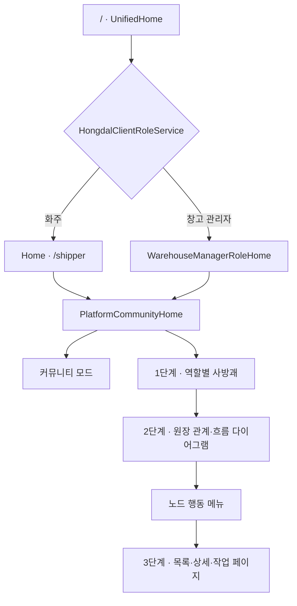

# Platform Home Mode

Hongdal 클라이언트는 앱을 역할별로 복제하지 않고 하나의 셸에서 역할과 커뮤니티 문맥을 공유한다. 업무 탐색은 [3단계 내비게이션](ThreeStageClientNavigation.md)에 따라 `사방괘 → 다이어그램 → 구체 데이터 페이지`로 이어진다. 실제 화면과 캡처는 [통합 커뮤니티 클라이언트와 꾸미기 상점](../ProjectOverview/unified-community-client.md)에서 본다.

## 구조

## 책임

- `UnifiedHome`: 현재 역할을 읽고 해당 역할 홈만 선택한다.
- `HongdalClientRoleService`: 역할과 `Preferences` 저장, 변경 이벤트를 담당한다.
- `MainLayout`: 우측 상단 역할 패널을 열고 역할 변경 후 `/`로 이동한다.
- `HongdalClientNavigationCatalog`: 역할별 좌측 메뉴를 제공한다.
- `PlatformCommunityHome`: 세 모드의 공통 UI와 모드 상태를 조정한다.
- 역할 홈: `CommunityModeContent`, `WorkModeContent`, `QuickActions`, 사방 이동 항목을 주입한다.
- 목적별 업무 페이지: 운송, 입고, 재고, 판매, 통관 같은 실제 처리를 맡는다.

## 3단계 내비게이션

1. 사방괘는 역할별 업무 영역을 고른다.
2. 다이어그램은 단일 원장, 연결 원장 묶음, 복합 원장의 경계와 관련 사람·장소·업무 노드 상태를 보여준다.
3. 노드 행동 메뉴는 구체적인 목록·상세·작업 페이지를 연다.

노드 기본 클릭은 선택과 요약이다. 데스크톱 오른쪽 클릭과 `⋮`, 모바일 길게 누르기와 `⋮`, 키보드 메뉴 동작은 같은 행동 목록을 열어야 한다. 앱 프로젝트 이름이나 노드 라벨로 URL을 추측하지 않고 중앙 내비게이션 메타데이터를 사용한다.

음식 주문과 음식 배달처럼 강하게 이어지지만 책임과 수명주기가 다른 원장은 연결 원장 묶음으로 함께 보여준다. 음식 주문 1건에는 직접 수령이면 배달 원장이 없고, 첫 배달·분할·재배달이 있으면 회차별 배달 원장이 여러 개 연결될 수 있다. 공동구매처럼 수요·결정·선적/통관·입고/분배를 조정하는 원장은 복합 원장으로 보여주고, 하위 원장 선택은 같은 2단계 안의 초점 이동으로 처리한다.

## 역할 전환

현재 역할은 `Shipper`와 `WarehouseManager`다. 상단 앱 바의 사람 버튼을 누르면 부드러운 패널이 열리며, 역할을 선택하면 홈, 좌측 메뉴, 사방 이동 기능이 함께 바뀐다. 언어 선택과 국내·해외 운영 프로필은 역할과 별도 상태로 유지한다.

## 모드 전환

`PlatformHomeModeStateService`는 커뮤니티와 업무 모드를 공유하고, `PlatformDiagramPaletteStateService`는 다이어그램 모드와 원장 템플릿을 공유한다.

| 모드 | 주 책임 | 종료·이동 |
| --- | --- | --- |
| 커뮤니티 | 게시판·피드·글쓰기·원장 초안 | 업무 또는 다이어그램으로 전환 |
| 업무 | 역할별 상태 요약과 업무 진입 | 목적별 라우트로 이동 |
| 다이어그램 | 원장 노드와 연결선 편집 | 커뮤니티로 돌아가 공유 |

## 반응형 다이어그램

데스크톱은 넓은 캔버스, 좌우 단계 이동, 우측 연결선 도크를 사용한다. 모바일은 세로 단계, 위아래 이동, 하단 옵션 시트, 선택 노드 집중 패널을 사용한다. 같은 원장 데이터를 사용하되 화면 폭에 맞춰 조작 방식을 구분한다.

노드 입력 준비도는 필수 입력값의 충족 정도를 퍼센트로 계산한다. 준비도 색상은 보조 피드백이며 수치와 입력 개수를 함께 표시한다.

## 후천 사방 내비게이션

여덟 괘 중 대각선 기능은 숨기고 리·태·감·진 네 괘만 쓴다. 북쪽을 화면 아래에 두므로 리는 위, 태는 오른쪽, 감은 아래, 진은 왼쪽에 배치한다.

창고 관리자 역할은 `리=판매`, `태=출고`, `감=배송`, `진=입고`로 고정한다. 각 방향은 최종적으로 관련 다이어그램 문맥을 열어야 한다. 현재 일부 항목이 업무 페이지로 바로 이동하는 것은 전환기 동작이다.

모바일 진입 장치는 오른쪽 벽면에 붙은 반원이다. 펼친 원형 판은 하단 업무 버튼보다 위에 놓고 닫히면 반원 이외의 돌출 형상을 남기지 않는다.

## 꾸미기 상태

`PlatformCommunityDecorationStateService`는 괘상 표시와 노드 이미지를 선택적으로 적용한다. 꾸미기를 꺼도 괘는 방향 화살표와 텍스트로 대체되고, 노드는 기본 업무 아이콘을 사용하므로 기능 접근성이 유지된다.

현재 상태는 앱 실행 중 메모리 상태다. 영구 보유권, 여러 기기 동기화, 실제 결제는 서버 상점 API와 계정 설정을 연결한 뒤 활성화한다.
