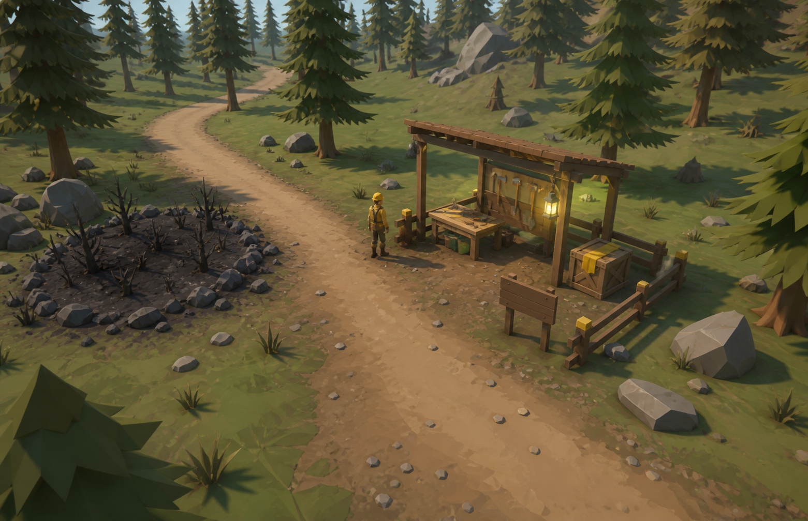
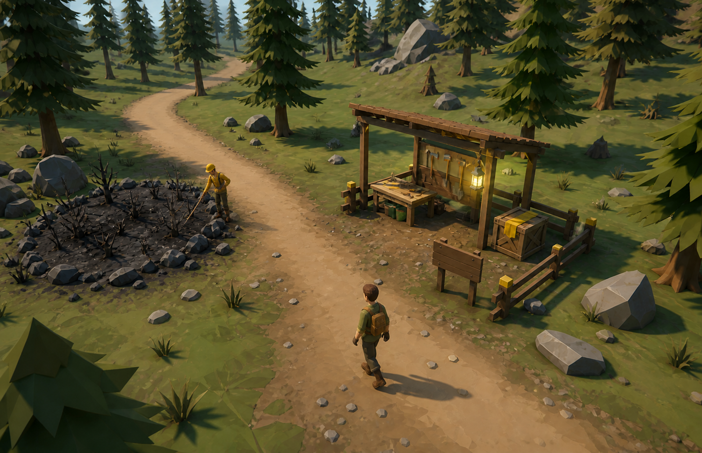
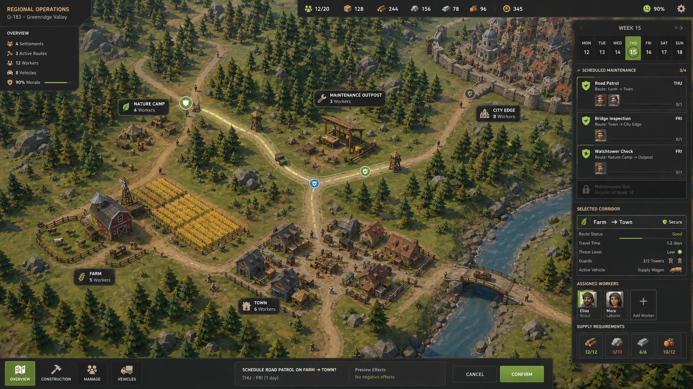
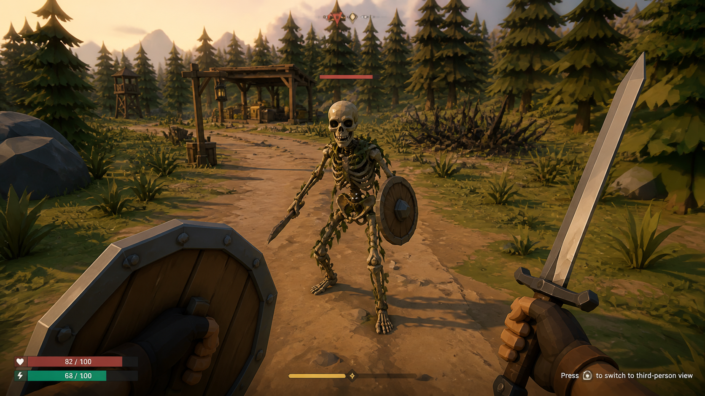
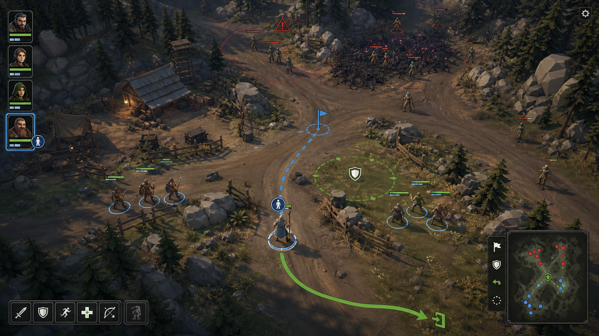
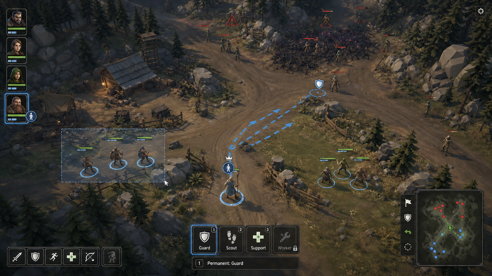
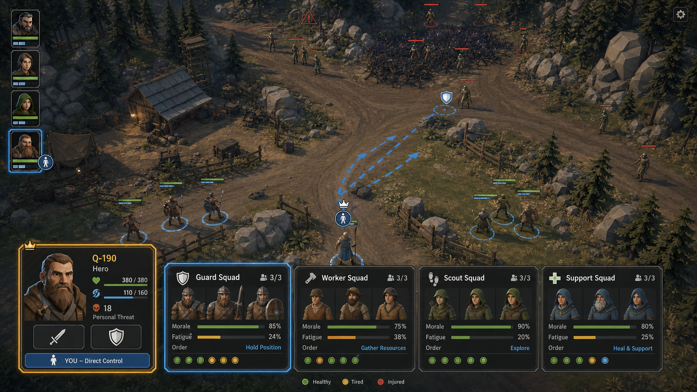

# 지역 오행 몬스터·개척 준비 문답

- 기획 ID: `PLAN-GAMEPLAY-REGIONAL-MONSTER-001`
- 기획 분야: `게임플레이 / 지역 몬스터·개척`
- 기획 판본: `region-five-elements-monster.inquiry.r5`
- 상태: `Refining / SuitableCreatureAssetPending`
- 상위 기획: `PLAN-STORY-YODONG-DEFENSE-001`
- 관련 하위 기획: 없음
- 관련 결정·기준: 과거 Q-161~Q-194와 D-555는 역사 계보, 현행 기준은 이 문서
- 관련 WI·PlayableLoop: Nature 탐사·흔적 조사·위협 대응·개척 준비 후보이며 대표 전투/귀환 폐루프는 미선정
- Graph Map 영향: 서식지·흔적·위협 원천·경비·회랑·퇴로 관계를 위협 레이어 후보로 제공
- 다음 질문 또는 인계 상태: 동물형·야수형 첫 경계 마수 의미는 유지하고 적합 Synty 자산 미확보를 보류

## 식별

- 문답 고유 식별자: `inquiry:region-five-elements-monster.r1`
- 내용 보완 revision: `region-five-elements-monster.inquiry.r5` (2026-09-01, D-555 첫 경계 동물형·야수형 마수와 미확보 보류 반영).
- 대상 주제: `topic:region-five-elements-monster.v1`
- 연결 후보: Nature 탐사·지역 위협 관찰·화물 회랑 안전화·개척 준비
- 이관 질문: `Q-161~Q-194`
- 상태: `Refining`

## 플레이어 약속 후보

플레이어는 지역의 환경과 몬스터 흔적을 조사해 금·목·수·화·토 속성 경향을 알아내고, 장비·소모품·마법진·동료·경로를 준비한 뒤 개척에 나선다. 속성을 이해하면 유리하지만 단일 속성 정답이 모든 상황을 자동 해결하지 않는다.

## D-553 강대한 적을 구성과 연결로 나눠 상대한다

강대한 적 집단이나 복합 위협은 지휘 개체·호위·원거리/지원 역할·증원·보급/회복 원천·소환/둥지·엄폐·접근 경로의 노드와 지휘·지원·이동·증원 엣지로 읽을 수 있다. 정찰·유인·매복·경로 차단·지휘 고립·지원 분리·증원 지연 같은 실제 행동으로 연결이 끊기면 남은 적의 종합 역량과 위험 단계를 다시 판정한다.

화면상 거리를 벌리거나 선택 그룹을 나누는 것만으로 약화시키지 않는다. 단일 거대 마수도 실제로 독립 가능한 부위·행동 단계·보호 개체·환경 지원·회복 원천만 분할 대상으로 삼는다. 나뉜 적은 재집결하거나 다른 목표를 공격할 수 있으므로 분할은 자동 승리가 아니며 시간·위치·민간인·보급로·동행대의 대가를 남긴다.

Graph Map L1은 왜 분할하고 무엇을 지키는지, L2는 적 노드·지원 엣지·분리/재결합 규칙, L3는 전투·분대·경로·행위 기록 계약 참조를 관리한다. 정확 schema·계산식·AI·전투 공간·WI·자산은 후속 설계다.

첫 농장 외곽·Nature 경계에서 내려오는 굶주린 마수 무리는 동물형·야수형 의미를 유지한다. 현재 P0 조사에서 확인한 사람형 Demon/Undead는 범주 대체로도 채택하지 않고 `적합 자산 미확보 / 보류`로 둔다. 보유 팩의 다른 이름 후보와 구매 가능 후보는 조사할 수 있지만 별도 승인 전에는 구매·Import·실제 배치를 하지 않는다.

## Q-161 확정 방향

- 지역마다 하나 이상의 오행 환경 경향을 가진 판본형 `RegionElementProfile`을 둔다.
- 몬스터는 종족 고유 특성과 현재 지역·계절·날씨·사건의 영향을 결합한 주·보조 속성을 가질 수 있다.
- 플레이어는 발자국·피해 흔적·식생·온도·습기·광물·행동 양식과 조사 결과를 통해 속성을 점진적으로 알아낸다.
- 개척 Preview는 확인된 속성, 불확실한 후보, 추천 장비·소모품·마법진·동료 Capability와 미준비 위험을 보여 준다.
- 속성 준비는 전투뿐 아니라 길 정비, 방책, 관수·배수, 야영·회복, 운송 안정성에도 영향을 줄 수 있다.

## 오행 게임 의미 후보

| 속성 | 몬스터·환경 표현 후보 | 플레이어가 준비할 수 있는 대응 후보 |
| --- | --- | --- |
| 금 | 단단한 갑각, 날카로운 공격, 광물 지대, 절단·관통 | 충격·열 대응, 방어구·도구 선택, 금속성 장애물 조사 |
| 목 | 성장, 덩굴, 재생, 독성 식생, 군집 확장 | 절단·화염·성장 억제, 해독·길 정리, 식생 관찰 |
| 수 | 습지, 냉기, 안개, 유동·잠복, 침수 | 보온·배수·시야·전기/결빙 주의, 우회 경로 |
| 화 | 고열, 연소, 폭발적 돌진, 건조·화재 | 냉각·방화·수원 확보, 연료·가연물 관리 |
| 토 | 중량, 장갑, 진동, 지형 변형, 둥지·성벽 | 관통·굴착·기동, 지반 조사, 우회·공성 준비 |

이 표는 기획 후보이며 아직 수치·상성·피해 배율을 확정하지 않는다.

## 상생·상극 경계

- 전통적인 상생·상극 관계는 전략 설명과 후보 계산의 출발점으로 사용할 수 있지만 자동 승패나 완전 면역을 곧바로 뜻하지 않는다.
- 기존 `EngineOverview.md`의 주문자 오행 관점은 사고를 돕는 비실행 메모이므로 몬스터 전투 규칙의 권위 계약으로 재사용하지 않는다.
- 몬스터 속성 규칙은 별도 StableId·rule revision·시험·Save/Replay 계보를 가져야 한다.
- 지역이나 사람을 현실의 종교·민족·성향과 연결해 분류하지 않고 게임 내부 환경·몬스터·행동 규칙에만 사용한다.

## Q-162 연성 오행 상성

- 유리 상성은 피해량만 올리는 것이 아니라 공격 기회, 방어 관통, 상태 이상 저항, 이동·추적, 시설 손상 방지, 전투 뒤 회복 비용 중 해당 규칙의 효율을 개선한다.
- 불리 상성은 완전 면역이나 진행 불가를 기본으로 만들지 않고 시간·내구도·소모품·피로·위험 노출 같은 추가 대가를 만든다.
- 중립 준비와 높은 숙련으로도 돌파할 수 있으며, 특정 속성 장비가 없다는 이유만으로 기본 공격·후퇴·관찰을 차단하지 않는다.
- Preview는 확인된 상성 근거와 예상되는 이점·위험 범위를 보여 주되 미관찰 속성의 정확한 배율을 공개하지 않는다.
- 상생은 파티·시설·환경 조합의 보조 효과 후보로, 상극은 대응 효율 후보로 사용하되 단일 표만으로 모든 결과를 계산하지 않는다.
- 첫 판본은 보정 상한·하한을 두고 같은 효과의 중복 중첩을 제한한다. 정확한 수치는 전투·개척 Fixture 시험 뒤 별도 rule revision에서 확정한다.

## Q-163 오행 구성 비율

- 모든 몬스터는 금·목·수·화·토 다섯 값을 모두 가진 `FiveElementComposition`을 사용한다.
- 저장 단위는 부동소수점 대신 합계가 10,000인 정수 basis point 후보로 두어 결정성·hash·Save/Replay를 유지한다.
- 종족의 기본 구성에 지역 Profile, 계절·날씨, 성장·부상·분노와 세계 사건 보정을 순서대로 적용하고 마지막에 정규화한다.
- `주 속성`과 `보조 속성`은 가장 높은 비율을 사람이 읽기 쉽게 요약한 파생값이며 별도 권위 원본이 아니다.
- 낮은 비율도 완전히 삭제하지 않지만 첫 규칙에서는 최소 영향 문턱과 전체 보정 상한을 두어 다섯 효과가 무제한 중첩되지 않게 한다.
- 상성 계산은 단일 속성 일치가 아니라 플레이어 준비 구성과 몬스터 구성 비율의 가중 관계로 계산한다.
- 같은 종족도 물가·습지에서는 수 쪽, 화재·건조 지역에서는 화 쪽, 광물·폐시설에서는 금 쪽으로 치우칠 수 있다.
- 구성 변경은 명시적인 원인 revision을 남기며 전투 도중 Unity FX가 바뀌었다는 이유만으로 비율을 변경하지 않는다.

### 예시

```text
숲 늑대 기본
금 10 / 목 40 / 수 20 / 화 10 / 토 20

장마·습지 보정 뒤
금 8 / 목 32 / 수 38 / 화 6 / 토 16
```

예시는 비율 개념을 설명하기 위한 후보이며 실제 밸런스 수치가 아니다.

## Q-164 오행 정보의 점진적 공개

- 미관찰: 정확한 오행 값과 상성 배율을 숨기고 외형·환경·행동·피해 흔적만 제공한다.
- 첫 관찰: `수 기운이 강함`, `목·토 경향`, `화 기운이 약해 보임`처럼 우세·약세 경향을 서술한다.
- 반복 조사: 각 오행을 `낮음·보통·높음` 또는 넓은 비율 범위로 좁히고 근거가 된 흔적·행동을 함께 기록한다.
- 충분한 지식: 승인된 조사·전투·분석 근거가 쌓이면 다섯 구성 비율과 기준 시각·지역·날씨·Profile revision을 상세 카드에서 공개한다.
- 변동 표시: 계절·날씨·사건으로 현재 구성이 알려진 기준선과 달라질 수 있으면 마지막 관찰 시점과 불확실성을 표시한다.
- UI 경계: World에서는 형태·Material·FX·Audio·행동으로 경향을 읽게 하고 정확한 값은 선택 가능한 지식 카드에서 확인한다.
- 지식 권위: Unity가 색이나 FX를 보고 비율을 역산하지 않고 Simulation의 관찰 가능한 지식 Projection만 표시한다.
- Multiplayer: 다른 플레이어가 지식을 공유할 수 있지만 발견하지 않은 현재 변동값까지 자동으로 동기화하지 않고 출처·관찰 revision을 남긴다.

## Q-165 복수 근거의 오행 지식 축적

- 흔적 관찰: 발자국·점액·그을음·식생 변화·광물 파편·온습도와 이동 경로를 조사해 지역 경향과 행동 후보를 좁힌다.
- 직접 관찰: 안전거리에서 외형·행동·환경 반응을 기록해 우세·약세 오행과 조우 패턴을 추정한다.
- 전투 경험: 공격 유형, 방어·회피 반응, 상태 이상, 피해 경감과 후퇴 결과를 통해 실제 상성 반응을 기록한다.
- 재료 분석: 전투·탈피·둥지·환경에서 적법하게 획득한 표본을 작업대·연구 시설에서 분석해 구성 비율과 변동 원인을 더 정확히 좁힌다.
- 지식 결속: 각 근거는 SourceStableId, 관찰 시각·지역·날씨, 대상 Profile revision과 신뢰 범위를 가진다.
- 해금 규칙: 같은 처치만 반복하거나 탐지 버튼 한 번을 누른 것으로 다섯 비율 전체를 공개하지 않는다. 서로 다른 근거가 상세 공개 관문을 충족해야 한다.
- 비살상 경로: 흔적·직접 관찰·버려진 표본·동료 지식 공유만으로도 상당한 지식에 도달할 수 있어 처치를 유일한 학습 수단으로 강제하지 않는다.
- 실패·오판: 불충분한 표본이나 오래된 관찰은 범위를 넓게 유지하며 잘못된 정확한 수치를 권위 사실처럼 만들지 않는다.

## Q-166 명상(정신 차림) 숙련의 단서 해석

- 명상 숙련은 관찰하지 않은 오행 사실이나 정확한 비율을 자동 생성하지 않는다.
- 같은 흔적에서 잡음과 중요한 변화를 구분해 추정 범위를 더 빠르게 좁히고 오래된 정보와 현재 변동의 차이를 알아차릴 가능성을 높인다.
- 직접 관찰에서는 공격 전조·기운 변화·환경과 몬스터의 불일치를 더 이르게 읽어 개척 Preview의 불확실성을 줄인다.
- 전투에서는 아직 확인하지 않은 면역·약점을 자동 공개하지 않고 실제 반응을 더 정확하게 ActionRecord와 지식 근거로 분류한다.
- 재료 분석에서는 표본 오염·지역 보정·계절 보정 가능성을 식별해 잘못된 단일 결론을 줄인다.
- 낮은 숙련도도 기본 조사 폐루프를 완결할 수 있고 높은 숙련은 정보 품질·속도·미세 변화 판독을 개선한다.
- 파티에서는 숙련자의 해석 결과를 출처가 있는 관찰 의견으로 공유할 수 있지만 각 플레이어의 지식 원장·공개 동의와 현재 Profile revision을 존중한다.
- 회복·위협 효과는 기존 플레이어 내면 명상 규칙이 소유하며 오행 지식 숙련이 별도 회복 수치를 임의로 지급하지 않는다.

## Q-167 첫 숲 화물 회랑의 목 중심·수 변동

- 첫 검증 회랑은 평상시 `목` 비율이 가장 높은 숲길로 둔다. 식생 성장·덩굴·재생·길 침범과 군집 확장이 기본 환경 압력이다.
- 비·장마·습지화가 발생하면 `수` 비율이 높아진다. 안개·진흙·침수·냉기·시야 감소와 잠복 가능성이 함께 커지며, 목 중심이라는 지역 계보를 임의로 지우지는 않는다.
- 현재 오행 구성은 지역 기준선, 계절, Sky 관측 입력, 승인된 세계 사건 revision을 Simulation이 결합해 결정한다. Unity의 비·안개 FX만으로 권위 비율을 바꾸지 않는다.
- 플레이어는 평상시에는 길 정리·절단 도구·재성장 억제를 준비하고, 우천 시에는 배수·보온·시야·차량 접지력까지 추가로 준비한다.
- 회랑 안전화 결과는 몬스터 처치 하나로 끝나지 않고 식생 제거, 배수, 노면 보수, 조명·방책·마법진, 순찰 상태와 함께 구간별로 판정한다.
- 첫 Fixture는 독립된 숲 회랑에서 검증한다. Town 주문·Farm 생산의 완료 조건으로 조용히 결속하지 않고, 양쪽 독립 폐루프가 준비된 뒤 명시적인 화물 회랑 통합 slice에서 연결한다.

## Q-168~Q-194 숲 회랑 안전화와 관리 초소

- `Q-168`: 첫 대표 위협은 덩굴에 잠식된 사람형 언데드 순찰자다. 구매한 Dungeon Realms의 `Demon Skeleton`·`Undead Knight`와 Base Locomotion·Sword Combat은 임포트 뒤 우선 검증 후보이며, 현재 설치된 Skeleton과 절차형 Animation은 fallback으로 유지한다.
- `Q-169`: 숲길 주변의 덩굴 핵 군락이 유해를 움직이고 언데드 재출현의 지역 원인이 된다. 개별 언데드 처치만으로 회랑이 영구 안전해지지 않는다.
- `Q-170`: 첫 핵 처리 방법은 외곽 뿌리 절단, 통제 소각, 잔불 정리 순서다. 도끼·Bramble·Log·Fire·Smoke 표현과 기존 작업 Task를 재사용한다.
- `Q-171`: 점화 Preview는 바람·강수·건조도·주변 가연물 거리를 함께 검사한다. 위험이 높으면 방화선 또는 소화용 물 준비 전까지 Confirm을 차단한다.
- `Q-172`: 소각 뒤 구간은 탄 흔적, 정리된 맨땅, 통제된 식생 회복으로 변한다. 일정 기간 안전하지만 장기간 방치하면 약한 덩굴이 재침범할 수 있다.
- `Q-173`: 재침범은 현장의 작은 Bramble·새싹과 회랑 카드의 `안정 → 관찰 필요 → 재침범 위험`을 함께 사용해 알린다.
- `Q-174`: 초기 재침범은 도끼·낫을 이용한 가벼운 가지치기와 길 정리로 `안정`에 복귀할 수 있으며 매번 핵 소각을 요구하지 않는다.
- `Q-175`: 회랑이 안정되면 기존 인연이 있는 Farm 또는 Town의 NPC 연락원 한 명이 Nature 거점을 방문한다.
- `Q-176`: 첫 연락의 중심은 단순 보급이 아니라 숲 회랑 공동 유지관리 협력 제안서다. Clipboard·Map·Sign과 계획 원장을 사용해 제안 원인·범위·대가를 표시한다.
- `Q-177`: 첫 협력은 덩굴 재침범 점검, 배수 정리, 위험 흔적 조사와 길목 수리를 함께 수행하는 제안으로 한다.
- `Q-178`: 초기에는 플레이어가 선도하고 연락원이 동행한다. 직접 경험과 신뢰가 쌓이면 플레이어가 물자·도구를 제공하고 연락원이 반복 작업을 수행하는 형태로 확장한다.
- `Q-179`: 짧은 임시 위임은 직접 작업 경험·연락원 신뢰·작업 물자로 열고, 장시간·정기 유지관리는 같은 조건에 회랑 관리 초소가 더해져야 안정적으로 수행할 수 있다.
- `Q-180`: 첫 초소는 간이 지붕·작업대·도구 걸이·보급 상자·등불·표지판으로 이루어진 소형 개방형 H1이다. 폐쇄형 숙소나 대형 방어 거점으로 확대하지 않는다.
- `Q-181`: 초소는 정리한 덩굴 핵을 관찰할 수 있으면서 회랑 통행을 막지 않는 평탄한 길가에 둔다. 침수·낙석·재침범 범위를 피하고 실제 배치 수치는 전문 연구에서 검증한다.
- `Q-182`: 초기 초소는 상시 숙소가 아니라 작업일 임시 주재 거점이다. 점검·가지치기·배수 정리 같은 작업이 등록된 날 연락원 NPC 한 명이 낮 동안 머물고, 플레이어가 합류하거나 물자를 맡길 수 있으며 작업 종료 뒤 Farm 또는 Town으로 돌아간다. 예정 작업·담당자·필요 물자·시간대·진척·지연 사유는 플레이어 캘린더에서 확인하되, 캘린더가 작업을 자동 확정하거나 권위 상태를 직접 바꾸지는 않는다.
- `Q-183`: 플레이 관점은 현장 3인칭과 광역 운영 시점을 명시적으로 전환하는 2단 구조로 한다. 광역 운영 시점은 Nature·Farm·Town·City와 회랑 상태, NPC 위치, 캘린더 작업, 물자 요구를 같은 권위 상태 사본으로 보여 주며, 명령은 관점과 무관하게 `Preview → Confirm`을 거친다. 카메라·선택·Overlay는 WorldRevision을 직접 변경하지 않는다.
- `Q-184`: 현장 전투에서는 플레이어가 원할 때 3인칭과 1인칭을 수동 전환할 수 있다. 공격·피격·회피처럼 짧게 카메라 전환을 보류해야 하는 동작은 종료 직후 요청을 적용한다. 관점이 달라도 같은 Actor·Command·BattleTick·체력·집중·피해 결과를 사용하며, 다대다 전투에서 현재 국지 교전이 끝난 뒤 넓은 상황을 다시 볼 수 있는 자동 시야 복귀 보조를 후속 질문에서 정한다.
- `Q-185`: 다대다 전투의 기본 관리 관점은 일반 3인칭이 아니라 높은 사선의 전술 지휘 시점이다. 플레이어는 이 시점에서 부대·엄폐·전선·후퇴로를 읽고 명령하며, 선택한 자기 Actor의 국지 교전에 1인칭으로 직접 개입할 수 있다. 직접 개입이 끝나면 전술 지휘 시점으로 복귀한다. 카메라 전환은 같은 전투 식별자·Actor 상태·BattleTick을 계속 읽으며 별도 전투를 생성하지 않는다.
- `Q-186`: 전술 지휘 시점의 기본 명령 깊이는 분대·역할 중심이다. 플레이어는 위치 이동·구역 방어·집중 공격·엄폐·집결·후퇴·특정 Actor 호위를 지시하고, NPC는 역할·상황·전투 상태에 따라 구체적인 공격·회피·대상 선택을 자율 수행한다. 플레이어 자기 Actor의 직접 개입은 이 자율 명령 체계를 대체하지 않고 같은 전투 안의 한 선택으로 동작한다.
- `Q-187`: 전술 지휘 시점의 Actor 선택은 역할별 고정 분대와 마우스 드래그 임시 선택을 함께 사용한다. 경비·정찰·지원·작업 분대는 단축키로 선택하고, 전장이 흐트러졌을 때는 서로 다른 분대의 가까운 Actor를 임시 묶어 이동·엄폐·후퇴를 지시한다. 자기 Actor는 별도 표시와 직접 개입 입력을 가지며, 선택·경로 표시는 표현일 뿐 Confirm 전에는 전투 상태를 바꾸지 않는다.
- `Q-188`: 전투는 실시간을 기본으로 하되 SoloLocal에서는 BattleTick을 멈추지 않는 전술 감속을 허용한다. 감속 중에도 분대 선택·경로 Preview·Confirm과 전투 결과가 같은 규칙으로 진행된다. RemoteHost에서는 한 플레이어가 권위 시간을 변경할 수 없으므로 정상 속도를 유지하고 명령 예약·빠른 선택 UI로 대응한다. 감속은 피해·명중·회피 수치를 바꾸는 버프가 아니라 입력과 상황 판독 보조다.
- `Q-189`: 자기 Actor의 1인칭 직접 개입은 해당 Actor의 자동 이동·공격만 임시 보류하고 나머지 NPC 분대의 기존 명령은 계속 실행한다. 직접 개입 종료 뒤 자기 Actor는 현재 위치·위험·새 명령을 평가해 안전하면 분대에 재합류하고, 위험하면 현 위치를 유지하며, 새 확정 명령이 있으면 이를 우선한다. 관점 전환만으로 분대 소속을 삭제하거나 전체 분대를 자기 Actor 주변으로 강제 집결시키지 않는다.
- `Q-190`: 전술 지휘의 관리 단위는 플레이어 자기 캐릭터를 나타내는 고유 `HeroCard` 한 장과 농노·경비·전투병·정찰·지원처럼 역할별 NPC 집단을 나타내는 `SquadCard`로 구분한다. HeroCard는 개인 장비·회복·위협·직접 개입 상태를 보여 주고, SquadCard는 인원·사기·피로·현재 명령과 구성원 상태를 요약한다. 카드는 권위 Actor·분대 상태의 관점별 조회 결과이며 카드를 제거한다고 NPC 상태가 삭제되거나 합쳐지지 않는다. 앞서 제시한 직접 개입 중 전투불능 처리 질문은 이 카드·분대 구조 뒤로 보류한다.
- `Q-191`: SquadCard는 인원·사기·평균 피로·부상자 수·현재 명령을 요약하지만, 내부의 각 NPC는 고유 식별자와 정체성·체력·장비·피로·숙련·관계·부상 상태를 개별적으로 유지한다. 카드 상세 보기에서 구성원을 확인할 수 있으며 카드 요약을 갱신하거나 숨겨도 NPC의 개별 상태와 생활 연속성은 사라지지 않는다.
- `Q-192`: 전투 뒤 부상 NPC는 즉시 완치되지 않고 SquadCard에 전투 가능·경상·중상·실종·전투 불능으로 구분된다. 플레이어는 거점 후송·현장 응급처치·임시 배속·부족 인원 임무 지속·Farm 또는 Town 신규 모집 중에서 선택한다. 카드 인원 공백과 개별 부상 상태는 치료·회복·재편성 또는 명시적인 후속 결과가 확정될 때까지 유지된다.
- `Q-193`: NPC는 체력 0에서 즉시 사망하지 않고 전투 불능·중상·구조 가능 상태를 거치며, 구조 기회 상실·후송 불가·치료 자원 부재·위험 지역 장기 방치 같은 제한된 조건에서만 사망할 수 있다. 농노·농업 노동자의 동원과 사상은 Farm 가용 노동·파종·수확·생산성에 영향을 주고, 전투병 손실은 경비력을 낮춰 농업·건설·물류 인력의 추가 징발 압력을 만든다. 전투 승리도 사상자·부상·생산 공백이 크면 세계 전체 결과에서는 손실로 평가할 수 있다. HeroCard는 영구 삭제하지 않고 중상·강제 후퇴·회복 폐루프로 연결한다.
- `Q-194`: 위협 해결은 조기 관찰·위험 시간 회피·경로 변경·방어 시설·유인 원인 제거·순찰·지능 세력과의 협상·서식지와 생활권 분리를 우선하며 전투는 필요한 경우의 마지막 수단으로 둔다. 비전투 해결도 회랑 안정·인명 보호·생산 기반 보존이라는 정식 권위 결과와 행위 기록을 남긴다. 전투를 선택한 경우에도 적 전멸보다 민간인 보호·부상자 구조·안전한 후퇴·생산 공백 최소화를 함께 평가한다.

## Q-195 비전투 해결 보상 질문

- 상태: `Asked`
- 질문: 비전투 해결의 보상을 별도 평화 점수가 아니라 회랑 안전·인명과 노동 보존·관계 개선·운송 지연 감소·치료와 수리 비용 절약·회복 상승·위협 감소 같은 실제 세계 상태 개선으로 돌려줄 것인가?
- 현재 경계: 추천안은 제시됐지만 사용자가 Frostpunk 조사로 주제를 전환했으므로 답변을 확정하지 않았다.
- 재개 시 확인: 실제 세계 상태 개선만 사용할지, 별도 평화·명성 점수를 병행할지, 자원 절약만 보상할지 선택한다.

### Q-181 추천안 기획 이미지



- 상태: `PlanningConceptOnly`, 실제 Scene·Game View 미검증.
- 참고 화면: Unity `nature-e7-restored-closed-loop-game-view.png`의 현재 저다각형 Nature 표현.
- 표현 후보: Nature Tree·Rock·Ground, Farm·Construction Table·Tool·Crate·Fence·Lantern·Sign 계열. Dungeon·Animation 구매 팩은 `PurchasedNotImported`이며 이 초소 구성의 선행 조건이 아니다.
- 프롬프트 의도: 소각된 덩굴 핵 옆의 안전한 평탄 길가에, 통행을 막지 않는 간이 지붕·작업대·도구·보급 상자·등불·표지판을 배치한다.
- 알려진 차이: 이미지의 정확한 부재 치수·울타리 폭·지면 경사·Prefab 외형은 실제 자산 조립 결과가 아니며 H 배치 연구에서 다시 동결한다.

### Q-182 추천안 기획 이미지



- 상태: `PlanningConceptOnly`, 실제 Scene·Game View 및 캘린더 UI 미검증.
- 표현 의도: 낮 작업일에 연락원 NPC 한 명이 덩굴 재침범 흔적을 점검하고, 플레이어가 회랑을 따라 합류하는 순간을 보여 준다.
- Synty 후보 계열: Nature Tree·Rock·Ground, Farm·Construction Table·Tool·Crate·Fence·Lantern·Sign, 보유 Humanoid Actor 계열. 정확한 Prefab·Animation은 임포트 재고와 전문 연구에서 동결한다.
- 알려진 차이: 이 이미지는 작업 캘린더, NPC 스케줄 권위, Task 진행 상태를 표현하지 않으며 공간과 Actor 배치의 기획 참고만 제공한다.

### Q-183 추천안 기획 이미지



- 상태: `PlanningConceptOnly`, 실제 Unity UI·입력·Game View 미검증.
- 표현 의도: 높은 사선 시점에서 Nature 거점·관리 초소·Farm·Town·City 가장자리와 연결 회랑을 읽고, 캘린더·NPC 배정·물자 요구·선택 회랑 상태를 함께 확인한다.
- Synty 후보 계열: 보유 Nature·Farm·Town·City·Construction·Generic의 환경·건물·Actor·Vehicle 기능 계열. 팩 이름은 영역 권위가 아니라 표현 출처로만 사용한다.
- 권위 경계: 이미지의 `Confirm`은 UI 의도이며 실제 명령 계약·예상 revision·거부 사유가 연결되기 전에는 구현 증거가 아니다.

### Q-184 추천안 기획 이미지



- 상태: `PlanningConceptOnly`, 실제 1인칭 Rig·Animation·Game View 미검증.
- 표현 의도: 같은 숲 회랑 전투를 플레이어가 선택한 1인칭 관점에서 검·방패로 수행하고, 필요하면 3인칭으로 복귀할 수 있음을 보여 준다.
- Synty 후보 계열: 보유 Generic Skeleton·Nature 환경·Weapon 표현과 구매 후 미임포트 Dungeon·Base Locomotion·Sword Combat 후보. 이미지가 실제 Prefab·Animation 호환을 증명하지 않는다.
- 권위 경계: 카메라 전환은 전투 상태·BattleTick·WorldRevision을 독자적으로 변경하지 않는다.

### Q-185 수정 기획 이미지



- 상태: `PlanningConceptOnly`, 실제 전술 선택·명령·Game View 미검증.
- 표현 의도: 다대다 회랑 전투를 높은 사선에서 관리하고, 선택 Actor·분대·엄폐·이동 지점·방어 구역·집중 표적·후퇴로를 판독한다. 선택한 자기 Actor에는 별도 직접 개입 입력으로 1인칭 진입이 가능하다.
- Synty 후보 계열: Nature 환경, Construction 초소·엄폐물, Generic Humanoid·Skeleton·Weapon과 구매 후 미임포트 Dungeon·Animation 후보. 실제 대형 부대 수와 Animation 호환은 동결되지 않았다.
- 권위 경계: 선택 원·경로·위험 구역·미니맵은 표현이며, 명령은 안정 식별자와 예상 revision을 가진 `Preview → Confirm` 뒤에만 권위 상태를 바꾼다.

### Q-187 추천안 기획 이미지



- 상태: `PlanningConceptOnly`, 실제 선택 입력·명령 계약·Game View 미검증.
- 표현 의도: 역할 분대 단축 선택과 전장 위 박스 드래그 임시 선택을 함께 사용하고, 선택 Actor들의 이동 진형을 Confirm 전에 미리 본다.
- 자산 경계: Actor·환경은 Synty 기능 후보이나 선택 사각형·선택 원·경로·역할 아이콘은 프로젝트 고유 UI 표현이다.
- 권위 경계: UI 선택 집합은 임시 표현 상태이며, 확정된 TacticalCommand만 권위 행위 기록과 전투 상태를 변경한다.

### Q-190 영웅 카드·분대 카드 기획 이미지



- 상태: `PlanningConceptOnly`, 실제 UI·Actor Projection·Game View 미검증.
- 표현 의도: 영웅 카드는 개인 장비·회복·위협·직접 개입을 강조하고, 분대 카드는 경비·작업·정찰·지원의 인원·사기·피로·명령과 구성원 상태를 요약한다.
- 자산 경계: 카드 초상은 Synty Actor 후보에서 생성할 수 있으나 카드 틀·아이콘·상태 막대는 프로젝트 고유 UI다. 이미지의 정확한 초상·수치·영문 표기는 확정 UI가 아니다.
- 권위 경계: 카드 선택은 실제 ActorStableId 또는 SquadStableId를 참조하며, 카드 자체가 전투 상태나 NPC 개별 정체성을 소유하지 않는다.

### 현재 표현 자산 조사 경계

- 현재 설치된 Synty 7개 팩에서 이름으로 확인되는 명시적 적대 Actor 후보는 `PolygonGeneric`의 `SM_Gen_Chr_Skeleton_01` 하나다.
- `PolygonNature`의 `SM_Prop_Skeleton_Ground_01`은 흔적·피해 현장 소품이지 살아 움직이는 몬스터 Actor가 아니다.
- 현재 canonical Nature 조우 Builder도 Nature 팩에 캐릭터·몬스터 Prefab이 없음을 명시하고 대체 위협 형상을 사용한다.
- 따라서 숲·수변·비·안개·흔적은 현재 Synty 환경 자산으로 준비할 수 있지만, 대표 몬스터 외형은 `Skeleton` 임시 후보, 기존 대체 형상 또는 별도 검토 자산 중 하나를 명시적으로 선택해야 한다. 기획상의 늑대·멧돼지·좀비를 보유 자산으로 간주하지 않는다.

## 공간·표현 준비

- H1: 속성 흔적 관찰점, 위협 발생점, 대응 시설·마법진·보급 지점.
- H2: 한 구간의 조사→준비→조우→회복 작업을 수용하는 개척 작업 구역.
- H3: 여러 H2와 화물·탐사 회랑을 잇는 지역 개척 경관.
- Presentation E4는 지역색 하나로 속성을 단정하지 않고 몬스터 형태·FX·흔적·환경·Audio와 조사 카드의 복수 신호를 사용한다.
- Synty Prefab은 형태 후보이며 속성·피해·상성을 확정하지 않는다. Material Variant·FX·배치 문맥과 Simulation 상태 사본을 결합한다.

## 미정

- 연성 상성의 첫 보정 상한·하한과 중첩 규칙
- 낮은 비율의 최소 영향 문턱과 가중 상성 계산식
- 각 근거 종류의 첫 지식 진척량·신뢰도와 상세 비율 공개 관문
- 속성 장비·마법진·동료·약초 준비의 첫 실제 WI
- 지역 사건과 계절이 속성을 바꾸는 범위
- 첫 숲 회랑 대표 몬스터의 생태 역할과 승인 Visual 후보

## FB-01 농사 생활·위임 균형 검토

- 2026-08-30 사용자가 수확 지연·예산 구매/외상·모드별 밟힘·훈련 농사 NPC 대응을 수정하고 나머지 추천안을 승인했다(D-357, FB-01/r2).
- 묶음 전체와 담당은 [FB-01 검토 안내](../검토묶음/FB-01-농사생활위임.md)를 따른다. 질문 답변의 단일 원본은 이 파일이다.

### Q-385 농사꾼이 위협을 만나면

- 식별: `Q-생활위협-D3-01 · 전체 Q-385`
- 상태: `Confirmed` (2026-08-30, D-357, FB-01/r2; 수치 미정과 후속 확장은 별도).
- 질문: 전투 임무가 없는 농사 NPC는 몬스터가 접근하면 어떻게 할까?
- 확정 답변: 농사 NPC는 위험에 접근하면 작업을 중단하고 접근 가능한 안전한 곳으로 피한다. 훈련받은 NPC는 후퇴한 뒤 무기고에 가서 무기를 갖추고 나와 싸울 수 있도록 한다. 미훈련 NPC에게 전투를 강제하지 않는다. 완료 성과는 보존하고 도주 자체의 추가 벌은 없으나 실제 피격은 적용한다. 무기·훈련·접근 경로가 없을 때 무장이나 이동을 가정하지 않으며 순간이동·무적은 없다.
- 보편 행위/책임: 작업 중단·후퇴. 새 WI ID 등록이나 단일 명령 합치기를 뜻하지 않는다.
- 기존 결정·경계: 기존 방위 분대 자동 출동은 바꾸지 않는다. 비전투 작업자의 대응을 구분하며 보편 휴식/건설 환불 정책을 전용하지 않는다.
- 예상 준비: D3 선택·실패·복귀의 Logic E2~E4 준비. 기획 답변 승인과 실제 E는 별도이며 추가 개발 범위는 FB-01 승인 보완과 작업 명세 결속을 따른다.

## 다음 질문 후보

- 첫 숲 회랑의 대표 몬스터와 현재 자산 제약을 반영한 표현 방식
- 명상 숙련 단계별 추정 범위 축소·변화 감지 보정의 상한
- 속성 조사에 필요한 플레이어 행동과 도구
