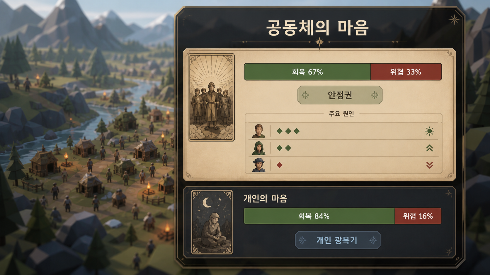

# 플레이어 내면·명상·계획 문답

## 식별

- 문답 고유 식별자: `inquiry:player-mind-meditation.r1`
- 내용 개정: `player-mind-meditation.inquiry.r28` (2026-09-02, NPC 역할 분리의 필요 최소 공개; 파일명·고유 식별자 유지)
- 이관 질문: `Q-006~Q-022`, `Q-040~Q-044`, `Q-065~Q-067`, `Q-122~Q-125`, `Q-196~Q-198`
- 상세 원문·조사 계보: [동결 통합 아카이브](../nature-night-day2.inquiry.r1.md)
- 상태: `Refining`

## 이 문서가 소유하는 질문

- 명상(정신 차림) 숙련과 현재 집중 판정
- 회복·위협 축, 개인 광복기·암흑기와 감쇠
- 파티 공명·잔향·중첩·개인 행동 문턱
- 심층 관찰과 다른 플레이어의 허용된 성장 낌새
- 언제든 세우는 개인 계획과 계획 진척의 회복 기여
- 별도 즉시 정신 자원 `집중력`
- 내면 상태 HUD·Audio·접근성

## 현재 확정 기준

- Health·Stamina와 별도로 즉시 정신 자원 `집중력`을 둔다.
- 회복·위협은 더 장기적인 개인 내면 축이며 집중력과 같은 수치가 아니다.
- 명상 숙련이 높을수록 가벼운 행동에서도 집중 판정과 심층 관찰에 접근하기 쉬워진다.
- 모든 유의미한 플레이어 행동은 명상의 재료가 될 수 있지만, 행동마다 명상 UI·성장·편린·회복을 자동 지급하지 않는다.
- 공명은 주변 파티원의 회복을 돕고 잔향으로 감쇠하지만, 광복기의 마지막 문턱은 대상 플레이어 자신의 행동이 넘는다.
- UI는 Health·Stamina·집중력 막대와 회복·위협 내면 문양을 구분한다.
- 집중력·위협 피드백은 호흡·문양·심박·환경음과 비색상 아이콘을 약하게 겹치며 강도를 조절할 수 있다.
- 유의미한 문제 해결로 오른 개인 회복은 명상 시작·집중 상태 진입의 준비 가중치에 유리하게 작용할 수 있다. 회복은 명상 숙련 경험·현재 집중력·관심 분야와 다른 입력이며 자동 발동·성공·편린 획득을 보장하지 않는다.
- 높은 개인 회복 상태에서 명상해 영감·편린 획득이 실제 성립하면 산출량에 단계형 배수를 적용할 수 있다. 배수는 획득 판정 뒤 한 번만 적용하며 완전 지식·스킬·Recipe를 대신하지 않는다.
- 증폭 명상은 개인 회복을 소모하지 않으며 적절한 완료 뒤 개인 회복을 더 높인다. 취소·실패·중복 실행·무의미한 반복은 이 추가 회복을 만들지 않는다.
- 개인 또는 현재 분대보다 강한 적과 실제 대치하면 위협이 오르고 회복이 지속 하락할 수 있다. 전투 중 선택형 집중 타이밍에 성공하면 하락을 완화하거나 회복 일부를 되올릴 수 있지만 적·피해·위협 원인을 없애지는 않는다.

## 모든 행동과 명상의 연결 원칙

- 채집·벌목·제작·운반·거래·대화·약속 이행·조사·이동·훈련·전투·구조·실패와 회복처럼 플레이어가 실제로 수행한 유의미한 행동은 같은 `ActionRecord` 계보에 `성찰 가능 경험`을 남길 수 있다. 단순 UI 열람·조회·취소·자동 수행·NPC 위임·Save 복원은 플레이어의 새 경험으로 만들지 않는다.
- 행동 직후에는 필요한 결과와 짧은 감각만 보여 주고 명상을 강제하지 않는다. 플레이어가 안전한 거점·휴식·계획 시간에 명상하면 별도의 행동 선택 목록 없이 최근의 유효 행동 흐름을 함께 성찰한다. `무엇을 보았는가`, `어떻게 행동했는가`, `무엇이 달라졌는가`, `다음에는 무엇을 바꿀 것인가`가 시간·장소·대상·행위 기록의 연속성에서 자연스럽게 구성된다.
- 명상은 모든 과거 기록을 한꺼번에 펼치지 않는다. 현재 장소·최근 시간창·반복된 관심·위험 변화·새 결과·미해결 약속을 기준으로 관련 경험을 묶고, 관계·기술·위협·계획 가운데 가장 의미가 큰 흐름을 먼저 드러낸다. 플레이어는 명상을 시작할지만 정하며 개별 행동을 선별하는 관리 작업은 요구하지 않는다.
- 성찰 결과는 행동 종류와 근거에 따라 숙련 교정 후보, 이데아의 편린 후보, 계획 갱신, 개인 회복, 위협 이해 가운데 하나 이상이 될 수 있다. 후보는 완전한 지식·스킬·Recipe·정답·자동 성공이 아니며 이후 훈련·실전·자료·대화로 검증한다.
- 같은 행동 기록이 여러 명상 흐름에 포함되더라도 동일 성장·편린·회복을 복제하지 않는다. 새 관점·새 단서·후속 결과가 생겼을 때만 같은 사건이 갱신된 성찰 문맥에 다시 포함될 수 있고, 그 경우에도 기존 지급 계보와 중복 여부를 확인한다.
- 작업 중 선택형 집중 타이밍은 `현재 수행 품질`, 사후 명상은 `완료된 경험의 해석과 연결`을 담당한다. 둘은 함께 사용할 수 있지만 하나의 성공을 두 개의 독립 완료 보상으로 중복 계상하지 않는다.
- 모든 행동이 명상과 연결된다는 원칙은 모든 WI에 같은 미니게임을 붙이거나 모든 행동을 느리게 만드는 뜻이 아니다. 각 WI는 `Applied`, `PendingProfile`, `LearningOnly`, `NpcOnly`, `Automatic`, `Excluded` 등 기존 분류와 사유를 유지하고, 플레이어에게 의미 있는 선택·대가·결과가 있는 범위만 성찰 후보로 다룬다.

## 생각 발생과 생각 정리 미니게임

- 명상을 시작했다고 항상 생각이 떠오르지는 않는다. 최근 행동에 새 결과·실수·반복 차이·강한 감각·미해결 의문이 없거나 플레이어의 현재 집중과 회복이 낮다면 `고요함`으로 끝날 수 있다. 이는 실패가 아니며 숙련·회복·위협에 불이익을 주지 않는다.
- 생각이 떠오르면 시스템은 최근 유효 행동 흐름에서 분야와 출처 `ActionRecord`를 가진 `성찰 씨앗`을 만든다. 플레이어가 명상할 행동을 고르는 것이 아니라, 벌목·제작·거래·관계·전투 등 실제 경험에서 무엇이 떠올랐는지가 먼저 정해진다.
- 첫 생각 정리 형식은 짧은 `관찰→원인→개선` 연결 미니게임을 후보로 둔다. 실제 행동에서 나온 생각 조각 3~5개를 순서나 인과에 맞게 이어, 무엇이 잘됐거나 어긋났고 다음 행동을 어떻게 바꿀지 하나의 성찰로 정리한다. 정답 암기보다 실제 기록과 일치하는 연결을 사용하고, 허위 원인이나 아직 모르는 정보를 정답으로 요구하지 않는다.
- 생각 정리가 성립하면 출처 행동의 분야 숙련에 작은 성찰 성장치를 주고, 내용에 따라 동작 교정·이데아 편린 후보·새 계획·위험 이해를 함께 남길 수 있다. 벌목 뒤 집이나 안전한 거점에서 명상해 도끼 각도·나뭇결·힘 전달·회수 동작을 정리했다면 벌목 숙련이 오르는 것이 대표 예다.
- 미니게임 성공은 물질 보상·행동 완료·전투 승리·완전한 기술을 새로 만들지 않는다. 실제 벌목을 하지 않고 벌목 생각만 반복하거나, 같은 성찰 씨앗을 재조회·Save 복원·반복 완료해 숙련을 복제할 수 없다.
- 생각 정리를 중단하거나 잘못 연결해도 기존 분야 숙련을 잃지 않는다. 같은 씨앗의 진행 상태를 보존해 다시 정리할 수는 있지만 보상은 씨앗 판본당 한 번만 성립한다. 새 행동·단서·교정이 생기면 갱신된 씨앗으로 다시 성찰할 수 있다.
- 작업 도중의 선택형 집중 타이밍은 현재 행동의 수행 품질과 추가 명상 경험을 다루고, 휴식 중 생각 정리는 완료된 경험을 이해해 해당 분야의 숙련·편린 후보로 연결한다. 같은 행동의 같은 결과를 두 경로에서 중복 보상하지 않도록 하나의 행위 계보에서 판정한다.

### 생각 정리 표현 초안과 확장

- 첫 초안은 어두운 명상 화면에 짧은 생각 조각과 이데아 문양을 띄우고, 플레이어가 관련 조각을 선으로 이어 `관찰→원인→개선`의 작은 인과 흐름을 완성하는 방식으로 둔다. 선 연결 결과는 실제 성찰 씨앗의 허용 관계와 대조하며 임의 연결을 정답으로 만들지 않는다.
- 장기적으로는 `순서 맞추기`, `원인과 결과 연결`, `공통 원리끼리 묶기`, `동작·호흡·힘의 리듬 맞추기`, `불필요한 생각 걷어내기` 같은 짧은 요소를 분야별 Profile로 조합할 수 있다. 벌목은 힘 전달·각도·회수의 순서와 인과, 제작은 재료·열·시간의 관계, 인간관계는 약속·행동·결과의 연결을 주로 사용한다.
- 한 번의 명상에 모든 조작을 넣지 않는다. 성찰 씨앗 하나는 핵심 조작 하나와 필요할 때만 보조 조작 하나를 사용하고, 생각의 복잡도가 아니라 플레이어가 판독해야 할 원리의 수로 난도를 정한다.
- 조합형 확장은 새로운 독립 보상 체계를 만들지 않는다. 어떤 표현을 사용해도 같은 성찰 씨앗·행위 기록·분야 숙련 판정을 소비하며, 동일 결과의 중복 지급을 허용하지 않는다.
- 선 연결이 어려운 경우 순차 선택·목록 정렬·자동 연결 보조를 제공하고, 시간 제한은 기본값으로 두지 않는다. 색만으로 관계를 구분하지 않고 문양·선 모양·짧은 문구를 함께 사용한다.

### 첫 명상 튜토리얼

- 첫 튜토리얼은 한스 집에서 보내는 첫날밤의 안전한 휴식과 플레이어 본인의 실제 첫 벌목 완료 기록이 함께 있을 때 연다. 벌목하지 않았거나 NPC가 대신 수행한 경우 벌목 생각을 만들어 내지 않으며, 첫 유효 플레이어 행동이 생긴 뒤 다음 안전한 명상으로 미룬다.
- 이 첫 회차에서는 나무를 벨 때의 도끼 각도·나뭇결·힘 전달·회수 동작에 관한 성찰 씨앗이 반드시 떠오른다. 이는 첫 사용법을 가르치기 위한 한 번의 기획된 발생이며, 이후 모든 명상의 생각 발생률이나 편린 획득을 보장하지 않는다.
- 안내는 생각 조각 3개를 `관찰→원인→개선`으로 잇는 가장 짧은 형식부터 시작한다. 첫 연결을 보여 준 뒤 다음 연결을 플레이어가 수행하고, 자동 연결 보조와 다시 보기 도움말을 제공한다.
- 플레이어가 튜토리얼을 건너뛰거나 중단해도 벌목 숙련·회복을 잃지 않는다. 성찰 씨앗과 미완료 상태를 보존해 이후 안전한 명상에서 다시 열 수 있으며, 완료 보상은 같은 씨앗 판본에서 한 번만 지급한다.
- 첫 튜토리얼 완료 뒤에는 일반 규칙으로 돌아가 `고요함`·생각 발생·분야별 조합형 미니게임이 실제 최근 행동과 상태에 따라 나타난다. 튜토리얼 완료 여부가 이후 명상 성공률이나 생각 발생 확률에 숨은 영구 보정을 주지 않는다.

## 상태창의 지관 이데아와 플레이 성향 우선순위

- 플레이어 상태창은 장착 무기·방어구·인벤토리뿐 아니라 현재 플레이어가 지관하고 있는 이데아를 별도 내면 영역으로 보여 준다. 이 영역은 물건 보관함이 아니라 플레이어의 **염체(念體)**가 무엇을 알아차렸고 무엇을 더 깊게 관찰하려는지 읽는 화면이다. `염체`는 생각 념(念)을 쓰며 `영체`와 구분한다.
- 화면은 최소한 `관심 방향`, `지관 중인 이데아`, `획득한 편린`, `검증된 지식·기술`을 구분한다. 관심을 둔 것만으로 편린이나 기술을 얻지 않고, 후보 편린을 완성된 이데아로 표시하지 않는다.
- 플레이어는 문명 경영 게임의 식량·생산·연구 우선처럼 `전투`, `마법`, `생산`, `연구` 등의 관심 우선순위를 자유롭게 조절하거나 모두 중립으로 둘 수 있다. 이후 벌목·농사·연금·물류·관계처럼 실제 플레이에서 성립한 분야가 같은 목록에 확장될 수 있다.
- 우선순위는 관련 이데아·성찰 씨앗·학습 기회·필요 물자의 **추천·정렬·강조**에 사용한다. 선택하지 않은 분야를 금지하거나 효율을 깎지 않고, 직업·성향·빙의 대상의 영구 판정으로 고정하지 않는다.
- 높은 우선순위도 실제 관찰·행동·훈련·자료·대화·명상 근거를 대신하지 않는다. 아직 만나지 않은 지식, 모르는 Recipe, 보지 않은 적의 약점이나 숨은 현실 자료를 상태창이 먼저 공개하지 않는다.
- 이 우선순위는 개인 조달 우선순위와 연결할 수 있지만 같은 상태는 아니다. 예를 들어 `생산` 이데아를 중시해도 씨앗이나 도끼를 자동 구매하지 않으며, 현재 계획·재고·계절·가격과 함께 추천 이유를 보여 준 뒤 플레이어가 별도로 확정한다.
- 염체(念體)는 플레이어의 생각과 지관 방향을 묶어 보여 주는 내면 관찰 주체의 표현이며, 별도의 영혼·유령·자율 NPC나 상태 권위가 아니다. 염체 표현·애니메이션·문양이 바뀌어도 실제 숙련·편린·재고·행동 완료는 각각의 권위 기록이 판정한다.
- 추천 근거는 `선언한 관심`, `현재 계획`, `최근의 유효 ActionRecord`, `이미 확인한 부족`, `성찰 씨앗`으로 제한하고 플레이어가 확인·수정·비활성화할 수 있게 한다. 추천을 따르지 않아도 실패·관계 하락·숨은 벌점을 주지 않는다.
- 첫 구현 후보는 다중 가중치 자동 최적화보다 `주 관심 1개 + 보조 관심 최대 2개 + 모두 중립`의 간결한 프리셋이다. 정확한 항목 수·변경 비용·성장 가중치는 후속 기획이며, 구현 전까지 우선순위는 탐색과 추천을 돕는 비권위 메타데이터로 유지한다.

## ActionRecord 기반 개인 염체 그래프

- 플레이어가 상태창의 염체(念體) 영역을 열면, 실제로 기록된 `ActionRecord`를 근거로 개인의 경험과 이데아 형성 과정을 그래프로 보여 준다. 이 그래프는 월드 공간·배치의 Graph Map과 구분되는 개인 내면 조회 결과이며 월드 노드나 권위 상태를 대신하지 않는다.
- 첫 화면의 중심에는 현재 플레이어의 염체를 두고, 주변에 `최근 경험`, `성찰 씨앗`, `이데아 편린 후보`, `획득한 편린`, `검증된 지식·기술`, `현재 계획`을 서로 다른 노드 종류로 배치한다. 후보·획득·검증 단계를 문양·외곽선·짧은 상태 문구로 구분하며 색만으로 구분하지 않는다.
- 행동 기록 하나를 곧바로 이데아 노드로 만들지 않는다. `실제 행동 완료 → 성찰 가능 경험 → 명상에서 성찰 씨앗 형성 → 관찰·원인·개선 연결 → 편린 후보 → 후속 훈련·실전·자료·대화 검증`의 실제로 성립한 단계만 이어 붙인다.
- 첫 엣지 종류는 `경험함`, `성찰함`, `관련 원리를 알아차림`, `후속 행동으로 검증함`, `계획에 적용함`, `새 근거로 수정됨`으로 제한한다. 단순 시간 인접, 같은 장소, 비슷한 단어만으로 인과 엣지를 자동 확정하지 않는다.
- 각 노드를 선택하면 시각·장소·대상·WI·행동 결과·근거 판본과 후속 선택을 짧게 확인할 수 있다. 원본 기록 전체를 한 화면에 펼치지 않고, 요약 노드에서 근거 ActionRecord와 관련 성찰로 단계적으로 내려간다.
- 동일 반복 행동은 모든 기록을 개별 노드로 쌓아 화면을 가리지 않는다. 같은 문맥의 반복은 묶음 노드로 집계하되 첫 수행·실패·큰 품질 변화·새 대상·새 결과·새 통찰은 독립 사건으로 남기며 언제든 원기록을 펼칠 수 있게 한다.
- 전투·마법·생산·연구 등의 관심 우선순위는 관련 군집의 위치·크기·강조·추천 탐색 순서를 바꿀 수 있지만 기록이나 엣지를 삭제하지 않는다. 중립 또는 미선택 분야도 실제 경험과 근거가 있으면 그래프에 남는다.
- 그래프는 시간창·장소·대상·분야·WI·후보/획득/검증 상태로 필터링할 수 있다. 기본값은 최근의 유효 경험과 현재 관심을 함께 보여 주되, 과거 기록이 사라졌다고 오해하지 않도록 전체 이력 진입점을 둔다.
- 잘못 이해한 원인이나 후속 반증은 기록을 지우지 않고 `새 근거로 수정됨` 관계로 남긴다. 편린 후보의 철회·통합·분기는 계보를 보존하며 이미 지급된 성장이나 보상을 UI 재배치만으로 다시 지급하지 않는다.
- 그래프의 좌표·확대 상태·군집 배치는 표현 데이터다. 권위는 ActionRecord·성찰 씨앗·편린·지식·숙련·계획의 안정 식별자와 revision이 소유하며, Save/Replay 뒤에도 같은 판본에서 같은 의미 관계가 복원되어야 한다.
- 첫 수직 표본은 `첫 벌목 완료 ActionRecord → 한스 집 안전한 명상 → 도끼 각도·나뭇결·힘 전달의 성찰 씨앗 → 관찰·원인·개선 → 벌목 이데아 편린 후보`다. 실제 벌목이나 명상이 없으면 표본 그래프를 꾸며 내지 않는다.

### 앞으로의 행위와 가능성

- 염체 그래프는 과거 기록만 되돌아보는 화면이 아니다. 획득한 경험·편린·계획에서 앞으로 시도할 수 있는 `행위 후보`, `준비할 것`, `만날 대상`, `검증할 질문`, `예상되는 변화`를 미래 방향 노드로 펼친다.
- 기본 읽기 방향은 `과거 근거 ← 현재 염체 → 앞으로의 행위`다. 왼쪽 또는 안쪽에는 실제 경험과 성찰 계보, 중심에는 현재 관심·회복·위협·계획, 오른쪽 또는 바깥쪽에는 아직 실행하지 않은 선택 가능성을 둔다. 정확한 화면 방향은 접근성 설정에서 바꿀 수 있다.
- 미래 노드는 `추천 후보`, `관심 있음`, `계획함`, `준비됨`, `진행 중`, `보류·취소`를 구분한다. `계획함`이나 `준비됨`을 완료로 표시하지 않고, 실제 행동 완료 뒤에만 새 `ActionRecord`를 만들고 기대 노드와 결과 노드를 연결한다.
- 이데아 노드에서 다음 행위를 펼치면 `무엇을 할 수 있는가`, `왜 지금 제안되는가`, `어디서·누구와 가능한가`, `무엇이 필요한가`, `무엇을 알게 될 수 있는가`, `어떤 대가·위험이 있는가`를 보여 준다. 아직 알 수 없는 결과는 범위나 가능성으로 표시하고 정답·확정 보상을 미리 누설하지 않는다.
- 첫 벌목 표본에서는 `다른 나뭇결 관찰`, `도끼 회수 동작 훈련`, `숙련 나무꾼과 대화`, `다른 도끼와 비교`, `같은 동작을 안전하게 재현` 같은 선택적 다음 경험을 후보로 둘 수 있다. 이는 강제 퀘스트가 아니며 하나를 고르지 않아도 기존 진행과 다른 분야의 플레이를 막지 않는다.
- 플레이어가 미래 노드를 선택하면 즉시 행동을 자동 실행하지 않고 개인 계획 또는 추적 관심으로 등록한다. 장소·대상·시간·도구·권한 조건이 실제로 맞을 때 실행 가능한 WI나 관찰 기회를 제안하며, 명시적 입력·Preview·Confirm이 필요한 행동은 기존 절차를 그대로 따른다.
- NPC에게 위임하거나 자동 작업으로 처리된 결과는 플레이어가 직접 경험한 것과 구분한다. 보고를 읽고 이해한 것은 `보고로 알게 됨`, 현장에서 직접 수행한 것은 `직접 경험함`으로 다른 근거 관계를 사용한다.
- 실행 뒤에는 `기대했던 변화`와 `실제 결과`를 나란히 연결해 맞음·부분 일치·예상 밖·실패·중단을 성찰 재료로 남긴다. 실패와 취소는 숨기지 않되 숨은 벌점을 주지 않고, 새로운 원인·준비·대안 노드를 열 수 있다.
- 미래 후보는 현재 관심 우선순위에 따라 강조될 수 있지만 한 분야만 독점하지 않는다. 생존 위험·약속·시간 민감 사건은 별도 징후로 드러내되 시스템이 플레이어 대신 우선순위를 확정하거나 선택을 실행하지 않는다.
- 오래되거나 조건이 사라진 후보는 자동 완료하지 않고 `현재 실행 불가` 또는 `문맥 만료`로 접는다. 근거가 갱신되면 같은 안정 식별자의 revision을 올려 다시 제안하며, 단순 UI 재열람으로 후보나 보상을 복제하지 않는다.

### 공동체와 연결되는 중요한 이데아

- 염체 그래프의 장기 고리는 개인 숙련만 다루지 않는다. 요동성 방어처럼 여러 사람·시설·물자·경로·계절·위협이 함께 얽힌 장기 목표를 플레이어가 실제 단서로 알아차리면, 개인 염체 안에 `공동체 이데아의 편린`으로 등록할 수 있다.
- `공동체 이데아`는 공동체 전체가 이미 합의했거나 같은 생각을 공유한다는 뜻이 아니다. 플레이어가 공동체의 생존·회복·방어·번영과 관련된 관계를 알아차린 개인적 이해이며, 다른 인물·조직의 인식과 정책은 별도 기록과 동의가 필요하다.
- 장기 목표의 이름·전체 원인·정답을 처음부터 공개하지 않는다. 전선 보고, 비정상적인 마수 이동, 부상자와 피난민, 물자 부족, 창고·보급로·난방·의약품 상태, NPC 증언처럼 플레이어가 실제로 접한 단서만 편린 노드가 된다.
- 요동성 방어 편린은 처음부터 하나의 완성 노드로 주어지지 않는다. `사람을 지켜야 함`, `보급이 방어를 유지함`, `퇴로와 경로가 생존을 바꿈`, `계절 준비가 전투력을 보존함`, `위협의 배후가 따로 있을 수 있음` 같은 부분 이해가 근거와 함께 모이고, 충분히 연결될 때 장기 이데아의 윤곽이 드러난다.
- 중요한 이데아 표시는 희귀도나 메인 퀘스트 등급만으로 정하지 않는다. 영향받는 사람과 영역의 범위, 실패의 회복 가능성, 시간 민감도, 다른 계획과의 연결 수, 플레이어가 확인한 근거를 함께 보여 주며 정확 중요도 판정은 후속 기획으로 남긴다.
- 공동체 이데아 편린에서 여러 개인 행위 경로를 펼칠 수 있다. 전투·정찰뿐 아니라 농사·채집·연금·의료·물류·건설·연구·외교·관계 회복도 같은 장기 목표에 기여할 수 있으며, 어느 분야도 필수 직업이나 단일 정답으로 강제하지 않는다.
- 개인 행동이 공동체에 기여하려면 실제 결과 계보가 이어져야 한다. 물약 제작만으로 방어 기여가 되지 않고 `제작→검수→배정→운반→현장 인계→사용 또는 비축`이 확인되어야 하며, 표현·재고 아이콘·의도만으로 공동체 성과를 확정하지 않는다.
- 플레이어가 아직 알지 못하는 공동체 기여 관계는 회색 빈 노드나 숨은 퍼즐 정답으로 먼저 노출하지 않는다. 새 단서를 얻으면 기존 편린의 revision을 올려 관계가 확장되고, 잘못된 추론은 `새 근거로 수정됨` 계보로 남긴다.
- 공개 가능한 공동체 정보는 게시판·보고·회의·NPC 대화를 통해 다른 주체와 공유할 수 있지만, 개인의 내면 기록·관심 우선순위·명상 내용은 자동 공개하지 않는다. 공유는 정보의 공개 범위와 출처를 확인한 별도 행위다.

#### 장기 이데아의 단계적 윤곽

- 공동체 장기 이데아는 단서 하나로 이름과 전체 윤곽이 즉시 확정되지 않는다. 첫 단계에서는 `평소와 다른 움직임`, `설명되지 않는 부족`, `반복되는 불안`처럼 출처가 있는 이름 없는 징후만 남긴다.
- 서로 독립된 장소·대상·보고에서 비슷한 변화가 반복되면 `연결 가능성`이 열린다. 이 단계의 엣지는 확정 인과가 아니라 가설이며, 다른 설명과 반증 가능성을 함께 보존한다.
- 현장 관찰과 신뢰 가능한 보고가 충분히 맞물리면 `공동체 위험 가설`로 올라간다. 무엇이 위험한지는 좁혀지지만 배후·시기·규모·해결법은 아직 모를 수 있다.
- 공식 보고·관계자 확인·물자와 인력의 실제 변화처럼 이름을 붙일 근거가 성립한 뒤에야 `요동성 방어` 같은 장기 이데아가 상태창에 등록된다. 이름 등록은 목표 해결·메인 퀘스트 강제 수락·모든 편린 공개를 뜻하지 않는다.
- 이름이 생긴 뒤에도 사람·보급·경로·계절·위협·배후의 하위 편린은 별도로 발견하고 검증한다. 새 단서가 기존 윤곽을 바꾸면 이름·설명·관계 revision을 갱신하되 과거 가설과 수정 이유를 지우지 않는다.
- UI는 이를 숫자 진행률 하나로 단순화하지 않고 `징후`, `연결 가설`, `공동체 위험`, `이름 붙은 장기 이데아`의 판독 가능한 상태와 근거 수·출처 다양성·남은 불확실성을 함께 보여 준다.

#### 시스템 명칭과 변경 이력

- 플레이어에게 장기 이데아의 이름을 직접 지어야 하는 관리 작업은 요구하지 않는다. 시스템이 현재까지 확인된 근거의 범위를 넘지 않는 중립적인 임시 명칭을 붙이고, 더 명확한 사실을 알게 되면 같은 안정 노드의 명칭을 교체한다.
- 첫 명칭은 원인·배후·정답을 추측하지 않고 관측된 현상만 요약한다. 예를 들어 `북방의 이상 징후`, `반복되는 경계 물자 부족`, `서로 연결될 수 있는 전선 변화`처럼 표시하고, 공식 관계와 목표가 확인된 뒤 `요동성 방어 준비` 같은 명확한 이름으로 바꾼다.
- 명칭 변경은 새 이데아·새 퀘스트·새 보상을 복제하지 않는다. 안정 식별자와 근거 계보를 유지한 채 표시 명칭과 설명 revision만 갱신한다.
- 이름이 바뀌면 플레이어에게 비차단 알림을 주고 `이전 이름 → 새 이름`, 변경 시각, 변경을 일으킨 새 단서·보고, 당시 근거 상태, 남은 불확실성을 확인할 수 있게 한다.
- 염체 그래프의 노드 상세에는 `명칭 이력`을 두어 최초 임시 명칭부터 현재 명칭까지의 순서를 보여 준다. 과거 명칭은 검색과 기록 링크에서 계속 찾을 수 있지만 현재 상태와 혼동되지 않도록 `이전 명칭`으로 표시한다.
- 후속 근거가 기존 해석을 반박하면 더 정확하거나 다시 중립적인 명칭으로 교정할 수 있다. 잘못된 이름을 조용히 삭제하지 않고 교정 이유와 반증 근거를 이력에 남긴다.
- 시스템 명칭은 서버·기획에 숨은 정보를 미리 읽어 생성하지 않는다. 플레이어가 실제로 접근할 수 있는 ActionRecord·보고·대화·공개 상태만 사용하며, 다른 인물의 비공개 지식과 개인 정보를 명칭에 노출하지 않는다.
- 언어·번역에 따라 표시 문구가 달라도 같은 안정 식별자와 명칭 revision을 가리켜야 한다. 문자열 차이만으로 다른 이데아 노드를 생성하지 않는다.
- 명칭 변경 알림은 화면 가장자리의 작은 문양·짧은 이전/새 이름·변경 사유 한 줄로 표시하고 일정 시간이 지나면 알림함으로 접는다. 플레이어가 원할 때 알림이나 염체 노드를 선택해 전체 명칭 이력과 근거를 연다.
- 명칭 변경만으로 세계 시간을 멈추거나 염체 화면을 강제로 열지 않는다. 전투·추적·재난·작업 중에도 입력을 가로막지 않으며, 접근성 설정에서 표시 시간·음향·진동·읽어주기를 조절하거나 알림을 기록 전용으로 바꿀 수 있다.
- 명칭 변경과 별개로 실제 생명 위험·시간 민감 사건이 시작됐다면 그 사건의 기존 경고 규칙을 사용한다. 중요한 이름으로 바뀌었다는 이유만으로 위험 경보를 과장하거나 메인 퀘스트를 자동 수락하지 않는다.

#### 공동체 기여 경로와 병목

- 공동체 장기 이데아의 기여는 단일 수치나 제작 개수만으로 표시하지 않는다. 각 경로를 `발견됨 → 준비 중 → 실제 경로와 연결됨 → 현장 효과 확인`의 질적 상태로 보여 주고, 어느 단계에서 무엇이 막혀 있는지 확인하게 한다.
- 물약 기여의 대표 계보는 `필요 파악 → 재료 확보 → 제조 → 품질·용도 확인 → 비축·배정 → 보급로 확보 → 운송 주체와 시간창 확보 → 현장 인계 → 사용 또는 전선 비축 → 부상·복귀·재고 결과 확인`이다. 제조 완료는 이 가운데 한 노드일 뿐 공동체 효과 완료가 아니다.
- 염체 그래프는 준비된 노드뿐 아니라 끊긴 필수 엣지를 `병목`으로 보여 준다. 예를 들어 물약이 충분해도 길이 차단됐거나 마차·호위·인수 담당이 없으면 `보급로 미확보`, `운송 주체 없음`, `현장 인계 불가`를 별도 원인으로 판독한다.
- 병목을 알아차리면 관련 미래 행위 후보를 펼친다. 경로 정찰·우회로 협의·호위 확보·운송 시간 조정·현장 책임자 확인·대체 거점 비축처럼 여러 대안을 제시하되 시스템이 하나를 정답으로 확정하거나 자동 실행하지 않는다.
- 플레이어는 병목을 직접 해결하거나 역량·권한·신뢰가 있는 NPC와 조직에 위임할 수 있다. 위임도 담당·범위·자원·기한·결과 보고가 연결되어야 하며, 지시했다는 이유만으로 경로 확보나 인계를 완료 처리하지 않는다.
- 전투·의료·물류·생산·건설·연구 경로는 독립된 막대가 아니라 필요한 노드와 엣지를 공유할 수 있다. 하나의 보급로가 식량·물약·방한품에 함께 쓰이면 같은 실제 경로를 참조하고 기여를 세 번 복제하지 않는다.
- 현장 효과는 해당 물자가 실제 사용됐는지, 예비 비축으로 남았는지, 도착이 늦었는지, 손실·반송됐는지를 구분한다. 사용되지 않은 예비 비축도 준비 기여일 수 있지만 치료·생존·전투력 회복 효과로 소급 계산하지 않는다.
- 병목 표시는 실패 처벌이 아니라 다음 판단을 돕는 설명이다. 다른 경로로 우회하거나 목표 범위를 줄이거나 시기를 늦추는 선택을 허용하고, 실제 시간 민감 사건에서는 지연에 따른 상태 변화와 남은 대안을 함께 보여 준다.

#### NPC 위임과 간접 기여

- 플레이어가 모든 병목을 직접 해결할 필요는 없다. NPC·상단·경비대에 목표를 맡기고 필요한 자원·예산·인력·정보·권한·기한을 제공해, 그들이 역량과 현장 판단으로 보급로 정찰·협상·호위·복구·중간 거점 확보를 수행하게 할 수 있다.
- 위임은 `목표`, `허용 범위`, `제공 자원`, `사용 상한`, `금지 사항`, `보고 시점`, `중단·재협의 조건`을 가진다. 플레이어가 세부 동작을 모두 지정하지 않아도 되지만, 침묵을 무제한 자원 사용이나 위험 확대의 허가로 해석하지 않는다.
- 염체 그래프는 `플레이어가 가능하게 함`과 `NPC가 실제로 수행함`을 다른 노드와 엣지로 기록한다. 플레이어에게는 자원 배분·사람 선택·위험 수용·약속 이행의 간접 기여를, NPC에게는 정찰·협상·전투·운송·복구의 실제 수행을 귀속한다.
- NPC 위임은 자동 성공이 아니다. 적성·숙련·신뢰·피로·장비·현장 정보·이동 경로·상대 조직·날씨·시간창에 따라 성공·부분 성공·지연·자원 추가 요청·우회·중단·실패가 발생할 수 있다.
- NPC가 아직 알려지지 않은 방법을 마음대로 발명하지 않는다. 자신이 아는 경로·관계·기술 안에서 여러 실행안을 만들고, 비용·시간·위험·예상 효과를 플레이어에게 제시하거나 사전 승인 범위 안의 방법을 선택한다.
- 진행 중에는 모든 내부 Tick을 실시간 보고하지 않고 출발·첫 확인·중요 병목·계획 변경·도착·인계·실패처럼 의미 있는 사건을 보고 계보로 남긴다. 플레이어는 보고를 읽고 자원 추가·범위 축소·담당 교체·직접 개입·계속 진행·철회를 선택할 수 있다.
- NPC 보고로 알게 된 정보는 개인 염체 그래프에서 `보고로 알게 됨`으로 표시한다. 플레이어가 직접 경로를 걸어 보거나 현장을 확인하지 않았다면 `직접 경험함`으로 바꾸지 않으며, 보고의 출처·시각·신뢰도·미확인 부분을 보존한다.
- 보급로 확보는 계획 승인이나 정찰 보고만으로 성립하지 않는다. 실제 통행 가능성·필요 시설·위협·운송 시간·인계 지점을 확인하고 대표 화물 또는 검증 가능한 이동이 성공한 뒤에야 해당 revision의 경로를 `확보됨`으로 올린다.
- 플레이어가 제공한 자원과 NPC 수행이 함께 공동체 효과를 만들더라도 공로를 하나의 개인 점수로 독점하지 않는다. 개인 회복·관계·평판·공동체 기여는 각각의 실제 역할과 결과에 따라 분리해 반영한다.

#### 긴급 예비 자원과 비용 효율성 이상

- NPC가 기본 사용 상한을 넘겨야 하면 원칙적으로 임무를 안전하게 멈추거나 가능한 범위를 축소하고 추가 승인을 요청한다. 플레이어가 출발 전에 `긴급 예비 자원 사용 권한`을 별도로 부여한 경우에만 생명 위험·보급로 붕괴·화물 전손처럼 정의된 긴급 조건에서 정해진 추가 상한까지 사용할 수 있다.
- 긴급 사용 뒤에는 대상·시각·장소·판단 근거·대안 부재·사용 품목/금액·수량·거래/소비 상대·남은 자원·임무 결과를 보고한다. 보고가 늦거나 일부 증빙이 없을 수는 있지만 그 사유와 후속 보완 계획을 남기며, 긴급 권한을 일반 운영비로 전용하지 않는다.
- NPC의 `업무 역량`과 `청렴·기록 신뢰`를 다른 축으로 본다. 능력이 뛰어나 임무 성공률이 높아도 자원 전용·리베이트·허위 증빙·관계자 특혜에 연루될 수 있고, 반대로 비용이 높거나 기록이 서툴다는 이유만으로 부패를 확정하지 않는다.
- 계획 대비 소비 편차, 투입 자원에 비해 낮은 성과, 반복되는 동일 상대 거래, 시세와 설명되지 않는 단가 차이, 재고·인수량 불일치, 증빙 공백이 나타나면 염체 그래프에 먼저 `비용 효율성 이상` 편린을 만든다. 이 단계에서는 부패·범죄·배신이라는 이름을 붙이지 않는다.
- 비용 효율성은 총비용 하나가 아니라 임무 범위·거리·시간창·날씨·위협·화물 종류·손실 회피·구조 인원·최종 인계 결과를 반영한 비교 범위로 본다. 쉬운 임무와 긴급 우회 임무를 같은 단가로 비교하거나, 사람을 살리기 위한 추가 지출을 낭비로 자동 판정하지 않는다.
- 이상 징후의 가능한 설명은 급박한 현장 가격, 우회 운송비, 화물 손실, 강탈·통행료, 잘못된 견적, 부실 기록, **재정·조달 역량 부족**, 현장 판단 미숙, 제3자 사기, 이해 충돌, 고의 부패일 수 있다. 그래프는 확인된 사실과 원인 후보를 분리하고 아직 모르는 원인을 숨은 정답처럼 단정하지 않는다.
- 원인 판정은 `비용 효율성 이상 발견 → 비교 가능한 임무·시세·성과 대조 → 원인 후보 분기 → 추가 단서와 독립 증거 → 확인된 원인 또는 미해결` 순서로 진행한다. 끝까지 증거가 부족하면 부패나 무능 어느 쪽도 확정하지 않고 미해결로 남긴다.
- 플레이어는 원장·재고·인수 기록 비교, 경로와 거래 상대 확인, 현장 목격자·담당자 대화, 독립 감사, 제한된 재임무, 다른 NPC의 교차 보고로 가설을 검증한다. 개인의 출신·국적·신앙·경제력·가족 관계 같은 보호 특성을 의심 점수의 대리 지표로 사용하지 않는다.
- 조사 전에는 무죄·유죄나 유능·무능을 자동 확정하지 않는다. 즉시 해임·처벌 외에도 긴급 예비 권한 축소, 공동 승인, 거래 상대 분리, 추가 증빙, 재정 담당 보조 배치, 조달 교육, 임시 감독, 업무 범위 변경을 선택할 수 있으며 생명·보급 긴급성 때문에 해당 NPC의 다른 능력이 당장 필요할 수 있다는 대가를 함께 보여 준다.
- 재정·조달 역량 부족이 확인되면 처벌보다 역할 분리·교육·견적 비교·공동 결재·전문가 보조로 개선할 수 있다. 개선 뒤 같은 조건에서 효율성이 회복되는지도 확인하며, 전투·협상·현장 지휘의 뛰어난 능력까지 함께 무능으로 판정하지 않는다.
- 고의 부패를 확정하려면 비용 편차 외에 허위 기록, 은폐, 개인·공모자 이익, 조작된 인수, 반복적 이해 충돌처럼 책임을 귀속할 독립 근거가 필요하다. 의심 수준에서 이름·평판·관계를 유죄로 고정하지 않는다.
- 실제 부패가 확인되면 개인 처벌만으로 끝내지 않고 손실 회수 가능성, 피해자·현장 복구, 공모 관계, 제도적 허점, 후속 보급 안정성을 별도 과제로 남긴다. 혐의가 해소되면 과거 의심을 조용히 삭제하지 않고 해소 근거와 관계 회복 가능성을 기록한다.
- 플레이어의 조사·의심·공개·보류 선택도 ActionRecord와 공동체 관계에 남지만, 조사 UI 열람이나 의심 편린 생성 자체를 성과·보상으로 지급하지 않는다.

#### 현장 지휘와 재정·조달 역할 분리

- 재정·조달 역량 부족이 확인되더라도 해당 NPC의 현장 지휘·전투·협상·경로 판단 능력이 유효하면 그 역할을 계속 맡길 수 있다. 예산 편성·가격 비교·계약·큰 지출·최종 결재는 다른 적격 NPC나 조직에 분리한다.
- 역할 분리는 처벌 표식이 아니라 능력 조합과 위험 통제다. `현장 책임자`, `조달 담당`, `재정 검토자`, `최종 승인자`의 책임을 분명히 하고, 같은 사람이 여러 역할을 맡을 때의 한도와 예외를 명시한다.
- 소액·일상 지출까지 모두 다중 결재로 막아 현장 대응이 마비되지 않도록 금액·위험·품목·긴급도에 따른 결재 문턱을 둔다. 사전 승인된 현장 운영비와 긴급 예비 상한 안에서는 현장 책임자가 실행하고, 그 밖의 지출은 조달·재정 역할과 공동 확인한다.
- 역할 재편 뒤에는 같은 종류의 임무에서 계획 대비 비용, 가격 비교, 증빙 완결성, 인수량, 지연, 현장 성과를 다시 관찰한다. 개선이 확인되면 작은 상한부터 단계적으로 권한을 복원하고, 악화·우회·은폐가 나타나면 제한을 유지하거나 조사 범위를 넓힌다.
- 권한 복원은 시간 경과만으로 자동 발생하지 않는다. 비교 가능한 임무와 기록이 필요하며, 한 번의 성공이나 개인 관계·호감만으로 재정 권한을 전부 돌려주지 않는다.
- 비용 문제의 원인이 고의 부패로 확인됐다면 단순 역할 분리만으로 사건을 종료하지 않는다. 손실·공모·피해 복구와 책임 절차를 진행하되, 생명 위험 현장에서 해당 NPC의 전문 능력을 제한적으로 계속 활용할지는 별도의 공개된 위험 판단으로 둔다.
- 역할 분리·복원·추가 제한은 염체 그래프에서 `운영 통제 변경`으로 표시하고, 원인 근거·적용 범위·시작 revision·검토 조건·실제 결과를 연결한다. 이것을 플레이어의 직접 현장 경험이나 공동체 효과로 중복 계상하지 않는다.

#### 역할 분리 정보의 필요 최소 공개

- 재정 역할 분리·감사·의심 정보를 주민 전체에 `무능`, `부패 의심`, `징계` 표식으로 공개하지 않는다. 주민과 일반 이용자에게는 현재 업무 담당 창구·승인 절차·서비스 가능 여부만 보여 주고 내부 원인과 조사 내용은 노출하지 않는다.
- 상세 원인·근거·권한 제한은 해당 NPC, 플레이어, 직접 상급자, 재정·조달 담당, 감사 책임자처럼 업무상 알아야 하는 주체만 열람한다. 단순 호기심·친분·신분만으로 접근할 수 없고 열람·전달 기록을 남긴다.
- 비공개는 은폐나 증거 삭제가 아니다. 권한 있는 독립 감사·피해 확인·이의 제기·내부 고발 경로는 유지하며, 책임자가 자기 기록을 조용히 수정하거나 접근 이력을 지울 수 없다.
- 공공 물자 손실·주민 피해·계약 상대의 권리처럼 설명 의무가 실제로 생기면 확인된 사실·영향·복구 조치·현재 통제만 필요한 범위에서 공개한다. 아직 확인되지 않은 혐의와 불필요한 개인 사정은 함께 공개하지 않는다.
- 혐의가 해소되거나 역할이 복원돼도 주민 대상 명예 회복 이벤트를 자동 강제하지 않는다. 이미 잘못된 정보가 공개된 경우에만 같은 범위에서 정정하고, 내부 기록에는 의심·검증·해소 계보를 보존한다.
- 염체 그래프는 플레이어 자신이 합법적으로 접근한 범위만 보여 준다. 개인 명상·관심 우선순위가 있다는 이유로 감사 비공개 자료나 다른 NPC의 개인 정보를 자동 열람하지 않는다.

## 다른 주제와의 연결

- 조합 격자 해금에 쓰이는 명상 숙련 조건은 [약초 Recipe 제작 문답](../약초Recipe제작/herbal-recipe-crafting.inquiry.r1.md)이 제작 규칙으로 소비한다.
- 수면 중 회복과 위협은 [Nature 거점·수면 문답](../Nature거점수면/nature-shelter-sleep.inquiry.r1.md)이 발생 조건을 소유한다.
- D-334의 관심 분야 설정→명상(정신 차림)→이데아의 편린→관련 NPC 인연 가능성은 [약초 문답 Q-353](../약초Recipe제작/herbal-recipe-crafting.inquiry.r1.md#q-353-첫-물약-술식을-만나는-경로)의 사용자 답변을 기준으로 참조한다. 물약 분야에서 출발한 후속 확장 방향이며 편린이 완전한 지식·즉시 NPC 생성·고용 승인을 뜻하지 않는다. 관심·명상 숙련·현재 집중·회복 수치를 구분하고 획득/만남 확률과 조건은 미정으로 유지한다.
- D-335는 같은 Q-353에서 상태창처럼 여는 UI의 관심 분야 카드 선택을 확정했다. 관심 카드·획득 편린·학습 지식은 구분하며 세부 카드 구성과 선택 수/변경 규칙은 원문의 미정·제안을 따른다. UI 구현·실제 입력·E 승격은 이번 반영에 포함하지 않는다.

## 다음 질문 후보

- Q122의 기본/추가 회복 방향은 답변 완료이며 아래 재결속 대기의 구현 차이만 유지한다. 같은 선택을 재질문하지 않는다.
- 집중력의 최대치·회복 경계와 실패 행동 제한
- 광복기·암흑기의 구체적인 화면·애니메이션 표현
- 관찰 정보 공개 동의와 Multiplayer 개인정보 경계

## Q-398 선택형 집중 타이밍과 명상 성장

- 식별: `Q-플레이어내면명상-D3-01 · 전체 Q-398`.
- 상태: `ConfirmedDirection`. Q397 답변 중 사용자가 직접 제안한 보완이다.
- 확정: 작업 중 선택적으로 참여하는 미니게임에서 표시/화살표가 왕복하고 목표 영역 안에 들어올 때 Space를 눌러 적중 피드백을 받는다. 성공한 집중 수행을 공통 역량인 명상(정신 차림) 성장에 활용한다. 참여하지 않아도 기본 작업과 농사 진행이 가능해야 한다.
- 의미: 게임 안의 수행 판정이다. 현실 사용자의 심리적 집중·몰입을 객관적으로 측정하거나 진단했다는 표현은 사용하지 않는다.
- 기존 코드 대조: `SimulationFocusTimingPolicy.cs`의 `Simulation집중판정Policy`는 왕복 위치·Perfect/Good/Miss·NoInput·NeutralSkip/AssistedNeutral 및 명상 경험 후보를 이미 계산한다. `SimulationFocusProfileCatalog.cs`는 Nature 첫 채취 작업만 Applied로 두며 나머지를 개별 분류한다. `SimulationNatureFocusMeditation.cs`에는 명령·완료·취소와 결과 연결이 있다. 이번 조사로 농사 또는 실제 화면 연결 완료를 주장하지 않는다.
- 재사용: 새로운 독립 보상 엔진이나 별도 실행 상위 WI를 만들지 않는다. 기존 집중 Profile·구체 WI·같은 행위 기록과 명상 성장 단계를 검토해 연결한다. NPC 위임/자동 수행이 플레이어의 타이밍 성공으로 둔갑하거나 UI 연타·조회·복원으로 성장이 중복 지급되어서는 안 된다.
- 경계: 기존 Policy는 명상 경험과 내면 회복 후보를 함께 계산한다. 이번 사용자의 명상 성장 요청만으로 모든 농사 WI에 회복 보상까지 자동 확대하지 않는다. Q122·기존 승인 판본과의 영향 검토가 필요하며 기존 Nature 규칙을 조용히 덮어쓰지 않는다.
- D366 후속 확정: 타이밍 수행이 어려운 사람도 있으므로 미스·무입력·건너뛰기로 기본 작업이나 작물에 손실을 주지 않는다. 성공한 회차에만 추가 명상 성장을 얻는다. 기본 작업 자체의 자원 비용·위험·성장 규칙은 그대로이며 기존 기본 성장의 삭감이나 모든 작업 비용 면제를 뜻하지 않는다.
- 미정: 적용할 첫 농사 WI, 작업 중 제시 시점/빈도, 속도·판정 폭·성장량, 접근성 입력 및 중단 처리. 실패 페널티 여부는 다시 미정으로 돌리지 않는다. 기존 보조/건너뛰기 계약을 우선 검토한다.
- 준비 깊이: D3은 Logic E1~E3 규칙·시험 및 Presentation E2~E4 입력/피드백 준비에 기여한다. 실제 E·실행 승인·Save·Game View 상태는 바꾸지 않는다. 기존 승인 기술 연결은 계속한다.

## 2026-08-28 재결속 대기

- 탐사·농사·건설을 포함해 플레이어가 의미 있는 행위를 적절하게 완수하면 개인 `NatureMind 회복`이 올라가야 한다는 공통 원칙 후보가 제안됐다.
- 현재 Accepted D-271은 Player WI를 완전 분류하지만 실제 작은 회복 지급은 승인된 Focus Profile의 `Perfect`·`Good`에만 둔다.
- `Q-122`에서 의미 있는 플레이어 WI의 적절한 완료에는 작은 기본 회복을, 집중 품질·계획 진척·숙련 수행에는 추가 회복을 주기로 확인했다. Preview·취소·자동·NPC 대신 수행·멱등 재요청·무의미 반복은 제외한다.
- 따라서 D-271을 조용히 확대하지 않고 새 revision에서 `CompletionRecoveryProfile`과 기존 Focus Profile의 관계·상한·감쇠를 판본화해야 한다.
- `Q-123`에서 모든 구체적 플레이어 WI를 비실행 `wi-family:meditation` 상위 WI군으로 전수 분류하기로 확인했다. 이 Family는 자식 WI의 Preview·Confirm·Task·Effect·Revision을 소유하지 않고 같은 ActionRecord의 기존 명상 적용 단계를 공통 관리한다.
- 여기서 `개인 NatureMind 회복`은 실패 뒤 원상복구 WI, 지역 RouteSafety 회복, 자연권 PartyRecovery와 별도 상태다.

## Q-124~Q-125 광복기 진입 피드백

- `Q-124`에서 평상시의 작은 회복은 과도한 수치 팝업보다 은은한 빛·호흡 표현으로 전달하고, 개인 광복기 진입처럼 중요한 문턱에서는 빛의 흐름과 짧은 음악적 피드백을 함께 주기로 확인했다. 진입 원인과 수치 변화는 상태창 또는 행위 기록에서 다시 확인할 수 있어야 한다.
- `Q-125`에서 혼합형을 선택했다. 광복기 진입 순간에 약 `2~4초`의 짧은 선율·종소리 계열 음악 효과를 재생하고, 광복기가 유지되는 동안에는 기존 배경음악을 교체하지 않은 채 밝은 악기층·화음을 은은하게 더한다. 광복기 종료 시 추가 음악층은 자연스럽게 감쇠한다.
- 사용자는 설정에서 진입 음악과 유지 음악층을 모두 끌 수 있어야 한다. 배경음악과 광복기 상태 음악 효과는 가능하면 별도 음량·켜기 항목으로 구분하고, 음향을 꺼도 빛·비색상 아이콘·상태 기록으로 진입 사실을 판독할 수 있어야 한다.
- 이 결정은 Audio·HUD 표현 계약이며 Simulation의 회복 수치, 광복기 문턱, WorldRevision을 변경하지 않는다.

## Q-196~Q-198 공동체의 마음

- `Q-196`에서 플레이어와 NPC의 마음을 중앙 시설로 치환하지 않고, 개인 상태에서 파생한 `공동체의 마음` 관점별 조회 결과를 패널로 표현하기로 했다.
- 개인과 공동체는 각각 회복·위협 원인값을 보존하되, 사람이 읽는 패널에서는 `회복 비율 + 위협 비율 = 100%`가 되도록 정규화한다. 공동체 집계는 인구 증가만으로 수치가 커지는 원시 합계를 상태 판정에 사용하지 않는다.
- 개인 광복기·암흑기와 공동체 광복기·암흑기는 별도로 판정한다. 개인이 광복기여도 공동체는 불안정할 수 있고 그 반대도 가능하다. 공동체 상태가 개인의 기간 상태를 강제로 덮어쓰지 않는다.
- 회복 비율 `51% 이상`은 회복 우세 안정권 후보다. 기존 `80% 진입 / 75% 미만 이탈` 광복기 완충 기준은 공동체 규칙 revision에서 별도 확정·시험하기 전까지 기준 후보다.
- `Q-197`에서 공동체 광복기는 처음에는 안전감·협력 분위기와 개인 회복 행동의 작은 효율 보정만 제공하고, 공동체 결속이 깊어지면 구성원에게 작은 지속 회복을 제공하는 단계형으로 확장하기로 했다.
- `Q-198`에서 작은 지속 회복은 공동체 광복기를 일정 시간 유지하고 공동 행동 참여율도 충족했을 때만 해금하기로 했다. 순간적인 비율 상승이나 소수 구성원의 반복 행동만으로 발동하지 않는다.
- 이 효과는 개인 회복을 돕는 제한된 입력이며 개인 광복기를 자동 확정하지 않는다. 지속 회복의 상한·대상 인구·참여 판정·저장 계약은 아직 미정이다.

## D-548 문제 예방 회복과 명상 준비

- 미도착 재고처럼 실제 문제를 찾아 알리고 후속 피해를 예방한 완료 결과는 D-278의 의미 있는 완료 회복 후보로 본다. 단서 열람·추측·현실 자료 읽기·중복 완료는 원인이 아니다.
- 플레이어와 직접 도움받은 NPC는 각자의 개인 회복 원인을 가진다. NPC 회복은 플레이어 명상에 직접 더하지 않으며, 공동체 기본층에 들어갈 때에는 Q-196~198과 D-459~D-461의 소속·체류·관측·정규화 조건을 따른다.
- 플레이어 개인 회복은 명상 준비의 한 입력이다. 회복이 높으면 명상 또는 집중 진입이 조금 수월할 수 있지만 명상 숙련 경험을 직접 올리거나 명상을 자동 시작하지 않는다. 성공 판정과 이데아의 편린 획득도 별도 조건이다.
- 정확 곡선·상한·감쇠·지속 시간·회복 원인 Profile·UI·Audio·Save/Replay는 후속 revision에서 정한다. 기존 D-271의 Focus Profile과 완료 행위 기록 계보를 조용히 확대하지 않는다.

## D-549 회복 상태의 영감·편린 산출 증폭

- 개인 회복이 높은 상태에서 플레이어가 명상을 선택하고 기본 영감·편린 획득 판정이 통과하면, 획득 산출량을 평상시보다 높인다. `편린 ×3·×4·×5`는 단계형 방향 예시이며 정확 문턱과 배수는 미정이다.
- 배수는 명상 성공이나 편린 획득을 보장하지 않는다. 관심 카드 선택, 명상 UI 열기, 단순 시간 경과, NPC·공동체 회복만으로 플레이어 편린을 만들지 않는다.
- 여러 편린은 같은 분야 성장에 쓰이는 산출 단위이며 서로 다른 이데아를 자동 완성하거나 즉시 완전한 지식·Recipe·스킬이 되지 않는다.
- 같은 명상 Session·회복 사본·결과 판본에 한 번만 적용하고 저장 불러오기·재조회·중복 Confirm으로 복제하지 않는다. 회복은 D-550에 따라 소모하지 않고 적절한 완료 뒤 추가로 높이며, 일일/Session 상한, 감쇠와 UI·Audio·Save/Replay는 후속 질문이다.

## D-550 증폭 명상의 비소모·추가 회복

- D-549의 증폭 명상은 회복을 지불하지 않는다. 적절한 명상 완료 결과가 성립하면 영감·편린 산출과 별도로 플레이어 개인 회복도 다시 오른다.
- 사용자 표시 문구는 `증폭(무분별)`로 기록한다. 정확 노출 위치와 이 문구가 단계·상태·경고 중 무엇을 뜻하는지는 후속 UI 설계에서 확정한다.
- 명상 시작·화면 열기·즉시 취소·실패·재조회·중복 Confirm은 회복을 올리지 않는다. 같은 Session과 결과 판본에 한 번만 지급하고 반복 감쇠·시간창·상한으로 무의미한 무한 순환을 막는다.
- 추가 회복은 명상 숙련 경험·현재 집중력·공동체 회복과 별개이며, NPC·공동체 회복의 자동 증가나 편린·완전 지식의 획득 보장이 아니다. 정확 증가량·완료 기준·감쇠·상한·UI·Audio·Save/Replay는 미정이다.

## D-551 강적 조우 위협과 전투 중 집중 회복

- D-480~D-482의 개인/분대 상대 위험과 실제 전투 상태를 기준으로, 자신보다 강한 적과 실제 대치하면 개인 위협이 오르고 회복이 시간에 따라 낮아질 수 있다. 이름 색 확인이나 안전한 원거리 관찰만으로 전투 압박을 확정하지 않는다.
- 플레이어는 전투 중 선택형 집중 타이밍에 참여해 목표 구간에서 클릭·버튼을 누를 수 있다. 성공하면 진행 중인 회복 감소를 완화하고 높은 품질은 낮아진 회복 일부를 되올린다. 적 전력·피해·퇴로 차단 같은 원인은 그대로다.
- Q-398의 판정 어휘와 행위 기록 계보를 재사용하되 전투 Profile은 별도 판본으로 둔다. `Miss/NoInput/NeutralSkip`에 추가 위협 벌점을 주지 않으며 접근성 건너뛰기로 전투 자체의 기본 불이익을 키우지 않는다.
- 전투 시간·공격·방어·이동·후퇴를 정지하거나 대신하지 않는다. 정확 변화량·빈도·입력 충돌·피격 중 처리·개인/분대 기준·UI·Audio·Save/Replay는 후속 설계와 실제 Play 검증 대상이다.

## D-552 위협 급변 순간의 집중 기회

- 전투 집중 기회는 상시 반복하지 않고 강한 공격 예고, 동료 중상·이탈, 퇴로 차단, 적 증원·격노, 지휘 단절처럼 위협과 회복 흐름이 크게 바뀌는 관측 가능한 사건에만 짧게 연다.
- 일반 공격·작은 수치 변화·원인 없는 주기마다 띄우지 않는다. 놓치거나 접근성 설정으로 건너뛰어도 추가 위협 벌점을 주지 않으며 사건 자체의 기본 변화만 적용한다.
- 공격·방어·회피·이동과 충돌하지 않는 입력창, 동시 사건 우선순위, 예고 길이, 감속 여부와 비색상/비음향 대체 신호는 후속 Presentation E4와 실제 Play에서 검증한다.

### 기획 이미지

- 상태: `PlanningConceptOnly`, 실제 Unity UI·Game View 미검증.
- 배경의 저다각형 Actor·정착지는 Synty 기능 후보이며 패널·막대·카드 문양은 프로젝트 고유 UI다.
- 이미지의 정확한 색·초상·원인 행·문구는 동결된 UI 계약이 아니다. 비색상 패턴, 키보드·패드 탐색과 읽기 순서는 Presentation E4에서 다시 검토한다.
