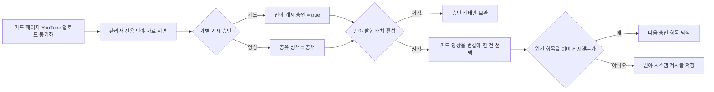

# 반야 게시판과 관리자 선별 발행

## 목적

`반야`는 배움·철학 자료를 나누는 고정 공개 게시판이다. 일반 사용자가 글쓰기 요청의 분류값을 직접 바꾸어 게시할 수 없는 관리자 선별 공간이다. 현재 첫 원천은 서버에 이미 수집되는 홍익학당 카드와 YouTube 영상이다. 수집된 외부 자료를 자동으로 모두 노출하지 않고, 서버관리자가 개별 항목을 선별한 뒤 정해진 배치가 미게시 항목을 한 건씩 올린다.

홍익학당은 현재 홍달의 협력기관이 아니다. 게시글은 제휴·공식 추천으로 표현하지 않고 원 출처, 기준일과 비제휴 안내를 포함한다.

## 승인과 발행 흐름



승인 상태는 다음과 같이 분리한다.

| 상태 | 의미 | 반야 발행 자격 |
| --- | --- | --- |
| 카드 `IsActive` | 원본 페이지에서 최근 감지됨 | 필요 |
| 카드 `IsAdminEnabled` | 내부 검토·활용 대상 ON | 필요 |
| 카드 `IsCommunityPublicationApproved` | 관리자가 반야 게시를 명시 승인 | 필요, 기본값 `false` |
| 영상 `공유상태 = 공개` | 관리자가 개별 영상 링크 게시를 승인 | 필요 |
| `CommunityEditorialBatch:Enabled` | 커뮤니티 편집 배치 전체 스위치 | 필요 |
| `PrajnaPublicationEnabled` | 반야 발행 전용 스위치 | 필요, 기본값 `false` |

카드는 활성화된 관리자 ON 묶음에 속해야 한다. 카드 승인 뒤 묶음이나 카드 자체를 끄면 발행 대상에서 제외된다. 승인 해제는 아직 게시하지 않은 후보를 제외하며, 이미 올라온 게시글을 자동 삭제하지 않는다. 게시 후 숨김이나 삭제는 별도 운영·감사 절차로 처리한다.

## 순서와 중복 방지

- Quartz 기본 일정은 한국 시간 매일 09:15이며 실행당 최대 한 건만 발행한다.
- 직전에 카드를 게시했다면 영상을 먼저 찾고, 직전에 영상을 게시했거나 이력이 없다면 카드를 먼저 찾는다. 한쪽 후보가 없으면 다른 쪽으로 진행한다.
- 카드 식별자는 `system:community-editorial:prajna-card:{cardId}`, 영상 식별자는 `system:community-editorial:prajna-video:{videoId}`다.
- 같은 외부 항목은 날짜가 바뀌거나 서버가 재시작되어도 다시 게시하지 않는다.
- 승인 후보가 없으면 빈 안내 글을 만들지 않는다.

## 공개 내용 경계

- 카드: 제목, 최대 420자의 짧은 소개, 선별 기준일, 원 출처 링크
- 영상: 제목, 최대 420자의 짧은 소개, 영상 게시일, 선별 기준일, YouTube 원본 링크
- 공통: 관리자가 선별했다는 표시와 홍익학당 비제휴 안내
- 제외: 사용자 개인정보, 관리자 메모, 저장된 원본·파생 이미지 파일, 영상 파일, 자막 전문

원자료 이미지는 관리자 검수와 별도 모바일 카드 기능에만 사용한다. 반야 게시글은 외부 원본 링크를 공유하므로 원 출처의 최신 내용과 이용 조건을 사용자가 직접 확인할 수 있어야 한다.

## 관리자 API

| Method | Path | 용도 |
| --- | --- | --- |
| `GET` | `/api/v1/admin/content/hongik-hakdang/cards?includeInactive=true` | 카드 묶음과 카드의 감지·검토·게시 승인 상태 조회 |
| `PUT` | `/api/v1/admin/content/hongik-hakdang/cards/{cardId}/community-publication` | 개별 카드 반야 게시 승인·해제 |
| `GET` | `/api/v1/admin/content/youtube/playlists` | 재생목록을 보며 선별 후보 탐색 |
| `PUT` | `/api/v1/admin/content/youtube/videos/{videoId}/publication` | 개별 영상 공개 승인·해제 |

모든 쓰기 API는 `서버관리자전용` 정책을 사용한다. 발행 배치는 외부 YouTube API를 직접 호출하지 않고 이미 동기화된 DB 상태만 읽는다.

## 설정 예시

```json
{
  "CommunityEditorialBatch": {
    "Enabled": true,
    "PrajnaPublicationEnabled": true,
    "PrajnaPublicationCronExpression": "0 15 9 * * ?",
    "PrajnaYouTubeChannelId": "UCI8HW08rOSlvweOjJ9Gp2Ng"
  }
}
```

저장소의 기본값은 전체 배치와 반야 발행 모두 `false`다. 운영자는 출처 표시, 게시 빈도와 관리자 승인 목록을 검토한 뒤 환경별 설정에서 명시적으로 활성화한다.
