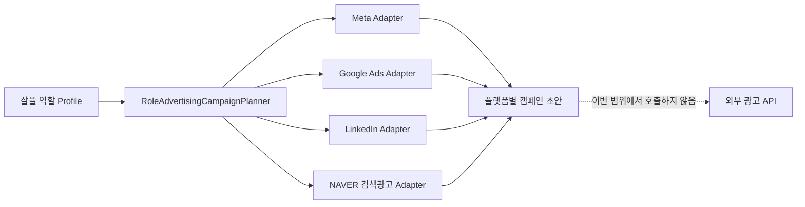

# 역할 기반 외부 광고 API 통합

## 목적

살뜰 광고는 플랫폼 전체를 모호하게 알리는 캠페인이 아니라, 같은 지역과 품목에서 필요한 역할을 함께 모으는 양면시장 획득 흐름으로 관리한다.

첫 범위는 커뮤니티 0.0에 직접 필요한 다음 역할이다.

- 커뮤니티 참여자
- 공동구매 수요자
- 공동구매 대표
- 생산자·공급자

화주, 창고 운영자, 화물·용달 기사, 음식 배달 기사는 역할 정의와 플랫폼 적합성만 보존한다. `EnforceV0RoleBoundary=true`인 동안 이 역할의 광고 계획은 차단한다.

## 책임 경계

- 역할 Profile은 landing page의 목적, 성공 지표, 기본 키워드·산업·직무 힌트를 정의한다.
- Planner는 역할과 0.0 경계, 전환 동의 안내, 채용성 광고 정책 검토 여부를 검증한다.
- Adapter는 공통 입력을 각 광고 API의 캠페인 구조와 타기팅 개념으로 변환한다.
- 외부 캠페인 생성·수정은 현재 구현하지 않는다. `SsalddelExecution:Mode=Simulation`과 `RoleAdvertising:Enabled=false`가 기본이다.
- 내부 사용자 이메일·전화번호·정확한 위치·광고 식별자를 Adapter 입력으로 받지 않는다.

내부 `탐색캠페인`은 살뜰 사용자 사이의 공개 탐색 흐름이다. 이 문서의 외부 광고 캠페인과 저장소, 상태, 식별자를 공유하지 않는다.

## 플랫폼 조사 결과

조사 기준일은 2026-07-17이다. API 버전, 권한, 심사 요건은 운영 연결 직전에 다시 확인한다.

| 플랫폼 | 적합한 역할/목적 | 공식 API와 주요 기능 | 운영 전제 | 현재 처리 |
| --- | --- | --- | --- | --- |
| Meta | 커뮤니티 참여자, 공동구매 수요자처럼 넓은 발견과 lead 수집 | Marketing API로 캠페인·광고 세트·소재 관리, Conversions API로 server event 측정 | Meta app, 광고 계정, `ads_management` 권한과 token | 캠페인·타기팅 초안만 생성 |
| Google Ads | 역할 관련 검색 의도가 명확한 수요자·공급자 | Campaign, budget, ad group, keyword, conversion reporting | manager account, developer token, OAuth 2.0, 광고 생성 허용 범위 | Search 초안만 생성 |
| LinkedIn | 생산자·공급자, 공동구매 대표, 향후 화주·창고 운영자 | Advertising API, targeting facets/entities, Audience Counts, campaign·conversion reporting | 심사된 Advertising API 접근, `rw_ads`, version header, app에 연결된 광고 계정 | B2B 역할 초안만 생성 |
| NAVER 검색광고 | 국내 지역명과 역할별 검색어 의도가 있는 사용자 | Campaign, ad group, keyword, Stat API | 검색광고 계정, API license·secret key·customer id·서명 header | 국내 Search 초안만 생성 |

공식 자료:

- [Meta Marketing API](https://developers.facebook.com/documentation/ads-commerce/marketing-api/overview)
- [Meta Conversions API](https://developers.facebook.com/documentation/ads-commerce/conversions-api)
- [Google Ads API 캠페인 생성](https://developers.google.com/google-ads/api/docs/campaigns/create-campaigns)
- [Google Ads API 전환 측정](https://developers.google.com/google-ads/api/docs/conversions/getting-started)
- [Google Ads API 접근 수준과 허용 용도](https://developers.google.com/google-ads/api/docs/api-policy/access-levels)
- [LinkedIn Advertising API 개요](https://learn.microsoft.com/en-us/linkedin/marketing/integrations/ads/ads-overview)
- [LinkedIn 캠페인 생성과 Audience Counts](https://learn.microsoft.com/en-us/linkedin/marketing/integrations/ads/getting-started)
- [NAVER 검색광고 API](https://naver.github.io/searchad-apidoc/)

## 역할별 기본 채널

| 역할 | 0.0 | 우선 채널 | 기본 전환 |
| --- | --- | --- | --- |
| 커뮤니티 참여자 | 허용 | Meta, Google Ads, NAVER 검색광고 | 가입 후 첫 공개 참여 |
| 공동구매 수요자 | 허용 | Meta, Google Ads, NAVER 검색광고 | 유효 구매 의향 등록 |
| 공동구매 대표 | 허용 | Meta, Google Ads, NAVER 검색광고 | 검증 가능한 대표 참여 신청 |
| 생산자·공급자 | 허용 | Google Ads, NAVER 검색광고, LinkedIn, Meta | 검증 가능한 공급 제안 |
| 화주·창고·기사 | 차단 | 역할 정의만 보존 | 1.0 이후 별도 검토 |

같은 지역과 품목에서 수요자와 공급자를 함께 모집한다. 방문수보다 유효 구매 의향, 공급 제안, 대표 신청처럼 실제 다음 단계로 이어지는 전환을 우선한다.

## 개인정보와 광고 정책

1. 역할은 살뜰 내부 개인 Profile을 외부로 내보내는 값이 아니라 광고 문안·키워드·산업 힌트를 만드는 Persona다.
2. Google Customer Match처럼 이메일·전화번호를 사용하는 기능은 이번 범위에서 제외한다. 향후 도입하려면 광고 목적 동의, 철회, 보존 기간, 삭제, 계정 자격과 각 플랫폼 정책을 별도 구현한다.
3. 전환 측정을 켜는 초안은 광고·분석 데이터 처리 안내 URL이 없으면 차단한다.
4. 기사 모집처럼 채용 또는 일자리로 해석될 수 있는 광고는 플랫폼 특별 광고 정책 검토 참조가 없으면 차단한다.
5. exact GPS, 상세 주소, 연락처, 내부 사용자 ID를 광고 Adapter에 전달하지 않는다.
6. API token, developer token, secret key는 tracked 설정에 넣지 않는다.

## 코드 위치

- 공통 계약: `Ssalddel.Contracts/Common/Advertising/RoleAdvertisingContracts.cs`
- 역할 Profile: `Ssalddel/Services/Advertising/RoleAdvertisingAudienceCatalog.cs`
- 플랫폼 Adapter: `Ssalddel/Services/Advertising/RoleAdvertisingPlatformAdapters.cs`
- 검증·계획: `Ssalddel/Services/Advertising/RoleAdvertisingCampaignPlanner.cs`
- 설정: `Ssalddel/Services/Options/RoleAdvertisingOptions.cs`
- DI: `Ssalddel/Extensions/ServiceCollectionExtensions.Advertising.cs`

## 다음 세로 구현 순서

1. 공동구매 수요자와 생산자·공급자의 실제 role-specific landing page 및 전환 event를 먼저 고정한다.
2. 플랫폼 계정과 개발자 접근 심사를 준비하되 secret은 local ignored configuration에만 둔다.
3. 한 플랫폼의 test account 또는 draft-only API gateway를 선택해 인증, idempotency key, retry, rate limit, audit log를 완성한다.
4. campaign 생성과 conversion 수집을 별도 Adapter로 나누고, conversion event 중복 제거 키를 둔다.
5. Simulation E2E와 개인정보 검토가 끝난 뒤에만 `Operational` 및 외부 집행 설정을 별도로 승인한다.
