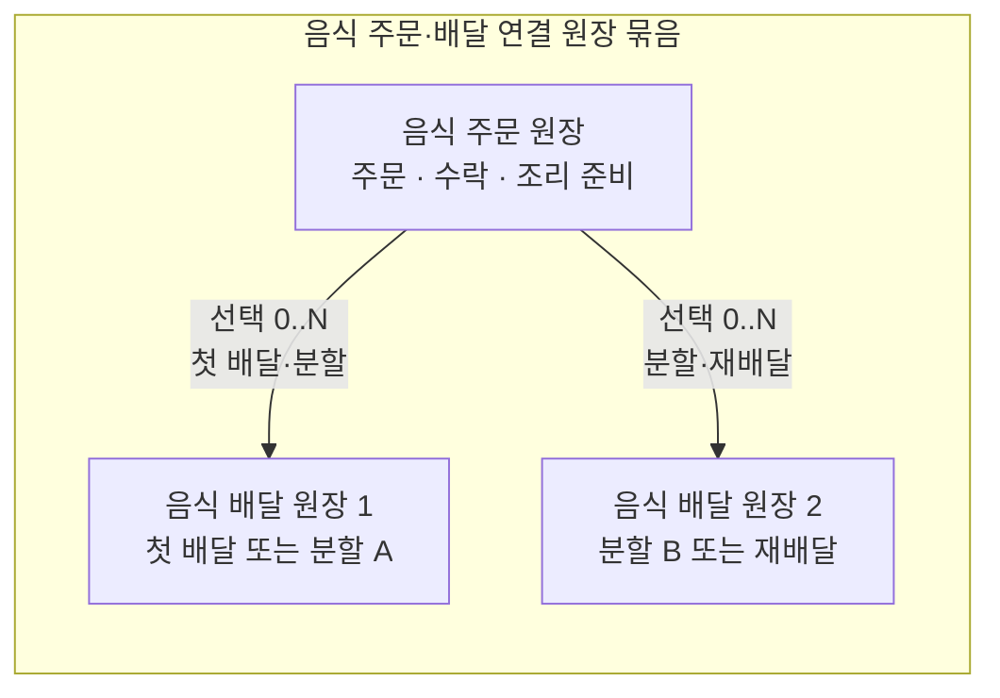
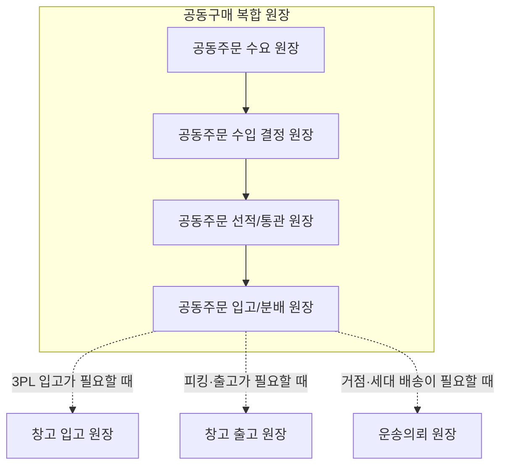
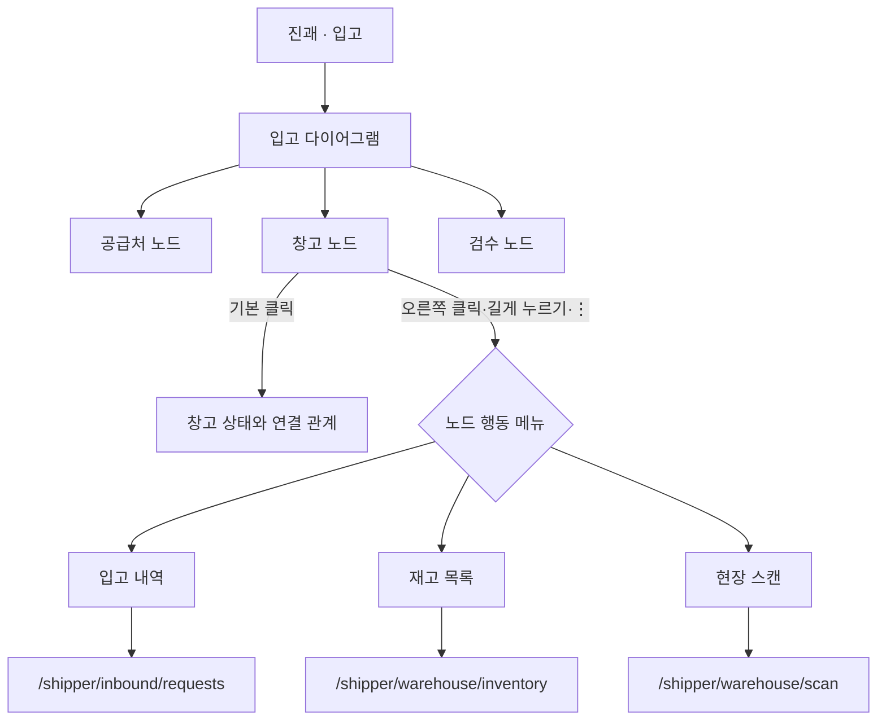

# 통합 클라이언트 3단계 내비게이션

> 상태: 목표 구조 확정, 단계별 구현 중  
> 기준일: 2026-07-13  
> 관련 문서: [Platform Home Mode](PlatformHomeMode.md), [통합 커뮤니티 클라이언트](../ProjectOverview/unified-community-client.md)

Hongdal 클라이언트의 페이지는 역할별 앱 목록을 먼저 보여주는 방식에서 벗어나 다음 세 단계로 연결한다.


역할 선택과 커뮤니티는 이 세 단계 바깥의 공통 셸 문맥이다. 역할을 바꾸면 세 단계에서 보이는 방향, 노드, 행동이 함께 바뀌며, 커뮤니티 글이나 원장 초안에서도 관련 다이어그램으로 들어갈 수 있다.

## 단계별 책임

| 단계 | 사용자의 질문 | 화면 책임 | 넣지 않을 것 |
| --- | --- | --- | --- |
| 1. 사방괘 | “어느 영역으로 갈까?” | 역할별 네 업무 영역 선택 | 상세 건수, 긴 목록, 복잡한 입력 |
| 2. 다이어그램 | “무엇이 연결되어 있고 어디가 문제인가?” | 사람·장소·업무·원장의 관계, 상태, 진행도, 다음 행동 표시 | 전체 입고 이력이나 주문 원문 같은 대량 데이터 |
| 3. 데이터 페이지 | “이 데이터를 확인하거나 처리하려면?” | 목록, 상세, 입력, 승인, 스캔, 증빙 같은 한 가지 구체 업무 | 전체 플랫폼 관계를 다시 그리는 역할 |

각 화면은 주 책임을 한 단계에 둔다. 예를 들어 창고 노드는 입고 건을 모두 펼치지 않고 `입고 내역` 행동만 제공하며, 실제 목록과 필터는 3단계 입고 페이지가 담당한다.

## 1단계: 역할 기반 사방괘

사방괘는 화면 오른쪽 벽면의 반원 손잡이에서 펼쳐지는 전역 내비게이션이다. 여덟 방향을 모두 쓰지 않고 모바일에서 판단하기 쉬운 리·태·감·진 네 방향만 사용한다.

현재 창고 관리자 역할의 의미는 다음과 같다.

| 화면 위치 | 방위·괘 | 업무 영역 | 선택 결과 |
| --- | --- | --- | --- |
| 위 | 남·리괘 `☲` | 판매 | 판매·주문 관계 다이어그램을 연다. |
| 오른쪽 | 서·태괘 `☱` | 출고 | 피킹·포장·출고 다이어그램을 연다. |
| 아래 | 북·감괘 `☵` | 배송 | 출고 이후 배송 연결 다이어그램을 연다. |
| 왼쪽 | 동·진괘 `☳` | 입고 | 공급처·입고·검수·보관 다이어그램을 연다. |

사방괘의 목적지는 원칙적으로 3단계 업무 페이지가 아니라 2단계 다이어그램이다. 현재 일부 방향이 업무 라우트로 바로 이동하는 것은 전환기 구현이며, 다이어그램별 진입 문맥이 마련되면 `원장 템플릿 + 초점 노드`로 교체한다.

## 2단계: 원장 관계와 흐름 다이어그램

다이어그램의 기본 업무 단위는 **원장**이다. 다이어그램은 원장 한 건 또는 서로 연결된 원장 묶음의 참여자·업무 블록·상태·인계 관계를 보여주고, 3단계 페이지를 찾는 시각적 색인으로 동작한다. 노드는 창고뿐 아니라 사람, 역할, 운송, 주문, 상품, 판매채널, 차량, 증빙, 정산 등으로 확장한다.

### 원장의 크기와 관계

모든 원장을 같은 크기의 독립 메뉴처럼 나열하지 않는다. 원장의 수명주기와 책임 경계에 따라 다음 세 수준으로 표현한다.

| 수준 | 의미 | 다이어그램 표현 | 예시 |
| --- | --- | --- | --- |
| 단일 원장 | 한 가지 업무 상태와 증빙을 독립적으로 추적 | 하나의 원장 경계 안에 관련 노드를 배치 | 입고 원장, 출고 원장, 운송진행 원장 |
| 연결 원장 묶음 | 수명주기와 참여자는 다르지만 선행·인계 관계가 강한 여러 원장 | 원장 경계는 나누고 바깥에 공통 묶음 테두리와 관계선을 표시 | 음식 주문 원장 + 음식 배달 원장 |
| 복합 원장 | 상위 업무 목적이 여러 하위 원장과 외부 인계를 조정 | 상위 원장 경계 안에 하위 원장 단계를 배치하고 외부 원장은 별도 경계로 연결 | 공동구매 원장 |

연결 원장 묶음은 원장 데이터를 합치는 뜻이 아니다. 각각의 식별자, 상태, 참여자, 권한, 종료 조건은 유지하고, 사용자가 하나의 업무 여정으로 이해할 수 있도록 개요 다이어그램에서 함께 보여준다. 복합 원장은 하위 원장을 숨기는 큰 레코드가 아니라 하위 원장의 진행과 인계 상태를 요약하는 상위 문맥이다.

#### 음식 주문·배달 연결 원장 묶음

`음식 주문 원장`은 주문 내용, 주문자·판매자·조리자, 주문 수락과 준비 상태를 담당한다. `음식 배달 원장`은 픽업지·도착지, 기사 배차, 이동, 전달 증빙과 수령 확인을 담당한다. 두 원장은 비슷한 참여자와 상태를 공유하지만 책임과 수명주기가 다르므로 하나의 원장으로 합치지 않는다.



음식 주문 원장은 주문·수락·조리·준비 완료까지를 담당한다. 직접 수령이면 배달 원장이 없고, 배달이 필요하면 원주문 하나에 배달 원장을 하나 이상 연결한다. 분할 배달은 전달할 메뉴·수량별 원장으로, 재배달은 이전 실패 원장을 덮어쓰지 않는 새 회차 원장으로 남긴다. 개요에서는 주문과 모든 배달 회차를 한 묶음으로 보되, 원장을 선택하면 같은 2단계 안에서 해당 원장의 세부 다이어그램으로 초점을 이동한다.

#### 창고 출고·운송·입고 연결 원장 묶음

창고 간 이동은 출고와 입고를 직접 선으로 잇지 않는다. 출발 창고가 출고 품목과 증빙을 운송 상차에 넘기고, 운송 하차가 도착 품목과 증빙을 입고 원장에 넘기는 네 단계로 표현한다.


| 경계 노드 | 사용자가 새 연결을 만들 수 있는 포트 | 데이터 인계 |
| --- | --- | --- |
| 창고 출고 | 오른쪽·아래쪽 출력 | 출고 품목, 확정 수량, 포장·출고 증빙을 운송 상차로 전달 |
| 창고 입고 | 왼쪽·위쪽 입력 | 운송 하차 품목, 인수 상태, 하차 증빙을 입고 검수의 근거로 수신 |

이 연결은 조건부다. 직접 납품처럼 별도 운송 원장이 없는 입고도 허용하지만, 운송 원장이 연결된 창고 간 이동에서는 `창고 출고 → 운송 상차 → 운송 하차 → 창고 입고` 순서를 유지한다. 모바일에서는 이 순서를 위에서 아래로 펼치고, 데스크톱에서는 경계 포트 방향을 유지한 채 캔버스에 배치한다.

#### 공동구매 복합 원장

`공동구매 원장`은 하나의 단일 작업이 아니라 공동구매라는 상위 목적 아래 여러 원장을 순서대로 조정하는 복합 원장이다. 현재 원장 카탈로그의 핵심 내부 흐름은 다음과 같다.



실선은 복합 원장 내부의 필수 진행 순서이고 점선은 조건에 따라 열리는 외부 업무 원장 인계다. 공동구매 개요에서 하위 원장을 선택하면 같은 2단계의 세부 원장 다이어그램을 열고, 해당 원장의 노드 행동을 선택할 때만 3단계 데이터 페이지로 이동한다.

노드는 다음 정보를 간결하게 보여준다.

- 이름과 종류
- 현재 상태와 진행도
- 역할 또는 책임자 범주
- 경고·지연·필수 입력 같은 핵심 신호
- 열 수 있는 구체 업무가 있다는 행동 표시

노드를 기본 클릭하면 선택·요약·연결 관계를 보여준다. 보조 클릭 또는 행동 버튼을 사용하면 작은 행동 목록을 연다.

### 노드 행동 메뉴

| 환경 | 메뉴 여는 방법 | 표시 방식 |
| --- | --- | --- |
| 데스크톱 | 마우스 오른쪽 클릭, `Shift+F10`, 메뉴 키, 노드의 `⋮` 버튼 | 노드 가까이에 작은 팝오버 |
| 모바일 | 길게 누르기 또는 노드의 `⋮` 버튼 | 화면 아래쪽 바텀 시트 |
| 키보드·보조기술 | 노드 포커스 후 행동 버튼을 `Enter` 또는 `Space` | 포커스가 메뉴 첫 항목으로 이동 |

모바일에서 길게 누르기만 강제하지 않는다. 발견하기 쉬운 `⋮` 버튼을 항상 함께 제공한다. 메뉴는 자주 쓰는 행동을 우선하며 한 번에 너무 많은 항목을 보여주지 않는다.

### 노드별 행동 예시

| 노드 종류 | 요약에서 볼 것 | 3단계로 연결할 행동 예시 |
| --- | --- | --- |
| 창고 | 운영 상태, 입고·재고·출고 요약 | 입고 내역, 재고 목록, 현장 스캔, 출고 작업 |
| 운송 | 결제·배차·상차·하차 상태 | 운송 목록, 의뢰 상세, 증빙, 정산 |
| 주문 | 주문 상태, 출고 준비도 | 주문 상세, 피킹 목록, 취소·예외 확인 |
| 음식 주문·배달 묶음 | 주문 수락·조리 준비와 픽업·전달의 연결 상태 | 주문 상세, 배달 배차, 전달 증빙, 수령 확인 |
| 공동구매 복합 원장 | 모집·결정·선적·통관·입고·분배 단계와 인계 상태 | 참여자·수량, 선적/통관, 창고 입고, 국내 운송 |
| 상품 | 재고와 판매 연결 상태 | 상품 여정, 리스팅, 재고 위치 |
| 판매채널 | 연결·동기화 상태 | 채널 계정, 상품 등록, 주문 이행 |
| 기사·차량 | 운행·배차 상태 | 현재 운송, 운송 이력, 차량 정보 |
| 사람·역할 | 참여 범위와 미처리 업무 | 프로필, 담당 업무, 관계 스냅샷 |
| 증빙·정산 | 누락과 보류 상태 | 사진/POD, 문서, 결제·정산 상세 |
| 입력 폼 | 폼 유형, 필수 입력 진행도, 제출 대상 | 운송의뢰 작성, 창고 입·출고 등록, 상·하차 확인 |

입력 폼의 제출 대상은 다이어그램 편집 규칙으로 제한하되, 폼마다 여러 허용 조건을 OR로 평가한다. 예를 들어 운송의뢰 폼은 운송/전달 종류 또는 운송·배차·상차 제목 조건 중 하나, 입고·출고 폼은 창고 종류 또는 각 업무 의미 키워드 중 하나만 만족해도 후보가 된다. 이후 노드 포트의 입력·출력 방향 규칙도 함께 적용한다. 이 구조는 특정 노드 이름 하나에 종속되지 않으면서도 폼을 의미 없는 원장에 연결하지 않도록 하고, 올바른 3단계 데이터 페이지 문맥을 유지한다.

## 3단계: 구체 데이터 페이지

3단계는 목록, 상세, 입력, 처리 중 하나를 주 책임으로 삼는다. 페이지는 다이어그램에서 전달한 문맥을 초기 필터로 사용하되, URL을 직접 열어도 동작해야 한다.

예를 들어 창고 노드에서 `입고 내역`을 누르면 다음 문맥을 전달할 수 있다.

```text
/shipper/inbound/requests?warehouseId=12&from=diagram&focusNode=warehouse-12
```

URL 파라미터 이름은 예시이며 실제 계약으로 확정하기 전까지 구현 완료로 간주하지 않는다. 중요한 원칙은 `warehouseId` 같은 안정된 식별자를 전달하고 화면에 보이는 노드 이름으로 라우트를 추측하지 않는 것이다.

3단계 페이지에서 뒤로 가면 다음 상태를 복원한다.

- 열었던 다이어그램과 원장 템플릿
- 선택 노드
- 확대·스크롤 위치
- 켜진 레이어와 필터
- 노드 행동 메뉴를 열기 전의 탐색 문맥

## 창고 예시



## 내비게이션 메타데이터 계약

노드 컴포넌트 안에서 역할별 라우트를 하드코딩하지 않는다. 다이어그램 구성 계층이 다음 개념의 메타데이터를 제공하는 방향으로 구현한다.

```text
DiagramNodeNavigation
- NodeKey
- NodeKind
- EntityId
- LedgerTemplateKey
- LedgerInstanceId
- ParentLedgerInstanceId
- RelatedLedgerInstanceIds[]
- LedgerRelationType
- RoleScope
- PrimaryAction
- Actions[]

DiagramNodeAction
- ActionKey
- Label
- IconKey
- RouteTemplate 또는 CommandKey
- RequiredRoles / RequiredPolicy
- RequiredContextKeys
- DisplayOrder
```

구체 형식은 공유 계약으로 확정할 때 이름을 조정할 수 있다. 다음 규칙은 유지한다.

1. 라우트는 중앙 카탈로그에서 관리한다.
2. 노드 라벨로 URL을 조합하지 않는다.
3. 클라이언트 메뉴 숨김은 편의 기능일 뿐 권한 검증이 아니다.
4. 서버 API가 역할과 리소스 접근 권한을 다시 검사한다.
5. 권한이 없는 행동은 숨기거나 비활성화하고 이유를 설명한다.
6. 삭제, 결제, 확정 같은 위험 행동은 메뉴에서 즉시 실행하지 않고 확인 페이지나 명시적 확인 단계를 거친다.

## 현재 구현과 목표의 경계

| 영역 | 현재 | 목표 |
| --- | --- | --- |
| 사방괘 | 네 방향과 역할별 목적지, 드래그·클릭 구현 | 모든 방향이 관련 다이어그램 문맥으로 진입 |
| 다이어그램 | 세로 모바일 흐름, 데스크톱 캔버스, 노드 상세와 준비도 구현 | 단일·연결·복합 원장 경계와 모든 노드의 공통 행동 메뉴·내비게이션 메타데이터 적용 |
| 데이터 페이지 | 운송·입고·재고·스캔·판매 등 기존 라우트 존재 | 다이어그램 식별자·필터를 받아 열리고 돌아갈 때 문맥 복원 |
| 권한 | 기존 페이지·API별 정책 사용 | 노드 행동 노출과 서버 정책을 같은 메타데이터로 추적 |

문서에서 현재 기능과 목표 기능을 섞어 쓰지 않는다. 공통 노드 행동 메뉴와 문맥 복원이 구현되기 전까지는 `목표` 또는 `설계`로 표시한다.

## GitHub 화면 문서 정리 기준

사용자 관점 문서는 다음 순서로 정리한다.

1. 1단계 사방괘 화면과 역할별 네 목적지
2. 2단계 다이어그램 종류와 노드 관계
3. 각 노드 행동에서 열리는 3단계 데이터 페이지

`ShipperApp`, `WarehouseManagerApp`, `DriverApp` 같은 프로젝트별 카탈로그는 코드 위치와 라우트를 찾는 물리 색인으로 유지한다. 프로젝트가 다르다는 이유만으로 사용자에게 별도 앱처럼 설명하지 않는다.

새 화면 README에는 가능한 경우 다음을 기록한다.

- 내비게이션 단계: 1, 2, 3 또는 공통 셸
- 진입 사방괘와 다이어그램
- 원장 수준: 단일 원장, 연결 원장 묶음, 복합 원장
- 부모·관련 원장과 선행·포함·인계 관계
- 출발 노드와 행동 이름
- 필요한 식별자와 초기 필터
- 뒤로 갈 때 복원할 문맥
- 역할·권한과 민감정보 범위
