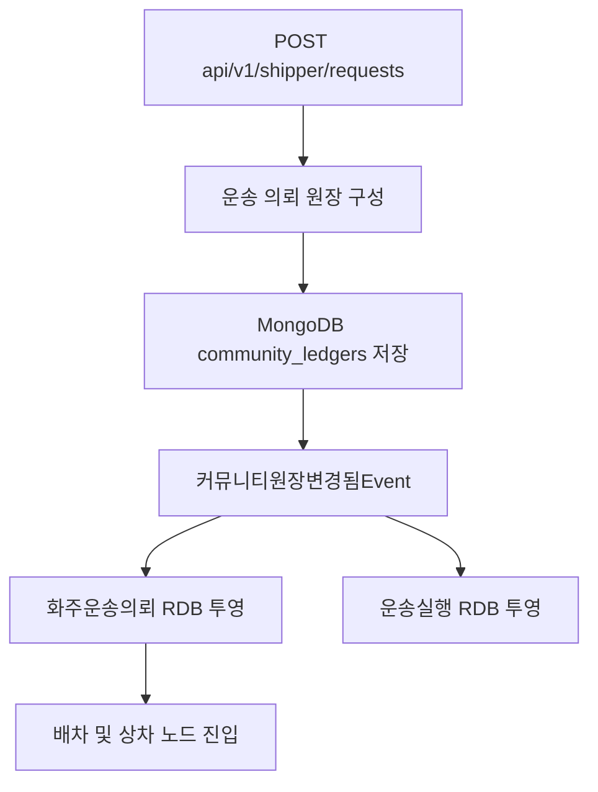

# 운송 의뢰 노드 수직 구현

## 목적

살뜰 2.0 운송 이행의 첫 업무 노드는 `운송 의뢰`다. 문화교통 1.5의 이동 준비 정보가 사람과 자격 사업자를 거쳐 실제 운송 의뢰로 확정된 뒤에만 진입한다. 이 노드를 화면의 도형이 아니라 MongoDB 원장 원본,
RDB 업무 투영, 기존 API, 후속 상차 노드를 연결하는 하나의 완결된 업무 단위로 다룬다.

## 원본과 투영

- MongoDB 운송 의뢰 원장이 업무 원본이다.
- `화주운송의뢰`, `운송실행투영`은 조회와 실행을 위한 RDB 투영이다. 원장 블록과 다이어그램은 MongoDB에만 둔다.
- 기존 화주 운송 의뢰 API 경로를 그대로 사용하며 별도 원장 전용 Controller를 만들지 않는다.

## 네 개의 원장 블록

1. `transport-request`: 요청자, 화물, 차량, 서비스 조건
2. `pickup`: 상차 주소, 담당자, 위치, 시간창
3. `dropoff`: 하차 주소, 담당자, 위치, 시간창
4. `settlement`: 결제 수단, 정산 시점, 증빙, 운임과 부가비용

운송 의뢰 노드는 위 네 블록 중 의뢰·상차·하차 입력을 함께 소유한다. 결제/정산 블록은 같은 생성
요청에 포함하지만 후속 정산 상태 변경은 결제/정산 노드가 담당한다.

## RDB 투영 시작 조건

다음 값이 모두 있어야 운송 의뢰와 운송 실행 RDB 투영을 만든다.

- 요청자: 화주 또는 주문자 사용자 식별자
- 화물 종류
- 상차지 주소, 연락처, 유효한 상차 시간창
- 하차지 주소

조건이 부족한 원장은 MongoDB 초안으로 남길 수 있지만 배차와 상차 실행에는 진입하지 않는다.

## 순환 방지

원장 변경 EventHandler가 RDB를 투영할 때는 RDB 업무 Event를 다시 발행하지 않는다. 사용자의 실제
운송 상태 변경 API만 업무 Event를 발행하고, 해당 EventHandler가 관련 MongoDB 원장을 다시 갱신한다.
따라서 양방향 동기화는 가능하지만 같은 변경이 무한 반복되지는 않는다.

## 다음 노드로 넘어가는 기준

- 기존 생성 API가 MongoDB 원장을 먼저 저장한다.
- 원장 이벤트로 RDB 운송 의뢰와 실행 투영이 만들어진다.
- 모든 입력값이 MongoDB와 RDB 사이를 왕복한다.
- 필수 입력이 부족하면 실행 투영이 보류된다.
- 단위 테스트와 서버 빌드가 통과한다.

이 기준이 충족된 뒤에만 `상차` 노드의 상태 전이와 증빙을 같은 방식으로 깊게 구현한다.
