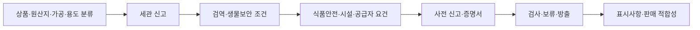

# 미국·호주 수입식품 통관 규정 기준

검토 기준일은 **2026-07-19**다. 이 문서는 홍달에서 공동수입 여정을 설계하거나 글쓰기 다이어그램에 규정 확인 노드를 붙일 때 사용하는 개발 기준이며, 개별 거래에 대한 법률·통관 자문이 아니다.

## 결론

수입식품은 `세관 신고` 하나로 통관 완료를 판정할 수 없다. 두 나라 모두 다음 판단을 분리해야 한다.



- 세관 화물 반출과 식품 규제기관의 적합 판정은 같은 상태가 아니다.
- 허가·증명·검사 여부는 품목명만으로 정할 수 없다. 원산지, 동식물 성분, 가공 정도, 포장, 최종 용도를 함께 확인해야 한다.
- 관세사 또는 customs broker가 신고를 대행해도 importer의 법적 책임이 자동으로 이전되지는 않는다.
- 홍달은 확인 항목과 공식 근거를 보여 주되 신고, 통관 승인, importer 지정, broker 자동 선택을 수행하지 않는다.

## 미국

### 규정 층위

| 단계 | 핵심 기준 | 개발 시 보존할 증빙 |
| --- | --- | --- |
| 관할 분류 | 일반 식품은 주로 FDA, 육류·가금·난제품과 일부 Siluriformes는 FSIS, 동식물 검역은 APHIS가 추가 적용될 수 있다 | 상품 사양, 성분, 가공 공정, 학명·축종, 원산지, 최종 용도 |
| CBP 신고 | `19 U.S.C. §1484`에 따라 importer of record가 reasonable care로 품목분류, 가격, 원산지와 admissibility 자료를 제출한다 | HTS 분류, customs value, invoice, packing list, B/L 또는 AWB, 원산지 근거 |
| FDA 시설 등록 | 적용 대상 외국 시설은 `21 U.S.C. §350d`, `21 CFR Part 1 Subpart H`에 따른 등록과 미국 내 agent가 필요하다. 예외 여부를 별도로 확인한다 | 시설 등록 확인 자료, 미국 agent 정보 |
| FDA Prior Notice | FDA 규제 식품은 구체적 제외·면제가 없으면 반입 전에 `21 CFR Part 1 Subpart I`에 따른 사전신고가 필요하다 | Prior Notice confirmation |
| FSVP | 적용 대상 미국 importer는 `21 U.S.C. §384a`, `21 CFR Part 1 Subpart L`에 따른 식품·공급자별 검증 프로그램을 유지한다 | hazard analysis, supplier evaluation, verification, corrective action 기록 |
| 품목별 식품안전 | 수산물 `21 CFR Part 123`, 주스 `Part 120`, 산성화·저산성 통조림 `Parts 108·113·114`처럼 별도 절차가 있다 | HACCP 또는 scheduled process 자료 |
| FSIS 경로 | 해당 육류·가금·난제품 등은 수출 가능 국가·시설, 정부 증명, FSIS 재검사 절차를 확인한다 | 공식 수출증명서, PHIS·ACE 자료, 재검사 결과 |
| APHIS 경로 | 식물·식물성 상품은 ACIR, 동물성 상품은 Veterinary Services의 최신 원산지별 조건을 확인한다 | permit, phytosanitary·veterinary certificate, treatment 자료 |
| 표시·판매 | FDA 식품은 `21 CFR Part 101`과 품목별 identity·성분·첨가물·nutrition·allergen 규정을 확인한다 | 최종 영문 라벨과 성분·알레르겐 검토본 |

### 역할을 혼동하면 안 되는 이유

- `Importer of Record`: CBP 신고, 분류, 가격, 원산지와 관세 책임의 중심이다.
- `FSVP Importer`: FDA 공급자 검증 책임자다. 항상 importer of record와 같지는 않다.
- `U.S. Agent`: 외국 식품시설 등록에서 FDA와 연락하는 역할이다. FSVP importer나 customs broker와 같은 역할로 간주하면 안 된다.
- `Customs Broker`: 위임받아 신고할 수 있지만 importer의 상품 적합성 책임을 대신 확정하지 않는다.
- `Foreign Facility/Supplier`: 시설 등록, 공정 관리, 증명과 공급자 검증에 필요한 원자료를 제공한다.

따라서 원장 역할 슬롯도 하나의 `미국 수입 담당자`로 합치지 않고 위 역할을 분리해야 한다.

## 호주

### 규정 층위

| 단계 | 핵심 기준 | 개발 시 보존할 증빙 |
| --- | --- | --- |
| ABF 신고 | Customs Act 1901과 ABF 절차에 따라 owner/importer 또는 licensed customs broker가 import declaration을 제출한다 | tariff classification, customs value, invoice, packing list, 운송서류 |
| BICON 사전 판단 | `Biosecurity Act 2015`와 `Biosecurity (Conditionally Non-prohibited Goods) Determination 2021`에 따라 정확한 식품·원산지·가공·용도를 BICON에서 조회한다 | BICON case, 상품 사양, 성분, 공정, 원산지 |
| 생물보안 조건 | BICON이 요구하는 import permit, 정부 증명, 처리, 포장 또는 검사를 선적 전에 충족한다 | permit, certificate, treatment declaration |
| 수입식품 관리 | `Imported Food Control Act 1992`, Regulations 2019, Order 2019가 IFIS와 risk food 분류를 구성한다 | Full Import Declaration, IFIS 자료 |
| 검사·보류 | DAFF가 Food Control Certificate를 발행하면 해당 식품은 검사·시험과 지시가 끝날 때까지 유통할 수 없다 | Food Control Certificate, 검사·시험 결과, release evidence |
| Risk food 증명 | 현행 Order와 BICON이 지정한 품목은 인정된 외국 정부 증명서 또는 food safety management certificate가 필요할 수 있다 | 현행 양식의 정부·안전관리 증명서 |
| 식품기준 | 판매 식품은 현행 Australia New Zealand Food Standards Code의 성분, 첨가물, 오염물질, 미생물, 포장, 표시 기준에 맞아야 한다 | 제품 사양, 시험성적, 최종 라벨 |
| 원산지 표시 | 소매 식품은 `Country of Origin Food Labelling Information Standard 2016` 적용 여부와 표시 형태를 확인한다 | 원산지 산정 근거, 최종 표시안 |

호주는 **생물보안 조건을 먼저** 충족한 다음 수입식품 안전 요건과 IFIS 절차를 적용한다. BICON은 2025년부터 식품안전 요구사항도 함께 제공하므로, 저장된 과거 체크리스트보다 실제 조회 결과가 우선한다.

## 품목별 분기 예시

| 품목 | 미국에서 추가 확인 | 호주에서 추가 확인 |
| --- | --- | --- |
| 신선 과일·채소 | APHIS ACIR의 원산지별 허용·permit·처리·검사, FDA 적용 요건 | BICON의 원산지·학명별 허용 조건, permit·처리, IFIS 분류 |
| 수산물 | FDA seafood HACCP. 단, Siluriformes 관할은 FSIS 여부를 먼저 확인 | BICON 생물보안, IFIS risk·surveillance 분류, 필요 시 정부 증명 |
| 육류·가금·난제품 | FSIS 국가·시설 eligibility, 정부 증명, APHIS 동물질병 조건, 재검사 | BICON 국가·축종·가공별 조건, 인정 정부 증명, IFIS 검사 |
| 주스 | FDA Juice HACCP와 importer verification | BICON 및 Code의 성분·미생물·표시 기준 |
| 산성화·저산성 밀봉식품 | FDA 시설 등록과 제품·용기·공정별 scheduled process filing | BICON 분류와 Code·IFIS 시험 기준 |
| 소매 포장식품 | FDA 또는 FSIS 영문 표시·알레르겐 기준 | Food Standards Code와 원산지 표시 기준 |

## 원장과 다이어그램에 필요한 최소 입력

규정 노드를 생성하기 전에 다음 값이 있어야 한다.

1. 정확한 상품명, 식품 유형, 과학명 또는 축종
2. 모든 원재료와 동식물 유래 성분
3. 제조국, 원료 원산지, 경유국
4. 살균·가열·건조·발효·냉동·밀봉 등 가공 방식
5. pH, 수분활성, 냉장·냉동 여부처럼 분류에 영향을 주는 사양
6. bulk·소매 포장 여부, 용기 재질·크기, 최종 라벨
7. 판매·외식 공급·추가 가공·샘플 등 최종 용도
8. importer, broker, FSVP importer, U.S. agent 또는 호주 owner/importer 역할 담당자
9. 제조시설과 공급자 식별정보
10. 예상 입항지, 운송 방식, 수량과 신고가격

값이 빠졌다면 시스템은 `통관 가능`을 반환하지 않고 `추가 분류 필요` 상태를 유지해야 한다.

## 코드 반영

`ImportedFoodComplianceCatalog`는 다음을 제공한다.

- 미국·호주 목적지별 규정 profile
- 공통 확인 단계와 품목별 조건부 requirement
- 책임 역할과 준비할 증빙 문서 코드
- 법률, 규정, 공식 지침, BICON·APHIS 조회 시스템의 검토일 포함 reference
- 수산물, 주스, 산성화·저산성 통조림, FSIS 품목, 식물·동물성 상품, 호주 risk food와 소매 포장 분기

호주는 아직 홍달의 실제 운영시장으로 활성화하지 않는다. 두 국가 profile 모두 다음 값을 유지한다.

```text
IsInformationOnly = true
IsOperationallyEnabled = false
CanAutoFileDeclaration = false
CanAutoClearOrRelease = false
CanAutoSelectImporterOrBroker = false
RequiresProductSpecificOfficialCheck = true
RequiresQualifiedProfessionalReview = true
```

## 공식 확인처

### 미국

- [19 U.S.C. §1484](https://www.govinfo.gov/link/uscode/19/1484)
- [CBP Basic Importing and Exporting](https://www.cbp.gov/trade/basic-import-export)
- [FDA Importing Human Foods](https://www.fda.gov/industry/importing-fda-regulated-products/importing-human-foods)
- [FDA Prior Notice of Imported Foods](https://www.fda.gov/industry/fda-import-process/prior-notice-imported-foods)
- [FDA FSVP Final Rule](https://www.fda.gov/food/food-safety-modernization-act-fsma/fsma-final-rule-foreign-supplier-verification-programs-fsvp-importers-food-humans-and-animals)
- [APHIS plant and plant-product imports](https://www.aphis.usda.gov/plant-imports/how-to-import)
- [APHIS animal-product imports](https://www.aphis.usda.gov/animal-product-import)
- [FSIS import guideline](https://www.fsis.usda.gov/guidelines/2022-0001)

### 호주

- [DAFF imported food legislation](https://www.agriculture.gov.au/import/goods/food/legislation)
- [DAFF food importer step-by-step guide](https://www.agriculture.gov.au/import/goods/food/info-for-food-importers)
- [BICON](https://bicon.agriculture.gov.au/)
- [ABF import declarations](https://www.abf.gov.au/importing-exporting-and-manufacturing/importing/how-to-import/import-declaration)
- [FSANZ imported foods](https://www.foodstandards.gov.au/consumer/imported-foods)
- [FSANZ Food Standards Code legislation](https://www.foodstandards.gov.au/food-standards-code/legislation)
- [Biosecurity Act 2015](https://www.legislation.gov.au/C2015A00061/latest)
- [Imported Food Control Act 1992](https://www.legislation.gov.au/C2004A04512/latest)
- [Imported Food Control Regulations 2019](https://www.legislation.gov.au/F2019L01006/latest)
- [Imported Food Control Order 2019](https://www.legislation.gov.au/F2019L01233/latest)

실제 선적 전에는 저장된 검토일과 무관하게 BICON, APHIS, FDA, FSIS, CBP·ABF의 현행 결과를 다시 확인하고, 품목과 거래 구조를 아는 관세·식품 규제 전문가의 검토를 거쳐야 한다.
