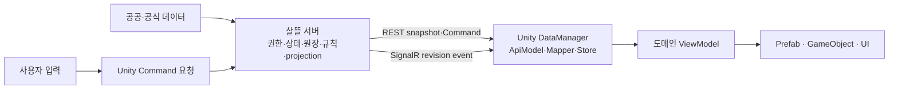

# 살뜰 Unity 생산·유통·협력 경험 플랫폼 종합 제안서

> 상태: 상위 제품·아키텍처 제안
>
> 구현 상태: Unity 데이터 코어 일부만 구현했으며 권위 서버 API, Unity 실시간 client, Prefab·Scene은 미구현
>
> 세부 데이터 설계: [Unity 농업·유통·경영 시뮬레이션 제안서](UnityAgricultureDistributionSimulationProposal.md)
>
> 공통 기준: [커뮤니티 0.0 기반 제품 원칙](CommunityFoundationV0Policy.md), [업무 실행 책임 모델](BusinessWorkflowResponsibilityModel.md), [입력·데이터 수집 처리 파이프라인](DataInputCollectionProcessingPipelineProposal.md)

## 1. 제안 요약

살뜰 Unity 프로젝트를 단순한 농장 게임이나 기존 서비스의 3D 화면으로 만들지 않는다. 생산, 유통, 경영과 협력의 관계를 사용자가 직접 경험하고, 선택의 근거를 공공데이터와 공동 원장으로 확인하는 **도메인 중심의 교육·협력 경험 플랫폼**으로 확장한다.

전체 방향은 다음 다섯 원칙으로 묶는다.

1. 생산·유통·협력의 업무 의미를 먼저 정의하고 GameObject는 이를 표현한다.
2. 공유되고 영속되는 상태의 유일한 진실은 살뜰 서버가 가진다.
3. REST와 SignalR의 책임을 나누고 Unity `DataManager`가 네트워크와 표현 사이를 격리한다.
4. Scene을 매번 새로 만들지 않고 Template, Prefab과 design token을 재사용 가능한 패턴으로 관리한다.
5. 협동조합·조직별 데이터는 ID만 붙이는 데서 끝내지 않고 서버 권한, 조회, cache와 실시간 group까지 같은 scope로 격리한다.

제품의 한 줄 정의는 다음과 같다.

> **살뜰의 공공 근거와 공동 원장을 바탕으로 생산·유통·협력을 함께 경험하는 데이터 기반 가상세계**

World 상태, 사용자 데이터, UseCase, 원장 projection과 GameObject 표현의 세부 책임은 [살뜰 비즈니스 도메인의 Unity World·원장 투영 아키텍처](UnityWorldLedgerProjectionArchitectureProposal.md)를 기준으로 한다.

## 2. 현재 구현과 목표의 경계

| 영역 | 현재 저장소 | 이 제안의 목표 |
| --- | --- | --- |
| Unity 데이터 | `Ssalddel.Unity`에 engine-independent package와 fixture 구현 | 서버 snapshot·실시간 event를 소비하는 Unity data layer |
| 시뮬레이션 계산 | client package에서 결정적 headless 계산 가능 | 공유 world의 확정 계산은 서버, client 계산은 preview·표현 보조 |
| REST API | Unity 전용 route 없음 | bootstrap, snapshot, Command와 history API |
| 실시간 | 운송 원장, 음식점 주문, 다이어그램 등 일부 SignalR Hub 존재 | Unity world·협력 원장용 권한 검증 Hub와 revision event |
| 조직 격리 | 일부 업무에서 `OrganizationKey` 기반 조회 제한 존재 | 협동조합 scope를 저장·권한·cache·실시간 전체에 일관 적용 |
| Prefab·Scene | Unity Editor project 없음 | 재사용 가능한 농장·시장·원장 Prefab과 design system |
| 공공데이터 | 살뜰 서버에 KAMIS 등 수집·보관 경로 존재 | 출처 보존 공개 projection만 Unity에 전달 |

현재 client-side simulation engine은 데이터 구조와 재현성을 검증하는 첫 구현이다. 여러 사용자가 공유하는 생산량, 재고, 공동 원장, 참여와 판매 결과의 권위로 사용하지 않는다. 온라인 협력 단계에서는 동일 규칙을 서버 실행 경계로 옮기거나 서버가 결과를 재검증하고 revision을 확정해야 한다.

### 2.1 현재 코드 근거

- [Program.cs](../../Ssalddel/Program.cs)는 운송 원장, 음식점 주문, 배차 추천과 다이어그램 협업 SignalR Hub를 등록한다.
- [TransportRequestLedgerHub.cs](../../Ssalddel/Hubs/TransportRequestLedgerHub.cs)는 인증 사용자·관리자 group을 분리한다.
- [DiagramCollaborationHub.cs](../../Ssalddel/Hubs/DiagramCollaborationHub.cs)는 원장 room 참여 전에 원장 접근을 검사한다.
- [조직개별공급발주UseCase.cs](../../Ssalddel/Application/ContractManagement/조직개별공급발주UseCase.cs)는 인증 context에서 해석한 `OrganizationKey`를 저장·조회 조건에 포함한다.

이 코드는 SignalR와 조직 scope에 재사용할 패턴이 있다는 근거다. Unity world Hub, 모든 협동조합 aggregate의 공통 tenant middleware, cross-scope 자동 차단과 두 Unity client 수렴이 구현됐다는 증거는 아니다.

## 3. 제품과 콘텐츠 철학

### 3.1 도메인 경험이 콘텐츠다

콘텐츠는 미니게임을 나열하는 방식보다 한 생산물이 사람과 역할을 거쳐 이동하는 흐름으로 구성한다.

```text
재배 조건 확인
  → 생산 계획과 비용 선택
  → 날씨·작황 변화 경험
  → 수확·선별·가공
  → 보관·운송·판매 방식 비교
  → 개인판매와 공동판매의 비용·노동·위험 확인
  → 공동 원장으로 선택과 역할 회고
```

사용자는 매출만 보는 것이 아니라 비용, 노동, 위험, 담당자, 미정 조건과 데이터 근거를 함께 본다. 공동판매는 언제나 더 유리한 정답이 아니라, 조건에 따라 협력의 가치와 조율 비용이 달라지는 선택지로 표현한다.

### 3.2 살뜰 철학을 게임 규칙에 반영한다

- 관심, 참여 의사, 연락처 공개, 공동 원장과 실행을 서로 다른 상태로 둔다.
- 지리적 가까움은 효율 후보일 뿐 자동 가입, 상대 선택, 계약이나 배차 근거가 아니다.
- 가상 참여자, fixture, 예상 가격과 계산 결과는 `SIMULATED`로 표시한다.
- 실제 사용자의 협력은 별도 동의와 서버 권한을 통과해야 한다.
- 공개 공공데이터를 공급 가능성, 재고, 계약 의사나 현재 위치로 해석하지 않는다.
- 효율이 낮은 참여자를 숨기지 않고 시간창·역할·집결 방식 같은 대안을 보여 준다.

## 4. 도메인 중심 구조

Unity class나 화면보다 먼저 다음 bounded context와 stable ID를 정의한다.

| 도메인 | 주요 aggregate·값 | 대표 경험 |
| --- | --- | --- |
| 생산 | 농장, 경작지, 작물, 재배 회차, 성장·수확 | 심기, 관리, 병충해 대응, 수확 |
| 환경 | 지역, 날씨 snapshot, 토양, 계절 | 환경 근거 확인과 영향 비교 |
| 시장 | 품목 mapping, 시장 단계, 가격 관측 | 산지·도매·소매의 차이 이해 |
| 경영 | 생산비, 노동, 장비, 현금 흐름, 수익 | 매출과 순수익 구분 |
| 제조 | 가공 lot, 공정, 수율, 부산물 | 원물과 가공품의 비용 구조 |
| 물류 | 재고 lot, 창고, 운송 구간, 연료·손실 | 보관·이동 비용과 제약 경험 |
| 협력 | 협동조합, 구성원, 역할, 참여 의사, 공동 원장 | 공동판매, 역할 분담, 합의와 회고 |
| 학습 | scenario, Command, Event, 근거, 결과 | 선택의 원인과 결과 재현 |

각 aggregate는 서버 stable ID, revision, scope와 공개 범위를 가진다. Unity GameObject instance ID, Prefab 이름과 scene 경로는 업무 식별자가 아니다.

## 5. 권위 서버와 client 역할

### 5.1 기본 흐름



### 5.2 서버가 확정하는 상태

- 사용자·협동조합 구성원과 역할
- 공유 world의 작물·재고·비용·공동 원장 상태와 revision
- 참여, 공개 범위, 상태 전이와 동의 증적
- 공동판매 조건, 역할 배정과 완료 기록
- 여러 client가 함께 보는 채팅·다이어그램·협력 action
- 외부 데이터의 source, freshness, 단위와 공개 projection
- 저장, Event/Outbox, 멱등성과 감사 기록

### 5.3 Unity client가 맡는 책임

- 입력 수집, 카메라, 애니메이션, 이펙트와 scene 표현
- 서버 snapshot을 Unity game model과 ViewModel로 변환
- loading, cached, reconnecting, stale, conflict와 error 표시
- 확정 전 입력 preview와 접근성 feedback
- 같은 stable ID의 변경을 해당 Prefab·UI에 반영
- 서버 revision을 넘어서 상태를 자체 확정하지 않음

client prediction이 필요해도 이는 반응성을 위한 임시 표현이다. 서버 응답과 다르면 server revision으로 되돌리고 원인을 사용자에게 설명한다.

## 6. REST와 실시간 통신 분리

SignalR는 연결을 유지하는 기본 실시간 수단으로 사용한다. 별도 raw socket은 위치·물리 상태처럼 SignalR로 감당하기 어려운 고빈도 자료가 실제로 확인된 경우에만 검토한다.

| 통신 | 담당 | 예시 |
| --- | --- | --- |
| REST `GET` | 초기화·전체 snapshot·catalog·history | 로그인 후 bootstrap, world 재접속, 가격 근거 조회 |
| REST `POST` | 권한·상태 검증이 필요한 Command | 심기, 수확 요청, 참여 의사, 공동판매 조건 제안 |
| SignalR server event | 이미 확정된 상태 변경 알림 | revision 변경, 원장 상태 변경, 역할·채팅·presence |
| SignalR client call | 저빈도 협업 action | room 참여, cursor·선택 공유, 메시지 |
| raw socket | 별도 성능 검증 후 예외 적용 | 고빈도 위치·물리 동기화가 필요한 경우 |

### 6.1 실시간 event 원칙

- event는 `CooperativeId`, aggregate ID, revision, event ID와 occurred time을 가진다.
- client가 보낸 group명이나 협동조합 ID만 신뢰해 group에 가입시키지 않는다.
- Hub는 인증 사용자와 membership을 서버에서 확인한 뒤 권한 있는 group에만 연결한다.
- client는 중복 event ID를 무시하고 낮은 revision을 적용하지 않는다.
- revision이 끊겼거나 reconnect한 경우 REST snapshot을 다시 조회한다.
- 상태 변경 성공 뒤 해당 aggregate를 재조회하거나 서버가 보낸 검증된 projection patch를 적용한다.
- SignalR 장애가 REST 저장 실패를 sample 성공으로 바꾸지 않는다.

### 6.2 Command envelope

모든 변경 요청은 최소한 다음 정보를 가진다.

```text
CommandId
CooperativeId / WorldId
AggregateId
ExpectedRevision
CommandType / Payload
ClientSentAt
ScenarioVersion / RuleSetVersion
```

`CommandId`는 재시도 멱등성에, `ExpectedRevision`은 동시 변경 충돌을 감지하는 데 사용한다. 협동조합 scope와 사용자 ID는 body 값만 믿지 않고 인증 context와 membership에서 다시 확인한다.

## 7. Unity DataManager와 상태 흐름

`DataManager`는 단순 HTTP wrapper도, 모든 gameplay를 가진 거대한 singleton도 아니다. 네트워크 transport, data validation, cache와 Unity 표현 사이의 조율 경계다.

```text
DataManager
  ├─ IUnityBootstrapClient
  ├─ IWorldSnapshotClient
  ├─ IWorldCommandClient
  ├─ IWorldRealtimeClient
  ├─ IScenarioPackageRepository
  ├─ IUnityStateStore
  └─ IDataStatusProvider
```

책임은 다음과 같이 제한한다.

1. Server DTO와 소스 assembly를 공유하지 않는 Unity `ApiModel`로 응답을 받는다.
2. Mapper가 schema, stable ID, 단위, provenance와 공개 범위를 검사한다.
3. 검증된 game model만 state store에 넣는다.
4. stable ID별 ViewModel 변경을 발행한다.
5. Prefab과 GameObject는 ViewModel을 구독해 표현을 갱신한다.
6. reconnect·revision gap·conflict가 있으면 snapshot을 다시 불러온다.

DataManager 상태는 최소 `NotLoaded`, `Loading`, `ReadyLive`, `ReadyCached`, `ReadyFixture`, `Reconnecting`, `Stale`, `Invalid`, `Failed`를 구분한다.

## 8. DTO와 실시간 계약

```text
Server Entity / Server DTO
  → HTTP·SignalR JSON contract
  → Unity ApiModel
  → Mapper
  → Unity GameModel
  → ViewModel
  → Prefab · UI
```

- Unity는 `Ssalddel.Contracts`나 서버 Entity를 직접 참조하지 않는다.
- REST snapshot과 SignalR event는 목적이 다르므로 같은 DTO 하나로 합치지 않는다.
- snapshot은 현재 상태 전체, event는 stable ID·revision·변경 종류·재조회 단서를 가진다.
- contract는 schema version을 가지고 additive 변경을 우선한다.
- GameModel은 gameplay와 표현에 필요한 최소 데이터만 가진다.
- ViewModel은 label, color, animation state 같은 표현 파생값을 담당한다.

## 9. 협동조합·조직별 데이터 격리

협동조합을 한 서버 안에서 운영하는 구조는 가능하다. 그러나 record에 ID 하나를 넣는 것만으로 격리가 완성되지는 않는다.

### 9.1 필수 scope

```text
CooperativeId
  └─ WorldId
      ├─ FarmId / FieldId
      ├─ InventoryId
      ├─ MarketPlanId
      ├─ CollectiveLedgerId
      └─ CollaborationRoomId
```

보호 데이터 aggregate와 조회 projection은 `CooperativeId` 또는 호환 `OrganizationKey`를 가진다. public 공공데이터는 조직 scope와 분리하고, 조직이 선택한 scenario·해석·원장만 private scope에 둔다.

### 9.2 서버 강제 규칙

- 인증 사용자의 membership과 role을 서버에서 조회한다.
- repository query는 ID 조회 뒤 client에서 거르는 방식이 아니라 scope를 조건에 포함한다.
- aggregate ID만 아는 다른 협동조합 사용자가 존재 여부를 추측하지 못하게 한다.
- cache key, idempotency key, search index, background job과 audit log에도 scope를 포함한다.
- SignalR group 가입 전에 membership과 aggregate 접근권한을 확인한다.
- 운영자 cross-scope 접근은 별도 권한·사유·감사 기록을 요구한다.
- 조직 이동·탈퇴·권한 철회가 REST, cache와 실시간 연결에 전파되어야 한다.

### 9.3 권장 역할

| 역할 | 기본 권한 |
| --- | --- |
| 방문자 | 공개 scenario와 공공 근거만 조회 |
| 조합원 | 자신의 협동조합 world와 허용된 공동 원장 조회·제안 |
| 생산 담당 | 재배 Command 요청과 생산 기록 확인 |
| 유통 담당 | 선별·재고·운송·판매 계획 확인 |
| 조합 운영자 | 구성원·역할·공개 범위와 원장 검토 |
| 플랫폼 운영자 | 명시적 지원 절차와 감사 기록이 있는 제한적 접근 |

## 10. Template·Prefab 재사용 구조

Prefab은 데이터를 저장하는 원본이 아니라 도메인 상태를 일관되게 표현하는 template이다.

### 10.1 Prefab 계층

| 계층 | 예시 | 책임 |
| --- | --- | --- |
| Foundation | focus ring, status badge, tooltip anchor | 공통 상호작용·접근성 |
| Domain primitive | `FarmTileView`, `CropView`, `InventoryLotView` | 한 도메인 값을 표현 |
| Interaction pattern | 선택, drag, context action, confirmation | 반복되는 입력 패턴 |
| Feature template | 농장 구획, 시장대, 공동 원장 board | 여러 primitive 조합 |
| Scene template | 농장, 공판장, 창고, 협동조합 회의 공간 | layout과 camera 기준 |

깊은 Prefab 상속보다 작은 component 조합을 우선한다. Prefab에는 server data나 가격 원본을 복제하지 않고 stable ID, ViewModel binding과 표현 설정만 둔다.

### 10.2 Design system

다음 token을 단일 catalog로 관리한다.

- color: 공개 근거, 개인 상태, 협동조합 상태, 경고, stale, simulated
- typography: 제목, 수치, 단위, 근거와 제한 안내
- spacing·corner·elevation·panel density
- icon: 생산, 환경, 시장, 경영, 제조, 물류, 협력
- motion: loading, 서버 확정 대기, 성공, conflict, reconnect
- accessibility: 최소 대비, focus, keyboard/gamepad 이동, reduced motion

`SIMULATED`, `CACHED`, `STALE`, `SERVER CONFIRMED` 상태는 색상만으로 구분하지 않고 label과 icon을 함께 사용한다.

### 10.3 Prefab contract test

- 필수 binding key와 ViewModel type
- data가 없을 때 empty/error 표현
- loading·reconnecting·conflict 상태
- locale이 바뀌어도 stable ID 유지
- mobile·desktop safe area와 input 방식
- Prefab instance가 서버 권위 상태를 로컬로 덮어쓰지 않는지

## 11. 첫 온라인 세로 슬라이스

첫 목표는 **협동조합 하나의 감자 재배 회차를 두 client가 같은 server revision으로 확인하고 일반판매·공동판매를 비교하는 흐름**이다.

```text
Client A가 FarmTile에서 심기 요청
  → REST Command
  → 서버 membership·상태·ExpectedRevision 검증
  → 생산 원장 저장·revision 증가·Event/Outbox
  → SignalR로 조합 world 변경 알림
  → Client A·B DataManager가 revision 적용 또는 snapshot 재조회
  → 두 FarmTile이 같은 성장 상태 표시
  → 수확 뒤 KAMIS 형태 fixture 근거로 판매 방식 비교
  → 비용·노동·위험과 공동 원장 회고
```

### 11.1 완료 조건

- 서버 재시작과 client 재접속 뒤 같은 stable ID와 revision을 조회한다.
- 같은 Command 재시도는 중복 심기·비용 기록을 만들지 않는다.
- 두 client는 event 순서가 달라도 최종 서버 snapshot에 수렴한다.
- 다른 협동조합 사용자는 ID를 알아도 farm·원장·room을 조회하거나 구독하지 못한다.
- 공공가격은 source, 기준일, 지역, 시장 단계, 단위와 제한을 보존한다.
- 일반판매와 공동판매는 매출뿐 아니라 비용, 노동, 위험과 역할을 비교한다.
- fixture와 실제 관측, client preview와 server confirmed 상태를 구분한다.
- 실제 주문, 결제, 계약, 배차나 정산을 만들지 않는다.

## 12. API·Hub 제안

아래 route는 목표 계약이며 현재 구현된 API가 아니다.

| Method | Route | 역할 |
| --- | --- | --- |
| `GET` | `/api/v1/unity/bootstrap` | 사용자, membership, 허용 world와 contract version |
| `GET` | `/api/v1/unity/worlds/{worldId}/snapshot` | 권한 있는 최신 world projection |
| `GET` | `/api/v1/unity/scenarios/{scenarioKey}/{version}` | immutable scenario package |
| `POST` | `/api/v1/unity/worlds/{worldId}/commands` | 멱등 Command와 revision 검증 |
| `GET` | `/api/v1/unity/ledgers/{ledgerId}` | 허용된 협력·학습 원장 재조회 |
| SignalR | `/hubs/unity-world` | 권한 있는 world revision·협력 event |

route에 `CooperativeId`를 노출하더라도 최종 scope는 인증 membership으로 판정한다. route parameter와 인증 scope가 다르면 `404` 또는 정책상 허용된 최소 오류만 반환한다.

## 13. 단계별 구현 계획

| 단계 | 결과물 | 완료 gate |
| --- | --- | --- |
| 0. 결정 | Unity version·pipeline·platform·repo·인증 방식 ADR | 팀 합의와 호환성 확인 |
| 1. 도메인 계약 | 협동조합 world, 생산 회차, inventory, ledger stable ID·revision | server domain test |
| 2. 권위 서버 | snapshot store, Command UseCase, Event/Outbox, scope authorization | 멱등·동시성·격리 test |
| 3. 네트워크 | bootstrap·snapshot·Command REST와 Unity Hub | reconnect·revision gap test |
| 4. Unity data | ApiModel, Mapper, DataManager, state store와 cache | server contract fixture test |
| 5. 표현 기반 | design token, FarmTile·Crop·status Prefab | Prefab contract·접근성 test |
| 6. 첫 online slice | 두 client 감자 재배·수확·판매 비교 | server convergence와 tenant 격리 |
| 7. 협력 확장 | 역할, 대화, 공동 원장과 회고 | 동의·공개 범위·철회 test |
| 8. 콘텐츠 확장 | 제조·물류·경영 scenario와 asset 적용 | 영역별 data·rule·성능 gate |

서버 contract와 권한이 닫히기 전에 다중 사용자 scene을 먼저 확장하지 않는다. Prefab과 그래픽은 첫 domain ViewModel과 상태표가 안정된 뒤 제작한다.

## 14. 검증 전략

### 14.1 서버

- Command 멱등성, ExpectedRevision conflict와 재조회
- 원장 저장, projection, Event/Outbox 재처리
- 협동조합 A/B의 같은 aggregate ID·검색·cache·Hub 격리
- membership 철회 직후 REST와 SignalR 접근 차단
- public data와 private organization projection 분리

### 14.2 Unity data

- Server JSON → ApiModel → Mapper → GameModel 호환성
- 중복·역순 event, revision gap과 reconnect
- live·cached·fixture·stale·invalid 상태
- 동일 snapshot과 Command의 결정적 preview
- 서버 응답이 preview와 다를 때 rollback·설명

### 14.3 Prefab·화면

- 같은 ViewModel로 desktop·mobile·gamepad 표현
- loading, empty, error, reconnect, conflict, no-access 상태
- source·시각·단위·제한과 `SIMULATED` 표시
- 두 client에서 최종 revision과 visible state 일치
- 실제 Unity Editor·PlayMode·빌드된 player에서 최종 화면 검증

## 15. 범위에서 제외하는 항목

첫 단계에는 다음을 포함하지 않는다.

- Unity client가 공유 상태의 최종 권위를 갖는 구조
- client가 보낸 `CooperativeId`만으로 접근을 허용하는 구조
- 모든 GameObject 위치·animation을 서버에 저장하는 작업
- 검증 없이 raw socket과 고빈도 동기화를 도입하는 작업
- 실제 주문, 결제, 계약, 유상 운송, 자동 배차와 정산
- 공공기관·협동조합 명부를 실제 공급 의사나 거래 가능성으로 표시
- Asset Store 구매 또는 Unity Editor 설치를 구현 완료로 간주하는 일

## 16. 착수 전 결정할 사항

1. Unity LTS version, render pipeline과 Windows·Android 지원 순서
2. Unity project와 현재 local UPM package의 repository 배치
3. Unity 인증 token 발급·갱신·secure storage 방식
4. `CooperativeId`와 기존 `OrganizationKey`의 호환·migration 규칙
5. client preview와 server authoritative simulation rule의 배포·version 전략
6. 첫 Hub event의 snapshot 재조회 방식과 projection patch 범위
7. design token·Prefab catalog의 소유 project와 review 절차

이 결정 뒤 첫 구현은 새로운 그래픽 scene이 아니라 `협동조합 격리된 server snapshot + 심기 Command + revision event + 두 DataManager의 수렴`이어야 한다.
