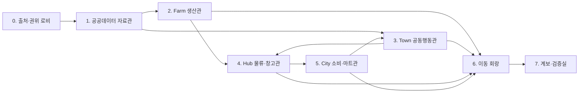

# Unity 통합 모판·전시관 제안

## 1. 제안 목적과 현재 판정

이 문서는 지금까지 만든 Unity의 Farm·Town·City 표현, 신티 에셋 연구소, 현실 관측 전시장, 턴 카드 모판과 서버의 공공데이터·주문자·화주·주문자 집단·음식배달·화물운송·창고관리·도심마트 코드를 하나의 **통합 모판·전시관**으로 결집하는 방안을 제안한다.

핵심 결론은 다음과 같다.

> 통합 전시관은 완성 업무 Scene을 진열하는 홍보 공간도, 서버 업무를 대신 실행하는 3D 관리자 화면도 아니다. 실제 Scene에 개별 배치할 객체 후보를 같은 고유 식별자와 데이터 계보로 연구·비교·검증하고 다음 World 이식 대상을 고르는 모판이다.

2026-08-11 현재 `EXH-0` 현황 대장, `EXH-1` 공통 구성 대장(Manifest), `EXH-2` Unity 로비·자료관·Farm Scene, `EXH-3` 화물·Hub·창고 데이터 계보, `EXH-4` Town 주문자 집단·City 마트 공개 범위와 `EXH-5` 음식점·기사·주문자 인계 전시까지 구현했다. 실제 공공데이터 호출, 권한이 확인된 실운영 Cargo·마트·음식배달 상태 사본 조회와 운영 Command는 수행하지 않았고, 기존 구현 상태는 코드·집중 테스트·Unity 실행 검증 근거·실운영 연결 여부를 분리해서 해석한다.

## 2. 왜 지금 통합 전시관이 필요한가

현재 자산은 충분히 많지만 완성 단위가 서로 다르다.

- 신티 에셋 연구소에는 Farm 498개, Town 702개, City 335개, 합계 1,535개 Prefab의 원본 색인과 대표 연구 기록이 있다.
- 현실 관측 전시장에는 감자 상자·KAMIS, 감자 토양 모판, 공공데이터 출처·지역·기간·단위·미수집 경계가 있다.
- 턴 카드 모판에는 후보를 실제 게임 덱과 분리하고 C0~C6 통과 조건으로 승격시키는 방식이 있다.
- Unity World에는 Farm·Town·Hub·City, 감자 재배·수확·판로·화물 이동, 창고·도심마트·주거공동체와 여러 시뮬레이션 절단면이 있다.
- 서버에는 공개정보부터 주문자 집단, 공급·통관 준비, 화물운송, 창고, 음식배달, 도심마트까지 이어지는 Controller·UseCase·contract가 있다.
- 그러나 이들을 한 장소에서 같은 계보로 탐색하고, 무엇이 구현·검증·차단 상태인지 비교하는 공통 전시 계약은 없다.

따라서 다음 단계는 에셋 수나 Scene 수를 늘리는 일이 아니라, **이미 있는 조각을 사실의 종류와 인계 관계에 따라 재분류하고 가장 작은 관통 동선을 만드는 일**이어야 한다.

## 3. 모판과 전시관의 재정의

### 3.1 하나의 공간, 네 가지 관람 상태

| 상태 | 질문 | 데이터 | 허용 상호작용 | 금지 사항 |
| --- | --- | --- | --- | --- |
| 모판 | 이것을 World에 심을 가치가 있는가 | 후보·출처·해석·통과 조건 | 선택, 비교, 승격 검토 | 운영 상태 변경 |
| 전시 | 현재 무엇이 확인됐는가 | 읽기 전용 서버·시뮬레이션 상태 사본 | 초점 이동, 데이터 계보 탐색, 원장 요약 열람 | 화면 상태로 업무 성공 추정 |
| 체험 | 이 규칙을 가상 세계에서 실행하면 무엇이 달라지는가 | 명시적 시뮬레이션 세션 | 미리보기, 확정, Tick, 기준 원장 재조회 | 실제 주문·결제·배차·알림 생성 |
| 운영 인계 | 실제 업무를 어디서 확인·실행하는가 | 권한이 확인된 실운영 관점별 조회 결과 | Web·MAUI 인계, 별도 서버 Command | Unity 애니메이션이나 범용 전시 확정으로 실행 |

`모판`과 `전시관`을 별도 제품으로 나누지 않는다. 전시관 안에서 아직 승격되지 않은 후보를 보는 상태가 모판이며, 검증된 상태 사본을 보는 상태가 전시다. 사용자가 체험을 명시적으로 시작할 때만 별도 시뮬레이션 세션을 연다.

### 3.2 배치 단위는 업무 장면이 아니라 배치 객체다

화물·창고, 주문자 집단·마트, 음식배달 같은 업무 계보는 여러 배치 객체의 관계를 설명하는 업무 흐름이다. Scene에 실제로 심는 단위는 건물, Dock, 선반, 조리대, Gate, 차량, 화물, 표지 객체 같은 독립 배치 객체다. 업무 흐름 전체를 하나의 Prefab이나 모듈로 고정하지 않는다.

배치 객체의 고유 식별자·시각 변형·배치 규격·연결 지점·데이터 연결·승격 검증 근거와 대상 Scene 배치를 분리하는 상세 계획은 [통합 모판·전시관 배치 객체 리팩토링 계획](UnityIntegratedSeedbedExhibitionObjectRefactoringPlan.md)을 따른다.

### 3.3 Pack의 책임

Pack은 업무 도메인이 아니라 시각 문법이다.

| Pack | 전시관에서 맡는 시각 언어 | 대응 가능한 업무 | 단독으로 증명하지 못하는 것 |
| --- | --- | --- | --- |
| Farm | 생산, 토양, 시설재배, 수확, 농기계, 농산물 | 생산자 관점, 작물 기준정보, 농업기상·토양·가격 관측, HarvestLot | 실제 생산량, 소유권, 품질, 출하 확정 |
| Town | 이웃, 저밀도 생활권, 집결, 근린상점, 지역 연결 | 개별 의향, 주문자 집단, 공동행동, 지역 집배송, 전통시장 | 자동 가입, 대표성, 합의, 계약 |
| City | 고밀도 주거, 도심상점, 물류시설, 행정·공공 기능 | 창고, 도심마트, 음식점, 공동수령, 운영 관점 | 재고, 영업 상태, 주문·배달 성공 |

Farm·Town·City를 서버 버전이나 역할과 일대일로 고정하지 않는다. 예를 들어 주문자 집단은 Town 광장에서 협의할 수 있지만 City 공동주택에도 존재할 수 있고, 창고는 Town Hub와 City 물류센터 양쪽에 있을 수 있다.

## 4. 제안하는 전시관 구조

전시관은 하나의 초기화 진입점과 하나의 공통 상황 HUD를 사용하고, 내부를 전시 구역으로 나눈다. Web 경로마다 Scene을 만들지 않는다.



### 4.1 0구역 — 출처·권위 로비

관람을 시작하기 전에 다음 네 상태를 항상 보여 준다.

- `LIVE / CACHED / FIXTURE / UNCOLLECTED / INVALID / FAILED` 데이터 상태
- `OPERATIONAL / SIMULATION / RESEARCH` 실행·관람 mode
- 현재 관점과 권한 범위
- 상태 사본의 상태 버전, 출처 개정 번호, 기준 시각과 마지막 성공 시각

이 로비는 `SsalddelExecution:Mode`를 바꾸는 임의 토글이 아니다. 서버가 허용한 실행 방식과 현재 세션을 표시하고, 체험 시작은 별도 시뮬레이션 세션 생성·선택 흐름을 따른다.

### 4.2 1구역 — 공공데이터 자료관

기존 `PublicDataHall`, 지역농수산 Map, 작물 기준정보, KAMIS·농사로·기상청·토양·전통시장·국제 가격 자료를 `출처 → 관측 → 해석 가능 범위 → 업무 참고` 순서로 전시한다.

각 자료 카드는 최소한 다음을 보존한다.

- 제공 기관과 자료 묶음·호출 기능 키
- 지역·공간 단위와 기준 기간
- 값, 단위, 통화, 유통 단계와 표본 수
- 출처 개정 번호·원문 hash·조회 시각·마지막 성공 시각
- 결측·제한·이용 조건
- 이 자료로 알 수 있는 것과 알 수 없는 것
- 연결 가능한 상품·지역·시설 고유 식별자

공공데이터는 모든 관의 **근거 조명** 역할을 한다. 주문 수량, 판매가, 재고, 생산량, 운임 또는 추천 결과를 대신 확정하지 않는다.

### 4.3 2구역 — Farm 생산관

기존 6×6 감자밭, 작기 profile, 토양·기상 관측, 수확과 HarvestLot을 한 계보로 배치한다.

```text
product:potato
  → CultivationProfile
  → CultivationCycle
  → HarvestLot
  → Package/Cargo 후보
```

관람자는 실제 관측과 시뮬레이션 생육을 나란히 비교할 수 있지만 둘을 합치지 않는다. 생산관의 대표 체험은 밭갈이·파종·생육·수확 미리보기·확정·Tick이며, 완료 뒤 같은 기준 상태 사본을 다시 조회한다.

### 4.4 3구역 — Town 공동행동관

주문자를 고립된 구매자가 아니라 `개별 의향 → 철회 가능한 수요 → 주문자 집단 후보 → 협의·이의·결의 → 사람 승인 인계`로 보여 준다.

| 전시 오브젝트 | 서버 의미 | 보호 경계 |
| --- | --- | --- |
| 개인 의향 우편함 | 본인의 조건·수량·철회 상태 | 타인의 상세 의향 비공개 |
| 집단화 지도 테이블 | 배송권 단위 집계와 배치 미리보기 | 지리적 가까움으로 자동 가입 금지 |
| 주민 회의대 | 협의·이의·결의·서명 상태 | 화면 선택을 동의로 해석 금지 |
| 공동 원장 벽 | 집단 원장·비용·노동·위험·담당 | 커뮤니티 대화와 실행 원장 분리 |
| 인계 Gate | 같이 수입·창고·운송 준비 | 승인만으로 계약·결제·신고 실행 금지 |

Town Pack의 주택·시청·광장·근린상점은 이 의미를 설명하는 외형일 뿐이다. 가구 수, 가족 형태, 경제력, 대표성 또는 동의 상태를 Prefab 배치로 추정하지 않는다.

### 4.5 4구역 — Hub 물류·창고관

화주의 운송 의뢰와 창고 업무를 한 덩어리로 합치지 않고, 명시적 인계로 연결한다.

```text
화주 운송 의뢰 초안
  → 출고 가능 조건 확인
  → 운송 의뢰/배차 후보
  → 상차·운송·하차·인수

입고 요청
  → 입고 확인
  → 검수
  → 적재·재고
  → 피킹·포장
  → 출고 예정
  → 운송 인계
```

전시 배치 객체는 `입고 Dock`, `검수대`, `Rack/적재함`, `피킹 카트`, `포장대`, `출고 대기장`, `기사 인계 Gate`로 구성한다. 각 객체는 현재 작업 고유 식별자와 상태만 표현하고, NPC가 목적지에 도착하거나 상자가 이동했다는 이유로 작업을 완료하지 않는다.

### 4.6 5구역 — City 소비·마트관

도심마트는 공개 상품과 내부 운영을 분리한다.

- 주문자에게는 판매 가능 상품·가격·기준 시각과 철회 가능한 주문 요청을 보여 준다.
- 마트 운영자에게는 권한이 확인된 재고·진열·보충·피킹·포장·인계의 관점별 조회 결과만 보여 준다.
- 주거공동체에는 개인정보를 제거한 집계와 공동수령 상태만 보여 준다.
- 판매가와 KAMIS 관측값은 나란히 비교할 수 있지만 같은 값으로 취급하지 않는다.

현재 공개 상품 API가 진열대 위치·보충 작업·직원 배정의 기준 출처를 제공하지 않는다면, 전시관은 그 칸을 `연결 대기`로 남긴다. 임의 진열대 위치나 운영자 작업 대기열을 생성하지 않는다.

### 4.7 6구역 — 이동 회랑

화물운송과 음식배달은 같은 도로를 사용할 수 있지만 같은 업무 흐름이 아니다.

| 구분 | 화물운송 | 음식배달 |
| --- | --- | --- |
| 대표 대상 | pallet, box, HarvestLot cargo | 음식 주문·마트 포장 주문 |
| 주요 제약 | 차량 제원, 상하차, 혼적, 장거리, 복귀·휴식 | 조리·포장 완료 예상, 짧은 배달권, 전달 시간 |
| 시작 | 화주·창고의 출고 가능 인계 | 음식점 접수 또는 마트 포장 준비 |
| 완료 | 하차 뒤 별도 인수·증빙 | 픽업 뒤 전달, 별도 주문자 수령 확인 |
| Unity 표현 | Regional Road·Truck·Hub Gate | City/Town street·Bike/Car·Pickup point |

따라서 공통 이동 표현(`MovementPresentation`)은 재사용하되, 배차 규칙·상태 전이·Command는 분리한다. 차량 도착 애니메이션은 어느 쪽에서도 완료 근거가 아니다.

### 4.8 7구역 — 계보·검증실

어떤 전시에서든 `계보 보기`를 누르면 다음 연결을 같은 화면에서 보여 준다.

```text
공공 출처 / 사용자 의향
  → 기준 원장 기록의 고유 식별자
  → Event 또는 인계
  → 인수 기록의 고유 식별자
  → 권한이 확인된 관점별 상태 사본
  → Unity 표현 모델
  → VisualRoot / VisualKey
  → 테스트와 Game View 검증 근거
```

연결이 끊긴 지점은 숨기지 않고 `Unlinked`, `Unverified`, `FixtureOnly`, `RuntimeUnverified`, `OperationalBlocked`로 표시한다.

## 5. 서버 업무를 전시관으로 해석하는 매핑

| 서버 영역 | 재사용할 실제 기반 | 전시관 해석 | 우선 연결할 고유 식별자 | 현재 핵심 공백 |
| --- | --- | --- | --- | --- |
| 공공데이터 | 농수산정보, 작물기준정보, 지역농수산 Map, 출처 대장·보관 자료 | 자료관의 출처 서가·관측 지도·비교대 | 출처, 관측, 상품, 지역 | 공급자별 실시간 승인·수집 상태와 Unity 공통 집계 |
| 주문자 | 개별주문 관점, 주문방식 비교, 음식·마트 주문 | 개인 의향 우편함과 소비 카드 | 의향, 주문, 상품, 수령자 범위 | 여러 주문 유형의 공통 관점별 조회 결과 |
| 주문자 집단 | 자동집단화 미리보기, 집단 운영주체, 협의·이행 계획 | Town 집단화 지도·회의대·공동 원장 | 수요, 집단, 모집, 원장 | 개인정보를 제거한 Unity 집계와 사람 승인 표현 |
| 화주 | `api/v1/shipper/requests`, 차량·운임 미리보기, 일괄 미리보기·확정 | Farm/Hub 출하 접수대 | 운송 의뢰, 화물, 상차·하차 장소 | 상품·HarvestLot·창고 출고와의 공통 데이터 계보 |
| 화물운송 | 기사 추천, 진행 운송, 상차·하차·예외·증빙 | 장거리 이동 회랑 | 운송, 배정, 화물, 증빙 | 실운영 관점별 조회 결과의 Unity HTTP 연결과 권한별 재조회 |
| 창고관리 | 권한이 확인된 Warehouse World 상태 사본, 입고·검수·적재·피킹·포장·출고 | Hub 내부 공정 전시 | 창고, 입고, 재고 Lot, 작업, 출고 | 실제 운영 DB·선택 상호작용·Game View 폐루프 검증 |
| 음식배달 | 음식 주문 접수·음식점 진행, 기사 작업 공간·제안·픽업·배달 | 음식점 주방과 단거리 전달 회랑 | 음식 주문, 배달 제안, 픽업, 수령 | 주문자·음식점·기사의 동일 원장 복합 관점별 조회 결과 |
| 도심마트 | 공개 상품·주문 요청, Warehouse 기반 마트 작업 흐름 | City 진열·후방재고·포장·공동수령 | 상품, 마트 재고, 진열, 작업, 주문 | 기준 진열대·위치·작업·배분 실운영 API |

이 표의 `재사용할 실제 기반`은 코드가 존재한다는 뜻이다. 운영 DB migration, 인증된 live 호출, Unity runtime 배선, Game View, 전체 test green까지 모두 증명됐다는 뜻은 아니다.

## 6. 공통 전시 계약 제안

### 6.1 서버가 소유할 구성 대장

새 구성 대장 `전시관ExhibitManifest`는 Unity `ScriptableObject`가 아니라 공유 계약과 서버 조회 결과 생성기가 소유한다.

```text
ExhibitStableId
ExhibitKind
WorkflowKey / ProductVersion
PerspectiveCode / AuthorizationScope
WorldStableId / ZoneStableId / ObjectStableIds
CanonicalRecordLinks[]
SourcePlan / SourceRevision / ProjectionRevision / ReferenceTime
DataState: Live | Cached | Fixture | Uncollected | Invalid | Failed
ExperienceMode: Research | ReadOnly | Simulation | OperationalHandoff
CompletionState: Candidate | Linked | Verified | Blocked | Promoted
AllowedInteractionIntentCodes[]
BlockedReasonCodes[]
VisualKeys[] / PackRoles[]
EvidenceLinks[]
```

`CanonicalRecordLinks`는 기준 원장 기록 종류, 고유 식별자, 관계 코드, 출처·대상 상태 버전을 보존한다. 단순 문자열 URL이나 Prefab 경로로 업무 관계를 만들지 않는다.

### 6.2 Unity가 소유할 것

Unity는 다음 표현·선택 책임만 가진다.

- `전시관CatalogDataManager`: 구성 대장과 상태 사본을 가져오고 마지막 성공 상태를 관리
- `전시관Projector`: 서버 응답을 카드·표지 객체·경로·배치 객체 상태로 해석
- `전시관SelectionStateStore`: 선택된 전시·World 배치 객체의 고유 식별자 보존
- `전시관PresentationModel`: 한국어 이름, 상태 표시, 출처 요약, 행동 의도
- `전시관VisualCatalog`: `VisualKey → 프로젝트용 Prefab/material/FX`
- `전시관SceneCoordinator`: 구역 초점 이동, 계보 회랑, Web 인계

기존 `에셋원본Index`, `에셋연구Catalog`, `에셋공공관측Catalog`, `턴카드모판CatalogData`는 버리지 않는다. 각각을 구성 대장 후보로 읽는 변환 연결부를 두고, 원본 Prefab GUID와 업무 고유 식별자를 계속 분리한다.

### 6.3 서버가 반환하지 않을 것

- 다른 사용자의 정밀 주소·연락처·GPS·주문 상세
- 실제 계약금액·결제수단·민감 화물 증빙 원문
- 창고 보안 위치나 권한 범위 밖의 재고
- 근거 없는 긴급도·우선순위 점수·30초 업무 queue
- 에셋 이름으로 추정한 생산량·거주자·영업 상태
- 하나의 범용 `ConfirmExhibit`로 모든 업무를 실행하는 Command

## 7. 상호작용 문법

모든 전시는 같은 UI 문법을 사용한다.

1. `관찰`: 현재 상태 사본과 출처·기준 시각을 본다.
2. `계보`: 앞뒤 원장·인계·상태 버전을 본다.
3. `비교`: 실제 관측, 시뮬레이션 값, 운영 값을 단위와 실행 방식을 유지한 채 비교한다.
4. `미리보기`: 해당 도메인의 서버 또는 시뮬레이션 미리보기를 요청한다.
5. `확정`: 명시적 확인 문구, 예상 상태 버전, 권한 상황을 가지고 원래 도메인 Command를 호출한다.
6. `새로고침`: 성공 뒤 기준 원장을 다시 조회한다.
7. `자세히`: 긴 입력·증빙·민감 업무는 상황 고유 식별자를 가진 Web·MAUI 인계로 넘긴다.

전시관 공통 버튼이 직접 업무별 규칙을 구현하지 않는다. `AllowedInteractionIntentCode`를 domain adapter가 원래 UseCase·Command로 연결한다.

## 8. 첫 통합 이야기: 감자 한 상자의 두 이동선

모든 서버 영역을 한 번에 억지로 단일 원장으로 합치지 않는다. 같은 `product:potato`와 지역을 공유하되, 두 개의 명확한 이동선을 병렬로 전시한다.

### 8.1 A선 — 생산·화물·창고·마트

```text
KAMIS/농사로/기상 관측
  → 감자 CultivationCycle
  → HarvestLot 300kg
  → 화주 출하·운송 의뢰 후보
  → 화물 기사 배정 후보
  → 상차·Hub 이동·하차
  → 창고 인수·검수·적재
  → 마트 후방재고·진열/보충 후보
  → 주문자 또는 주문자 집단의 구매·수령
```

### 8.2 B선 — 음식점·마트·음식배달

```text
주문자 음식/마트 주문
  → 음식점 조리 또는 마트 피킹·포장
  → 음식배달 offer
  → 기사 명시 수락
  → 픽업
  → 단거리 전달
  → 주문자 별도 수령 확인
```

A선과 B선은 City 소비관과 이동 회랑을 공유하지만 화물·주문·배달의 고유 식별자와 상태 전이는 분리한다. 이 구조가 검증되기 전에는 수입·수출·정산·복수 창고·다품목을 첫 전시에 넣지 않는다.

## 9. 우선순위와 단계별 실행안

우선순위는 시각적 화려함이 아니라 **계보 단절 위험 → 서버 권위 오류 위험 → 여러 업무가 재사용하는 정도 → 실제 관람 가치** 순으로 정한다.

| 순위 | 단계 | 구현 범위 | 완료 조건 |
| --- | --- | --- | --- |
| P0 | `EXH-0 현황 대장` | 기존 Unity 대장·Scene·서버 경로·계약·테스트·Game View 근거를 전시 후보 목록으로 정리 | 각 후보가 구현·집중 테스트·실행 상태·실운영 네 상태를 따로 가짐 |
| P1 | `EXH-1 공통 구성 대장` | 공유 계약, 서버 조회 결과 생성기, 예시 집계, Unity용 변환기와 테스트 | Prefab 경로 없이 고유 식별자·상태 버전·출처·실행 방식·차단 사유 왕복 |
| P2 | `EXH-2 로비·자료관·Farm` | 기존 연구소와 PublicDataHall 연결부, 감자 관측·재배·HarvestLot 읽기 전시 | `Live/Cached/Fixture/Uncollected/Failed`와 실제 관측·시뮬레이션이 Game View에서 구분됨 |
| P3 | `EXH-3 화물·Hub·창고` | A선의 화주 의뢰 후보, 화물 이동, Warehouse 상태 사본, 입고~출고 인계 | 같은 화물 계보, 권한, 예상 상태 버전, 별도 인수 상태가 유지됨 |
| P4 | `EXH-4 Town 주문자 집단·City 마트` | 개별 의향, 집단화 미리보기, 공동 원장 요약, 마트 공개·운영 관점 | 개인 상세 비노출, 사람 승인 경계, 판매가·KAMIS 분리 |
| P5 | `EXH-5 음식배달 분기` | 음식 주문·음식점/마트 준비·기사 제안·픽업·전달·수령 | 화물운송과 규칙을 합치지 않고 동일 도로 표현만 재사용 |
| P6 | `EXH-6 배치 객체 모판·배치 승격실` | 업무 흐름과 개별 배치 객체 분리, O0~O6 승격 조건, 배치 규격·연결 지점·Scene 이식 기록 | 연결·배치 근거가 끊긴 객체가 자동 승격되지 않음 |
| P7 | `EXH-7 운영 인계` | 권한이 확인된 실시간 관점별 조회 결과, 로그인 초기화, Web·MAUI 상황 인계 | 실패를 Fixture로 숨기지 않고 실제 Command 뒤 기준 원장 재조회 |
| P8 | `EXH-8 확장` | 전통시장·수입/수출·정산·다품목·다중 창고 | 앞 단계의 공통 계약으로 새 전시를 추가하고 기존 Scene 수를 폭증시키지 않음 |

### 9.1 2026-08-11 EXH-0~EXH-5 구현 결과

- `EXH-0`: 16개 후보를 코드·집중 테스트·실행 상태·실운영 연결의 네 검증 축으로 분리한 [현황 대장](UnityIntegratedSeedbedExhibitionInventory.md)을 작성했다.
- `EXH-1`: 공유 `통합전시관ManifestResponse`와 출처 계획·기준 원장 관계·검증 근거 계약을 추가했다.
- 서버 조회 결과 생성기 `통합전시관Projector`는 고유 식별자 중복, 네 검증 축 누락, 읽기 전시의 상태 변경, 범용 `ConfirmExhibit`, `Live + Fixture`, 운영 근거 없는 `Live`를 거부한다.
- 첫 fixture aggregate는 신티 에셋 연구소, 감자 현실 관측, 감자 재배·수확 체험 세 후보를 제공한다. 실제 감자 관측은 `Uncollected`, 재배 체험은 `Fixture/Simulation`이다.
- Unity용 변환기 `통합전시관Mapper`가 같은 전송 구조와 안전 경계를 검증해 현재 상태 사본으로 변환한다.
- `EXH-2`: 별도 Unity 프로젝트에 City 자료관, Farm 감자 재배·수확 구역, Town 에셋 모판을 하나의 3/4 Scene으로 구성했다. 세 후보 버튼은 같은 구성 대장 상태 사본을 읽되 `Research`, `ReadOnly`, `Simulation`을 섞지 않는다.
- 현실 관측은 `Uncollected/ReadOnly/Blocked`, 운영 근거는 `Unverified`로 표시하며 범용 확정과 운영 Command를 만들지 않았다.
- `EXH-3`: 화주 의뢰 후보→Cargo→화물 이동→Hub 입고→창고 인계→Warehouse World 상태 사본의 다섯 관계와 일곱 확인 지점을 추가했다. 관계마다 예상 대상 상태 버전을 보존하고 `ArrivedAtHub`, `ArrivedAtWarehouse`, `ReceivingCompleted`를 서로 다른 상태로 표시한다.
- `Loaded`, `Inspection`, `ArrivedAtWarehouse`는 별도 확정이 필요하지만 전시관은 해당 Command를 노출하지 않는다. 운영 인계·상태 사본 계약은 코드 근거로 연결했으며 실제 운영 Cargo 상태 사본은 적재하지 않아 운영 근거를 `Partial`로 유지한다.
- `EXH-4`: 철회 가능한 본인 개별 의향, 개인정보를 제거한 집단화 미리보기·공개 집계, 주문자 공개 마트 상품, 마트 운영자 전용 재고·진열 작업을 여섯 확인 지점으로 분리했다. `DisclosureScopeCode`는 `OwnerPrivate`, `PrivacySafeAggregate`, `OrdererPublic`, `MarketOperatorAuthorized` 네 범위를 사용한다.
- 집단화 미리보기는 자동 참여나 확정이 아니며 별도 동의가 필요하다. 주문자 공개 판매 가능 수량은 물리 후방재고가 아니고, 마트 판매가는 KAMIS 가격 관측으로부터 만들어졌다고 주장하지 않는다.
- `EXH-5`: 음식 주문→음식점 조리·픽업대기→기사 후보 제안→기사 본인 수락·배정→픽업→전달→주문자 수령 확인을 일곱 관계와 여덟 checkpoint로 연결했다. 기사 후보는 `DriverCandidateApproximate` 권역 축약만, 수락한 기사는 `AssignedDriverAuthorized` 범위만 보며 음식점은 `RestaurantAuthorized`로 분리한다.
- `전달완료`와 `수령확인`은 서로 다른 기준 원장 기록이며 별도 확정이 필요하다. 음식배달 구성 대장에서 `CargoJourney`, `WarehouseHandoff`, 화물 관계와 운영 Command를 거부한다.
- 서버 집중 테스트 13/13, Unity용 변환기 집중 테스트 12/12, 실제 Unity EditMode 6/6, Scene 생성기 검증과 EXH-5를 선택한 1600×900 Play Mode Game View를 통과했다. API 진입점, 실제 제공 기관 호출·운영 저장·Command는 포함하지 않는다.

### 9.2 가장 먼저 닫을 절단선

첫 절단선 `EXH-0 → EXH-1 → EXH-2`는 완료했다. 운영 Command를 새로 만들지 않고 다음을 증명했다.

- 기존 모판과 전시 후보를 하나의 목록으로 탐색한다.
- 한 후보가 어떤 server/Simulation/Unity 근거를 가지는지 본다.
- 감자 상자의 실제 관측 미수집 상태와 Simulation 수량을 혼동하지 않는다.
- `Farm 498 / Town 702 / City 335` 전체를 instantiate하지 않고 대표 12개와 검색·분류·계보만 사용한다.
- 승격되지 않은 후보는 실제 World catalog에 들어가지 않는다.

P3 이후에는 매 단계마다 하나의 인계만 닫는다. 예를 들어 `화주 출하 후보 → Cargo`, `Cargo 도착 → 창고 인수`, `포장 완료 → 음식배달 픽업 가능`을 별도 통과 조건으로 검증한다.

## 10. 현재 자산의 재사용 판정

### 바로 재사용

- 에셋 연구소의 원본 GUID 색인, 한국어 연구 카드, Pack·분류·쪽 전환
- 현실 관측 전시의 출처 정보, 알 수 있음/없음, 미수집·시뮬레이션 구분
- 턴 카드 모판의 후보/게시 분리와 C0~C6 통과 조건 표현
- `Data/Simulation → Perspective → PresentationModel → VisualRoot → VisualKey/Catalog` 구조
- Farm 6×6, HarvestLot, Cargo Journey, Warehouse, UrbanMarket, Residential Pickup View
- 상황 HUD, 개념 카드, 비교 겹침 화면, 미리보기·확정 Dock 문법

### adapter가 필요한 기반

- 공공데이터 출처 대장과 PublicDataHall을 공통 전시 구성 대장으로 변환
- 주문자·주문자 집단·화주·기사·창고·마트의 역할별 관점 조회 결과를 개인정보 제거 전시 집계로 변환
- 화물운송과 음식배달의 이동 상태를 공통 movement 표현으로 변환
- 기존 Scene·테스트·Game View 변경 기록을 검증 근거 링크로 연결
- Unity 별도 프로젝트와 monorepo `Ssalddel.Unity` package의 composition root 정리

### 먼저 보완해야 하는 공백

- 운영 도심마트의 기준 진열대·위치·작업·배분 관점별 조회 결과
- 여러 업무 기록을 잇는 명시적 상품·Lot·화물·주문·인계 관계
- Unity 로그인 초기화와 권한이 확인된 World 범위 확인
- Simulation session 자동 생성과 명시적 이어하기 분리
- PublicDataHall·CommunityMarketSquare의 최신 Editor compile·Scene wiring·Game View 재검증
- 실제 provider 승인·표본 수집과 운영 DB migration

## 11. 승격 조건

에셋 모판의 S0~S6와 턴 카드 모판의 C0~C6을 일반화해 전시 후보에는 별도 `X0~X7` 승격 조건을 적용한다. `X`는 전시(Exhibition) 단계이며 세계 상호작용의 E0~E7 증거 단계와 다르다.

| 단계 | 이름 | 통과 조건 |
| --- | --- | --- |
| X0 | 후보 등록 | 목적, 소유 업무 흐름, 금지 효과를 기록 |
| X1 | 출처·계약 | 출처와 기준 원장 고유 식별자, 계약 상태 버전 확인 |
| X2 | 권한·개인정보 | 관점과 공개·권한 필드를 테스트로 확인 |
| X3 | 읽기 관점별 조회 결과 | 서버·시뮬레이션 상태 사본과 실패 상태를 보존 |
| X4 | 전시 표현 | 한국어 카드·VisualKey·계보·mode가 Game View에서 읽힘 |
| X5 | 체험 폐루프 | 필요한 경우 미리보기→확정→Tick/Command→재조회 검증 |
| X6 | 운영 인계 | 인증·상태 버전·오류·Web/MAUI 인계를 실제 환경에서 확인 |
| X7 | World 이식 | 대표 Game View, 성능, 변경 기록과 회귀 test를 남기고 정식 Scene catalog에 승격 |

`X4`까지만 통과한 항목은 훌륭한 전시 후보일 수 있지만 운영 기능은 아니다. `X5` 시뮬레이션 통과도 `X6` 실운영 통과를 대신하지 않는다.

## 12. 검증 전략

### 계약·서버

- 고유 식별자 중복과 끊긴 관계 거부
- 출처·관점별 조회 결과·원장 기록 상태 버전의 독립 보존
- 권한 범위 밖 원장 기록 비노출
- 실패·결측·stale 상태를 Fixture 성공으로 대체하지 않음
- 도메인 Command가 아닌 전시 범용 확정 차단
- Command 성공 뒤 기준 원장 재조회

### Unity core·Editor

- Unity용 변환기와 서버 조회 결과 생성기 집중 테스트
- Pack·VisualKey를 바꿔도 업무 ID와 상태가 유지됨
- 1,535개 전체 instantiate 없이 paging·검색·대표 표본 동작
- Scene Builder idempotence, missing prefab/GUID, shader·material·collider 검사
- 연구·전시 mode에서 Command component와 session mutation이 없음을 검사

### 실행 상태·Game View

- 로비 Overview, 자료관, Farm, Town, Hub, City, 이동 회랑 대표 화면
- 선택→카드→계보→Zone focus 왕복
- 실제 관측·시뮬레이션·실운영 상태 표시와 단위·기준 시각 가독성
- 실패·차단·미연결 상태의 명시적 표현
- Play Mode Console 오류 0과 최종 Game View PNG·변경 기록

## 13. 위험과 대응

| 위험 | 대응 |
| --- | --- |
| 전시관이 거대한 통합 Scene이 됨 | 하나의 shell에 Zone을 additive/streaming하고 대표 subset만 instantiate |
| 모든 서버 DTO를 Unity가 직접 참조 | 서버 조회 결과 생성기와 공유 전시 계약으로 축약 |
| 에셋 배치가 업무 상태처럼 보임 | 모든 상태는 상태 사본·상태 버전·실행 방식 표시에서만 결정 |
| 공공데이터가 추천·가격·생산량을 확정 | 관측과 실행 원장을 별도 panel과 relation으로 표시 |
| 주문자 집단 전시가 개인을 노출 | 집계 관점별 조회 결과, 동의·철회 분리, 민감 필드 서버 차단 |
| 화물과 음식배달 규칙이 섞임 | 이동 표현만 공유하고 업무 흐름·Command·완료 조건 분리 |
| 미완료가 화려한 화면 뒤에 숨음 | E0~E7, 검증 근거 종류, 차단 사유를 항상 표시 |
| 기존 dirty Unity 작업을 훼손 | 새 계약과 adapter를 additive로 만들고 named path만 수정·검증 |

## 14. 명시적 비범위

첫 통합 전시에서는 다음을 하지 않는다.

- 1,535개 prefab을 한 Scene에 모두 배치
- Web/MAUI route 수만큼 Unity Scene 생성
- 실제 결제·계약·신고·자동 배차·운임 수취·정산 실행
- 개인 주소·연락처·GPS·주문·증빙 원문 전시
- 에셋 이름·개수·크기로 생산량·재고·수요·가격 추정
- KAMIS·농사로·기상청 호출 실패를 Fixture로 대체
- Animation·NavMesh 도착으로 업무 완료 처리
- 첫 단계에서 수입·수출·다품목·다중 창고까지 동시 완성

## 15. 권고 결론

통합의 중심은 `City Pack + Farm Pack + Town Pack`의 시각적 혼합이 아니라 다음 세 층의 조화다.

1. **근거 층**: 공공데이터, 사용자 의향, 운영 원장과 출처 계보
2. **업무 층**: 주문·집단화·출하·운송·창고·마트·배달의 명시적 인계
3. **표현 층**: Farm·Town·City Pack, 카드, route, NPC, camera와 FX

`EXH-0~5`로 목록·계약·첫 공간, 화물 계보, 주문자 집단·도심마트 공개 범위와 음식배달의 별도 상태 전이를 닫았다. 다음은 `EXH-6 배치 객체 모판·배치 승격실`에서 기존 업무 묶음을 업무 흐름으로 보존하면서 Scene에 심을 건물·시설·가구·차량·화물·표지 객체를 개별 배치 객체로 분리하는 것이다.

## 관련 문서

- [Unity 통합 모판 대응 모듈 구현 현황](UnityIntegratedSeedbedModuleStatus.md)
- [통합 모판·전시관 배치 객체 리팩토링 계획](UnityIntegratedSeedbedExhibitionObjectRefactoringPlan.md)
- [Unity 에셋 모판·공공데이터·토양자료 연결 제안](UnityAssetSeedbedPublicSoilDataProposal.md)
- [Unity 서버 데이터 연계 미술 수직 슬라이스 모듈 제안](UnityServerDataLinkedArtVerticalSliceProposal.md)
- [Unity Farm·Town·City 혼합 Composition 조화 설계](UnityFarmTownCityCompositionHarmonyDesign.md)
- [Unity Composition Set 통합 구현 순서](UnityCompositionSetIntegratedImplementationSequence.md)
- [Unity 기준 상품 Farm→Town/City 생애주기](UnityCanonicalProductFarmToMarketLifecycleProposal.md)
- [Unity World 구현 현황과 우선순위](UnityWorldImplementationPriority.md)
- [Unity 통합 모판·전시관 EXH-0 현황 대장](UnityIntegratedSeedbedExhibitionInventory.md)
- [기존 Figma UI/UX의 Unity World 적용 제안](UnityFigmaUiUxAdaptationProposal.md)
- [업무 프로세스·페이지 연결 지도](../ProjectOverview/business-process-page-map.md)
- [워크플로우·API 경계](../ProjectOverview/workflow-api-policy.md)
- [배차 흐름](../ProjectOverview/dispatch-flows.md)
- [창고 흐름](../ProjectOverview/warehouse-flows.md)
