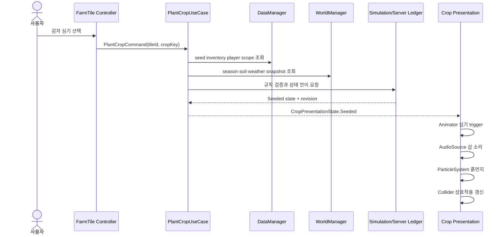

# 살뜰 비즈니스 도메인의 Unity World·원장 투영 아키텍처 제안서

> 상태: 아키텍처 기준 제안
>
> 핵심 정의: **기존 살뜰의 비즈니스 도메인과 공개 근거를 Unity의 World에 안전하게 투영한다.**
>
> 상위 제품 방향: [Unity 생산·유통·협력 경험 플랫폼 종합 제안서](UnityCooperativeExperiencePlatformProposal.md)
>
> 첫 구현과 데이터 기준: [Unity 농업·유통·경영 시뮬레이션 제안서](UnityAgricultureDistributionSimulationProposal.md)

## 1. 제안의 결론

살뜰 Unity는 별도의 게임 도메인을 새로 만들거나 기존 웹 화면을 3D로 옮기는 프로젝트가 아니다. 이미 존재하는 주문, 공동구매, 운송, 창고, 판매와 공개 데이터의 업무 의미를 유지하면서 사용자가 공간과 시간 안에서 그 관계를 경험하게 만드는 **World projection client**다.

권장 구조는 다음 다섯 층이다.

```text
WorldManager
  ├─ World State
  │    ├─ 시간·계절·날씨·토양
  │    ├─ 공공데이터·시장가격
  │    ├─ NPC·협동조합·World Event
  │    └─ 현재 world revision·freshness
  │
  ├─ DataManager
  │    ├─ Unity ApiModel·Mapper
  │    ├─ player/session snapshot
  │    ├─ cache·fixture·provenance
  │    └─ server revision 수렴
  │
  ├─ UseCase / Service
  │    ├─ 심기·수확
  │    ├─ 주문·공동구매
  │    ├─ 운송·입출고
  │    └─ 원장 Command·조회
  │
  ├─ Ledger Projection
  │    ├─ 주문원장
  │    ├─ 운송원장
  │    ├─ 창고원장
  │    └─ 공동구매원장
  │
  └─ GameObject Presentation
       ├─ C# Controller
       ├─ Animator
       ├─ AudioSource
       ├─ ParticleSystem
       ├─ Collider
       └─ UI·VFX·SFX
```

여기서 C# `MonoBehaviour`는 모든 규칙을 직접 계산하는 객체가 아니다. 검증된 상태와 표현 명령을 받아 Animator, AudioSource, ParticleSystem, Collider와 UI에 전달하는 **presentation coordinator**다.

## 2. 이 구조가 해결하는 문제

### 2.1 세계 상태와 개인 상태의 혼합

다음 값은 특정 플레이어가 소유하지 않는다.

- 날씨, 시간, 계절과 토양 환경
- 공공데이터와 시장가격 관측
- NPC와 협동조합의 공개 상태
- world event와 공동 시나리오 상태
- 데이터 출처, 기준 시각, 단위와 freshness

반대로 다음 값은 사용자 또는 허용된 조직 범위에 속한다.

- 내 재고, 주문, 농장과 창고
- 내 보유 자원, 도구와 게임 진행
- 참여 중인 공동구매와 역할
- 접근 가능한 운송·창고 원장
- 개인 설정과 session 상태

이 둘을 분리하지 않으면 GameObject가 날씨 API, 플레이어 재고, 주문 상태와 애니메이션까지 동시에 소유하게 된다. 결과적으로 scene 교체, 네트워크 재연결, animation 변경과 서버 revision 충돌이 모두 같은 코드에 얽힌다.

### 2.2 상태 저장과 표현의 혼합

원장은 업무 상태의 근거이며 GameObject는 그 상태의 표현이다. 밭에 보이는 감자, 이동 중인 트럭, 입고장에 놓인 pallet과 공동구매 게시판은 원장 원문이 아니다.

```text
Ledger / World canonical state
  → 권한별 Projection
  → Unity GameModel / ViewModel
  → GameObject 표현
```

GameObject가 파괴되거나 scene이 다시 로드돼도 원장과 World state는 사라지지 않아야 한다. 반대로 GameObject의 animation이 끝났다는 사실만으로 실제 주문, 배차, 입고 또는 수확 완료를 확정해서도 안 된다.

## 3. 계층별 책임

### 3.1 WorldManager

`WorldManager`는 현재 세계를 구성하는 여러 상태를 읽기 좋은 하나의 snapshot으로 조합하는 facade다. 모든 구현을 직접 가진 거대한 singleton으로 만들지 않는다.

```text
WorldManager
  ├─ IWorldClock
  ├─ ISeasonProvider
  ├─ IWeatherStateProvider
  ├─ ISoilStateProvider
  ├─ IPublicEvidenceProvider
  ├─ IMarketObservationProvider
  ├─ IWorldEventProvider
  └─ IWorldSnapshotPublisher
```

책임:

- 시간, 계절, 날씨와 세계 규칙의 현재 snapshot 조합
- 공개 데이터의 출처·기준 시각·단위·freshness 보존
- 같은 world revision에서 서로 모순되지 않는 읽기 모델 제공
- world 상태 변경 알림 발행
- offline fixture, cached snapshot과 live 상태를 명시적으로 구분

금지:

- 플레이어 inventory 직접 변경
- 주문·운송·창고 원장 상태 직접 확정
- Animator, AudioSource 또는 scene object 직접 탐색
- 외부 API raw response를 GameObject에 전달
- 기능별 모든 Manager를 내부에 무제한 추가

`GameManager`가 별도로 존재한다면 application lifecycle, pause, scene 전환과 session 시작·종료만 담당한다. 시간·계절·공공데이터처럼 세계 의미가 있는 값은 `WorldManager` 아래에 둔다.

### 3.2 DataManager

`DataManager`는 서버 transport와 Unity model 사이의 anti-corruption boundary다. 사용자가 말하는 “내 데이터”를 제공하지만, 모든 player 규칙을 직접 실행하는 객체는 아니다.

책임:

- REST·SignalR 응답을 Unity 전용 `ApiModel`로 수신
- schema, stable ID, revision, provenance와 scope 검증
- `ApiModel → GameModel` 명시적 mapping
- cache, fixture, reconnect와 revision gap 처리
- player/session snapshot과 접근 가능한 ledger projection 제공
- `ReadyLive`, `ReadyCached`, `ReadyFixture`, `Stale`, `Invalid`, `Failed` 구분

권장 내부 분리:

```text
DataManager facade
  ├─ IWorldSnapshotClient
  ├─ IPlayerStateRepository
  ├─ ILedgerProjectionRepository
  ├─ IScenarioPackageRepository
  ├─ IUnityCacheStore
  ├─ IApiModelMapper
  └─ IDataStatusProvider
```

서버 코드와 DTO의 재사용은 **업무 의미와 JSON 계약의 재사용**이다. Unity가 서버 Entity나 `Ssalddel.Contracts` assembly를 직접 참조하는 방식은 피한다. 서버 DTO는 Unity `ApiModel`과 contract fixture test로 호환성을 확인한다.

### 3.3 UseCase / Service

UseCase는 사용자의 의도를 하나의 업무 행동으로 번역한다.

예시:

- `PlantCropUseCase`
- `HarvestCropUseCase`
- `CreateOrderIntentUseCase`
- `JoinGroupPurchaseUseCase`
- `RequestCargoTransportUseCase`
- `ConfirmWarehouseInboundUseCase`

UseCase의 기본 순서는 다음과 같다.

1. 사용자와 현재 대상의 식별자를 확인한다.
2. DataManager에서 player·ledger projection을 읽는다.
3. WorldManager에서 계절·날씨·토양·시장 상태를 읽는다.
4. domain rule 또는 서버 Command로 가능 여부를 판정한다.
5. 성공한 canonical state 또는 검증된 simulation result를 받는다.
6. 표현용 state change를 발행한다.

운영 원장 상태를 바꾸는 행동은 Unity가 직접 확정하지 않는다. `화면 → Unity UseCase → Server Command API → Server UseCase/Domain → DB·Event·Outbox → 재조회` 흐름을 따른다.

### 3.4 Ledger Projection

원장은 현실 업무와 Unity World를 연결하는 핵심 매개다.

| 원장 | canonical 의미 | Unity 표현 예시 |
| --- | --- | --- |
| 주문원장 | 주문 의향, 제출, 확인, 취소 | 주문판, 상품 crate, 상태 badge |
| 공동구매원장 | 모집, 조건, 참여, 마감 | 공동 board, 참여 meter, 집결 공간 |
| 운송원장 | 요청, 배차 검토, 상차, 이동, 하차 | truck, route, loading zone |
| 창고원장 | 입고, 검수, 적치, 피킹, 포장, 출고 | pallet, rack, 작업대, gate |
| 생산·학습원장 | 심기, 관리, 수확, 비용과 근거 | farm tile, crop growth, 회고 board |

Unity가 받는 것은 원장 원문이 아니라 목적별 projection이다.

```text
UnityLedgerProjection
- LedgerId
- LedgerTypeCode
- SubjectStableId
- WorldObjectStableId
- StatusCode / StepCode
- Revision
- AvailableActionCodes
- DisplayStateCode
- EvidenceRefs[]
- ViewerScope
- LastProjectedAt
```

포함하지 않는 값:

- 범용 원장 `Data` dictionary 전체
- 허용되지 않은 연락처·상세주소·계약금액
- 계좌·결제·credential
- 다른 참여자의 개인별 수량과 의향
- 실시간 정밀 위치와 차량 식별자

### 3.5 GameObject와 C# Controller

GameObject는 표현 state와 stable ID reference만 가진다.

```text
CropGameObject
  ├─ CropPresentationController
  ├─ Animator
  ├─ AudioSource
  ├─ ParticleSystem
  ├─ Collider
  └─ CropInteractionView
```

`CropPresentationController`의 책임:

- ViewModel 또는 presentation event 구독
- `Seeded`, `Growing`, `Harvestable`, `Withered` 표현 상태 적용
- Animator parameter와 trigger 전달
- AudioSource clip 재생 요청
- ParticleSystem 재생·정지 요청
- Collider와 interaction UI 활성 상태 조정
- 중복 revision과 오래된 event 무시

금지:

- seed inventory 차감
- 계절·토양·날씨 규칙 판정
- 수확량·시장가격 계산
- 원장 저장과 HTTP 직접 호출
- animation 종료를 업무 완료로 확정

animation clip, sound asset과 particle prefab을 교체해도 UseCase와 ledger rule이 바뀌지 않는 구조가 목표다.

## 4. 감자 심기 예시

### 4.1 권장 흐름



### 4.2 실패 흐름

씨앗이 없거나 계절·토양 조건이 맞지 않으면 canonical state는 바뀌지 않는다.

```text
PlantCropResult
  ├─ Succeeded = false
  ├─ ReasonCode = SeedUnavailable | SeasonBlocked | SoilUnsuitable | RevisionConflict
  ├─ CurrentRevision
  └─ SuggestedActions[]
```

Controller는 실패 이유에 맞는 UI·sound feedback만 실행한다. 실패 animation을 보여 준 사실을 inventory 차감이나 원장 event로 기록하지 않는다.

### 4.3 animation event 경계

animation event는 다음과 같은 표현 내부 신호로만 사용한다.

- 손이 흙에 닿는 시점에 particle 재생
- 삽이 지면에 닿을 때 sound 재생
- animation 완료 뒤 입력 잠금 해제

실제 `Seeded` 상태와 revision은 animation event가 만들지 않는다. 상태가 먼저 확정되고 animation은 그 결과를 표현한다.

## 5. World 상태 모델

### 5.1 WorldSnapshot

```text
WorldSnapshot
- WorldId / CooperativeId
- Revision
- WorldTime / TimeScale
- SeasonCode
- WeatherSnapshot
- SoilRegionStates[]
- PublicEvidenceSnapshots[]
- MarketObservationSnapshots[]
- WorldEvents[]
- DataStatus
- GeneratedAt / EvidenceAsOf
```

공공데이터는 World 규칙과 분리한다. 실제 날씨·시장가격은 관측 근거이며, 게임의 성장 보정·가격 계산은 `RuleSetVersion`을 가진 규칙 결과다.

```text
Public observation
  + Scenario rule
  = Simulated effect
```

화면에는 세 값을 구분해 표시한다.

- 관측 출처와 기준 시각
- 적용한 시나리오·rule version
- 계산된 `SIMULATED` 결과

### 5.2 NPC와 협동조합

NPC는 실제 사용자나 실제 공급자의 대체물이 아니다.

- fixture NPC는 `SIMULATED`로 표시한다.
- 실제 협동조합 구성원은 서버 membership과 scope로 조회한다.
- 국적, 언어, 종교, 경제력을 신뢰 점수나 역할 자격에 사용하지 않는다.
- NPC 대화 결과가 실제 주문·참여·친구 관계를 자동 생성하지 않는다.

## 6. 저장과 권위 경계

| 상태 종류 | 권위 위치 | Unity 저장 가능 범위 |
| --- | --- | --- |
| 공개 관측 | 서버 source snapshot | 출처·version이 있는 cache |
| 개인 설정 | 사용자별 저장소 | 접근성·그래픽·입력 설정 |
| offline 학습 | Unity simulation save | `SIMULATED` run과 rule version |
| 공동 world | 서버 aggregate | 마지막 검증 snapshot과 revision |
| 운영 주문·운송·창고 | 서버 원장 | 권한별 최소 projection |
| animation·particle 상태 | scene runtime | 일시적 표현 상태만 |

offline 학습 결과를 실제 주문이나 원장으로 승격하려면 별도 서버 화면에서 목적, 조건, 공개 범위와 동의를 다시 확인한다.

## 7. 현재 코드와의 연결

현재 구현된 자산:

- `Ssalddel.Unity/Runtime/Data/DataManager.cs`: live·cache·fixture와 검증 상태 경계
- `SimulationDataModels.cs`: provenance와 scenario package
- `농업SimulationEngine.cs`: UnityEngine에 의존하지 않는 결정적 계산
- `농업ScenarioValidator.cs`: schema·stable ID·단위·hash 검증
- 감자 golden fixture와 headless test
- 살뜰 서버의 주문·공동구매·운송·창고 UseCase와 원장 모델

아직 구현되지 않은 자산:

- Unity Editor project와 presentation assembly
- `WorldManager` facade와 world provider interface
- `FarmTile`, `Crop`, `Truck`, `Warehouse` Prefab
- Animator·AudioSource·ParticleSystem adapter
- server용 Unity world·ledger projection API
- SignalR revision 구독과 reconnect 수렴

따라서 다음 구현은 현재 `DataManager`를 폐기하거나 서버 DTO를 직접 참조하는 일이 아니다. 기존 engine-independent package 위에 World state composition과 presentation adapter를 순서대로 추가하는 일이다.

## 8. 권장 폴더 구조

```text
Ssalddel.Unity/
  Runtime/
    ApiModels/
    Mapping/
    Data/
    Simulation/
    World/
      WorldSnapshot.cs
      IWorldStateProvider.cs
      WorldManager.cs
    UseCases/
      PlantCropUseCase.cs
      HarvestCropUseCase.cs
    Ledgers/
      UnityLedgerProjection.cs
      ILedgerProjectionRepository.cs

Unity Presentation Project/
  Runtime/
    Controllers/
      CropPresentationController.cs
      TransportPresentationController.cs
    Views/
    Animation/
    Audio/
    Effects/
  Prefabs/
    Farm/
    Logistics/
    Warehouse/
```

engine-independent `Ssalddel.Unity`에는 `MonoBehaviour`, Animator, AudioSource, ParticleSystem과 scene reference를 넣지 않는다. presentation assembly만 UnityEngine을 참조한다.

## 9. 구현 우선순위

### P0. 책임 계약 고정

- `WorldSnapshot`, player snapshot과 ledger projection 구분
- `WorldManager`, `DataManager`, UseCase, Controller 책임 test
- live·cached·fixture·stale와 `Simulation`/`Operational` 경계
- stable ID, revision과 provenance 보존

### P1. 감자 심기 세로 slice

- WorldManager의 시간·계절·날씨·토양 provider
- DataManager의 seed inventory 조회 port
- `PlantCropUseCase`
- headless 상태 전이 test
- Unity presentation adapter 계약

완료 기준은 동일 입력과 동일 revision에서 같은 `Seeded` 결과가 나오고, 실패 시 원장·inventory가 변하지 않는 것이다.

### P2. GameObject 표현

- `FarmTile`·`Crop` Prefab
- Controller → Animator·AudioSource·ParticleSystem 명령
- GameObject 파괴·재생성 뒤 같은 snapshot 복원
- animation asset 교체 뒤 domain test 불변

### P3. 원장 projection

- 생산·학습원장부터 `UnityLedgerProjection` 구현
- 주문·공동구매·운송·창고 projection 확장
- viewer scope와 개인정보 축소
- revision event와 snapshot 재조회

### P4. 공유 World

- 협동조합·World scope 권한
- 서버 Command, Event/Outbox와 SignalR 알림
- 두 client의 revision 수렴
- reconnect·중복 event·conflict 복구

## 10. 검증 기준

- World 상태와 player 상태가 서로 다른 store·contract로 구분된다.
- GameObject에는 raw API response나 원장 원문이 없다.
- Controller test는 표현 명령을, UseCase test는 업무 규칙을 각각 검증한다.
- animation·audio·particle asset 교체가 계산 결과를 바꾸지 않는다.
- scene reload 뒤 같은 stable ID와 revision으로 동일 표현을 재생성한다.
- 낮은 revision과 중복 event는 적용하지 않는다.
- 공공데이터의 source·시각·단위·지역·freshness가 유지된다.
- fixture와 계산 결과에는 `SIMULATED`가 표시된다.
- Unity client가 실제 주문·배차·입고·계약을 임의로 확정하지 않는다.
- 다른 사용자·협동조합의 원장 projection을 조회하거나 구독할 수 없다.

## 11. 최종 제안

이 아키텍처의 핵심은 Manager를 많이 만드는 것이 아니다. **세계 상태, 사용자 상태, 업무 행동, 원장 상태와 표현을 서로 다른 책임으로 두는 것**이다.

살뜰 서버의 도메인과 UseCase는 현실 업무의 의미와 권위를 계속 담당한다. Unity는 그 결과를 시간·공간·상호작용이 있는 World로 투영한다. 원장은 두 세계를 연결하는 stable state이며, GameObject는 그 상태를 사용자가 보고 듣고 조작할 수 있게 표현한다.

따라서 살뜰 Unity의 정확한 제품 정의는 다음과 같다.

> **기존 살뜰의 비즈니스 도메인과 공개 근거를 Unity World에 투영하고, 사용자가 생산·주문·협력·운송·창고의 관계를 안전하게 경험하게 하는 플랫폼**

이 방향이면 지금까지 만든 서버, 도메인 규칙과 원장 구조를 버리지 않는다. 동시에 Unity scene과 animation 변경이 서버 업무 규칙을 흔들지 않는 장기 확장 구조를 얻는다.
