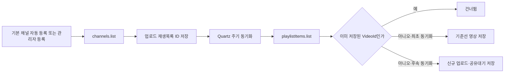

# YouTube 채널 새 영상 감지 모듈

## 목적

홍달 서버가 관리자가 등록한 YouTube 채널의 공개 업로드를 확인하고, 처음 발견한 영상과 이후 새로 올라온 영상을 구분해 저장한다. UI나 커뮤니티 게시글 생성은 이 모듈에 포함하지 않고, `공유대기` 영상 조회 결과를 다음 처리기가 사용할 수 있게 한다.

## 서버 흐름



`search.list`로 채널 영상을 검색하지 않는다. `channels.list`의 `contentDetails.relatedPlaylists.uploads`로 업로드 재생목록 ID를 얻은 뒤 `playlistItems.list`를 사용한다. 공식 문서상 두 목록 조회는 각각 기본 1 쿼터 단위이며, 채널별 최신 업로드 확인에 필요한 데이터만 읽을 수 있다.

`YouTube:DefaultChannels`에 지정된 채널은 전체 동기화가 시작될 때 DB에 없으면 자동 등록된다. 홍익학당 공식 홈페이지가 연결하는 YouTube 채널(`youtube.com/user/HongikHd`)은 채널 ID `UCI8HW08rOSlvweOjJ9Gp2Ng`로 기본 등록한다. 관리자가 같은 채널을 이미 등록했거나 비활성화한 경우에는 기존 DB 상태를 덮어쓰지 않는다.

## 책임 분리

| 구성 | 책임 |
| --- | --- |
| `YouTubeDataApiClient` | Google JSON 요청·응답과 API 오류 처리 |
| `YouTube채널감시Service` | 최초 기준선, 신규 업로드와 중복 판정 |
| `IYouTube채널감시저장소` | 감시 채널, 후보 영상 ID와 발견 영상 영속화 |
| `YouTube채널동기화Job` | 설정된 주기로 전체 활성 채널 동기화 |
| `YouTube채널감시Controller` | 관리자 채널·영상·재생목록 조회와 수동 동기화 API |

## 관리자 API

| Method | Path | 용도 |
| --- | --- | --- |
| `GET` | `/api/v1/admin/content/youtube/channels` | 감시 채널 목록 |
| `POST` | `/api/v1/admin/content/youtube/channels` | 채널 ID 등록 |
| `GET` | `/api/v1/admin/content/youtube/videos` | 발견 영상 목록 |
| `GET` | `/api/v1/admin/content/youtube/playlists?channelId={channelId}` | 관리 채널의 재생목록 조회 |
| `GET` | `/api/v1/admin/content/youtube/playlists/{playlistId}/videos?take=50` | 재생목록 영상 조회 |
| `PUT` | `/api/v1/admin/content/youtube/videos/{videoId}/publication` | 영상 공개 또는 숨김 설정 |
| `POST` | `/api/v1/admin/content/youtube/sync` | 전체 또는 단일 채널 수동 동기화 |

위 관리자 API는 모두 `서버관리자전용` 정책을 사용한다.

홍익학당은 현재 홍달의 협력업체가 아니므로 수집 자료를 일반 클라이언트나 커뮤니티에 자동 노출하지 않는다. 조회와 검수는 `HongdalAdminApp`의 내부 반야 페이지에서만 수행하고, 일반 사용자용 익명 공개 API와 모바일 카드 배포는 비활성화한다. 재생목록 목록은 `playlists.list`의 `nextPageToken`을 끝까지 따라가며, 재생목록별 영상은 한 요청에서 최대 200건까지 반환한다.

## 로컬 설정

API 키는 추적되는 `appsettings.json`에 넣지 않는다. 무시되는 `Hongdal/appsettings.Local.json`에 다음 형식으로 둔다.

```json
{
  "YouTube": {
    "Enabled": true,
    "ApiKey": "YOUR_YOUTUBE_DATA_API_KEY",
    "SyncIntervalSeconds": 300,
    "MaxResultsPerChannel": 20,
    "DefaultChannels": [
      {
        "ChannelId": "UCI8HW08rOSlvweOjJ9Gp2Ng",
        "DisplayName": "홍익학당"
      }
    ]
  }
}
```

Google Cloud 프로젝트에서 YouTube Data API v3를 활성화하고, 운영 키에는 사용 API와 서버 주소 제한을 적용한다.

## 다음 확장

YouTube는 PubSubHubbub 기반 푸시 알림을 지원한다. 공개 콜백 서버가 준비되면 업로드·제목·설명 변경 알림에서 `VideoId`와 `ChannelId`를 읽고, 현재 동기화 서비스를 호출하는 입력 어댑터를 추가한다. 웹훅은 알림 신호만 담당하고 최종 메타데이터와 중복 판정은 기존 API 클라이언트와 저장소가 계속 책임진다.

향후 공식 협력과 공개 범위가 합의되기 전에는 `sharing_status = 공유대기` 영상을 커뮤니티 게시글로 전환하지 않는다. 협력 관계가 생기면 별도 승인 이벤트 처리기를 추가하고, 동기화 트랜잭션과 커뮤니티 쓰기는 계속 분리한다.

## 공식 참고

- [YouTube Data API 시작하기](https://developers.google.com/youtube/v3/getting-started)
- [Channels: list](https://developers.google.com/youtube/v3/docs/channels/list)
- [PlaylistItems: list](https://developers.google.com/youtube/v3/docs/playlistItems/list)
- [Playlists: list](https://developers.google.com/youtube/v3/docs/playlists/list)
- [Push Notifications](https://developers.google.com/youtube/v3/guides/push_notifications)
