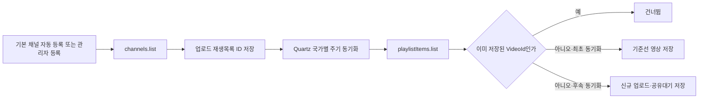

# YouTube 채널 새 영상 감지 모듈

## 목적

홍달 서버가 관리자가 등록한 YouTube 채널의 공개 업로드를 확인하고, 처음 발견한 영상과 이후 새로 올라온 영상을 구분해 저장한다. UI나 커뮤니티 게시글 생성은 이 모듈에 포함하지 않고, `공유대기` 영상 조회 결과를 다음 처리기가 사용할 수 있게 한다.

## 서버 흐름



`search.list`로 채널 영상을 검색하지 않는다. 음식 채널 후보를 관리자가 찾을 때에만 `search.list`의 채널 검색을 사용한다. 영상 동기화는 `channels.list`의 `contentDetails.relatedPlaylists.uploads`로 업로드 재생목록 ID를 얻은 뒤 `playlistItems.list`를 사용한다. 지식·성찰 카탈로그의 공식 handle은 `channels.list`의 `forHandle`로 채널 ID와 업로드 목록에 해석한다.

`YouTube:DefaultChannels`에 지정된 채널은 전체 동기화가 시작될 때 DB에 없으면 자동 등록된다. 홍익학당 공식 홈페이지가 연결하는 YouTube 채널(`youtube.com/user/HongikHd`)은 채널 ID `UCI8HW08rOSlvweOjJ9Gp2Ng`로 기본 등록한다. 관리자가 같은 채널을 이미 등록했거나 비활성화한 경우에는 기존 DB 상태를 덮어쓰지 않는다.

각 감시 채널은 ISO 3166-1 alpha-2 형식의 수집 국가 코드를 가진다. `KR`은 한국, `US`는 미국이며 국가가 확인되지 않으면 `ZZ`로 격리한다. 이 값은 콘텐츠 수집 시장 구분이고 제작자 국적이나 상품 원산지가 아니다. Quartz 작업은 `YouTube:CountryCollectionCodes`에 설정된 국가별로 채널을 나누어 동기화하므로 한 국가의 실패가 어느 묶음에서 발생했는지 로그에서 바로 확인할 수 있다.

## 책임 분리

| 구성 | 책임 |
| --- | --- |
| `YouTubeDataApiClient` | Google JSON 요청·응답과 API 오류 처리 |
| `YouTube채널감시Service` | 최초 기준선, 신규 업로드와 중복 판정 |
| `IYouTube채널감시저장소` | 감시 채널, 후보 영상 ID와 발견 영상 영속화 |
| `YouTube채널동기화Job` | 설정된 국가별로 활성 채널을 나누어 주기 동기화 |
| `YouTube채널감시Controller` | 관리자 채널·영상·재생목록 조회와 수동 동기화 API |
| `YouTube영상재료인지Engine` | 권한 확인 자막·프레임과 영상 메타데이터에서 근거 있는 식재료 후보 추출 |
| `YouTube영상재료자동인지Service` | 입력 검증·이미지 정규화·중복 제거 후 검수 대기 상품 후보 저장 |

## 관리자 API

| Method | Path | 용도 |
| --- | --- | --- |
| `GET` | `/api/v1/admin/content/youtube/channels?countryCode=KR` | 전체 또는 지정 국가의 감시 채널 목록 |
| `GET` | `/api/v1/admin/content/youtube/channels/search?query=food&regionCode=US` | 지정 지역의 음식 주제 채널 후보 검색 |
| `POST` | `/api/v1/admin/content/youtube/channels` | 채널 ID 등록 |
| `PUT` | `/api/v1/admin/content/youtube/channels/{channelId}/food-profile` | 음식 채널 분류·조사 정보 설정 |
| `PUT` | `/api/v1/admin/content/youtube/channels/{channelId}/knowledge-reflection-profile` | 자기계발·철학·종교 교육 채널의 주제·관점·공식 출처 설정 |
| `PUT` | `/api/v1/admin/content/youtube/channels/{channelId}/prajna-publication` | 확인된 지식·성찰 채널을 반야 원천으로 별도 허용·해제 |
| `GET` | `/api/v1/admin/content/youtube/videos` | 발견 영상 목록 |
| `GET` | `/api/v1/admin/content/youtube/playlists?channelId={channelId}` | 관리 채널의 재생목록 조회 |
| `GET` | `/api/v1/admin/content/youtube/playlists/{playlistId}/videos?take=50` | 재생목록 영상 조회 |
| `PUT` | `/api/v1/admin/content/youtube/videos/{videoId}/publication` | 영상 공개 또는 숨김 설정 |
| `POST` | `/api/v1/admin/content/youtube/sync` | 전체 또는 단일 채널 수동 동기화 |
| `POST` | `/api/v1/admin/content/youtube/sync?countryCode=US` | 지정 국가의 활성 채널만 수동 동기화 |
| `POST` | `/api/v1/admin/content/youtube-food/videos/{videoId}/ingredient-recognition` | 권한 확인 자막·프레임 자동 식재료 인지 |

위 관리자 API는 모두 `서버관리자전용` 정책을 사용한다.

수집만으로 일반 클라이언트나 커뮤니티에 노출하지 않으며 조회와 검수는 `HongdalAdminApp`의 내부 반야 페이지에서 수행한다. 채널이 `지식·성찰`로 확인되고 관리자가 채널 반야 게시를 허용한 뒤 개별 영상을 `공개`로 승인하고 별도 반야 발행 배치를 켠 경우에만 `반야` 게시판에 제목·짧은 소개·관점 표시·YouTube 원본 링크가 한 건씩 게시된다. 이때도 제휴, 인기 순위, 관점·교리의 우열이나 공식 추천으로 표시하지 않고 영상 파일·썸네일을 홍달 커뮤니티 첨부물로 복제하지 않는다. 재생목록 조회는 선별 보조 수단이고, 실제 발행 후보는 감시 저장소에 보관된 채널 승인과 개별 영상 승인 상태로 결정한다.

## 로컬 설정

API 키는 추적되는 `appsettings.json`에 넣지 않는다. 무시되는 `Hongdal/appsettings.Local.json`에 다음 형식으로 둔다.

```json
{
  "YouTube": {
    "Enabled": true,
    "ApiKey": "YOUR_YOUTUBE_DATA_API_KEY",
    "SyncIntervalSeconds": 300,
    "MaxResultsPerChannel": 20,
    "AutomaticIngredientRecognitionEnabled": false,
    "MaxIngredientRecognitionFrames": 4,
    "MaxIngredientRecognitionFrameBytes": 4194304,
    "MaxIngredientRecognitionTranscriptCharacters": 12000,
    "MinimumIngredientRecognitionConfidence": 0.55,
    "SeedFoodResearchCatalog": true,
    "SeedKnowledgeReflectionCatalog": false,
    "CountryCollectionCodes": [ "KR", "US", "GB", "SG", "AE", "JP", "CN", "ZZ" ],
    "DefaultChannels": [
      {
        "ChannelId": "UCI8HW08rOSlvweOjJ9Gp2Ng",
        "DisplayName": "홍익학당",
        "CountryCode": "KR"
      }
    ]
  }
}
```

Google Cloud 프로젝트에서 YouTube Data API v3를 활성화하고, 운영 키에는 사용 API와 서버 주소 제한을 적용한다.

자동 재료 인지는 `AutomaticIngredientRecognitionEnabled`와 별도 `HIOPSAI:Enabled`가 모두 활성화된 환경에서만 실행한다. 채널 동기화 작업은 영상 파일을 다운로드하지 않으며, 소유·협력 채널이나 권리자가 제공한 자막·대표 프레임만 별도 관리자 API로 넘긴다. 자세한 입력·검수 경계는 [YouTube 음식 상품 발견·공동구매 전산화](../ProjectOverview/youtube-food-commerce-discovery.md#자동-영상-식재료-인지)를 따른다.

## 다음 확장

음식 상품 후보 검수와 구매 의향 연결은 [YouTube 음식 상품 발견·공동구매 전산화](../ProjectOverview/youtube-food-commerce-discovery.md)에 정리한다.

Apify 자막 공급자는 [Apify YouTube 자막 Adapter](ApifyYouTubeTranscriptResearch.md)로 분리되어 있으며 기본 비활성이다. 비용·권리·내용 검수 후 관리자 단건 조회 결과만 기존 재료 인지 입력에 사용할 수 있다.

YouTube는 PubSubHubbub 기반 푸시 알림을 지원한다. 공개 콜백 서버가 준비되면 업로드·제목·설명 변경 알림에서 `VideoId`와 `ChannelId`를 읽고, 현재 동기화 서비스를 호출하는 입력 어댑터를 추가한다. 웹훅은 알림 신호만 담당하고 최종 메타데이터와 중복 판정은 기존 API 클라이언트와 저장소가 계속 책임진다.

`sharing_status = 공유대기` 영상은 커뮤니티 게시글로 전환하지 않는다. `공개`는 관리자가 해당 외부 링크를 반야 게시 후보로 선별했다는 뜻이며 협력 관계를 뜻하지 않는다. 향후 공식 협력과 콘텐츠 이용 범위가 합의되더라도 동기화 트랜잭션, 관리자 승인과 커뮤니티 쓰기는 계속 분리한다.

지식·성찰 대표 카탈로그는 홍익학당, TED, Big Think, The School of Life, BibleProject, Plum Village App, Sadhguru의 공식 채널 주소를 초기 후보로 가진다. 이는 유명도 순위나 서비스 추천 목록이 아니다. 카탈로그 시드는 기본 비활성이며 채널의 반야 게시 허용은 항상 별도 관리자 동작으로 남긴다.

## 공식 참고

- [YouTube Data API 시작하기](https://developers.google.com/youtube/v3/getting-started)
- [Channels: list](https://developers.google.com/youtube/v3/docs/channels/list)
- [PlaylistItems: list](https://developers.google.com/youtube/v3/docs/playlistItems/list)
- [Playlists: list](https://developers.google.com/youtube/v3/docs/playlists/list)
- [Push Notifications](https://developers.google.com/youtube/v3/guides/push_notifications)
- [YouTube API 개발자 정책](https://developers.google.com/youtube/terms/developer-policies)
- [Captions: download](https://developers.google.com/youtube/v3/docs/captions/download)
