# 2026-07-12 홍달 시각 변경 기록

이 문서는 커밋별 변경을 이미지로 되짚기 위한 기록입니다. 코드/API 중심 변경은 화면이 없을 수 있으므로, 관련 UI 흐름이나 메타데이터 화면을 함께 묶어 추적합니다.

이미지는 `artifacts/page-capture-check`에서 선별한 PNG만 `docs/assets/changes/2026-07-12-hongdal-visual-summary`로 복사했습니다. 브라우저 프로필, 캐시, 빌드 산출물은 문서 자산에 포함하지 않습니다.

## 커밋 요약

| Commit | 변경 축 | 시각 증거 |
| --- | --- | --- |
| `60be7e32` | 홍달 버전 로드맵과 운영 문서 정리 | 문서 중심 변경입니다. 이후 시각 기록의 기준 문맥으로 사용합니다. |
| `c579e0e9` | 커뮤니티 원장 다이어그램 작업대 추가 | 다이어그램 작업대, 다이어그램 모드 팔레트, API 경로 메타데이터 |
| `dcc9e85c` | 상태 변경 경험치 이벤트 처리 추가 | 홍달 1.0 노드 상태 톤 |
| `6b33884d` | 알뜰살뜰 마트 피킹/포장 작업 화면 추가 | 마트 워크플로우, 창고 출고 흐름 |
| `553213b1` | 웹앱 홍달 표기 정리 | 홈 화면 브랜드 표기 |
| `d169812a` | 쿠팡 카테고리 API 계약 정리 | API 계약 중심 변경입니다. 카탈로그 UI가 붙으면 별도 화면을 추가합니다. |
| `ae1be206` | 노드 스티커 상점 FakePG 결제 API 추가 | FakePG 정산 콘솔 초기 상태, 결제확보 후 상태 |
| `0e5a5f24` | 노드 스티커 기본 추천 후보 제한 | 노드 상세 패널과 추천 후보 맥락 |
| `e9f5abf0` | 커뮤니티 원장 협업 기반 보강 | 홍달 1.0 다이어그램 캔버스, 다이어그램 대화방 패널 |

## 커뮤니티 원장 다이어그램 작업대

`c579e0e9`에서 커뮤니티를 중심으로 원장을 만들고, 블록/노드를 이어 업무 흐름을 구성하는 작업대가 들어갔습니다. 사용자가 원장을 텍스트로만 입력하는 것이 아니라, 화면 안에서 업무 노드의 관계를 확인할 수 있는 방향입니다.

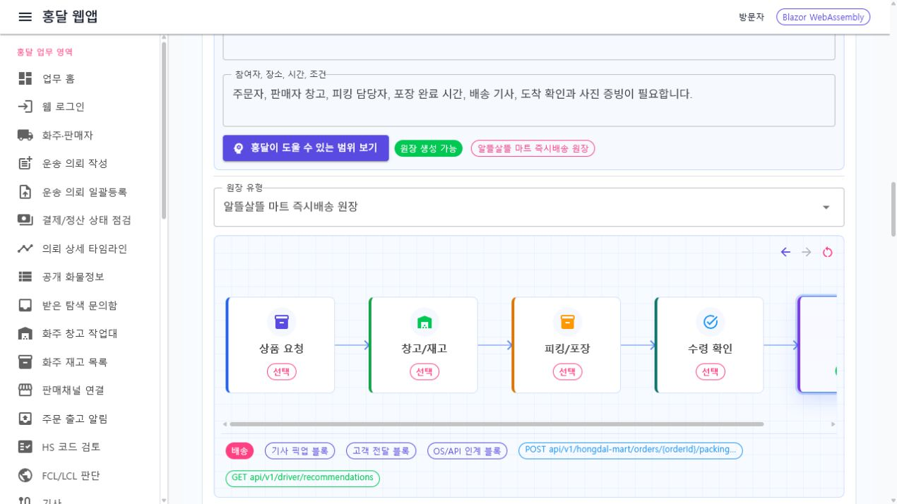

다이어그램 모드에서는 왼쪽 팔레트에서 업무 노드를 선택하고, 중앙 캔버스에 배치한 뒤 연결 관계를 확인하는 흐름으로 정리했습니다.

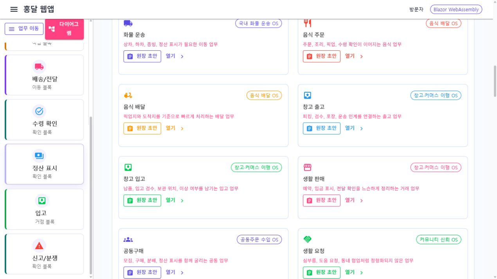

API 경로는 별도 컨트롤러를 새로 늘리기보다 기존 경로를 메타데이터로 활용하는 방향으로 맞췄습니다. 노드에서 도출되는 버튼/전송 동작이 어떤 API 경로와 연결되는지 화면에서 확인할 수 있어야 합니다.

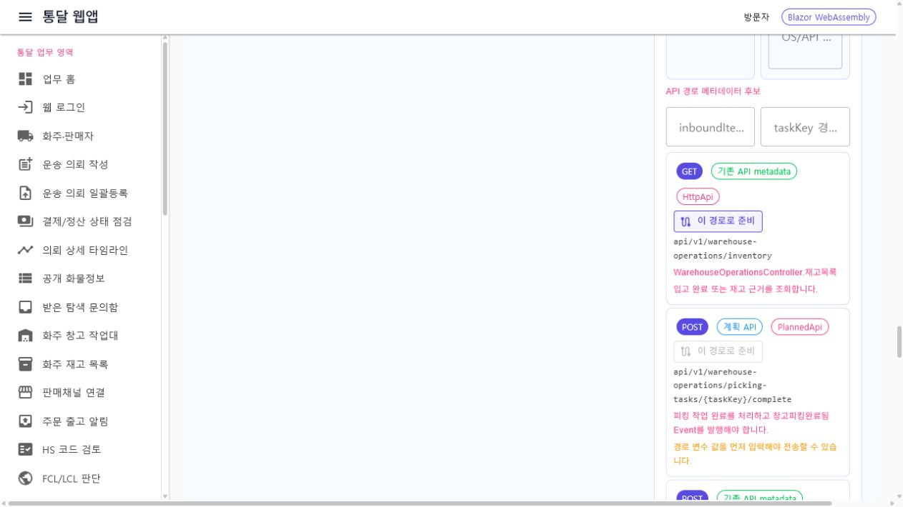

## 홍달 1.0 업무 흐름

홍달 1.0은 노드 수를 과하게 늘리지 않고, 화주/기사/운송/결제 축이 드러나는 정도로 묶었습니다. 완료된 일은 밝게, 아직 처리되지 않은 일은 어두운 톤으로 보여서 상태를 한눈에 읽을 수 있게 했습니다.

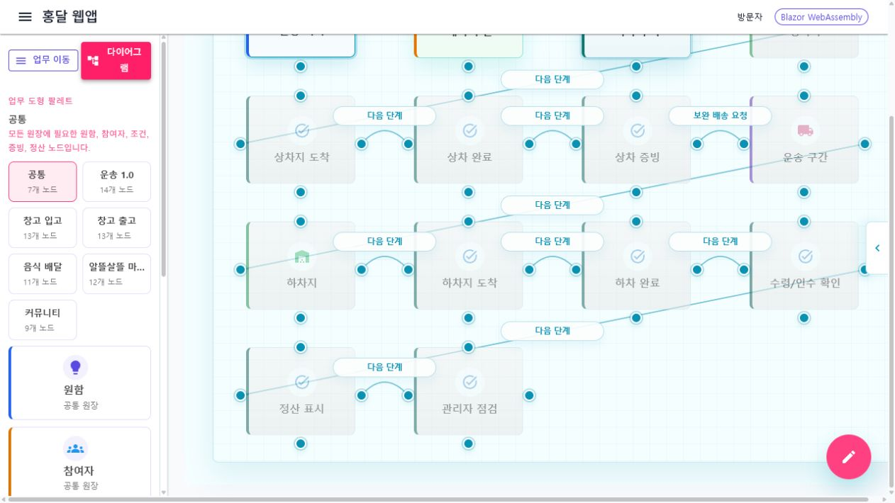

화물 운송 흐름은 요청, 배정, 상차, 하차, 결제/정산의 연결을 기준으로 둡니다.

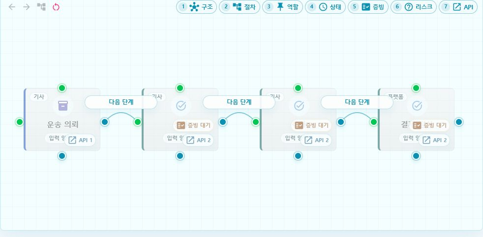

노드를 우클릭하거나 상세 동작을 선택했을 때는 관련 페이지 이동 또는 다이얼로그 입력으로 이어질 수 있도록 노드 상세 패널의 맥락을 유지합니다.

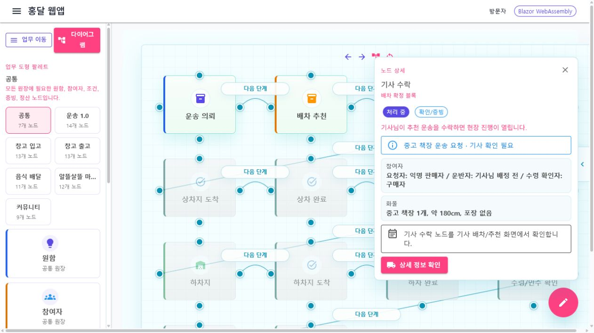

## 알뜰살뜰 마트와 창고 흐름

`6b33884d`에서는 알뜰살뜰 마트 쪽 피킹/포장 작업 흐름을 별도의 업무 흐름으로 분리했습니다. 홍달 1.0 운송 흐름과 일반 창고 흐름이 섞이지 않도록, 마트 주문 처리와 창고 출고 흐름을 각각 다이어그램으로 확인할 수 있게 했습니다.

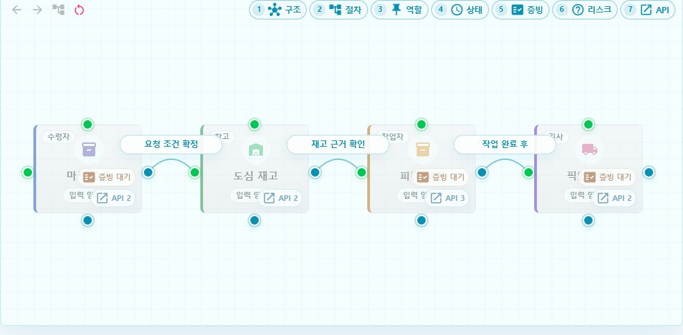

창고 출고 흐름은 상품 요청, 창고/재고, 피킹/포장, 출고/배송 연결을 중심으로 봅니다.

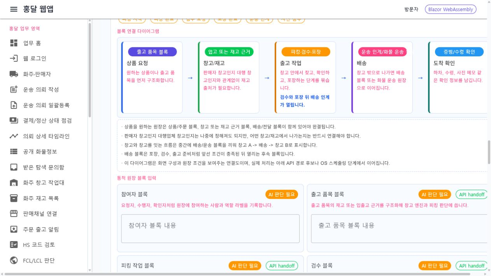

## 브랜드 표기 정리

`553213b1`에서는 렌더링된 화면에 남아 있던 잘못된 표기를 홍달로 정리했습니다. 이후 화면 캡처를 볼 때 브랜드 기준도 이 화면을 기준으로 확인합니다.

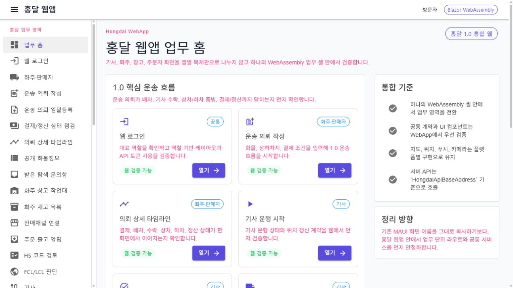

## FakePG 정산 콘솔

`ae1be206`의 FakePG 결제 API는 서버 API 중심 변경이지만, 어드민 개발 콘솔에서 샘플 운송 원장의 결제 보증과 기사 정산 흐름을 눈으로 확인할 수 있습니다. 아래 화면은 실결제, 실정산, 실제 운송계약을 만들지 않는 Admin 메모리 시뮬레이션입니다.

초기 상태에서는 Fake PG가 `결제확보대기`, 운송 원장이 `운송대기`, Fake 정산이 `정산대기전`으로 표시됩니다.

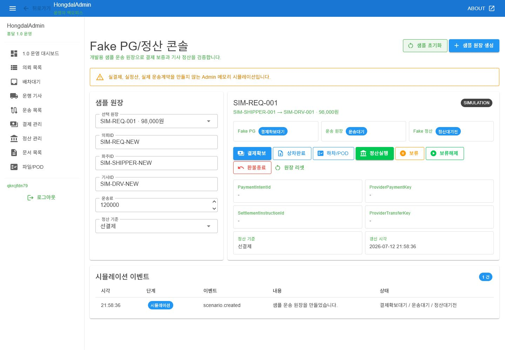

`결제확보`를 실행하면 Fake PG 상태가 `결제확보됨`으로 바뀌고, `PaymentIntentId`, `ProviderPaymentKey`, 시뮬레이션 이벤트가 함께 기록됩니다.

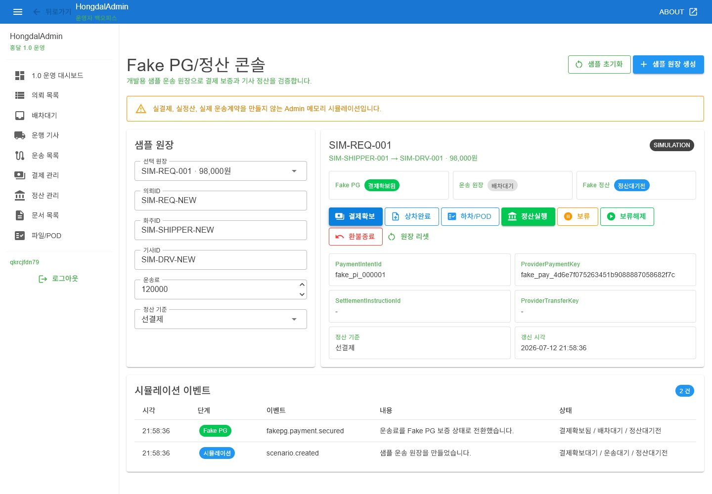

## 커뮤니티 원장 협업 기반

`e9f5abf0`에서는 커뮤니티에서 만든 원장 다이어그램을 기준으로 대화방을 열고, 다이어그램 이름, 원장 맥락, 방 ID, 메시지 흐름을 함께 확인할 수 있게 했습니다. 홍달 1.0 운송 흐름은 노드 수를 운송 의뢰, 상차, 하차, 결제/정산 중심으로 압축해 캔버스에서 확인합니다.

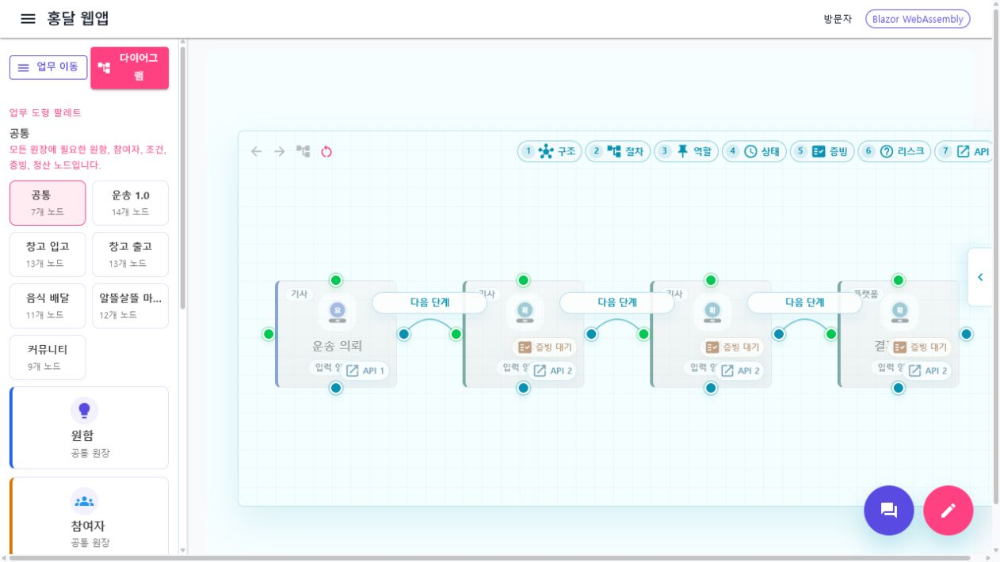

다이어그램 대화방은 SignalR 허브 경로와 연결 상태를 표시하고, 상대방 메시지는 사용자 아이콘과 함께 왼쪽에, 내 메시지는 오른쪽 말풍선으로 보여줍니다. 서버 허브가 없는 로컬 문서 캡처에서는 로컬 미리보기 상태로 표시됩니다.

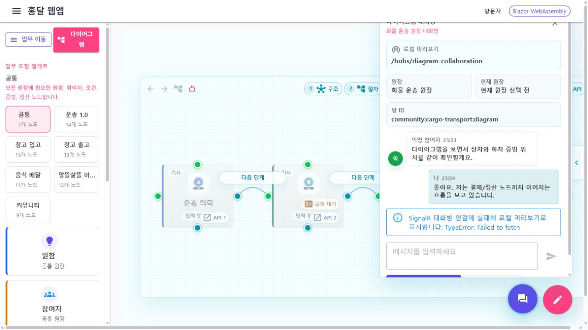

## API 중심 변경의 시각 기록 방식

`d169812a`, `ae1be206`처럼 API 계약이나 서버 동작이 중심인 커밋은 그 자체로는 화면 캡처가 없을 수 있습니다. 이 경우에는 다음 중 하나로 시각 증거를 남깁니다.

- API 메타데이터가 노드 또는 버튼에 연결된 화면
- FakePG, 카탈로그, 상점 같은 후속 UI가 붙은 화면
- 테스트 결과와 함께 연결되는 대표 업무 화면

이번 기록에서는 API 경로 메타데이터 화면, 노드 상세 패널, FakePG 정산 콘솔을 API 중심 변경의 연결 증거로 남깁니다.

## 다음 기록 규칙

새 커밋에서 화면 변화가 생기면 다음 순서로 기록합니다.

1. `artifacts/page-capture-check`에 검증용 캡처를 남깁니다.
2. 문서에 넣을 대표 이미지만 `docs/assets/changes/<날짜>-<주제>`로 복사합니다.
3. 이 문서 또는 새 날짜 문서의 표에 커밋 해시, 변경 축, 시각 증거를 추가합니다.
4. 코드/API 중심 변경은 화면이 없다는 사실을 명시하고, 가장 가까운 UI 또는 메타데이터 화면과 연결합니다.
