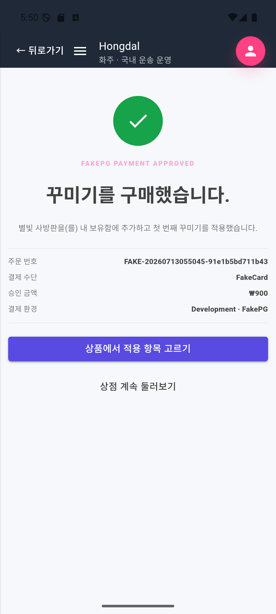
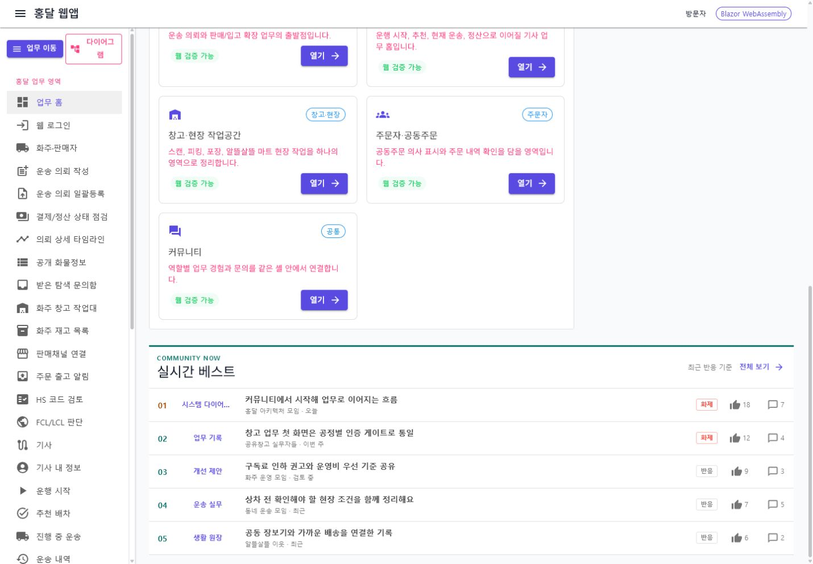

# 2026-07-13 홍달 시각 변경 기록

이 문서는 `origin/main` 이후 2026-07-13에 쌓인 커밋을 기능 맥락과 화면 변화 기준으로 추적합니다. 화면이 바뀐 커밋은 실제 렌더링 캡처를 연결하고, 서버·DB·문서 중심 커밋은 화면이 없다는 사실과 후속 확인 화면을 명시합니다.

검증용 원본은 `artifacts/page-capture-check`와 `artifacts/android-render-check`에 남기고, 문서에 오래 보관할 대표 PNG만 `docs/assets/changes/2026-07-13-hongdal-visual-summary`에 선별했습니다. 사용자 정보, 실제 결제 정보, 실제 배송 주소는 포함하지 않습니다.

## 커밋 요약

| Commit | 변경 축 | 화면 변경 | 시각 증거 |
| --- | --- | --- | --- |
| `f4add00a` | 원장 중심 업무 투영 기반 정리 | 없음 | MongoDB 원장과 RDB 블록 투영을 다루는 서버·DB 변경 |
| `e4b7c965` | 원장 중심 운영 설계 정리 | 없음 | 아키텍처 문서 변경 |
| `bb8be229` | 피킹/포장 작업과 원장 상태 이벤트 기록 | 없음 | 서버 작업·원장 상태 이벤트 변경, 후속 창고 화면에서 확인 |
| `07274cb3` | 알뜰살뜰 마트 포장 완료 배차 경계 | 없음 | 서버 배차 경계 변경, 후속 마트 작업 화면에서 확인 |
| `99108b09` | 상태 변경 후속 처리의 이벤트 핸들러 통일 | 없음 | 서버 이벤트 처리 구조 변경 |
| `e390a7b2` | 교육 현장 체험 활동 제출 흐름 | 없음 | API·작업자·제출 큐 중심 변경 |
| `c69271f4` | Typecast 게시글 음성화 파이프라인 | 없음 | API·DB·음성 작업자 중심 변경 |
| `e9fc64f0` | 교육·음성·원장 이벤트 실행 구성 | 없음 | DI·설정·원장 저장소 실행 구성 변경 |
| `504da7d8` | 원장 템플릿과 업무 투영 범위 확장 | 간접 | 원장별 팔레트와 다이어그램에서 템플릿 구성을 확인 |
| `8c61319b` | 역할 기반 통합 홍달 앱과 다이어그램 작업공간 | 있음 | 통합 홈, 역할 전환, 후천 사방 이동, 모바일 다이어그램, 꾸미기 FakePG |
| `1736c126` | 웹 다이어그램 팔레트의 원장 중심 재구성 | 있음 | 원장별 노드 묶음과 홍달 1.0 캔버스 |
| `d1098d4f` | 웹 홈 실시간 베스트 | 있음 | 업무 홈 하단 실시간 베스트 목록 |
| `a31bec92` | 이벤트·원장·교육·음성화 설계 기록 | 없음 | 설계 문서 변경 |
| `3228236e` | 통합 홍달 앱 화면 흐름과 캡처 정리 | 문서 자산 | 페이지 문서와 장기 보관용 화면 캡처 |
| `2251656` | 홍달 1.0 커뮤니티 중심 제품 원칙 | 없음 | 제품·운영 정책 문서 변경, 기존 통합 커뮤니티 홈 캡처 유지 |

## 역할 기반 통합 홍달 앱

`8c61319b`에서는 화주 앱이라는 한정된 이름 대신 `Hongdal`을 표시하고, 어드민을 제외한 여러 역할을 같은 클라이언트에서 전환하는 구조를 추가했습니다. 기존 커뮤니티 홈, 게시판, 글쓰기, 업무 진입은 유지하면서 역할 전환과 다이어그램 진입을 결합했습니다.

홍달 생활 게시판은 커뮤니티 글을 추천, 분류, 제목, 글쓴이, 추천 수, 댓글 수로 빠르게 훑는 게시판형 목록입니다. README 첫 화면에서는 업무 구조 설명보다 이 게시판 화면을 먼저 보여 주고, 데스크톱과 모바일 캡처를 함께 둡니다.

역할 패널에서는 화주, 기사, 창고 관리자처럼 현재 사용할 업무 관점을 선택합니다. 역할이 바뀌면 홈과 내비게이션, 업무 진입점이 같은 앱 안에서 함께 바뀝니다.

후천 사방 이동판은 역할별 주요 업무 방향을 화면 오른쪽 하단에서 펼쳐 선택하는 보조 내비게이션입니다. 가운데는 공통 태극 중심으로 커뮤니티 글 목록과 꾸미기 상점을 나누고, 바깥 사방은 역할별 업무 방향을 고릅니다.

## 모바일 원장 다이어그램

모바일 다이어그램은 운송 의뢰, 상차, 하차, 결제·정산처럼 묶을 수 있는 절차를 세로 흐름으로 표시합니다. 각 노드는 입력 준비도, API 연결 수, 상세 진입과 연결 동작을 함께 제공합니다.

`504da7d8`의 원장 템플릿 확장과 `8c61319b`의 UI 작업은 이 화면에서 함께 확인합니다. 전자는 원장과 업무 투영 메타데이터를 제공하고, 후자는 그 정보를 사용자가 조작할 수 있는 노드와 흐름으로 표시합니다.

## 꾸미기 상점과 FakePG

노드·괘상 이미지를 만드는 디자이너와 사용하는 사용자를 연결하기 위한 꾸미기 상점 흐름을 추가했습니다. 개발 단계 결제는 실제 PG가 아닌 FakePG를 사용하며, 구매 완료 후 보유함과 적용 상태로 이어집니다.

이 화면의 주문 번호, 결제 수단과 금액은 개발용 샘플입니다. 실제 결제 승인이나 실제 금전 이동을 의미하지 않습니다.

## 원장 중심 웹 다이어그램 팔레트

`1736c126`에서는 웹앱의 다이어그램 메뉴를 개별 업무 블록 나열에서 원장별 노드 묶음으로 바꿨습니다. 화물 운송, 창고 입고·출고, 음식 배달, 알뜰살뜰 마트, 공동주문 수입, 생활 요청 원장을 먼저 고르고, 공통 노드와 해당 원장의 전용 노드를 구분해 표시합니다.

캡처의 중앙 캔버스에는 홍달 1.0의 운송 의뢰, 상차, 하차, 결제·정산 네 노드가 표시됩니다. 왼쪽 팔레트와 중앙 캔버스가 같은 원장 템플릿 키를 사용하므로, 메뉴 선택과 다이어그램 문맥을 함께 추적할 수 있습니다.

## 웹 홈 실시간 베스트

`d1098d4f`에서는 기존 웹 업무 홈의 카드와 내비게이션을 삭제하거나 교체하지 않고, 하단에 실시간 베스트 글 목록을 추가했습니다. 글 제목, 게시판, 작성 주체, 반응·댓글 수를 한 줄씩 빠르게 훑고 커뮤니티 게시판으로 이동할 수 있습니다.

## 화면이 없는 커밋의 추적 방법

`f4add00a`부터 `504da7d8`까지의 서버·DB 중심 커밋은 독립 화면을 새로 만들지 않았습니다. 화면을 억지로 중복 첨부하지 않고 다음 연결 기준으로 추적합니다.

- 원장·투영 변경은 원장별 다이어그램 팔레트와 노드 입력 준비도에서 확인합니다.
- 피킹·포장·마트 배차 변경은 창고 관리자 역할의 마트 작업 화면과 후속 원장 상태에서 확인합니다.
- 교육 현장 체험은 제출 API와 작업자 처리 상태를 기준으로 별도 운영 화면이 생길 때 캡처를 추가합니다.
- Typecast 음성화는 게시글 음성 생성 상태와 재생 UI가 연결될 때 해당 커밋을 역참조합니다.
- 이벤트 핸들러 리팩토링은 화면 변경이 아니라 상태 반영 일관성과 테스트 결과로 검증합니다.

`2251656`은 홍달 1.0의 제품 중심을 유상 화물 배차·주선이 아니라 커뮤니티와 공동 원장으로 다시 명시한 문서 변경입니다. 화면 코드는 바뀌지 않았으므로 새 캡처를 만들지 않으며, 이 문서 위쪽의 **역할 기반 통합 홍달 커뮤니티 홈** 캡처를 현재 제품 방향의 대표 화면으로 계속 사용합니다.

## 검증 기록

- `Hongdal`, `Hongdal.Ui.Common`, `Hongdal.WebApp`, `HongdalApp` 빌드: 경고 0, 오류 0
- 이벤트·교육·Typecast·원장·다이어그램 관련 대상 테스트: 52개 통과
- 원장별 웹 팔레트: 2026-07-13 로컬 렌더링에서 화물 운송 원장과 홍달 1.0 네 노드 확인
- 실시간 베스트: 기존 웹 업무 홈 아래에 목록이 렌더링되고 커뮤니티 링크가 유지되는 것을 확인

## 다음 기록 규칙

1. 화면 변경 커밋은 커밋 해시, 변경 축, 실제 렌더링 캡처를 같은 날짜 문서에 추가합니다.
2. 검증 원본은 `artifacts/`에 두고 대표 이미지만 `docs/assets/changes/<날짜>-<주제>`에 복사합니다.
3. 서버·DB 전용 커밋은 `화면 없음`을 명시하고, 후속 UI가 생기면 연결 화면과 원래 커밋 해시를 함께 기록합니다.
4. 캡처에는 실제 사용자·주소·연락처·결제·계좌·배송 증빙 정보를 넣지 않습니다.
