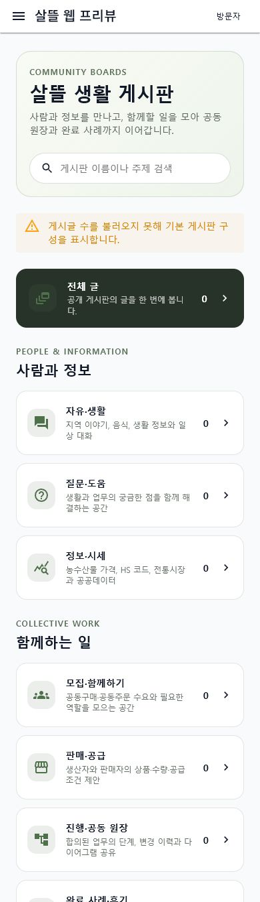
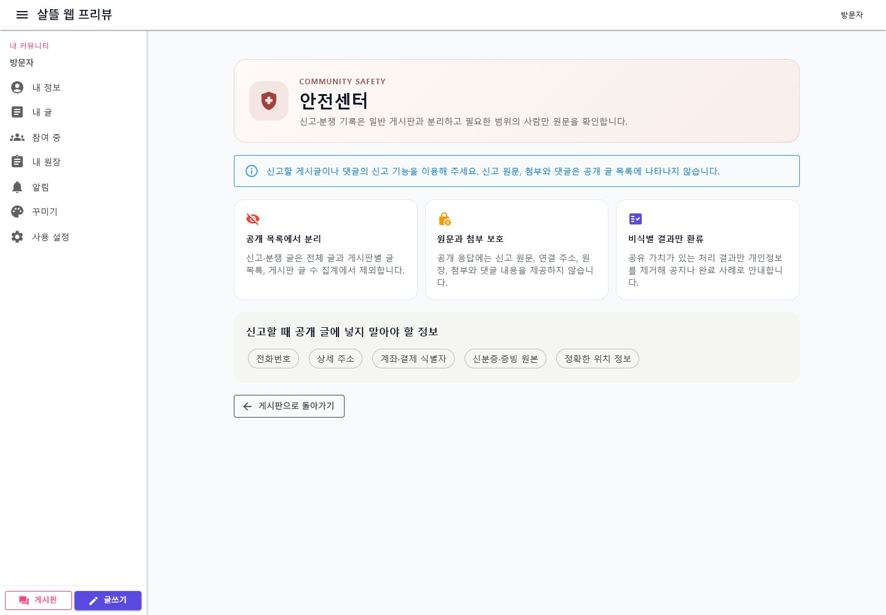

# 목적별 커뮤니티 게시판과 안전센터

> 기록일: 2026-07-17
>
> 대상: `Ssalddel.WebApp`, `Ssalddel.Ui.Common`, 커뮤니티 조회 API와 공통 계약

## 변경 요약

- 게시판을 역할이나 개별 업무 이름이 아니라 사용 목적 중심의 9개 공개 게시판으로 정리했다.
- 기존 게시글 분류는 별칭으로 유지해 `업무 질문`, `생활 원장`, `시스템 다이어그램` 등의 글도 새 게시판에서 함께 조회한다.
- 역할과 업무 단계는 `roleTag`, `workflowTag` 필터로 분리해 게시판 수가 역할 수만큼 늘어나지 않게 했다.
- 서버가 게시판별 실제 공개 글 수와 최근 활동 시각을 집계하는 `board-summaries` API를 제공한다.
- 신고·분쟁 기록은 전체 글, 게시판별 목록과 집계에서 제외하고 별도 안전센터의 보호 원칙을 안내한다.
- 공개 응답에 신고 원문, 첨부, 댓글, 연결 주소와 원장 문맥이 노출되지 않도록 방어선을 추가했다.

## 실제 화면

### 데스크톱 게시판 홈

### 모바일 게시판 홈

### 안전센터

## 검증

- `dotnet test Ssalddel.Tests/Ssalddel.Tests.csproj --no-restore --filter "FullyQualifiedName~CommunityBoardCatalogTests|FullyQualifiedName~CommunityPostListPageViewModelTests|FullyQualifiedName~CommunityLedgerCompletionPostServiceTests|FullyQualifiedName~CommunityPostComposerViewModelTests"`
  - 19개 통과
- `Ssalddel.Contracts`, `Ssalddel.Ui.Common`, `Ssalddel`, `Ssalddel.WebApp` 빌드 확인
- 로컬 WebApp을 데스크톱 `1440px`, 모바일 `390px` 폭에서 렌더링하고 게시판 9개와 안전센터 문구를 확인

API 서버를 연결하지 않은 시각 검증에서는 게시글 수 조회 실패 상태와 기본 게시판 구성을 함께 확인했다. 운영 연결 시에는 동일 화면이 `board-summaries` 응답의 공개 글 수를 표시한다.
