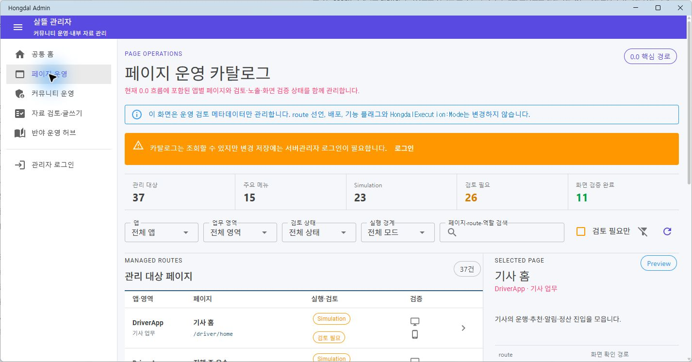
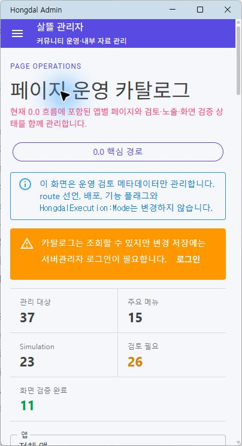

# Admin 페이지 운영 카탈로그

## 변경 기록

| 변경 축 | 화면 변경 여부 | 시각 증거 |
| --- | --- | --- |
| 현재 0.0 핵심 화면을 앱·업무영역·실행 경계·검토 상태·화면 검증 기준으로 관리하는 Admin 작업공간 | 화면 변경 | 데스크톱과 404px 모바일에서 요약, 복합 필터, 10개 단위 목록, 선택 상세와 비로그인 편집 차단 확인 |

## 적용 범위

- `SsalddelAdminApp`의 `/page-catalog`에서 Admin, 커뮤니티, 음식점, 창고, 기사, 주문자 앱의 핵심 route 37개를 관리한다.
- 카탈로그 항목은 실제 Razor source 경로와 `@page` 선언을 기준으로 구성한다.
- 앱, 업무영역, 검토 상태, 실행 경계, 검색어와 검토 필요 여부를 함께 적용해 목록을 좁힐 수 있다.
- 각 페이지의 목적, 사용자 역할, 관리 책임, 인증 필요 여부, 외부 효과 가능성, source와 화면 확인 경로를 상세에서 확인한다.
- 서버관리자만 검토 상태, 내비게이션 노출 분류, 데스크톱·모바일 확인 여부와 운영 메모를 저장할 수 있다.
- 카탈로그 변경은 route 선언, 배포, 기능 플래그 또는 `SsalddelExecution:Mode`를 직접 변경하지 않는다.
- 현재 관리 메타데이터 저장소는 Admin 앱 프로세스 수명 동안 유지되는 in-memory 구현이다. 서버 영속 API를 연결하기 전까지 실제 배포 관리 원장으로 간주하지 않는다.
- 목록은 10개 단위 페이지 이동을 제공해 좁은 화면에서도 상세 편집 영역까지 과도하게 스크롤하지 않도록 한다.

## 화면

### 데스크톱

### 모바일

## 검증

- 카탈로그 37개 항목의 source 파일과 실제 `@page` route 선언 일치 확인
- 페이지 카탈로그 Page ViewModel 집중 테스트 4개 통과
- `Ssalddel.Tests` 전체 테스트 1,421개 통과
- `SsalddelAdminApp` Windows 빌드 통과, 경고 0개·오류 0개
- 실제 MAUI Blazor 앱에서 `/page-catalog` 진입, 검토 필요 필터, 목록 선택, 상세 표시와 비로그인 저장 비활성 확인
- 데스크톱 `1426 x 746`과 모바일 `404 x 746`에서 제목, 요약, 필터, 목록 행과 상세 입력의 가로 넘침 없음
