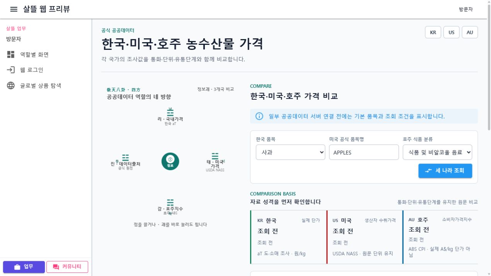
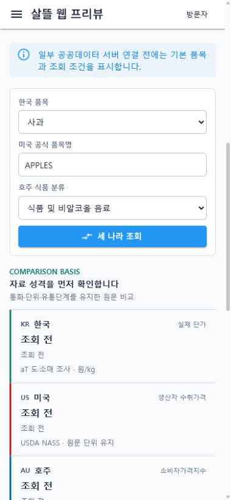

# 한국·미국·호주 농수산물 가격 비교

## 변경 기록

| 변경 축 | 화면 변경 여부 | 시각 증거 |
| --- | --- | --- |
| 한국 aT 실제 단가, 미국 USDA NASS 생산자 가격, 호주 ABS 소비자가격지수를 국가별 원문 단위와 조사 단계로 구분해 조회·비교 | 화면 변경 | 데스크톱과 390px 모바일에서 3개국 조회 조건, 비교 기준, 국가별 결과와 API 실패 안내 확인 |

## 적용 범위

- `/information/public-data`와 `/information/agricultural-fisheries-price-comparison`에서 같은 비교 작업공간을 제공한다.
- 한국은 aT 도·소매 실제 단가, 미국은 USDA NASS 원문 생산자 가격, 호주는 ABS 소비자가격지수로 구분한다.
- 서로 다른 통화·단위·조사 단계의 값을 하나의 구매 견적이나 환산 가격처럼 표시하지 않는다.
- 국내·미국·호주 조회 ViewModel은 독립적으로 실행되며 한 국가의 API 연결 실패가 다른 국가 결과를 지우지 않는다.
- 외부 API 연결 전에는 기본 품목과 공식 출처를 표시하고, 조회 실패는 국가별 안내 상태로 남긴다.
- Page ViewModel은 국가별 ViewModel과 화면 구역을 조립하고, 호출 실패 정책과 fallback 카탈로그는 별도 책임으로 분리한다.

## 화면

### 데스크톱

### 모바일

## 검증

- 가격 비교 Page ViewModel 집중 테스트 4개 통과
- 공공데이터 개요 실패 시 fallback 출처 유지 확인
- 미국 조회 실패 시 한국·호주 결과 유지 확인
- `Ssalddel.Ui.Common`, `Ssalddel.WebApp`, `SsalddelApp` Windows 빌드 통과, 경고 0개·오류 0개
- 데스크톱 `1280 x 720`과 모바일 `390 x 844`에서 조회 버튼, 비교 기준, 국가별 결과 카드와 가로 넘침 없음 확인
- API 연결 실패 시 Blazor 오류 화면 없이 국가별 안내 상태 표시 확인
