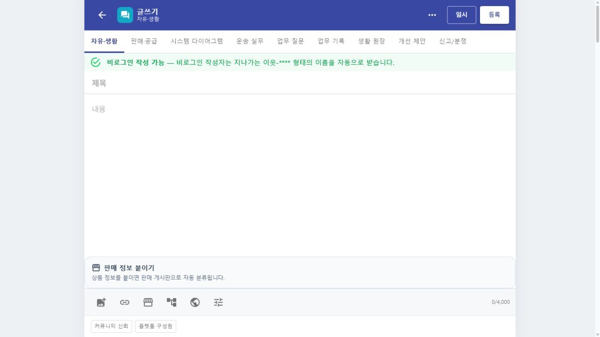

# 게시판별 익명 작성과 특색 닉네임

## 커밋 기록

| 커밋 | 변경 축 | 화면 변경 여부 | 시각 증거 |
| --- | --- | --- | --- |
| `5c3b7f6f` | 게시판별 비로그인·로그인·운영자 작성 조건과 비로그인 작성자의 게시판 특색형 익명 닉네임 적용 | 화면 변경 | 방문자 글쓰기에서 작성 조건과 `지나가는 이웃-****` 자동 발급 안내 확인 |

## 적용 범위

- 공개 열람과 비로그인 작성을 별도 정책으로 구분한다.
- 자유·생활, 질문·도움, 정보·시세, 음식은 각각 `지나가는 이웃`, `궁금한 이웃`, `시세 살피는 이웃`, `골목 미식가`를 기본 이름으로 사용한다.
- 비로그인 글·댓글에는 IP나 기기 식별자가 아닌 글마다 새로 만든 짧은 무작위 표식을 붙인다.
- 화물, 모집, 판매·공급, 공동 원장, 후기와 사용자 개설 게시판은 로그인 후 작성하게 한다.
- 공지·이용안내와 반야는 운영자 작성으로 유지하고 신고·분쟁은 `익명 신고자`로 표시한다.

## 화면

## 검증

- `dotnet build Hongdal.Contracts/Hongdal.Contracts.csproj --no-restore` 경고·오류 없음
- `dotnet build Hongdal/Hongdal.csproj --no-restore -p:BuildProjectReferences=false` 경고·오류 없음
- 관련 게시판 계약·정책 테스트 22개 통과
- 깨끗한 검증 worktree에서 `dotnet build Hongdal.WebApp/Hongdal.WebApp.csproj` 경고·오류 없음
- 방문자 상태의 `/community/boards`에서 게시판별 작성 조건과 글쓰기의 자동 익명 닉네임 안내를 확인
