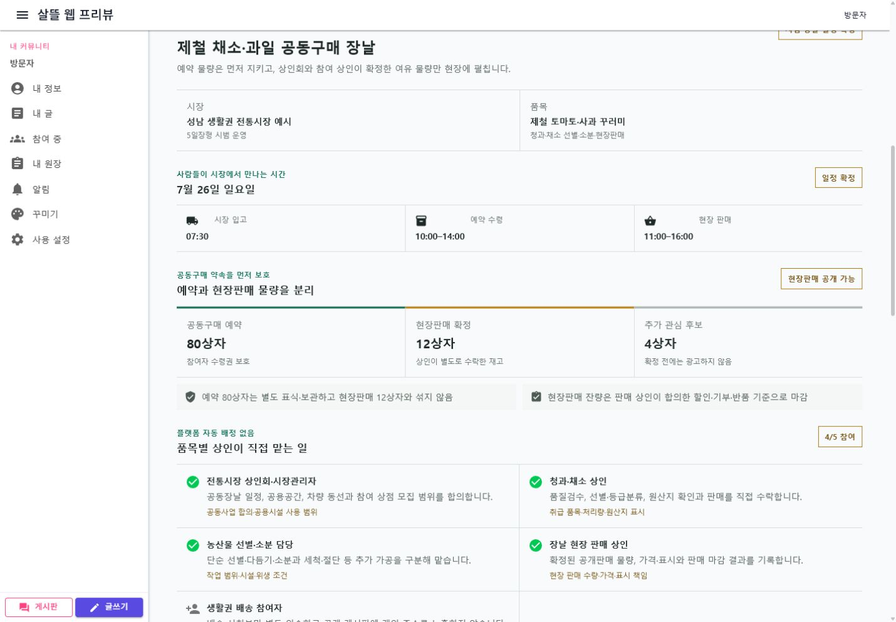
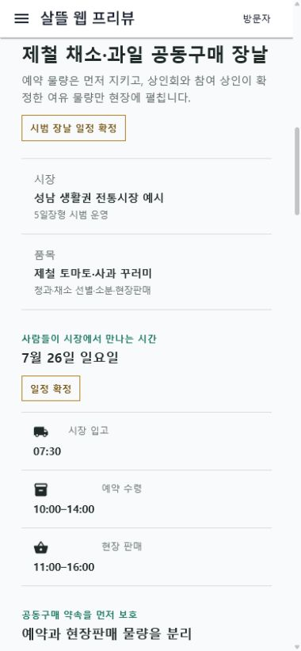

# 공동구매 장날과 품목별 전통시장 참여

## 변경 기록

| 변경 축 | 화면 변경 여부 | 시각 증거 |
| --- | --- | --- |
| 공동구매 예약 물량을 보호하면서 상인회·품목별 상인이 확정한 여유 물량을 특정일 시장에서 공개 판매하는 장날 하위 ViewModel | 화면 변경 | 데스크톱·390px 모바일에서 입고·예약수령·현장판매 일정, 분리 재고, 청과·채소 역할과 8단계 운영 절차 확인 |

## 적용 범위

- 전통시장 생활권 공동구매에 장날 일정·재고·상인 참여·공개 홍보 상태를 조립한다.
- 상인회 또는 시장관리자가 공동사업, 공용공간, 입고 동선과 참여 상점 모집 범위를 먼저 합의한다.
- 플랫폼은 상인을 자동 배정하지 않고 청과·채소·정육 등 품목별 상인이 작업 범위와 물량을 직접 수락하게 한다.
- 공동구매 예약 재고와 현장판매 재고를 별도 식별·보관한다.
- 추가 관심 수량은 상인과 공급자가 확정하기 전에는 현장판매 가능 물량으로 공개하지 않는다.
- 미수령 예약 물량은 자동 현장판매하지 않고 사전 합의한 연락·환불·양도 기준을 적용한다.
- 일정과 공개판매 재고가 확정된 뒤에만 지역 게시판·시장 현장판·동의한 구독자 알림에 장날을 공개한다.
- 개인 주소와 구매내역은 공개하지 않고 판매량·지역 보상·잔량과 재참여 의향만 동의된 집계로 남긴다.

## 둘러보기 예시

- 상인회와 시장관리자의 시범 장날 합의
- 청과·채소 상인, 선별·소분 담당과 현장 판매 상인의 직접 수락
- 공동구매 예약 80상자, 현장판매 확정 12상자, 추가 관심 후보 4상자 분리
- 시장 입고 `07:30`, 예약 수령 `10:00–14:00`, 현장 판매 `11:00–16:00`
- 산지 출하량과 선별 처리량 기준 추가 참여 여력 4상자 표시

## 화면

### 데스크톱

### 모바일

## 검증

- 공동행동 Page ViewModel과 공통 UI DI 집중 테스트 29개 통과
- 별도 artifacts 경로에서 Contracts, 공통 UI, 서버와 WebApp 빌드 통과
- 데스크톱 viewport `1440 x 1000`(저장 PNG `1430 x 993`): 재고 3구분, 역할 5개, 단계 8개 표시와 가로 넘침 없음
- 모바일 viewport `390 x 844`(저장 PNG `380 x 822`): 일정·재고의 단일 열 전환과 전체 하위 요소 가로 넘침 없음
- 새 브라우저 세션에서 `/community/actions/in-progress?campaignId=77777777-7777-4777-8777-777777777777` 콘솔 오류 없음
- 실제 API가 연결되지 않은 로컬 WebApp에서는 명시적인 둘러보기 예시를 사용했다.
