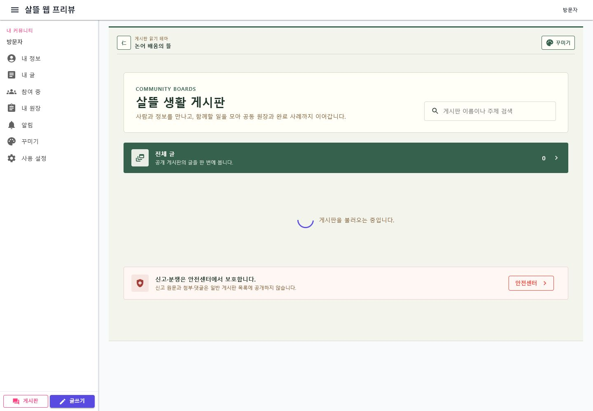
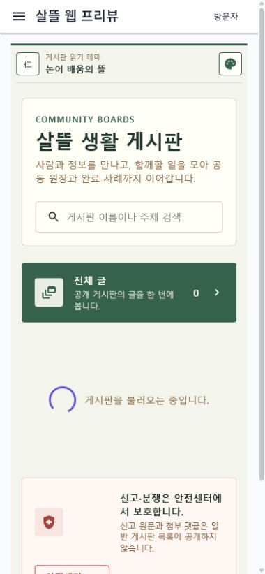

# 커뮤니티 읽기 테마 패키지

## 커밋 기록

| 커밋 | 변경 축 | 화면 변경 여부 | 시각 증거 |
| --- | --- | --- | --- |
| `87758356` | 홈 테마 패키지를 게시판 홈, 글 목록, 글 본문까지 이어지는 공통 읽기 테마로 확장 | 화면 변경 | 데스크톱·모바일에서 `논어 배움의 뜰` 패키지 적용 및 재접속 복원 확인 |

## 적용 범위

- 꾸미기 상점의 홈 테마 한 번 적용으로 게시판 홈, 글 목록, 글 본문이 같은 색상·표면 토큰을 사용한다.
- 현재 패키지 이름과 상점 진입점을 공통 읽기 테마 막대에 표시한다.
- 선택한 패키지 키와 활성 상태를 브라우저 저장소에 보관해 주소를 직접 다시 열어도 복원한다.
- 다이어그램과 업무 화면에는 읽기 테마를 강제로 적용하지 않는다.

## 화면

### 데스크톱

### 모바일

## 검증

- `dotnet test Ssalddel.Tests/Ssalddel.Tests.csproj --filter "FullyQualifiedName~CommunityReadingThemePresentationTests|FullyQualifiedName~CommunityDecorationSelectionStoreTests|FullyQualifiedName~PlatformCommunityDecorationStateServiceTests" --no-restore`
- 관련 테스트 11개 통과
- `dotnet build Ssalddel.WebApp/Ssalddel.WebApp.csproj --no-restore` 경고·오류 없음
- `/community`, `/community/boards`, 샘플 글 본문에서 브라우저 console error와 가로 overflow 없음 확인
- 상점에서 `논어 배움의 뜰` 적용 후 직접 재접속해 패키지명 `논어 배움의 뜰`, 기호 `仁`, 강조색 `#35614D` 복원 확인
- 로컬 검증에서는 커뮤니티 API를 함께 실행하지 않아 게시판 수가 fallback 또는 loading 상태로 표시됐다.
