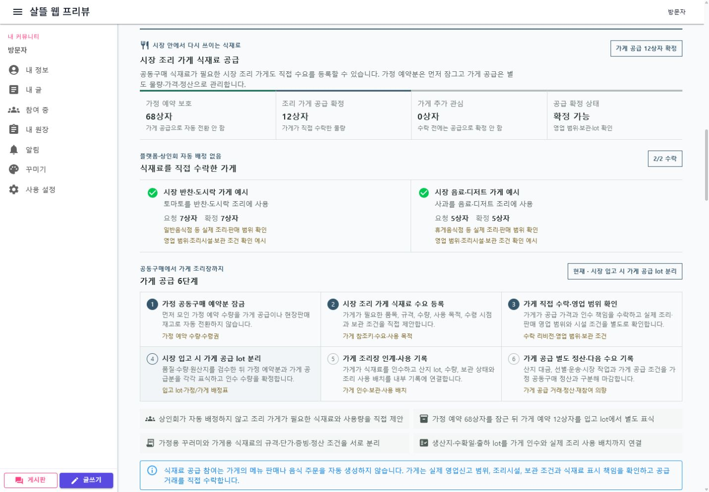
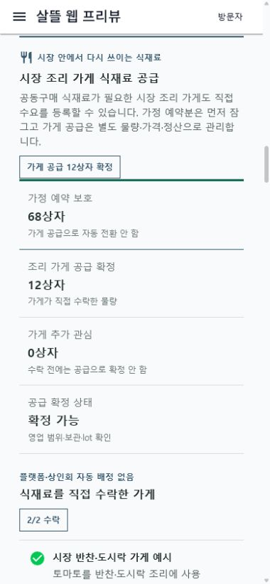

# 국내 농수산물 산지 직입고와 전통시장 배분

## 변경 기록

| 변경 축 | 화면 변경 여부 | 시각 증거 |
| --- | --- | --- |
| 국내 생산자·산지 공급 주체의 공동 출하를 전통시장 직입고, 가정·시장 조리 가게 배분, 생활권 수령과 장날 판매로 연결하는 장날 하위 ViewModel | 화면 변경 | 데스크톱·390px 모바일에서 국내 산지→전통시장 경로, 가정 68상자·조리 가게 12상자 분리, 가게 2곳과 6단계 공급, 10단계 전체 이행 확인 |

## 적용 범위

- 상품 출발국가와 배송국가가 모두 `KR`이고 전통시장 생활권을 수령 거점으로 정한 농수산물 공동구매에만 국내 산지 여정을 조립한다.
- 생산자·생산자단체 또는 산지 수산물 공급 주체, 산지 선별·포장 주체, 국내 직송 운송 주체와 시장 입고 주체를 독립된 역할 슬롯으로 둔다.
- 플랫폼은 공급자·운송인·참여 상인을 자동 선정하거나 배정하지 않는다.
- 국내 거래에는 수입 검역·통관 단계를 만들지 않으며 해외산 농산물에는 국내 산지 직입고 여정을 적용하지 않는다.
- 수산물은 냉장·냉동 운송과 선도·온도·원산지 확인을 기본 취급 프로필로 둔다.
- 시장에 입고된 예약 물량은 참여자별로 먼저 배정하고 현장판매 재고로 자동 전환하지 않는다.
- 시장 내 조리·식음료 가게는 필요한 식재료 수량과 사용 목적을 직접 등록하고 별도 공급 조건을 수락할 수 있다.
- 가정 예약 68상자를 먼저 잠그고 가게 공급 12상자를 가게별 lot로 분리하며, 가정용과 가게용 가격·증빙·정산을 구분한다.
- 가게의 영업 범위·조리시설·보관 조건을 확인하되 플랫폼은 가게를 자동 배정하거나 적법성을 보증하지 않는다.
- 식재료 인수는 메뉴·음식 주문을 자동 생성하지 않으며 실제 소비자 판매는 음식 주문 업무에서 별도로 시작한다.
- 주소 제공에 동의한 주문만 생활권 배송 주체에게 인계한다.
- 생산자 대금, 산지 작업, 운송, 시장 검수·소분·판매와 생활권 배송의 보상을 다음 회차 기록에 함께 남긴다.

## 둘러보기 예시

- 경기 광주·충북 충주 생산자의 제철 토마토·사과 공동 출하
- 예약 출하 80상자, 추가 관심 16상자와 시장 처리 한도 100상자
- 생산자·산지 포장·직송 운송·시장 입고 역할 4개 직접 수락
- 시장 반찬·도시락 가게 7상자와 음료·디저트 가게 5상자 식재료 공급 직접 수락
- 산지 출하 lot를 성남 생활권 전통시장 `07:30` 입고 슬롯에 연결
- 시장 입고 뒤 품질·수량·원산지를 검수하고 가정 예약·가게 공급·확정 여유 물량 장날 판매를 분리

## 화면

### 데스크톱

### 모바일

## 검증

- 공동행동 Page ViewModel 집중 테스트 16개와 전체 테스트 1,407개 통과
- 별도 artifacts 경로에서 WebApp과 HongdalApp Windows 빌드 통과, 경고 0개·오류 0개
- 데스크톱 viewport `1440 x 1000`(저장 PNG `1430 x 993`): 가정 예약 68상자 보호, 가게 공급 12상자, 가게 2곳의 직접 수락과 6단계 공급 절차 표시
- 모바일 viewport `390 x 844`(저장 PNG `380 x 822`): 배분 지표와 가게별 수락 정보의 단일 열 전환 확인
- 두 viewport 모두 시장 조리 가게 식재료 공급 영역의 가로 넘침 요소 없음
- `/community/actions/in-progress?campaignId=77777777-7777-4777-8777-777777777777`의 현재 서버 콘솔 오류 없음
- 실제 API가 연결되지 않은 로컬 WebApp에서는 명시적인 둘러보기 예시를 사용했다.
