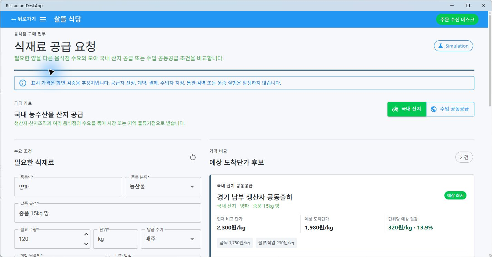
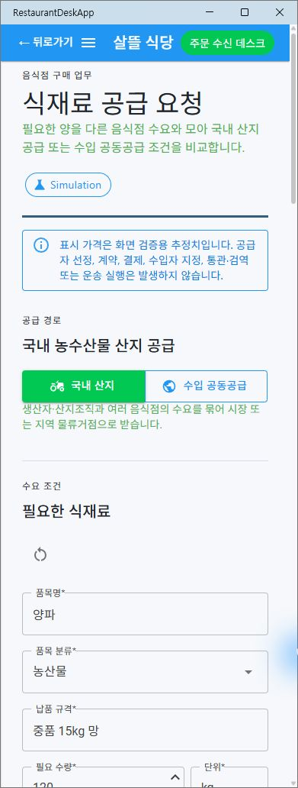

# 음식점 국내·수입 식재료 공급 요청

## 변경 기록

| 변경 축 | 화면 변경 여부 | 시각 증거 |
| --- | --- | --- |
| 음식점의 반복 식재료 수요를 국내 농수산물 산지 공급 또는 수입 공동공급 조건으로 비교하는 Page ViewModel과 Simulation 화면 | 화면 변경 | 데스크톱과 391px 모바일에서 공급 경로 전환, 요청 조건 입력, 예상 도착단가 비교, 후보 직접 선택과 초안 저장 확인 |

## 적용 범위

- `RestaurantDeskApp`의 `/ingredients/supply-request`에서 국내 농수산물 산지 공급과 수입 공동공급을 명확히 구분한다.
- 국내·수입 요청 초안은 경로를 전환해도 각각 보존한다.
- 비교 기준은 상품 단가만이 아니라 물류·작업비와 수입 시 통관·검역 예상비를 합친 예상 도착단가다.
- 예상 최저 후보를 표시하되 자동 선택하지 않고 음식점 사용자가 직접 조건을 선택한다.
- 국내 공급은 생산자·산지 조직, 선별·포장 또는 시장 입고, 국내 운송, 납품 음식점 역할을 표시한다.
- 수입 공동공급은 수출자, 수입자, 관세사·검역, 국제·국내 물류, 납품 음식점 역할을 별도로 표시한다.
- 수입 요청에는 희망 원산지 또는 허용 범위가 필요하다.
- 저장 결과는 `Simulation` 공급 요청 초안이며 공급자 선정, 계약, 결제, 수입자 지정, 통관·검역 또는 운송 실행을 발생시키지 않는다.
- Page Razor는 조립과 명령 연결만 담당하고 요청 폼, 가격 후보, 진행 목록은 음식점 App의 독립 하위 컴포넌트로 분리한다.
- 공급 모델·서비스 계약과 작성·비교·진행 Page ViewModel 구현을 별도 파일로 분리한다.

## 화면

### 데스크톱

### 모바일

## 검증

- 음식점 식재료 공급 요청 Page ViewModel 집중 테스트 10개 통과
- `Hongdal.Tests` 전체 테스트 1,417개 통과
- `RestaurantDeskApp` Windows 빌드 통과, 경고 0개·오류 0개
- 실제 MAUI Blazor 앱에서 국내·수입 경로 전환, 후보 직접 선택, 목표 단가 반영과 Simulation 초안 저장 확인
- 데스크톱 `1426 x 746`과 모바일 `391 x 1032`에서 입력·경로 버튼·가격 카드의 가로 넘침 없음
- 기존 `NotFoundPage`가 route 없이 등록되어 전체 Router 렌더링을 중단하던 문제를 `/not-found` route로 보완
