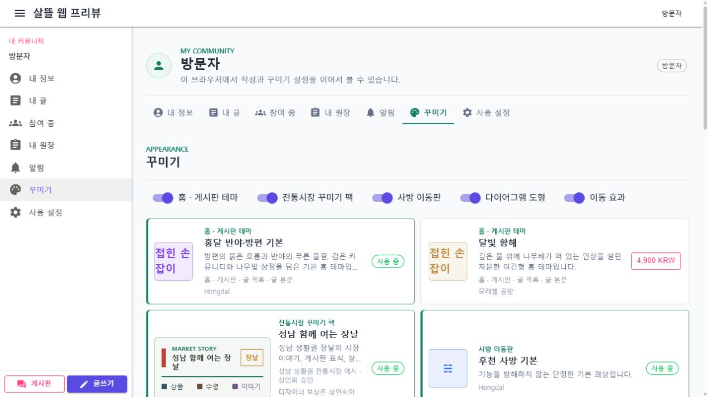
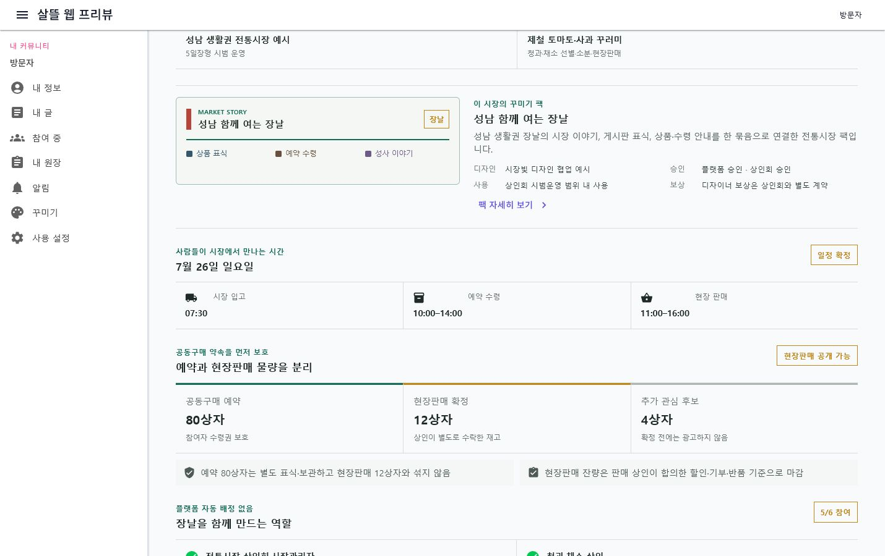
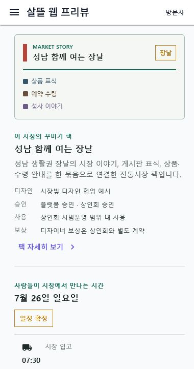

# 전통시장별 꾸미기 팩과 디자이너 참여

## 변경 기록

| 변경 축 | 화면 변경 여부 | 시각 증거 |
| --- | --- | --- |
| 시장별 공용 디자인 팩, 디자이너 초안과 이중 승인 경계 | 화면 변경 | 꾸미기 상점의 시장 팩과 공동구매 장날의 실제 적용 상태를 데스크톱·390px 모바일에서 확인 |

## 적용 범위

- 시장 머리표, 게시판 표식, 장날 배너, 상품 표식, 예약 수령 안내와 성사 이야기 표지를 하나의 팩으로 묶는다.
- 각 팩은 `traditional-market:{market-key}` 한 시장에만 적용하며 다른 시장으로 자동 복제하지 않는다.
- 디자이너는 시장명, 적용 범위, 여섯 개 표식과 보상 제안을 담은 초안을 꾸미기 상점에 제출할 수 있다.
- 플랫폼의 안전·저작권·접근성 검토와 해당 상인회 승인이 모두 끝난 리비전만 공식 적용할 수 있다.
- 가격, 수량·중량, 원산지, 알레르기, 보관 조건, 수령 장소·시간과 재고 구분은 팩이 변경할 수 없다.
- 디자이너 보상은 상인회 또는 시장관리자와의 별도 계약 사항이며 현재 흐름은 자동 정산하지 않는다.

## 화면

### 꾸미기 상점

### 장날 적용 상태

## 검증

- 시장 범위 적용, 미승인 초안 차단, 다른 시장 범위 적용 거부와 브라우저 선택 복원 집중 테스트를 실행했다.
- `HongdalApp` Windows 대상 빌드로 공용 컴포넌트와 MAUI 소비 화면을 함께 확인했다.
- WebApp의 꾸미기 상점과 장날 경로에서 데스크톱·390px 모바일 렌더링, 가로 넘침과 핵심 문구를 확인했다.
- 화면은 샘플 성남 생활권 시장과 시범 장날 데이터를 사용하며 실제 시장 승인이나 계약을 뜻하지 않는다.
