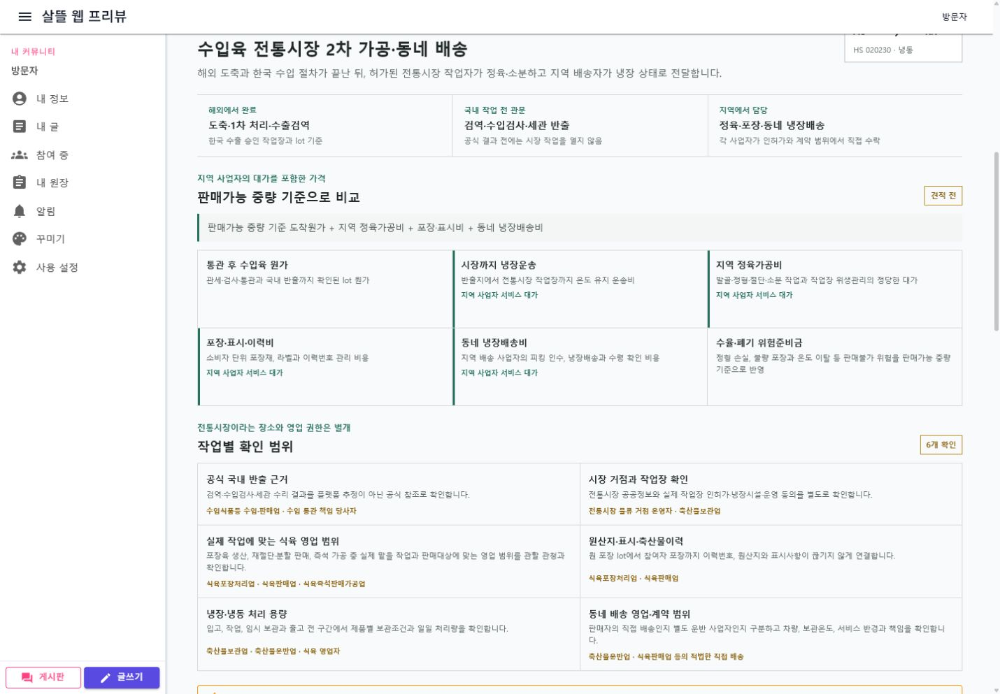
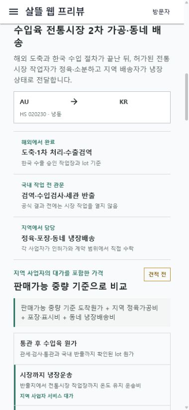

# 수입육 전통시장 2차 가공과 생활권 배송

## 변경 기록

| 변경 축 | 화면 변경 여부 | 시각 증거 |
| --- | --- | --- |
| 해외 승인시설의 도축·1차 가공부터 한국 검역·통관, 전통시장 2차 가공과 생활권 냉장배송까지 10단계 여정 조립 | 화면 변경 | 데스크톱·390px 모바일에서 책임 경계, 지역 사업자 비용, 영업 확인 항목과 진행 상태 확인 |

## 적용 범위

- 도착국이 한국이고 출발국이 해외이며 HS 코드가 `02`로 시작하는 같이 수입 후보에만 표시한다.
- 전통시장 역할은 국내 검역·수입검사·통관 반출이 확인된 뒤 시작한다.
- 살아 있는 가축의 운송과 도축은 전통시장 역할에서 제외하고 해외 승인시설의 책임으로 분리한다.
- 전통시장 거점 운영자, 허가된 식육 작업자, 식육 판매자, 국내 콜드체인 운송인과 생활권 배송자를 각각의 역할 슬롯으로 둔다.
- 발골·정형·절단·소분은 반입 제품과 사업자의 실제 영업 범위에 따라 별도 확인한다.
- 공공데이터의 전통시장 등재나 플랫폼 역할 확인을 영업신고·시설 허가·계약의 증명으로 사용하지 않는다.
- 플랫폼은 가공업자나 배송업자를 자동 선정·배정하지 않고 각 사업자의 직접 참여와 계약을 요구한다.
- 소비자 주소는 공동행동에 공개하지 않고 배송 동의 후 필요한 수행자에게만 전달한다.

## 비용 표시

공동행동 화면은 통관 후 수입육 원가, 시장까지의 콜드체인, 전통시장 2차 가공 보상,
포장·표시·이력관리, 생활권 냉장배송과 수율·폐기 위험을 판매 가능 중량 기준으로 분리한다.
지역 상인의 작업을 무료 절감으로 계산하지 않으며 견적과 처리량·온도·수율 근거가 없으면
확정 편익으로 표시하지 않는다.

## 화면

### 데스크톱

### 모바일

## 검증

- 공동행동 Page ViewModel과 국내 공동구매 이행 계획 집중 테스트 18개 통과
- 별도 artifacts 경로에서 Contracts, 공통 UI, 서버와 WebApp 빌드 통과
- 데스크톱 viewport `1440 x 1000`(저장 PNG `1430 x 993`): 비용 6항목, 확인 요건 6항목, 단계 10개 표시와 가로 넘침 없음
- 모바일 viewport `390 x 844`(저장 PNG `380 x 822`): 단일 열 전환과 문서·컴포넌트·개별 항목 가로 넘침 없음
- 새 브라우저 세션에서 `/community/actions/party?campaignId=66666666-6666-4666-8666-666666666666` 콘솔 오류 없음
- 실제 API가 연결되지 않은 로컬 WebApp에서는 명시적인 둘러보기 예시를 사용했다.
