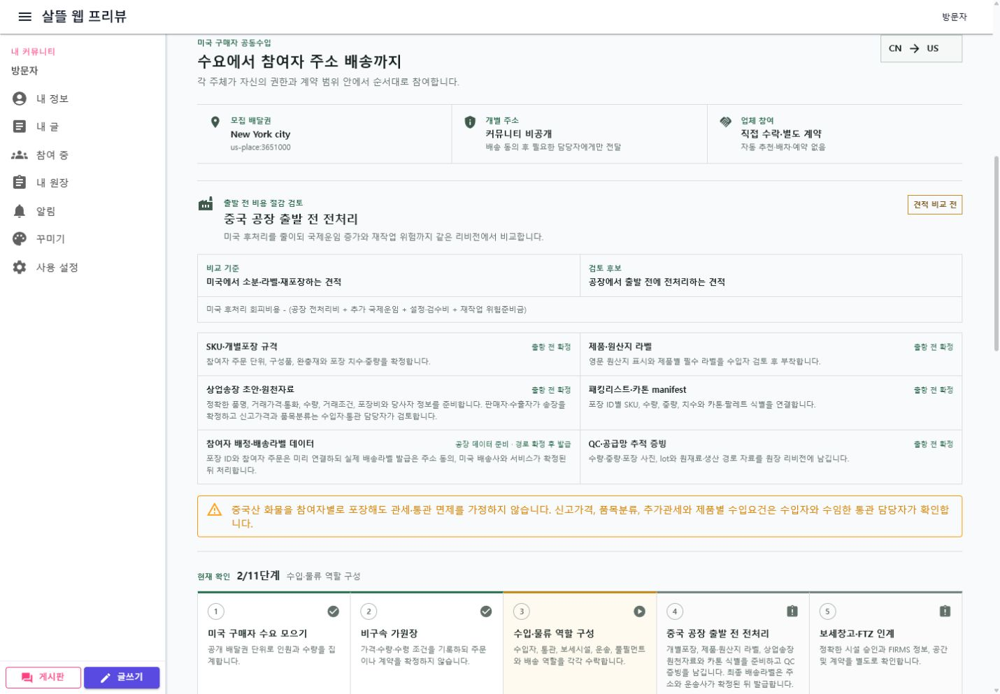

# 미국 구매자 공동수입 배송 여정

## 변경 기록

| 변경 축 | 화면 변경 여부 | 시각 증거 |
| --- | --- | --- |
| 미국 구매자 수요에서 중국 공장 전처리, 보세·통관·풀필먼트와 참여자 주소 배송까지 11단계 여정 조립 | 화면 변경 | 데스크톱·390px 모바일에서 전처리 비용 비교·단계·개인정보·업체 참여 경계 확인 |

## 적용 범위

- 서버 운영 국가를 공동구매 거래경로, 투표와 공동수입 원장 메타데이터에 보존한다.
- 미국 운영 서버에서는 중국 공장 출발·미국 배송을 공동수입 예시로 조립한다.
- 공동행동 Page ViewModel에 배송 하위 ViewModel을 조립하고 미국 시나리오에서만 여정을 표시한다.
- 수요 집계와 가원장은 기록 상태로, 역할 구성은 현재 확인 상태로 보여 준다.
- 중국 공장의 개별포장·라벨·송장 원천자료와 미국 3PL 후처리 견적을 비교하는 입력을 분리한다.
- 실제 parcel 배송라벨은 주소 동의와 배송사·서비스 확정 뒤 발급하도록 시점을 분리한다.
- 보세·통관·풀필먼트·parcel 배송은 자동 실행하지 않고 `별도 계약 필요`로 표시한다.
- 공개 배달권만 표시하고 참여자의 개별 주소는 커뮤니티에 노출하지 않는다.
- 개별포장을 de minimis 또는 통관 회피 수단으로 취급하지 않는다.

## 화면

### 데스크톱

### 모바일

## 검증

- 공동행동 Page ViewModel과 공동조달 경제성 산정 engine 집중 테스트 14개 통과, 별도 artifacts 경로에서 Contracts·server·WebApp 소비 프로젝트 빌드
- 데스크톱 viewport `1440 x 1000`(저장 PNG `1430 x 993`): 11단계와 공장 전처리 비교 표시, 가로 넘침·경계 문구 잘림·단계 문구 잘림 없음
- 모바일 viewport `390 x 844`(저장 PNG `380 x 822`): 전처리 비교와 작업 목록 1열 전환, 11단계 및 작업 항목의 가로 넘침 없음
- 새 브라우저 세션에서 `/community/actions/party?campaignId=55555555-5555-4555-8555-555555555555` 콘솔 오류 없음
- 실제 API가 연결되지 않은 로컬 WebApp에서는 명시적인 둘러보기 예시를 사용했다.
