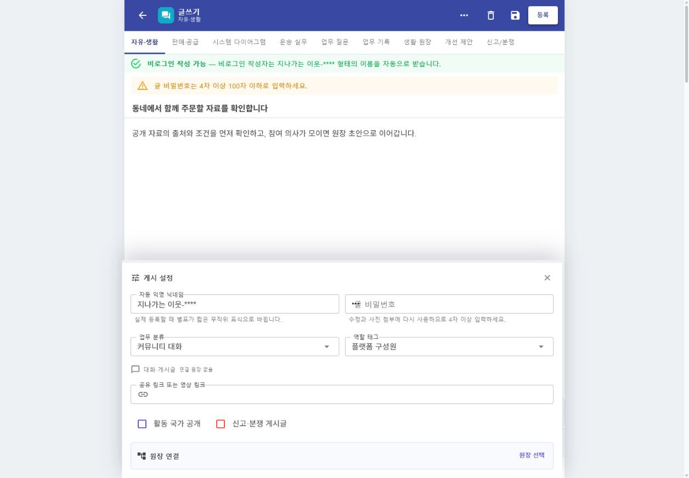
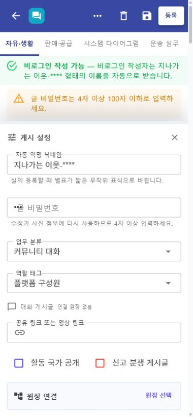

# 커뮤니티 글쓰기 저장·복구 신뢰성

## 변경 기록

| 변경 축 | 화면 변경 여부 | 시각 증거 |
| --- | --- | --- |
| 자동 임시저장과 복구 | 화면 변경 | 제목·본문을 벗어날 때 browser 초안을 저장하고 저장 시각을 표시하며, 편집기를 닫거나 새로고침해도 제목·본문·수정 대상·예약 시각을 복원 |
| 명시적 초안 비우기 | 화면 변경 | 삭제 아이콘, `계속 작성`과 `비우기`의 2단계 확인, browser 저장소와 현재 입력의 동시 삭제 |
| 등록 전 검증 | 화면 변경 | 닉네임·비밀번호·제목·본문·링크·판매 정보·국가 코드 규칙을 서버 계약과 맞추고 오류를 입력 화면에 유지 |
| 사진 첨부 | 화면 변경 | JPEG·PNG·WebP·GIF, 파일당 5MB, 최대 5개를 미리 검증하고 개별 제거·전체 제거 제공 |
| 부분 실패 복구 | 간접 확인 | 글 저장 뒤 사진만 실패하면 저장 성공을 유지하고 실패 파일명과 상세 화면 재확인 안내를 반환해 중복 등록 방지 |
| 관리자 원장 연결 | 화면 변경 | 관리자 글쓰기에도 공통 원장 선택·상세·계층 화면을 연결하고 선택 원장을 초안에 명시적으로 첨부·해제 |
| WebApp DI 경계 | 간접 확인 | 관리자 전용 통계·AI·이미지 ViewModel 등록을 Admin 조립 경계로 이동해 일반 WebApp 시작 실패 제거 |

## 동작 경계

- 임시 초안에는 글 비밀번호와 로컬 사진 파일을 저장하지 않는다.
- 자동저장과 초안 비우기가 동시에 시작돼도 세대 번호와 저장 잠금으로 오래된 저장이 삭제 결과를 되살리지 못한다.
- 글 본문이 먼저 저장된 뒤 첨부가 실패하면 등록을 실패로 되돌리지 않는다. 사용자는 글 상세에서 저장 여부를 확인하고 수정 화면에서 사진만 다시 붙인다.
- 서버의 Problem Details `detail`, `message`, `title`을 우선해 일반적인 HTTP 상태 문구보다 실제 거절 사유를 보여 준다.
- 원장 선택은 글의 맥락 연결이며 원장 상태 전이, 역할 배정, 계약, 결제, 배차 또는 정산을 실행하지 않는다.

## 화면

### 데스크톱

### 모바일

캡처는 실제 `Hongdal.WebApp`의 공통 `PlatformCommunityPostComposer`를 렌더링한 결과다. 예시 제목과 본문만 사용했으며 실제 사용자 정보, 주소, 연락처, 결제 정보 또는 증빙 파일은 포함하지 않았다.

## 검증

- 글쓰기·관리자 작성·공통 DI 대상 테스트 60개 통과
- `Hongdal.WebApp` Release 빌드 경고 0개·오류 0개
- `HongdalAdminApp` Windows Release 빌드 경고 0개·오류 0개
- `HongdalAdminApp` Android Release 빌드 경고 0개·오류 0개
- 실제 WebApp에서 입력 자동저장, 짧은 비밀번호의 등록 전 차단, 닫기·새로고침 복구, 비밀번호 미복원, 초안 비우기 확인 및 삭제를 검증
- 기본 데스크톱과 390px 모바일 viewport에서 헤더 버튼, 설정 입력, 원장 연결이 겹치거나 잘리지 않는지 확인
- 최종 검증 포트에서 신규 browser 오류 없음 확인
