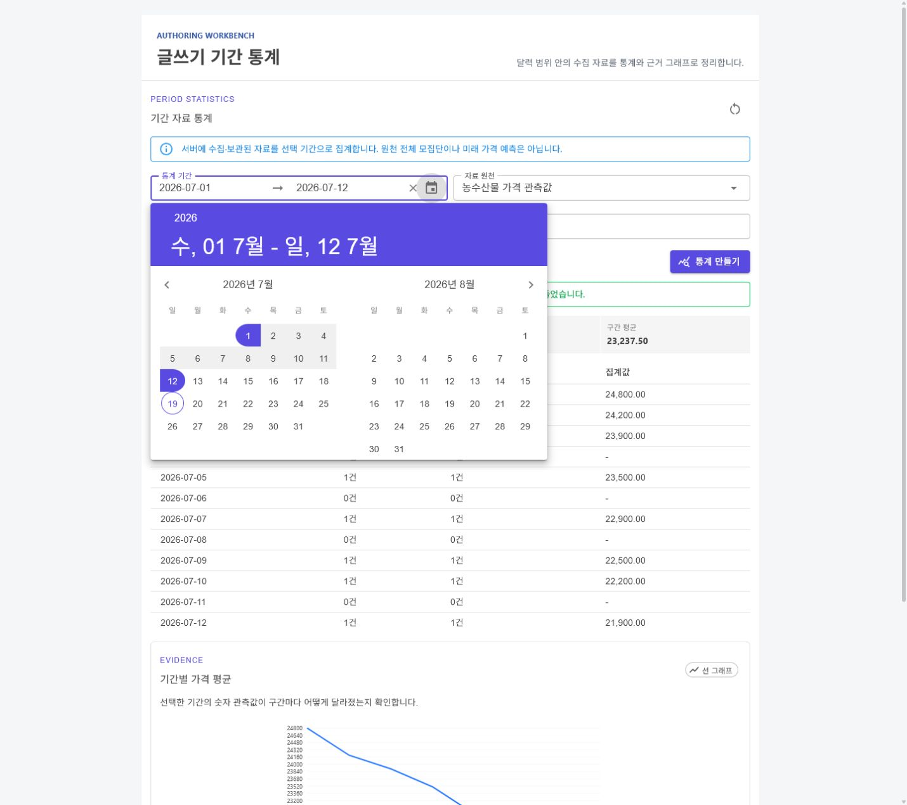
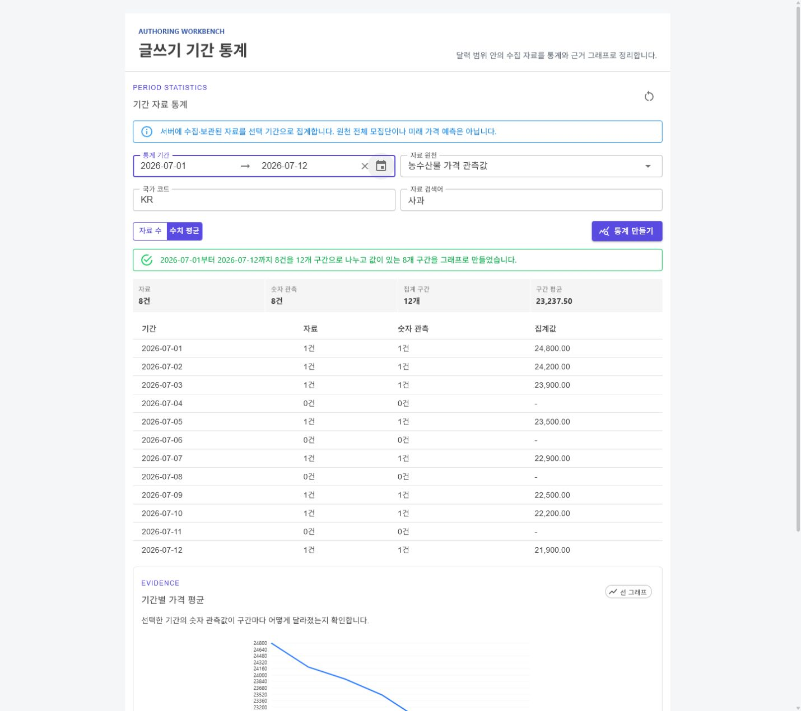
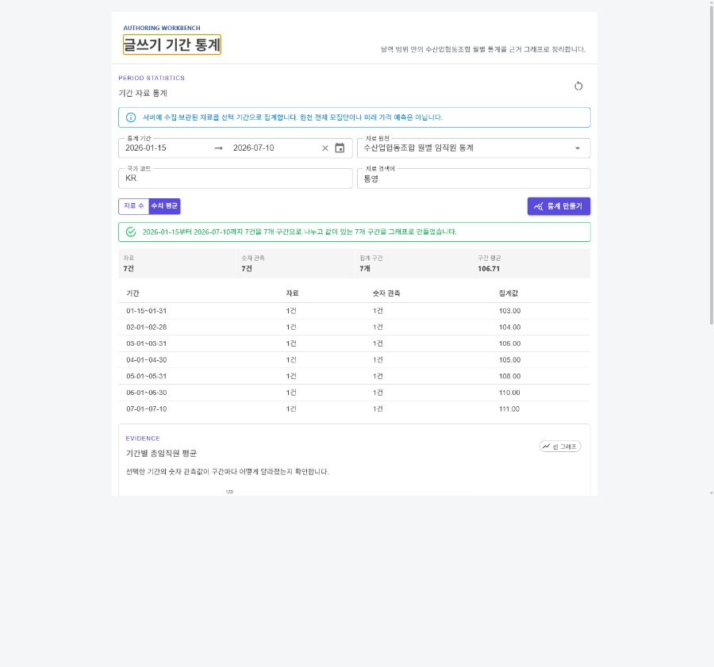
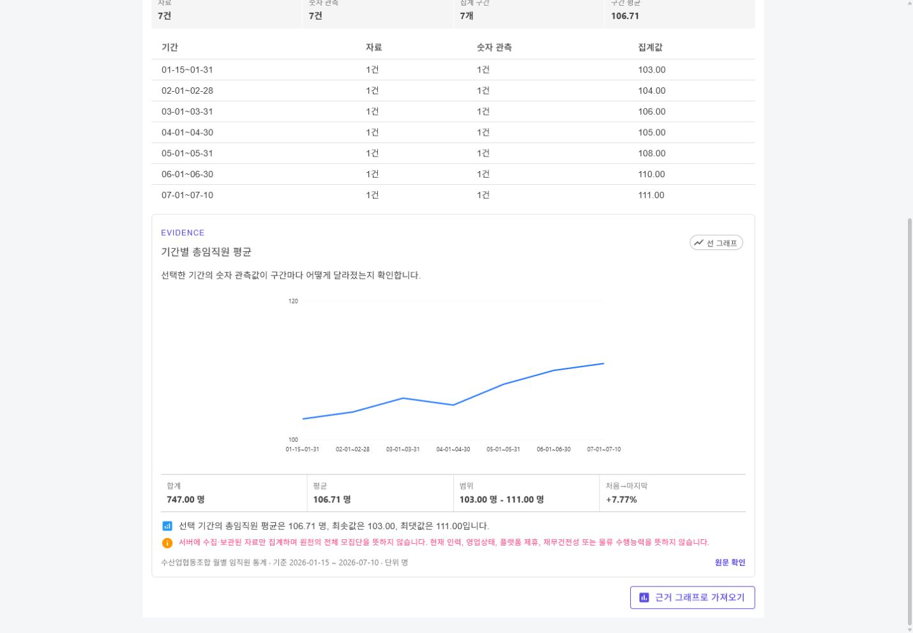
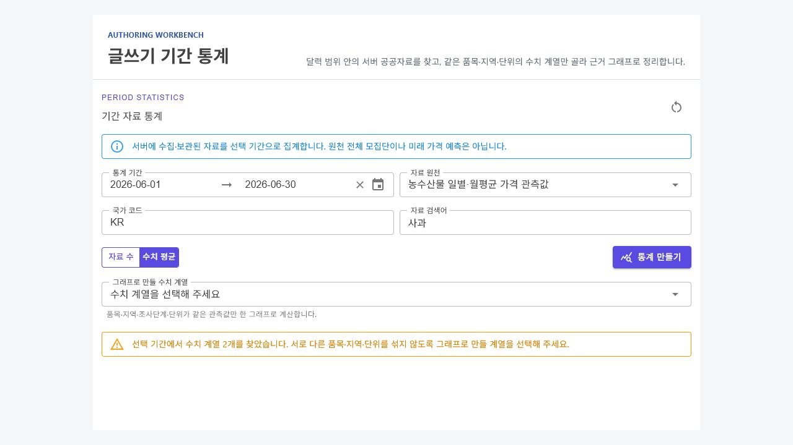
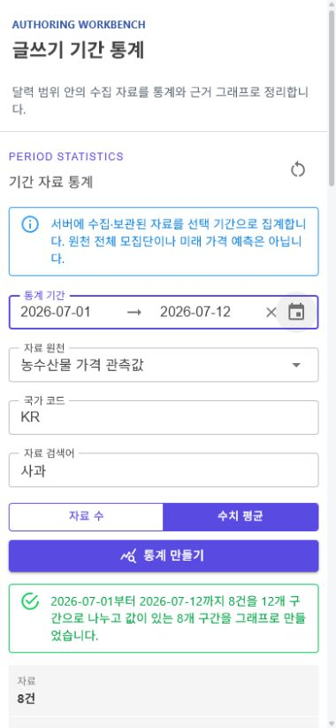
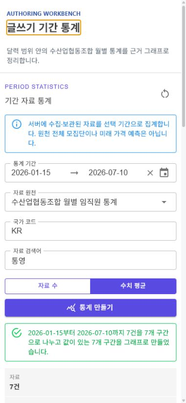
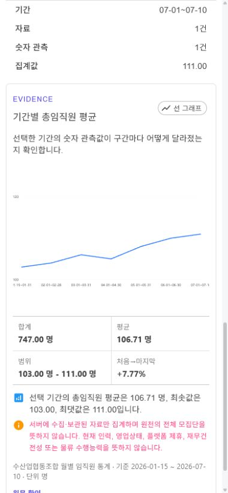
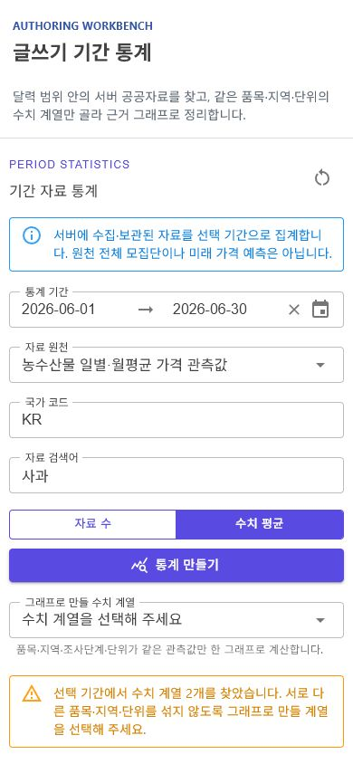

# 글쓰기 기간 통계와 근거 그래프

## 변경 기록

| 변경 축 | 화면 변경 여부 | 시각 증거 |
| --- | --- | --- |
| 글쓰기에서 달력으로 통계 기간 선택 | 화면 변경 | 데스크톱 달력 팝업과 모바일 입력 화면 |
| 수집 자료의 기간별 건수·수치 평균 집계 | 화면 변경 | 구간 표, 요약 수치와 빈 구간 표시 |
| 서버 공공 시계열 원천과 수치 계열 선택 | 화면 변경 | KAMIS·USDA·ABS·수협 원천 및 품목·지역·단위별 계열 선택 |
| 집계 결과를 기존 근거 그래프로 전달 | 화면 변경 | 가격 평균 선 그래프와 출처·기준일·한계 |
| 수산업협동조합 월별 임직원 통계 원천 | 화면 변경 | 원천 선택, 월별 통계 표와 임직원 수 선 그래프 |
| 자료 수집 API의 시작일·종료일 필터 | 간접 확인 | 서비스·ViewModel 단위 테스트 |

## 동작 범위

- 작성자는 `통계 기간`, 자료 원천, 국가 코드와 검색어를 선택한다.
- 달력 범위가 확정되면 해당 기간의 수집 자료를 다시 조회하고 최대 12개 구간으로 집계한다.
- `자료 수`는 날짜별 수집 건수를, `수치 평균`은 같은 원천·지표 계열·통화·단위의 숫자 관측값 평균을 보여 준다. 계열이 둘 이상이면 그래프로 만들 계열을 먼저 선택한다.
- 전체 조회에는 서버가 보관한 YouTube, KAMIS 일별·월평균, USDA NASS 월별 생산자가격을 포함한다.
- ABS 식품 소비자물가지수와 수산업협동조합 통계는 외부 호출 원천이므로 해당 원천을 명시 선택했을 때만 조회한다.
- 수산업협동조합 원천은 선택 범위가 걸치는 최대 13개 기준월을 조회하고, 같은 조합·같은 임직원 구분만 월별로 집계한다.
- 결과는 기존 근거 그래프 편집기로 가져와 글의 통계 근거로 다듬을 수 있다.
- 조회 기간은 시작일과 종료일을 모두 포함하며 최대 366일로 제한한다.

## 데이터 경계

- 한 번에 최근 100건까지 집계하므로 결과를 원천 전체 모집단으로 표현하지 않는다.
- 숫자 평균은 원천·품목·품종·등급·조사단계·지역·통화·단위가 같은 계열에만 적용한다. 기준이 섞이면 계열 선택 목록을 먼저 보여 주며 임의 평균을 만들지 않는다.
- USDA 값은 미국 생산자가격, ABS 값은 실제 단가가 아닌 소비자물가지수로 유지한다. KAMIS 일별과 월평균도 별도 계열이다.
- 주문·결제·정산·주소·사용자 활동과 원장 내부 상태는 공공 근거 통계에 포함하지 않는다.
- 수산업협동조합 임직원 수는 현재 인력, 영업상태, 재무건전성, 제휴 또는 물류 역량을 뜻하지 않는다.
- 원천별 조회 실패는 다른 원천의 결과로 숨기지 않고 실패 내역과 함께 표시한다.
- 통계는 서버가 보관했거나 원천 선택 뒤 조회한 자료의 작성 보조 요약이며 미래 가격 예측이나 판매 권고가 아니다.

## 화면

### 기간 선택

### 기간 집계와 근거 그래프

### 수산업협동조합 월별 통계

### 서버 공공자료와 수치 계열 선택

### 모바일

캡처는 실제 공통 Razor 컴포넌트를 KAMIS, USDA NASS, ABS 및 금융위원회 수산업협동조합 형식의 화면 검증용 모의 자료로 렌더링한 결과다. 표시된 수치는 실제 거래 제안이나 특정 조합의 현재 인력 현황이 아니다.

## 검증

- `Hongdal.Tests` 전체 1,494개 통과
- `HongdalAdminApp` `net10.0-windows10.0.19041.0` 빌드 경고 0개·오류 0개
- 달력 팝업 열기, 통계 재조회, 수치 계열 선택, 수산업협동조합 월별 표·선 그래프와 데스크톱·모바일 반응형 렌더링 확인
- 모바일 390px에서 가로 넘침 없음과 브라우저 경고·오류 없음 확인
- `git diff --check` 확인
