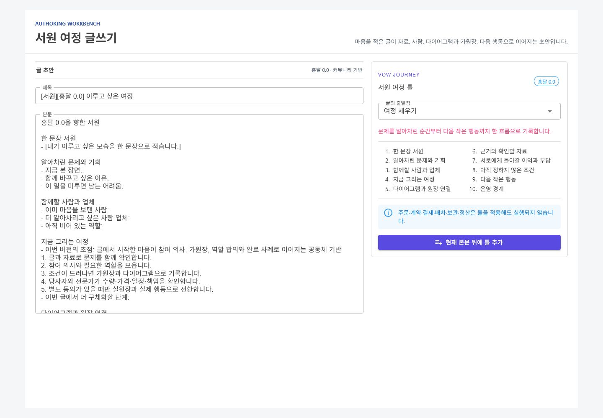
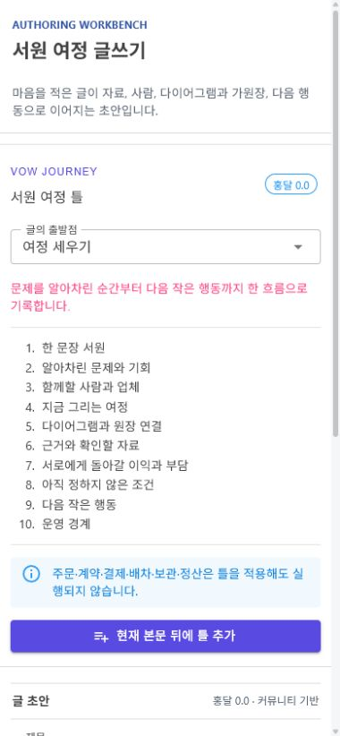
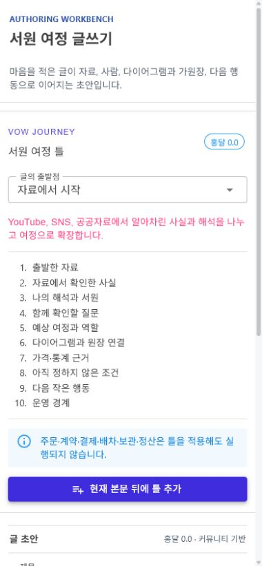

# 서원 여정 글쓰기 템플릿

## 변경 기록

| 변경 축 | 화면 변경 여부 | 시각 증거 |
| --- | --- | --- |
| 서원 여정 기본 틀 | 화면 변경 | 데스크톱 글 초안과 `서원 틀` 도구 |
| 자료 기반 서원 틀 | 화면 변경 | 모바일 YouTube·SNS·공공자료 출발점 |
| 함께할 사람·업체 모집 틀 | 화면 변경 | 공통 선택 목록과 ViewModel 테스트 |
| 기존 초안 보존 | 간접 확인 | 제목·본문을 유지한 덧붙이기 단위 테스트 |
| 실행 경계 | 화면 변경 | 주문·계약·결제·배차·보관·정산 비실행 안내 |

## 글의 구조

- `여정 세우기`: 한 문장 서원, 문제와 기회, 함께할 사람과 업체, 여정 단계, 다이어그램과 가원장, 근거, 상호 이익, 미정 조건, 다음 행동, 운영 경계
- `자료에서 시작`: 원문과 기준일, 사실과 해석의 구분, 확인 질문, 예상 여정과 역할, 가격·통계 근거
- `함께할 사람 찾기`: 공동 목적, 현재 모인 마음, 역할 슬롯, 자격과 책임, 역할별 이익과 부담, 실원장 전환 조건

버전 선택은 기존 `홍달 0.0`부터 `다음 서원`까지 유지한다. 템플릿은 선택한 버전의 초점, 이어받는 기반과 운영 경계를 본문에 포함한다.

## 적용 경계

- 빈 글에는 선택한 틀로 제목과 본문을 만들고 게시판을 `서원`, 역할을 `운영자 서원 기록`으로 둔다.
- 작성 중인 글에는 기존 제목과 본문을 바꾸지 않고 새 틀을 구분선 뒤에만 추가한다.
- 운영 경계가 잘리지 않도록 본문 제한을 넘으면 부분 적용하지 않는다.
- 템플릿 선택과 적용은 다이어그램, 가원장, 실원장, 참여 초대 또는 외부 업무를 자동 생성하지 않는다.
- 주문·계약·결제·배차·보관·정산은 당사자와 자격 있는 사업자의 별도 확인 사항으로 남긴다.

## 화면

### 데스크톱

### 모바일

캡처는 실제 공통 `CommunityVowJourneyTemplateTool`과 `CommunityVowJourneyTemplateViewModel`을 화면 검증용 호스트에서 렌더링한 결과다. 실제 사용자 정보나 외부 업무 실행 데이터는 포함하지 않았다.

## 검증

- `Hongdal.Tests` 전체 1,498개 통과
- `HongdalAdminApp` `net10.0-windows10.0.19041.0` Release 빌드 경고 0개·오류 0개
- 템플릿 전환과 본문 덧붙이기 동작 확인
- 데스크톱 1440px·모바일 390px 렌더링 및 가로 넘침 없음 확인
- 브라우저 경고·오류 없음 확인
