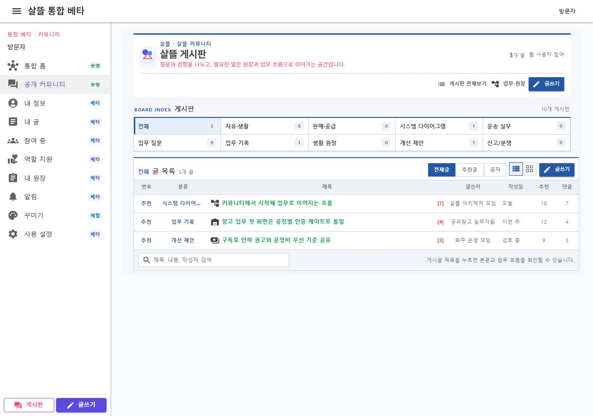
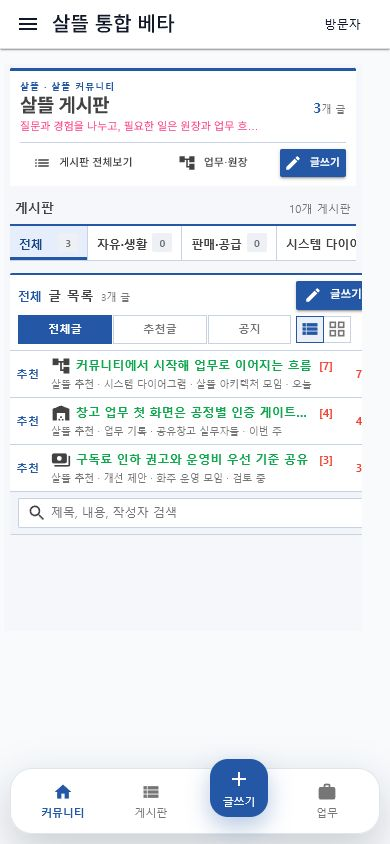

# 전통 게시판 기본형과 게시글 상세 이동

## 변경 내용

- `/community`의 기본 화면을 게시판 분류와 밀도 높은 글 목록을 한눈에 훑는 전통 게시판 형태로 정리했다.
- 공개 커뮤니티 첫 화면에서는 게시판과 글 목록에 집중하고, 업무·원장 작업은 `/community/workspace`로 분리했다.
- 게시판 디렉터리와 게시판별 글 목록도 같은 선·간격·색상 체계를 사용하도록 정돈했다.
- 실제 게시글 제목은 `/community/posts/{id}`로, 추천 게시글 제목은 `/community/posts/recommended` 전용 상세 화면으로 이동한다.
- 상세 화면의 `글 목록` 링크는 출발한 게시판 문맥을 보존한다.

## 실제 화면

### 데스크톱 게시판

### 모바일 게시판

### 모바일 게시글 상세

## 검증

- `Ssalddel.WebApp` Debug·Release 빌드: 경고 0, 오류 0
- 커뮤니티 화면·메타데이터 관련 테스트 14개 통과
- 1280×900 데스크톱과 390×844 모바일에서 가로 넘침 없음
- 모바일에서 글 제목 선택 → 전용 상세 화면 → 원래 게시판으로 돌아가는 링크를 확인
- 상세 화면에서 글 목록이 중복 노출되지 않음을 확인
