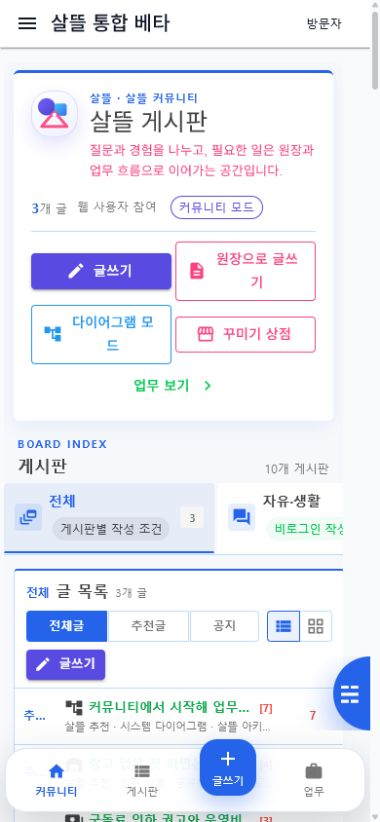

# 게시판형 커뮤니티 첫 화면 복구

## 변경 요약

- `/community` 첫 화면을 게시판 소개, 게시판 분류, 번호·분류·제목·글쓴이·작성일·추천·댓글 열이 있는 글 목록 중심으로 복구했다.
- 기존 카드형 게시판 디렉터리는 삭제하지 않고 `/community/categories` 보조 경로로 옮겼다.
- WebApp 대표 화면에서는 게시판을 선택하면 `/community/boards`, 글쓰기 버튼을 누르면 `/community/write`로 이동하도록 전용 경로 사용을 명시했다.
- 게시글 API가 연결되지 않아도 글 목록 표와 빈 상태를 유지하고 오류 안내와 재시도를 함께 표시한다.
- README의 대표 이미지를 카드형 디렉터리에서 실제 게시판형 첫 화면으로 교체했다.

## 실제 렌더링

1280px급 desktop과 390px mobile에서 게시판 분류와 글 목록이 첫 화면에 표시되고 가로 넘침이 없음을 확인했다.

## 단계별 이동 검증

1. `/community`에서 `자유·생활` 게시판 선택
2. `/community/boards?board=자유·생활` 글 목록으로 이동
3. 글 목록의 `글쓰기`를 눌러 `/community/write?board=자유·생활`로 이동
4. 글쓰기 화면에서 게시글 제목·내용 입력란과 등록 동작 확인

## 검증

- `dotnet build Ssalddel.WebApp/Ssalddel.WebApp.csproj --no-restore`
- desktop: 게시판 표 1개, 머리글 포함 행 4개, 가로 넘침 없음
- 390px mobile: 게시판 표 1개, 머리글 포함 행 4개, 가로 넘침 없음
- API 연결 실패 상태에서 오류 안내와 빈 글 목록 표 동시 표시
