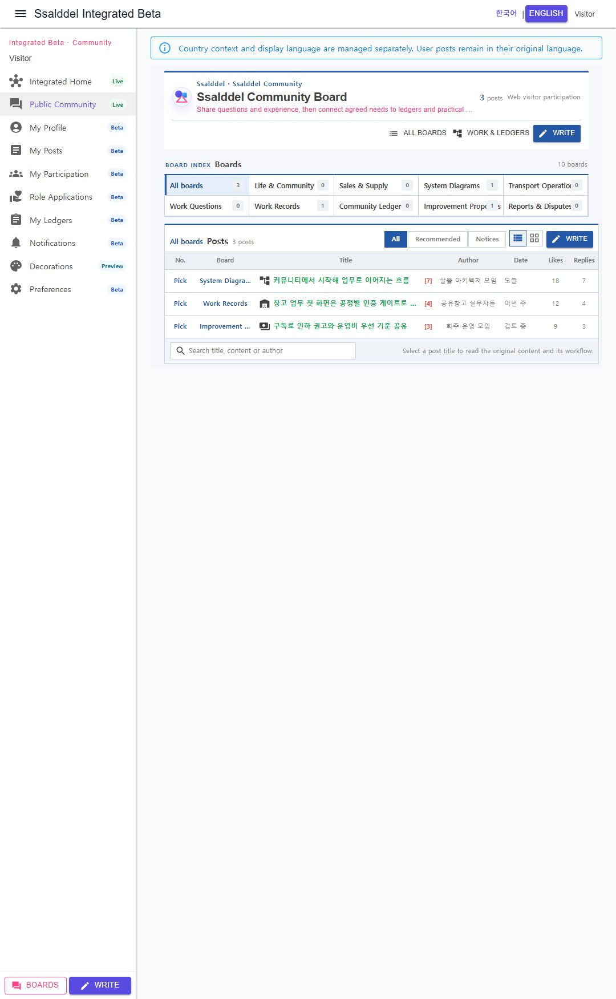

# 공개 커뮤니티 국가·언어 분리 진입

## 변경

- 공개 커뮤니티 대표 경로를 `/ko/community`, `/en/community`로 분리했다.
- 화면 언어 선택 책임을 계정 설정, 명시적 브라우저 선택 쿠키, `Accept-Language`, 신뢰된 국가코드 추천, 한국어 기본값 순으로 분리했다.
- 계정의 표시 언어는 기존 Identity claim에 저장하고, 비로그인 사용자의 선택은 브라우저 쿠키에 저장한다.
- 국가코드는 통화·법률·운영 문맥을 위한 별도 값으로 유지하며 화면 언어를 확정하지 않는다. 원본 IP는 계약과 로그에 추가하지 않았다.
- 신뢰된 reverse proxy 국가 헤더는 `WebLocalization:TrustProxyCountryHeader`가 명시적으로 켜진 경우에만 최초 추천에 사용한다.
- 상단 `한국어 | English` 전환을 항상 노출하고, 공개 커뮤니티 셸·메뉴·게시판명·버튼·검색·오류 문구만 번역했다.
- 사용자가 작성한 게시글 제목·본문·작성자 표시는 자동 번역하지 않고 원문을 유지한다.

## 실제 확인

- `/en/community`에서 영문 셸, 메뉴, 게시판 분류, 글 목록 제어 표시
- `한국어` 선택 시 `/ko/community` 이동과 한국어 UI 복원
- 다시 `English`를 선택한 뒤 `/community`로 접속하면 저장한 선택을 우선해 `/en/community`로 안내
- 영문 UI에서도 한국어 게시글 제목·작성자·작성 시점 원문 유지
- 브라우저 콘솔의 현재 실행 오류 없음

## 현재 경계

- 국가코드 헤더 신뢰는 기본 비활성이다. 실제 배포에서 Caddy 또는 앞단 edge가 검증한 국가코드를 넣을 때만 설정을 활성화해야 한다.
- 이번 세로 단위는 공개 커뮤니티 대표 화면을 완성했다. 개인 메뉴와 글쓰기·상세 같은 하위 경로의 국가·언어 prefix 확장은 후속 페이지 단위로 진행한다.

## 화면

