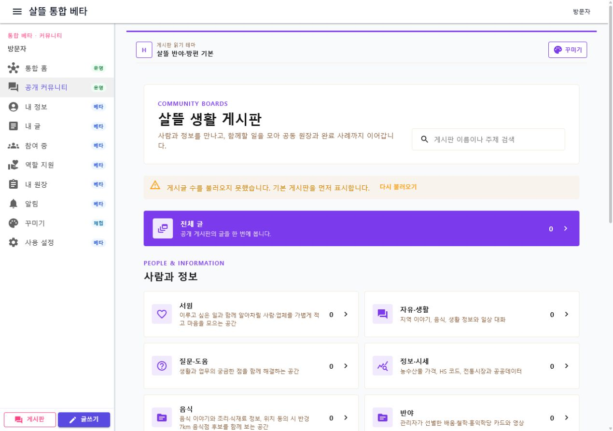

# 커뮤니티 공개 흐름과 README 집중화

## 변경 요약

- GitHub README를 커뮤니티 게시판 대표 화면 하나와 하위 업무 기능 구조로 축약했다.
- 현재 배포 사이트 홈과 커뮤니티 직행 URL을 명시했다.
- Azure 미리보기 운영비는 방문자 부담이 아니며, 현재 구독 크레딧 범위에서 현금 지출이 거의 없다는 점과 크레딧 종료 뒤 과금 경계를 함께 밝혔다.
- 게시판 홈과 글 목록에 복구 가능한 오류 안내와 재시도를 추가했다.
- API 연결 실패 중에도 목적별 기본 게시판과 선택한 게시판 문맥을 유지한다.
- 글쓰기·상세 route에 제목, 목록 복귀와 새 글쓰기 동선을 분리했다.

## 실제 렌더링

로컬 WebApp에서 API가 연결되지 않은 상태를 의도적으로 확인했다. 기본 게시판이 유지되고 오류 안내와 `다시 불러오기`가 표시되며, 1280px desktop과 390px mobile에서 가로 넘침이 없었다.

## 검증

- `dotnet build Ssalddel.WebApp/Ssalddel.WebApp.csproj --no-restore`
- 커뮤니티 관련 테스트 35개 통과
- 배포 홈과 `/community` HTTP 200 확인
- `git diff --check`
