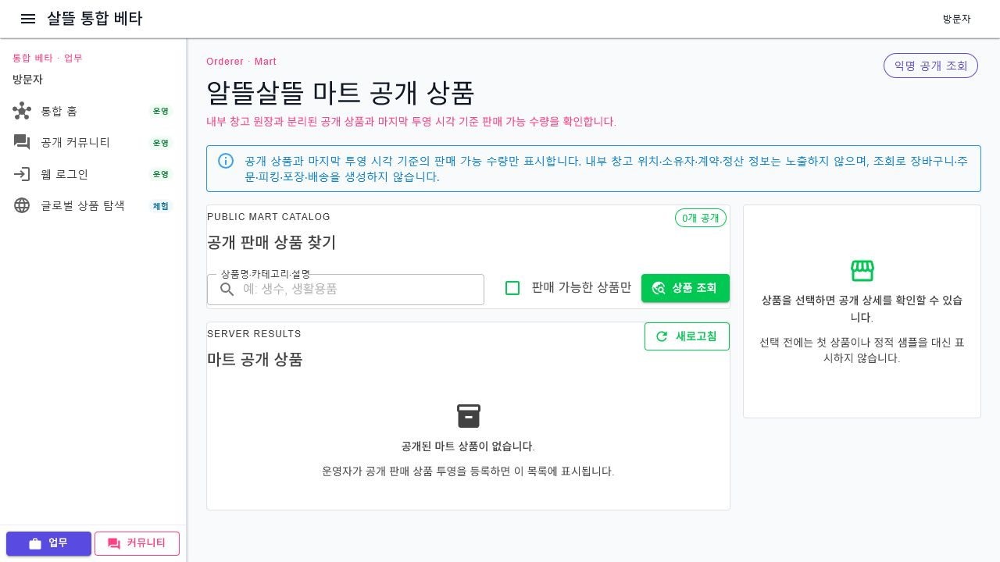

# 통합 베타 업무 페이지 연결

## 변경 기록

| 변경 축 | 화면 변경 여부 | 시각 증거 |
| --- | --- | --- |
| 회원가입 개인정보 동의 | 화면 변경 | 필수 개인정보 처리 안내와 선택 동의를 분리하고, 익명 커뮤니티 이용에는 회원가입이 필수가 아님을 명시 |
| 화물·창고 업무 | 화면 변경 | 화물 의뢰 상세·취소/환불 검토와 입고 예정·작업 보드를 공용 조회·상태 정책으로 분리 |
| 공동구매·통관·판매 | 화면 변경 | 공개 공동구매, HS 코드 검토, 판매 채널 계정·주문을 독립된 Client·ViewModel·Workspace 책임으로 연결 |
| 마트 주문 흐름 | 화면 변경 | 익명 공개 상품, 로그인 주문 요청, 창고 피킹·포장 화면을 서로 다른 원장과 권한 경계로 연결 |
| 인사 역할 지원·검토 | 화면 변경 | 일반 사용자의 역할 지원과 관리자 검토를 별도 UseCase·Client·ViewModel로 분리 |
| API·영속 흐름 | 간접 확인 | 서버 검증, 소유권, 멱등성, 페이지 기능 flag, EF migration과 카탈로그 테스트를 함께 연결 |

## 동작 경계

- 새 업무 페이지는 기존 `SsalddelExecution:Mode` 경계를 재사용하며 실제 결제·배차·계약·재고 차감을 자동 실행하지 않는다.
- 공개 조회와 로그인 보호 정보를 분리하고, 빈 결과나 API 실패를 정적 sample 데이터로 숨기지 않는다.
- 마트 공개 상품 조회는 내부 창고 위치·소유자·계약·정산 정보를 노출하지 않는다.
- 마트 주문 요청은 별도 원장에 저장하며 재고 예약·피킹·배송 실행으로 곧바로 이어지지 않는다.
- 화면 검증 때만 local server에서 `SsalddelMartWorkflow`를 활성화했다.

## 대표 화면

### 주문자 마트 공개 상품

실제 통합 WebApp과 local API를 연결해 익명 공개 조회의 빈 상태를 렌더링했다. 실제 사용자 정보, 주소, 연락처, 주문번호, 결제 정보는 포함하지 않았다. 나머지 화면은 컴포넌트·ViewModel·탐색 카탈로그 테스트로 간접 확인했다.

## 검증

- `Ssalddel.Tests` 전체 테스트 1,785개 통과
- `OrdererApp` build 경고 0개·오류 0개
- 통합 WebApp `/orderer/mart`와 local API를 연결해 기능 flag 활성 상태의 익명 공개 조회 렌더링 확인
- 대표 화면 browser console 경고·오류 0개 확인
- staged diff whitespace 오류 없음
