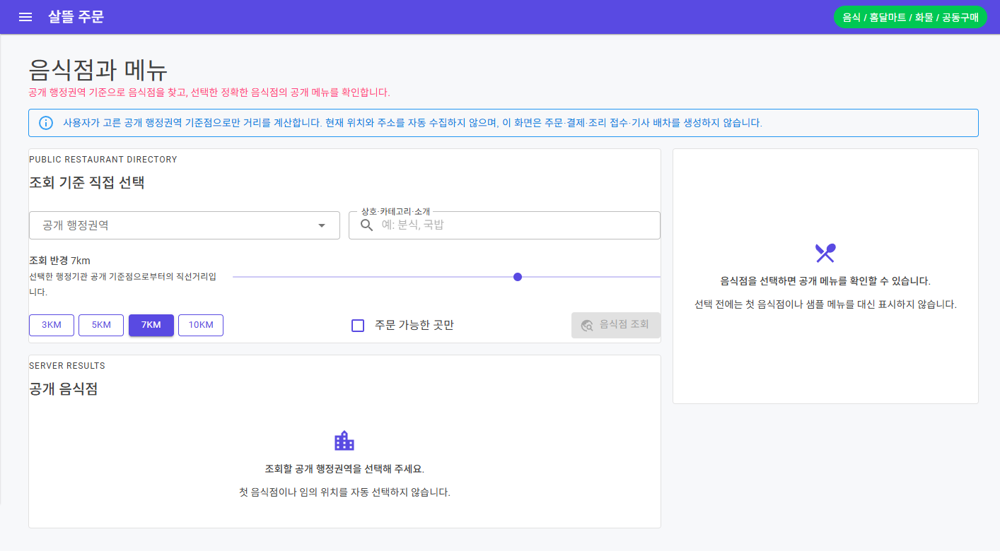
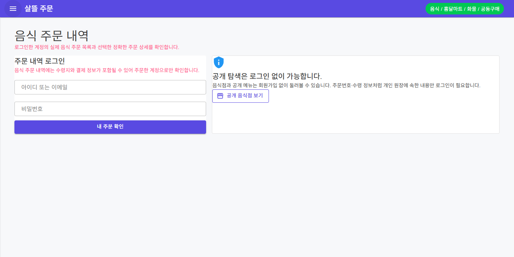

# 주문자 음식점 탐색과 음식 주문 내역

## 변경 기록

| 변경 축 | 화면 변경 여부 | 시각 증거 |
| --- | --- | --- |
| 공개 음식점·메뉴 탐색 | 화면 변경 | 사용자가 공개 행정권역과 반경을 직접 고르고 서버 저장 음식점만 조회하며, 선택 전에는 첫 음식점·임의 위치·샘플 메뉴를 자동 표시하지 않음 |
| 주문자별 음식 주문 내역 | 화면 변경 | 로그인 전에는 주문번호·수령 정보가 노출되지 않고, 공개 음식점 탐색은 회원가입 없이 이용할 수 있음을 함께 안내 |
| 공용 주문 앱 셸 | 화면 변경 | 고정 AppBar와 페이지 제목이 겹치지 않도록 상단 여백 책임을 `MainLayout`에 통합 |
| API·영속 흐름 | 간접 확인 | 공개 음식점·메뉴 RDB 모델과 migration, 사용자 소유권을 검증하는 주문 목록·정확한 주문번호 상세 API, 보호 API token 전달 경계를 연결 |

## 동작 경계

- `FoodDeliveryWorkflow`는 기본 비활성 상태를 유지한다. 화면 검증 때만 local server에서 기능 flag를 켰다.
- 음식점 탐색은 현재 위치나 주소를 자동 수집하지 않고 사용자가 선택한 공개 행정권역 기준점만 사용한다.
- 공개 탐색은 로그인 없이 가능하지만 주문 내역은 로그인한 사용자 소유 주문만 조회한다.
- 목록 실패나 빈 결과를 sample 음식점·sample 주문으로 숨기지 않는다.
- 조회 화면은 주문·결제·조리 접수·기사 배차를 생성하지 않으며 `Simulation` 실행 경계를 유지한다.

## 화면

### 공개 음식점과 메뉴

### 음식 주문 내역 로그인 경계

두 캡처는 실제 Windows `OrdererApp` WebView와 local API를 연결해 렌더링한 결과다. 빈 공개 조회 상태와 익명 로그인 경계만 담았으며 실제 사용자 정보, 주소, 연락처, 주문번호, 결제 정보는 포함하지 않았다.

## 검증

- `Ssalddel`, `OrdererApp`, `Ssalddel.Tests` build 경고 0개·오류 0개
- staged tree 전체 테스트 1,599개 통과
- 실제 `OrdererApp`에서 `/food/restaurants` 공개 조회 초기 상태와 `/orders` 로그인 보호 상태 렌더링 확인
- AppBar 하단 32px 아래에서 두 페이지 제목이 시작해 겹침이 없는지 확인
- 두 페이지 왕복 뒤 browser console·page 오류 0개 확인
