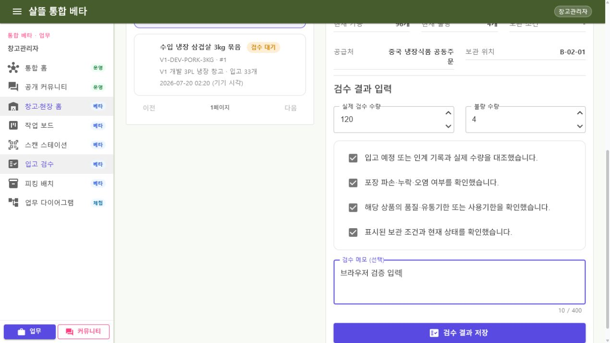

# 창고 입고 검수와 같은 ID 재조회

커밋 상태: 미커밋

## 변경 기록

| 변경 축 | 화면 변경 여부 | 결과 |
| --- | --- | --- |
| 검수대상 목록 | 화면 변경 | 정적 카드 대신 접근 가능한 창고의 서버 목록을 검색·상태·페이징 조건으로 조회 |
| 정확한 상세 | 화면 변경 | 사용자가 선택하거나 URL에 명시한 `inboundItemId`만 조회하고 첫 항목·sample로 대체하지 않음 |
| 검수 작성 | 화면 변경 | 실제 수량·불량 수량, 네 가지 현장 확인과 최대 400자 메모를 저장 전에 검증 |
| 상태 전이 | 간접 확인 | Controller API → UseCase → service가 `보관중`을 `검수완료`로 전이하고 저장 뒤 같은 ID를 재조회 |
| 단일 책임 분리 | 화면·구조 변경 | 목록, 상세, 작성, 페이지 조정, host 인증/capability를 독립 ViewModel·service·adapter로 분리 |

## 책임과 실행 경계

- 서버는 창고 소유자 또는 해당 창고 배정 사용자만 목록·상세·검수에 접근하도록 제한한다.
- 상품 소유자라는 이유만으로 창고 검수 권한을 부여하지 않는다.
- 목록과 상세 계약에는 사용자 ID, 주소, 연락처, 계좌, 결제 식별자와 증빙 원본을 포함하지 않는다.
- 최초 검수만 수량·불량 수량, 검수 이력, 감사와 event를 기록한다.
- 완료 후 동일 수량 재시도는 기존 결과를 반환하고, 다른 수량 재시도는 거부한다.
- 이 페이지는 `Simulation` 경계에서 검수 결과만 저장한다. 적재·출고·운송 인계·계약·결제·정산은 실행하지 않는다.

## 실제 화면

### 데스크톱 1280px

개발용 입고상품 목록과 상세만 사용했으며 실제 개인정보, 주소, 연락처, 계좌, 결제 식별자와 증빙 원본은 포함하지 않았다. 활성 브라우저가 viewport override를 제공하지 않아 별도 모바일 PNG는 생성하지 않았고, 반응형 compact card 규칙과 소비 앱 build를 함께 검증했다.

## 브라우저 검증

- 개발 계정 `shipper1` 로그인과 창고관리자 역할 판정 성공
- 보호 API에서 검수 대기 입고상품 2건 조회
- 선택한 입고상품 ID 2가 URL `?inboundItemId=2`와 상세에 동일하게 표시
- 실제 검수 수량 120, 불량 수량 4와 창고·공급처·보관 위치 표시
- 네 가지 현장 확인 전 저장 비활성, 전부 확인한 직후 저장 활성화
- 임시 검수 이력을 남기지 않기 위해 브라우저 저장은 실행하지 않음
- console 경고·오류 0건

## 검증

- 목록·상세 접근 범위, 상품 소유권만으로 검수 불가, 상태·수량·메모 검증 테스트
- 최초 검수, 동일 수량 자연 멱등 재시도, 완료 후 다른 수량 거부 테스트
- 저장 성공 뒤 같은 ID 상세와 목록을 다시 조회하는 ViewModel 테스트
- `Ssalddel.Tests` 전체 테스트 1,814개 통과
- `Ssalddel`, `Ssalddel.Ui.Common`, `Ssalddel.WebApp`, `WarehouseManagerApp`, `SsalddelAdminApp` build 경고 0개·오류 0개
- `git diff --check` 통과
