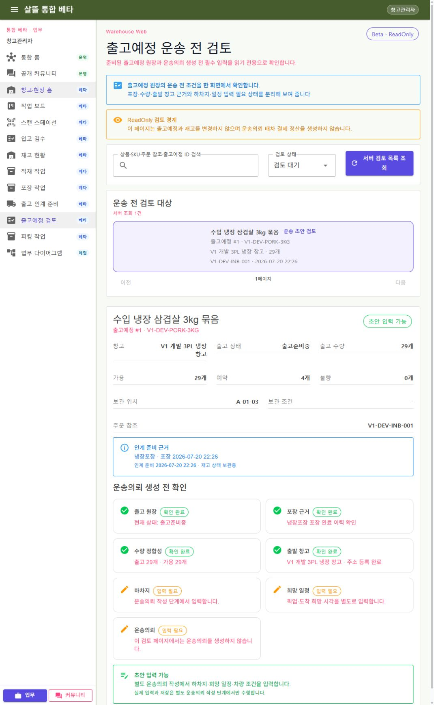

# 출고예정 원장의 운송 전 읽기 검토

## 변경

- WarehouseManagerApp과 통합 WebApp에 `/warehouse/general/outbound-plan-review` 페이지를 추가했다.
- 서버 목록, 정확한 `outboundPlanId` 상세, 페이지 선택 조정, host 인증·capability 책임을 분리했다.
- 창고 소유자 또는 배정 사용자 범위의 취소되지 않은 출고예정만 조회하며 기본 목록은 운송의뢰가 연결되지 않은 `출고준비중` 원장만 보여 준다.
- 출고 원장, 포장 완료 이력, 출고·가용 수량 일치, 활성 출발 창고와 주소 등록 상태를 준비 조건으로 계산한다.
- 후속 원장 투영으로 재고 현재 상태가 정규화돼도 포장 완료 이력과 유형을 잃지 않도록 이력 메모를 읽기 근거로 사용한다.
- 하차지, 희망 일정과 운송의뢰는 별도 작성 단계의 입력 필요 항목으로 표시한다.
- `Beta / ReadOnly` 경계에서 재고 예약·차감, 운송의뢰, 배차, 계약, 결제와 정산을 생성하거나 변경하지 않는다.

## 실제 확인

- `shipper1` 로그인
- 준비된 출고예정 `#1`의 정확한 상세 조회
- 출고 29개·가용 29개, 냉장포장 완료 이력, 활성 출발 창고와 주소 등록 완료 확인
- 하차지·희망 일정·운송의뢰의 `입력 필요` 상태 확인
- 생성·저장·예약·배차·결제 버튼이 없는 읽기 전용 화면 확인
- 테스트 서버 종료

## 화면

