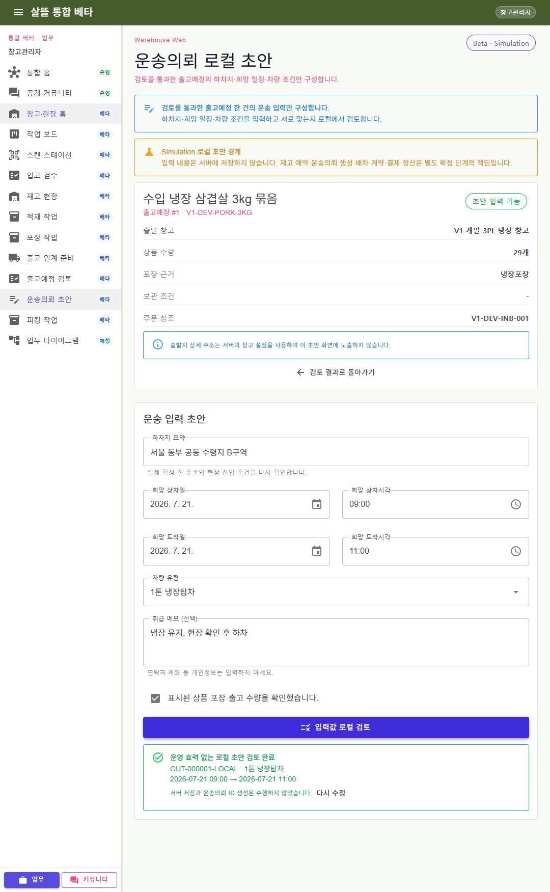

# 출고예정에서 이어지는 운송의뢰 로컬 초안

## 변경

- WarehouseManagerApp과 통합 WebApp에 `/warehouse/general/transport-request-draft` 페이지를 추가했다.
- 정확한 `outboundPlanId` 원장 조회, 운송 입력, 교차검증, host 인증·capability 책임을 분리했다.
- 출고예정 검토를 통과한 원장만 하차지 요약·희망 일정·차량 유형·취급 메모를 입력할 수 있다.
- 도착 일시가 상차 일시보다 뒤인지, 차량 유형이 지원 목록에 있는지, 상품·수량 확인이 완료됐는지 검증한다.
- 출발지 상세 주소를 화면에 노출하지 않고 취급 메모에 개인정보를 입력하지 않도록 안내한다.
- `Beta / Simulation` 경계에서 로컬 검토 결과만 만들고 서버 저장, 재고 예약·차감, 운송의뢰 ID 생성, 배차, 계약, 결제와 정산을 실행하지 않는다.

## 실제 확인

- `shipper1` 로그인 상태에서 출고예정 `#1`의 정확한 상세 조회
- 가상 하차지, 희망 상차·도착 일시, `1톤 냉장탑차`, 상품·수량 확인 입력
- `OUT-000001-LOCAL` 로컬 검토 결과 생성
- 서버 저장·운송 생성·확정·예약·배차·결제 버튼 없음 확인
- 테스트 서버 종료

## 화면

