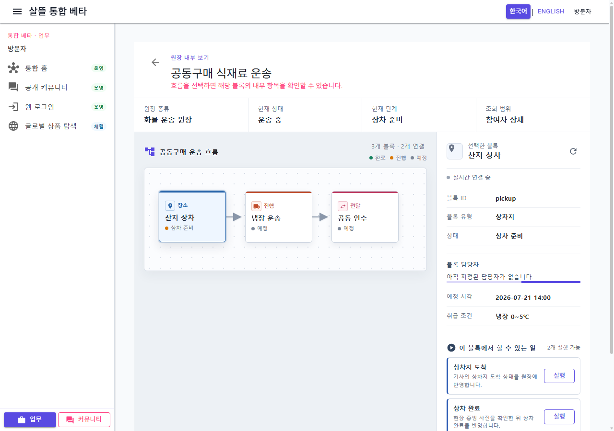

# 공동 원장 다이어그램 상세 단일책임 조립

## 변경 기록

| 변경 축 | 화면 변경 여부 | 책임 경계 |
| --- | --- | --- |
| 원장 상세 shell | 화면 유지 | 740줄에서 157줄로 축소하고 요약·권한 안내·하위 화면 조립만 담당 |
| 다이어그램 canvas | 화면 유지 | desktop SVG 흐름과 mobile 단계 목록, 노드 선택 event만 담당 |
| 블록 inspector | 화면 유지 | 선택 블록의 담당자·업체·공개 항목·허용 업무 표시를 담당 |
| presentation | 간접 확인 | 좌표 배치, 연결선, 상태·아이콘·담당자·외부 URL 표시 규칙을 순수 함수로 분리 |
| session ViewModel | 간접 확인 | 선택 블록, SignalR 원장 방 입장, revision 판정과 상위 재조회 요청을 담당 |
| scoped CSS | 화면 유지 | shell·canvas·inspector가 자기 markup의 반응형 스타일만 소유 |

## 조립 구조

```text
CommunityLedgerDiagramDetail (157줄)
├─ CommunityLedgerDiagramDetailViewModel
│  ├─ 선택 블록 상태
│  ├─ 실시간 원장 session
│  └─ revision 기반 재조회 요청
├─ CommunityLedgerDiagramCanvas
│  └─ CommunityLedgerDiagramPresentation
└─ CommunityLedgerBlockInspector
   ├─ 담당자·업체·공개 항목
   ├─ CommunityLedgerBlockAssignmentPanel
   └─ CommunityLedgerNodeActionPanel
```

## 유지·보강한 동작

- 새 원장을 열면 첫 블록을 선택하고 같은 원장의 새 Context에서는 사용자가 선택한 블록을 유지한다.
- 현재 revision보다 새로운 실시간 변경만 상위 원장 재조회를 요청한다.
- component dispose 때 실시간 event를 해제하고 입장한 방 연결을 종료한다.
- canvas의 node 선택은 inspector를 같은 Context에서 즉시 전환한다.
- node의 `aria-pressed`를 빈 boolean attribute가 아닌 명시적인 `true`·`false` 값으로 제공한다.
- 증빙 업로드와 상태 Command는 이전 분리 단계의 독립 업무 패널 경계를 그대로 유지한다.

## 화면

### 데스크톱 원장 흐름과 inspector



### 모바일 390px 블록 업무


캡처는 clean worktree의 검증 전용 sample 원장을 실제 WebApp에서 렌더링한 결과다. 외부 Command는 실행하지 않았고 실제 개인정보·주소·운송 식별자·증빙은 포함하지 않았다.

## 검증

- clean worktree `Ssalddel.Ui.Common` build 경고 0개·오류 0개
- clean worktree 검증용 `Ssalddel.WebApp` build 경고 0개·오류 0개
- presentation·session·업무 실행·조립 경계 테스트 18개 통과
- `산지 상차 → 냉장 운송` 선택 시 inspector 제목과 빈 업무 상태 전환 확인
- 선택 node `aria-pressed="true"`, Blazor error UI `display:none` 확인
- 1280×900 desktop 및 390×844 mobile 렌더링 확인
- mobile `innerWidth=390`, `scrollWidth=390`으로 가로 넘침 없음
