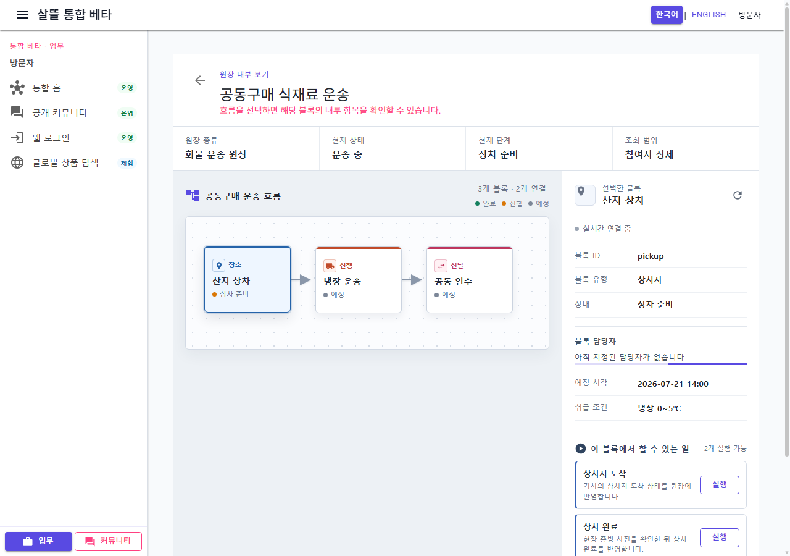
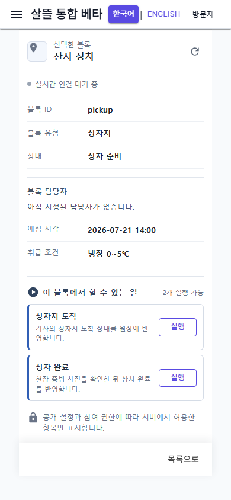

# 공동 원장 블록 업무 실행 책임 분리

## 변경 기록

| 변경 축 | 화면 변경 여부 | 책임 경계 |
| --- | --- | --- |
| 원장 다이어그램 상세 | 화면 유지 | 선택 블록과 원장 흐름을 조립하고 증빙·Command 실행 구현은 소유하지 않음 |
| 블록 업무 컴포넌트 | 화면 유지 | 실행 가능 업무, 확인 UI, 증빙 선택, 실행 결과 표시를 담당 |
| 블록 업무 ViewModel | 간접 확인 | 증빙 검증, 실행 가능 상태, 업로드·Command 순서, 성공·실패 상태를 담당 |
| 실행 service 계약 | 화면 없음 | ViewModel이 HTTP 구현이 아니라 업무 실행 interface에 의존하도록 분리 |
| CSS | 화면 유지 | 블록 업무 스타일을 해당 컴포넌트의 scoped CSS로 이동 |

## 실행 경계

```text
CommunityLedgerDiagramDetail
└─ CommunityLedgerNodeActionPanel
   └─ CommunityLedgerNodeActionViewModel
      └─ ICommunityLedgerNodeActionService
         ├─ 증빙 업로드
         └─ 허용된 운송 상태 Command
```

- 사진 필수 업무는 8MB 이하 이미지와 현장 확인이 모두 있어야 실행할 수 있다.
- 성공한 Command 뒤에만 상위 원장의 재조회를 요청한다.
- 실패 메시지는 해당 업무 패널에 남기고 선택한 업무를 유지해 사용자가 다시 판단할 수 있게 한다.
- 이 commit은 917줄 원장 상세 중 외부 효과가 있는 블록 업무 실행 책임을 먼저 분리한 단계다. 다이어그램 표시·inspector·실시간 session 분리는 다음 단계로 남긴다.

## 화면

### 데스크톱 원장 상세



### 모바일 390px 업무 패널



캡처는 clean worktree의 검증 전용 sample 원장을 실제 WebApp에서 렌더링한 결과다. 외부 API를 실행하지 않았고 실제 개인정보·주소·운송 식별자·증빙은 포함하지 않았다.

## 검증

- clean worktree에서 `Ssalddel.Ui.Common` build 경고 0개·오류 0개
- 증빙 정책, 성공·실패 상태, 조립 경계를 확인하는 테스트 6개 통과
- 검증 전용 WebApp route build 경고 0개·오류 0개
- 실제 DOM에서 2개 업무와 `상차 완료` 표시 확인
- 1280×900 desktop 및 390×844 mobile 렌더링 확인
- mobile `innerWidth=390`, `scrollWidth=390`으로 가로 넘침 없음
