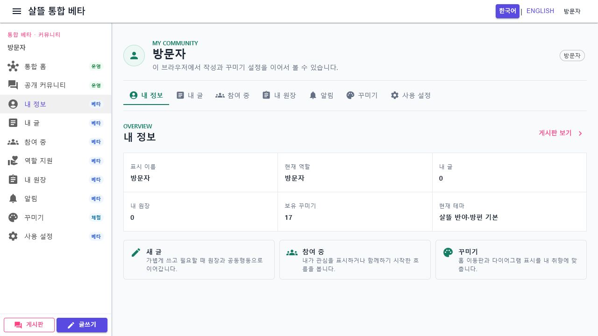
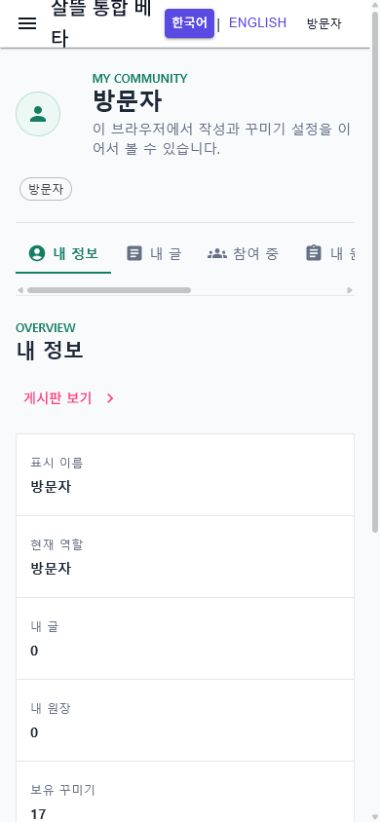

# 개인 커뮤니티 페이지 단일책임 분리

## 변경 기록

| 변경 축 | 화면 변경 여부 | 책임 경계 |
| --- | --- | --- |
| 라우트 페이지 | 화면 유지 | 576줄 다중 책임 페이지를 140줄 이하의 route 해석·하위 화면 조립 셸로 축소 |
| 활동 ViewModel | 화면 유지 | 인증 상태, 내 글과 참여 원장 조회·표시를 담당 |
| 알림 설정 ViewModel | 화면 유지 | 알림 설정 조회·저장·초기화를 담당 |
| 꾸미기 ViewModel | 화면 유지 | 꾸미기 보유·적용·구매와 서버 상태 복원을 담당 |
| section 컴포넌트 | 화면 유지 | 개요·글·참여·원장·알림·꾸미기·설정을 각자 한 화면 책임으로 분리 |
| presentation·route model | 간접 확인 | 날짜·상품 표시와 route 해석을 UI markup 및 service 호출에서 분리 |

## 조립 구조

```text
CommunityPersonalPage route shell
├─ CommunityPersonalPageViewModel
│  ├─ CommunityPersonalActivityViewModel
│  ├─ CommunityPersonalPreferencesViewModel
│  └─ CommunityPersonalDecorationsViewModel
├─ 개요
├─ 내 글
├─ 참여
├─ 원장
├─ 알림
├─ 꾸미기
└─ 설정
```

## 유지한 동작 경계

- `/community/me`, `/community/personal/{section}`, `/community/decorations` route와 탭 이동을 유지한다.
- 인증 상태에 따라 내 글·참여 원장과 개인 설정을 조회한다.
- 알림 설정의 저장·초기화와 꾸미기 보유·적용·구매 흐름을 기존 service 계약으로 유지한다.
- route 컴포넌트는 service와 store를 직접 호출하지 않고 하위 책임을 조립한다.

## 화면

### 데스크톱 개요



### 모바일 390px 개요



캡처는 격리된 clean worktree에서 실행한 WebApp의 실제 `/community/me` 화면이다. 익명 방문자 sample 상태만 사용했고 개인정보는 포함하지 않았다.

## 검증

- 격리 worktree에서 `dotnet build Ssalddel.WebApp/Ssalddel.WebApp.csproj --no-restore -p:WasmEnableWebcil=false` 경고 0개·오류 0개
- route 해석과 조립 책임 회귀 테스트 18개 통과
- `/community/me`, `/community/me/posts`, `/community/me/notifications`, `/community/decorations` 실제 브라우저 렌더링 확인
- 데스크톱과 390px 모바일 화면 확인, 브라우저 console 오류 없음
- 현재 주 작업 트리 전체 build는 이번 변경과 무관한 기존 `OrdererFoodOrderWorkspace.razor`의 `EventCallback` compile 오류 때문에 별도로 통과하지 못함
