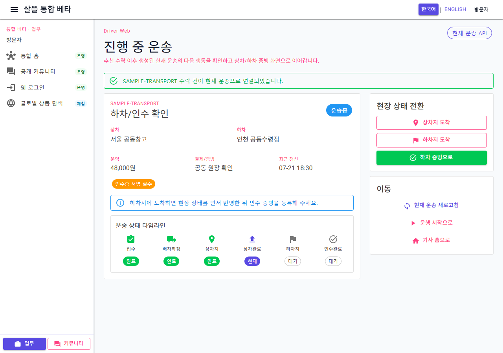
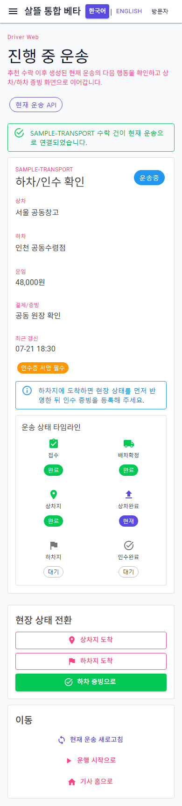

# 기사 현재 운송 페이지 단일책임 분리

## 변경 기록

| 변경 축 | 화면 변경 여부 | 책임 경계 |
| --- | --- | --- |
| 현재 운송 route shell | 화면 유지 | 541줄에서 74줄로 축소하고 query 문맥·알림·하위 화면 조립만 담당 |
| 조회 ViewModel | 간접 확인 | 현재 운송 조회, 수락 직후 재조회와 화면 피드백을 담당 |
| 현장 행동 ViewModel | 간접 확인 | 수동 재조회와 상차지·하차지 도착 Command를 담당 |
| 갱신 session | 간접 확인 | 15초 polling과 원장 event 구독·해제 수명을 담당 |
| 운송 개요 | 화면 유지 | 운송번호·상하차지·운임·증빙 조건·예외 안내를 표시 |
| 상태 타임라인 | 화면 유지 | 운송 상태를 여섯 단계의 완료·현재·대기로 표시 |
| 현장 상태 전환 | 화면 유지 | 상차지·하차지 도착 Command와 현재 단계의 증빙 화면 이동을 담당 |
| 보조 이동 | 화면 유지 | 현재 운송 재조회와 운행 시작·기사 홈 이동을 담당 |
| presentation | 간접 확인 | 상태 단계·색상·다음 증빙·금액 표시 규칙을 순수 함수로 분리 |

## 조립 구조

```text
DriverCurrentTransportPage (74줄 route shell)
├─ DriverCurrentTransportPageViewModel
│  ├─ 현재 운송 조회와 추천 수락 건 자동 재조회
│  ├─ DriverCurrentTransportActionsViewModel
│  │  └─ 수동 재조회와 현장 상태 Command
│  └─ DriverCurrentTransportRefreshSession
│     └─ 원장 event + 15초 polling 동기화
├─ DriverCurrentTransportOverview
│  └─ DriverCurrentTransportTimeline
├─ DriverCurrentTransportStatusActions
├─ DriverCurrentTransportNavigation
└─ DriverCurrentTransportEmptyState
```

## 유지·보강한 동작

- `/driver/transports/current?acceptedRequestId=...` 문맥과 수락 건 자동 재조회 흐름을 유지한다.
- 상차지·하차지 도착은 기존 `기사운송증빙Service`를 통해 서버 Command를 실행한 뒤 현재 운송을 다시 조회한다.
- 원장 변경·새로고침 event와 15초 polling은 route markup이 아닌 ViewModel 수명 안에서 시작하고 dispose 때 해제한다.
- 동시에 들어오는 갱신은 한 번씩 직렬화하고 자동 갱신 실패는 화면 피드백으로 격리한다.
- 상태 표시 규칙과 다음 상차·하차 증빙 route를 API workflow에서 분리한다.

## 화면

### 데스크톱 현재 운송



### 모바일 390px 현재 운송



캡처는 clean worktree의 검증 전용 sample 운송을 분리된 실제 WebApp 컴포넌트로 렌더링한 결과다. 외부 Command는 실행하지 않았고 실제 개인정보·주소·운송 식별자·증빙은 포함하지 않았다.

## 검증

- clean worktree `Ssalddel.WebApp` build 경고 0개·오류 0개
- 수락 직후 자동 재조회, 상차·하차 상태 전환, 원장 event 구독 해제, presentation과 조립 경계 테스트 19개 통과
- 실제 DOM에서 sample 운송, 다음 하차 증빙, 여섯 단계 타임라인 표시 확인
- 실제 `/driver/transports/current` route에서 ViewModel DI 생성과 비로그인 빈 상태·인증 안내를 확인하고 Blazor 오류 없음
- 1280×900 desktop 및 390×844 mobile 렌더링 확인
- mobile `innerWidth=390`, `scrollWidth=390`으로 가로 넘침 없음
- Blazor error UI `display:none` 확인
- 현재 주 작업 트리 전체 build는 이번 변경과 무관한 기존 `OrdererFoodOrderWorkspace.razor`의 `EventCallback` compile 오류 때문에 별도로 통과하지 못함
