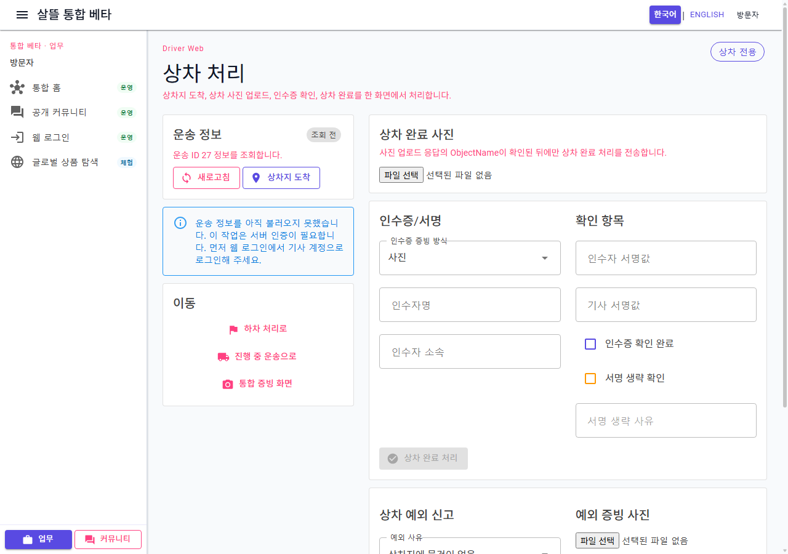
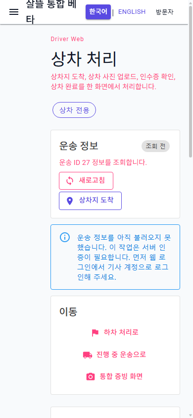

# 기사 상차 처리 페이지 단일책임 분리

## 변경 기록

| 변경 축 | 화면 변경 여부 | 책임 경계 |
| --- | --- | --- |
| 상차 route shell | 화면 유지 | 436줄에서 67줄로 축소하고 route 문맥·상태 알림·하위 화면 조립만 담당 |
| 상차 페이지 ViewModel | 간접 확인 | 운송 조회, 상차지 도착, 상차 완료, 상차 예외와 실행 상태를 조율 |
| 운송 요약 | 화면 유지 | 운송 ID·조회 상태와 새로고침·상차지 도착 event만 표시 |
| 이동 안내 | 화면 유지 | 하차 처리·진행 중 운송·통합 증빙 route만 구성 |
| 상차 사진 | 화면 유지 | 파일 읽기·미리보기·업로드와 성공한 `ObjectName` 보관을 담당 |
| 인수증 | 화면 유지 | 증빙 방식·인수자·서명·서명 생략 확인과 완료 event를 담당 |
| 예외 신고 | 화면 유지 | 상차 전용 사유·현장 메모·관리자 확인·선택 증빙 입력을 담당 |

## 조립 구조

```text
DriverTransportPickupPage (67줄 route shell)
├─ DriverTransportPickupPageViewModel
│  ├─ DriverPickupProofViewModel
│  ├─ DriverTransportIssueViewModel (상차 전용 사유)
│  └─ DriverTransportPickupOperations
├─ DriverTransportPickupSummaryPanel
├─ DriverTransportPickupNavigation
├─ DriverPickupProofPhotoEditor
├─ DriverPickupReceiptEditor
└─ DriverTransportIssueEditor
```

통합 증빙 화면과 상차 전용 화면은 `DriverPickupProofPhotoEditor`, `DriverPickupReceiptEditor`, `DriverTransportIssueEditor`를 함께 사용한다. 상차 화면만의 입력 순서와 제목은 parameter로 조립해 표시 책임을 중복 구현하지 않는다.

## 유지·보강한 동작

- `/driver/transports/{transportId}/pickup`의 route ID로 운송을 조회하고, 인증되지 않은 사용자는 기사 로그인 필요 안내를 받는다.
- route ID가 바뀌면 이전 운송의 상차 사진 업로드 결과, 인수증과 예외 입력을 모두 초기화해 다른 운송에 재사용하지 않는다.
- 상차 사진 업로드 성공 응답의 `ObjectName`이 준비되기 전에는 상차 완료 Command를 전송할 수 없다.
- 상차 완료는 현재 route ID와 인수증 입력을 기존 service 계약으로 전달하고, 인수증·서명 조건의 최종 판정은 기존 서버 정책에 맡긴다.
- 예외 신고는 상차물건없음·수량불일치·상차담당자부재·화물훼손·사진재촬영필요만 제공하고 모든 신고를 `상차` 단계 payload로 만든다.
- 상태 변경 성공 뒤 운송 재조회가 실패해도 성공 결과를 실패로 덮어쓰지 않는다.
- 실행 중에는 중복 조회·상태 변경·완료·예외 신고를 막고 완료 조건에 맞춰 버튼을 비활성화한다.

## 화면

### 데스크톱 1280×900



### 모바일 390×844



캡처는 clean worktree의 실제 `/driver/transports/27/pickup` route를 렌더링한 결과다. 검증용 ID만 사용했고 외부 조회·업로드·상태 Command는 실행하지 않았으며 실제 개인정보·주소·운송 식별자·증빙은 포함하지 않았다.

## 검증

- clean worktree `Ssalddel.WebApp` build 경고 0개·오류 0개
- 상차 route 조립, route 전환 초기화, 완료·예외 payload와 공유 통합 증빙 회귀 테스트 27개 통과
- 실제 route에서 운송 ID `27`, 인증 필요 안내, 운송 요약·이동·상차 사진·인수증·상차 예외 입력 표시 확인
- 1280×900 desktop 및 390×844 mobile 실제 렌더링 확인
- mobile `innerWidth=390`, `clientWidth=380`, `scrollWidth=380`으로 문서 가로 넘침 없음
- desktop·mobile 모두 Blazor error UI 비노출 확인
- 현재 주 작업 트리 전체 build는 이번 변경과 무관한 기존 `OrdererFoodOrderWorkspace.razor`의 `EventCallback` compile 오류 때문에 별도로 통과하지 못함
