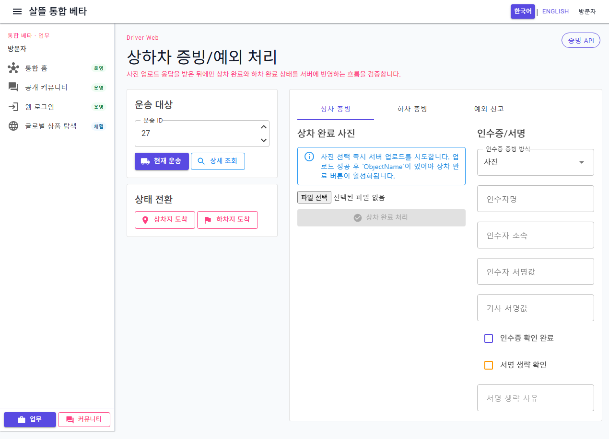
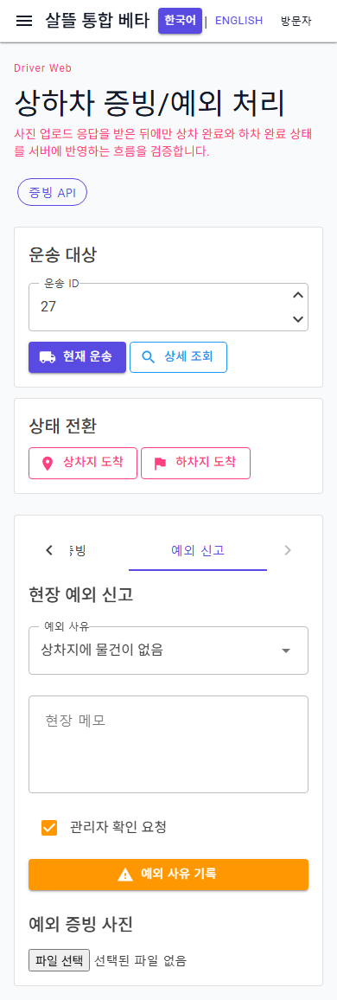

# 기사 통합 운송 증빙 페이지 단일책임 분리

## 변경 기록

| 변경 축 | 화면 변경 여부 | 책임 경계 |
| --- | --- | --- |
| 통합 증빙 route shell | 화면 유지 | 518줄에서 59줄로 축소하고 query 문맥·상태 알림·하위 화면 조립만 담당 |
| 대상 ViewModel | 간접 확인 | 운송 ID, 현재·상세 조회, 상하차지 도착과 공통 실행 상태를 담당 |
| 상차 증빙 ViewModel | 간접 확인 | 상차 사진 업로드, 인수증 입력 조립과 상차 완료 Command를 담당 |
| 하차 증빙 ViewModel | 간접 확인 | 하차 사진 업로드와 하차 완료 Command를 담당 |
| 예외 ViewModel | 간접 확인 | 예외 사유·메모·관리자 확인·선택 증빙을 신고 payload로 조립 |
| 이미지 reader | 간접 확인 | 브라우저 파일의 5MB 제한 읽기, content type 보정과 preview 생성을 담당 |
| 입력 컴포넌트 | 화면 유지 | 운송 대상·상태 전환·상차·하차·예외 입력을 각자 표시하고 사용자 event만 전달 |

## 조립 구조

```text
DriverTransportProofPage (59줄 route shell)
├─ DriverTransportProofPageViewModel
│  ├─ DriverPickupProofViewModel
│  ├─ DriverDropoffProofViewModel
│  └─ DriverTransportIssueViewModel
├─ DriverTransportProofTargetPanel
├─ DriverTransportProofStatePanel
└─ MudTabs
   ├─ DriverPickupProofEditor
   ├─ DriverDropoffProofEditor
   └─ DriverTransportIssueEditor
```

## 유지·보강한 동작

- `/driver/transport/proof?transportId=...` 문맥과 현재 운송·상세 조회를 유지한다.
- 사진 업로드 성공 응답의 `ObjectName`이 있어야 상차·하차 완료 Command를 실행한다.
- 상차 완료는 인수증 방식·인수자·기사 서명·서명 생략 사유를 기존 service 계약으로 전달한다.
- 예외 신고는 사용자가 선택한 단계·사유·메모·관리자 확인과 선택한 증빙만 payload로 조립한다.
- 운송 ID가 바뀌면 이전 운송의 사진 업로드 결과와 인수증·예외 입력을 초기화해 다른 운송에 재사용하지 않는다.
- 새 사진 업로드가 실패하면 이전 성공 증빙을 완료 Command에 재사용하지 않는다.
- 상태 Command가 성공한 뒤 상세 재조회만 실패한 경우 성공 상태 메시지를 유지한다.

## 화면

### 데스크톱 상차 증빙



### 모바일 390px 예외 신고



캡처는 clean worktree의 실제 `/driver/transport/proof?transportId=27` route를 렌더링한 결과다. 검증용 ID만 입력했고 외부 조회·업로드·상태 Command는 실행하지 않았으며 실제 개인정보·주소·운송 식별자·증빙은 포함하지 않았다.

## 검증

- clean worktree `Ssalddel.WebApp` build 경고 0개·오류 0개
- 운송 조회, 증빙 초기화, 상하차 완료, 예외 payload, 재업로드 실패와 조립 경계 테스트 17개 통과
- 실제 route에서 query 운송 ID `27`, 상차 입력과 예외 입력 표시 확인
- 1280×900 desktop 및 390×844 mobile 렌더링 확인
- mobile `innerWidth=390`, `scrollWidth=390`으로 가로 넘침 없음
- Blazor error UI `display:none` 확인
- 현재 주 작업 트리 전체 build는 이번 변경과 무관한 기존 `OrdererFoodOrderWorkspace.razor`의 `EventCallback` compile 오류 때문에 별도로 통과하지 못함
