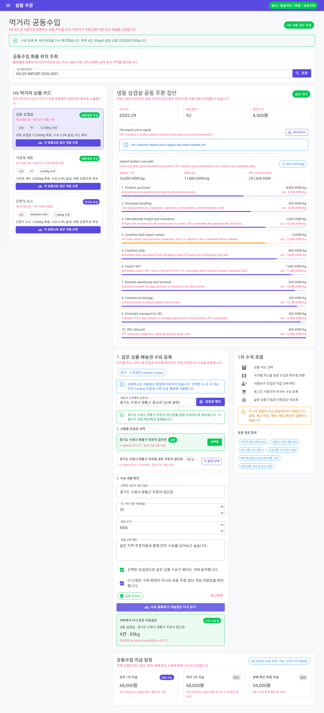
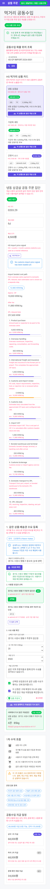

# 국가별 배송권을 잇는 공동주문 수요 원장

## 변경 기록

| 변경 축 | 화면 변경 여부 | 시각 증거 |
| --- | --- | --- |
| 국가별 모집권 해석 | 화면 변경 | 한국은 도로명주소·Naver·Kakao 행정구역을, 미국은 Census geography를 공통 모집권 후보로 바꾸고 사용자가 최종 범위를 직접 선택 |
| 공동주문 수요 등록 | 화면 변경 | 로그인 사용자만 선택한 상품·모집권·수량·희망 단가와 두 가지 동의를 수요 원장에 등록 |
| 자동집단 재조회 | 화면 변경 | 등록 직후 같은 상품·모집권의 자동집단을 서버에서 다시 읽어 인원·수량·상태를 표시 |
| 운영 효과 분리 | 화면 변경 | 결제, 재고 차감, 배차, 배송 확정은 이 1차 흐름에서 실행되지 않음을 입력부와 결과 옆에 명시 |

## 1차 수직 흐름

1. 현재 운영 국가를 읽는다.
2. 사용자가 배송지 주소를 입력하고 공개 모집권 후보를 확인한다.
3. 상세주소를 버리고 행정구역 기반 모집권 Key와 표시명만 선택한다.
4. 로그인과 명시적 동의 뒤 상품·모집권 수요를 등록한다.
5. 등록 응답만 믿지 않고 같은 상품·모집권 자동집단을 서버에서 다시 조회한다.

## 동작 경계

- 한국 모집권은 시·군·구를 기본 권장 범위로 사용하고 읍·면·동 후보를 함께 제공한다. 주소 공급자를 사용할 수 없을 때도 상세 번지 없이 행정구역 구조만 추출하는 제한적 fallback을 둔다.
- 미국 모집권은 기존 Census geography 기반 배송권 해석기를 같은 공통 contract로 사용한다.
- 상세주소, 계좌, 결제 식별자와 실제 배송 확정 정보는 공동수요 원장에 저장하지 않는다.
- 공동구매 workflow의 기존 기능 flag와 `Simulation`/`Operational` 경계를 유지한다.
- 이번 범위는 수요 집계까지이며 결제, 재고 예약, 운송 배차와 배송 실행은 후속 단계다.

## 화면

### 데스크톱

### 모바일 390px

캡처는 실제 `GroupPurchaseIntent` source를 연결한 격리 Blazor 검증 호스트에서 수행했다. 가짜 검증 계정과 sample adapter만 사용했고 주소 상세는 생략했으며 실제 개인정보·결제·배송 정보는 포함하지 않았다.

## 검증

- `Ssalddel.Contracts`, `Ssalddel`, Windows 대상 `OrdererApp` build 경고 0개·오류 0개
- 한국·미국 모집권 해석, 국가별 DI 등록, API workflow metadata 집중 테스트 59개 통과
- 주소 입력 → 모집권 확인 → 범위 동의 → 로그인 → 수요 등록 → 서버 자동집단 재조회 E2E 흐름 통과
- 데스크톱·390px 모바일 모두 가로 넘침 없음
- browser console 오류, page exception, HTTP 4xx/5xx 응답, browser error log 모두 0건
