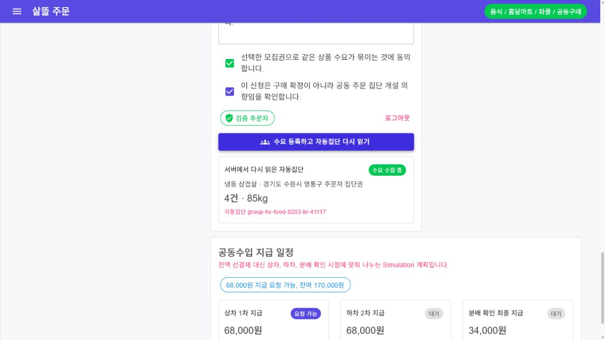
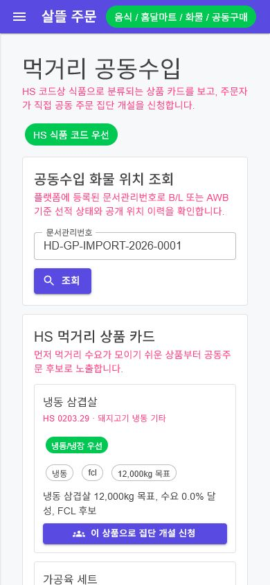

# 공동주문 페이지 단일책임 분리

## 변경 기록

| 변경 축 | 화면 변경 여부 | 책임 경계 |
| --- | --- | --- |
| 라우트 페이지 | 간접 화면 변경 | 1,158줄에서 61줄로 축소하고 제목과 하위 업무 컴포넌트 조립만 담당 |
| 페이지 ViewModel | 간접 화면 변경 | 선택 상품과 여러 하위 화면이 공유하는 의향 수량·희망 단가만 관리 |
| 선적 조회 | 화면 유지 | 문서관리번호 입력, 공개 선적 조회 상태와 이력 표시를 독립 컴포넌트가 담당 |
| 상품·원가 | 문구 정돈 | 상품 목록 선택과 HS 수입 단가·도착원가 분석을 서로 다른 컴포넌트로 분리 |
| 배송권 수요 | 화면 유지 | 운영 국가, 모집권 해석, 동의, 로그인, 수요 등록과 자동집단 재조회만 한 수직 흐름으로 관리 |
| 지급 표시 | 문구 정돈 | 지급 일정 계산·표시를 별도 컴포넌트로 옮기고 `Simulation` 계획임을 명시 |

## 조립 구조

```text
GroupPurchaseIntent 페이지
├─ GroupPurchaseIntentPageViewModel
│  ├─ 선택 상품
│  ├─ 의향 수량
│  └─ 희망 단가
├─ 선적 위치 조회
├─ HS 상품 목록
├─ 수입 단가·도착원가 분석
└─ 배송권 공동수요
   ├─ 모집권 확인·선택
   ├─ 로그인·동의·수요 등록
   ├─ 자동집단 서버 재조회
   ├─ 1차 흐름·운영 검토 표시
   └─ Simulation 지급 일정 표시
```

## 유지한 동작 경계

- 상품 전환 시 상품명, 기본 의향 수량과 희망 단가가 함께 바뀐다.
- 상세주소는 수요 원장에 저장하지 않고 선택한 공개 모집권 Key만 사용한다.
- 수요 등록 뒤 같은 상품·배송권 자동집단을 서버에서 다시 읽는다.
- 결제, 재고 차감, 배차와 배송 확정은 실행하지 않는다.
- 공동구매의 기존 기능 flag와 `Simulation`/`Operational` 경계를 변경하지 않는다.

## 화면

### 자동집단 재조회 결과



### 모바일 390px 최초 진입



캡처는 실제 분리된 `OrdererApp` source를 연결한 격리 Blazor 검증 호스트에서 수행했다. 가짜 검증 계정과 sample adapter만 사용했고 실제 개인정보·상세주소·결제·배송 정보는 포함하지 않았다.

## 검증

- Windows 대상 `OrdererApp` build 경고 0개·오류 0개
- 라우트 페이지가 API service를 직접 소유하지 않는 구조 회귀 테스트 7개 통과
- 상품 전환 시 기본값 `20kg·8,500원 → 5kg·7,200원` 연동 확인
- 주소 입력 → 모집권 선택 → 동의 → 로그인 → 수요 등록 → 자동집단 서버 재조회 E2E 통과
- 데스크톱과 390px 모바일에서 가로 넘침 없음
