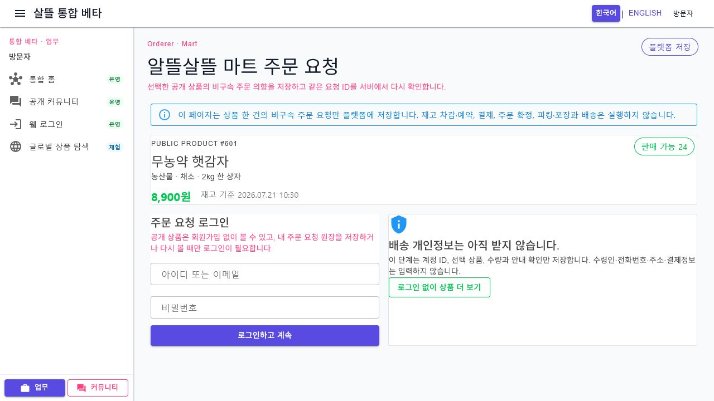
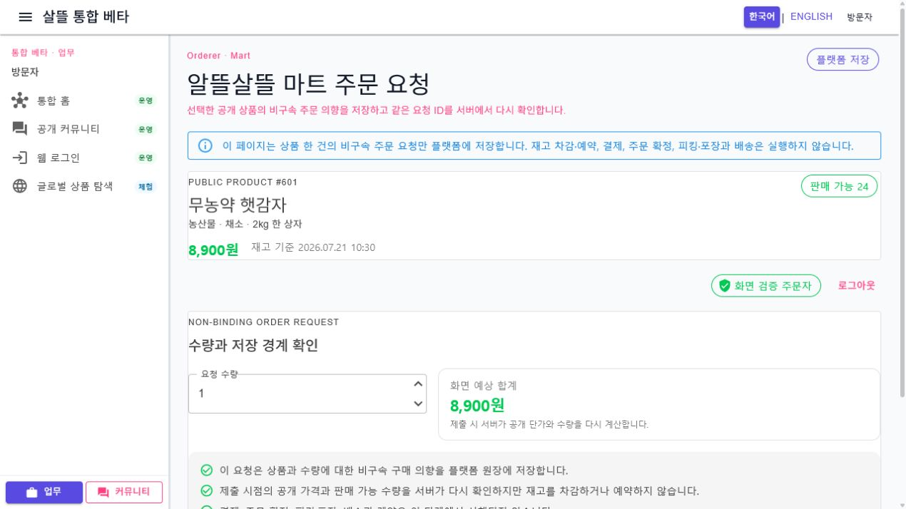
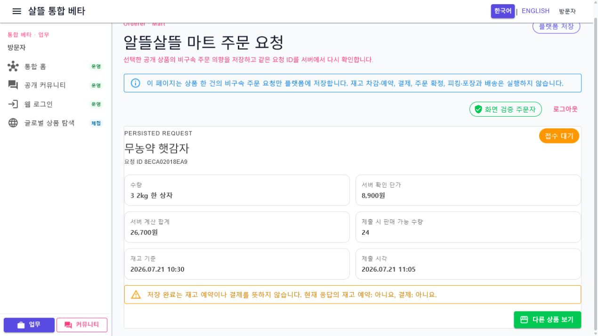

# 주문자 마트 주문 요청 단일책임 분리

## 변경 기록

| 변경 축 | 화면 변경 여부 | 책임 경계 |
| --- | --- | --- |
| 주문 요청 조립 shell | 구조 정돈 | 260줄 화면을 54줄 shell로 줄이고 접근·선택·상품·인증·저장 영수증·작성 책임만 조립 |
| 기능 접근 상태 | 화면 유지 | 기능 확인 전·비활성·오류·재시도를 전용 component로 분리 |
| 정확한 상품 상태 | 화면 유지 | 주소의 `productId` 한 건만 조회하고 loading·not-found·error·retry를 담당 |
| 주문자 인증 | 구조 정돈 | 세션 복원, 로그인·로그아웃과 배송 개인정보 비수집 안내를 독립 영역으로 분리 |
| 비구속 요청 작성 | 구조 정돈 | 수량, 화면 예상 합계, 네 가지 실행 경계 확인과 저장 action만 담당 |
| 저장 영수증 | 구조 정돈 | 저장 뒤 주소의 정확한 `requestId`를 재조회해 서버 확인 단가·합계·재고 기준·실행되지 않은 효과를 표시 |
| 표현 규칙 | 간접 확인 | 예상 합계, 짧은 ID, 날짜, 빈 값과 오류 메시지를 `OrdererMartOrderRequestPresentation`으로 분리 |
| 반응형 스타일 | 구조 정돈 | 각 component의 scoped CSS로 옮기고 720px 이하 로그인·입력·영수증 단일 열을 고정 |

## 조립 구조

```text
OrdererMartOrderRequestWorkspace (54줄 shell)
├─ OrdererMartOrderRequestAccessState
├─ OrdererMartOrderSelectionPrompt
├─ OrdererMartOrderProductPanel
├─ OrdererMartOrderAuthenticationPanel
├─ OrdererMartOrderRequestForm
├─ OrdererMartOrderRequestDetailPanel
└─ OrdererMartOrderRequestPresentation
```

기존 `마트주문작성PageViewModel`은 기능 접근, 주문자 인증, 공개 상품, 작성과 저장 영수증 ViewModel의 수명을 계속 조립한다. 하위 화면은 전달받은 상태와 event만 표현하며 API 호출, 인증 저장소 또는 영속 상태 확정을 새로 소유하지 않는다.

## 유지한 제품 경계

- 상품이나 요청 ID가 없을 때 첫 상품, 최근 요청 또는 샘플을 자동 선택하지 않는다.
- 주소의 `productId`와 저장 응답의 `requestId` 한 건만 조회하며, 찾지 못한 ID를 다른 원장으로 대체하지 않는다.
- 제출 전에는 사용자가 비구속 주문 안내를 명시적으로 확인해야 하며, 서버가 공개 단가와 판매 가능 수량을 다시 검증한다.
- 실패한 제출은 같은 `클라이언트요청Id`로 재시도하고, 새 요청을 준비할 때만 새 멱등 ID를 발급한다.
- 저장은 구매 의향 원장만 만들며 재고 차감·예약, 결제, 주문 확정, 피킹·포장, 배송과 계약을 실행하지 않는다.
- 수령인, 전화번호, 주소와 결제정보를 이 페이지에서 수집하지 않는다.

## 화면

로그인 전에는 선택한 공개 상품과 함께, 원장 저장에 로그인이 필요한 이유와 배송 개인정보를 아직 받지 않는 경계를 표시한다.



로그인 뒤에는 수량·화면 예상 합계·비구속 안내 확인과 저장 action을 한 영역에서 제공한다.



저장 뒤에는 URL의 동일한 요청 ID를 다시 조회해 서버 확인 금액과 재고 기준을 보여 주고, 저장 완료가 재고 예약이나 결제를 뜻하지 않음을 명시한다.



캡처는 격리된 검증 host의 비식별 샘플 데이터로 만들었고 검증용 service 등록은 제거했다. 현재 브라우저 제어 surface가 390px viewport 전환을 허용하지 않아 mobile PNG는 만들지 못했다. 대신 720px 반응형 단일 열 규칙을 구조 테스트로 고정했다.

## 검증

- clean 격리 worktree `Ssalddel.Ui.Common` build 경고 0개·오류 0개
- clean 격리 worktree `Ssalddel.WebApp` build 경고 0개·오류 0개
- clean 격리 worktree `OrdererApp` Windows build 경고 0개·오류 0개
- 주문 요청 조립·반응형 구조와 관련 ViewModel 테스트 38개 통과
- 실패 뒤 같은 멱등 ID 재시도, 안내 미확인 제출 차단, 없는 요청 ID 무대체 동작을 자동 테스트로 확인
- desktop 1280×720 실제 렌더링에서 로그인 → 수량 3개·예상 합계 26,700원 → 저장 → URL의 동일 요청 ID 영수증 재조회 확인
- 브라우저 console 오류 0개
