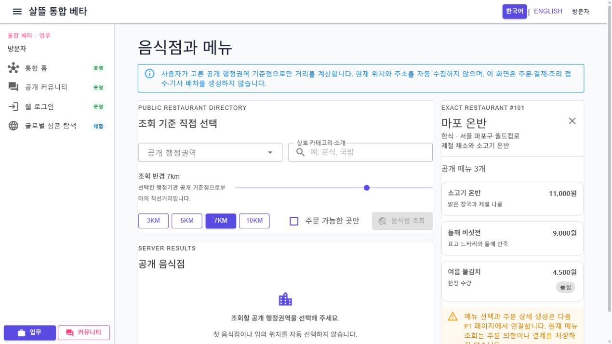
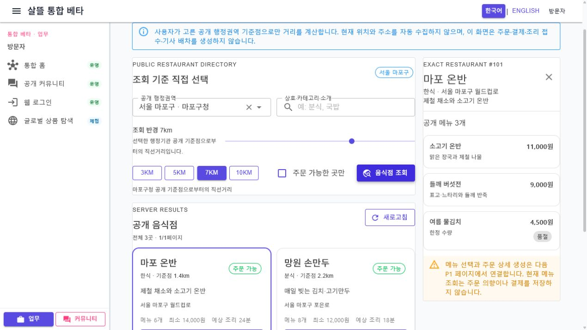

# 주문자 음식점 탐색 단일책임 분리

## 변경 기록

| 변경 축 | 화면 변경 여부 | 책임 경계 |
| --- | --- | --- |
| 음식점 탐색 조립 shell | 구조 정돈 | 303줄 화면을 35줄 shell로 줄이고 기능 접근, 검색 기준, 결과 목록, 정확한 상세만 조립 |
| 기능 접근 상태 | 화면 유지 | 기능 확인 전·비활성·오류·재시도를 전용 component로 분리 |
| 공개 탐색 조건 | 화면 유지 | 행정권역, 공개 기준점 반경, 검색어, 주문 가능 필터와 조회 action만 담당 |
| 공개 결과 목록 | 화면 유지 | loading·empty·error·retry, 카드 목록과 paging만 담당 |
| 정확한 음식점 상세 | 화면 유지 | 요청한 `restaurantId` 한 건과 공개 메뉴, not-found·retry·선택 해제만 담당 |
| 표현 규칙 | 간접 확인 | 거리, 빈 값, 오류 메시지 표현을 `OrdererRestaurantPresentation`으로 분리 |
| 반응형 스타일 | 구조 정돈 | 각 component의 scoped CSS로 옮기고 1,000px 이하 단일 열, 700px 이하 입력·카드·메뉴 단일 열을 고정 |

## 조립 구조

```text
OrdererRestaurantWorkspace (35줄 shell)
├─ OrdererRestaurantAccessState
├─ OrdererRestaurantSearchPanel
├─ OrdererRestaurantResultList
├─ OrdererRestaurantDetailPanel
└─ OrdererRestaurantPresentation
```

기존 `음식점탐색PageViewModel`은 접근, 탐색 기준, 목록, 상세 ViewModel의 수명을 계속 조립한다. 하위 화면은 전달받은 상태와 event만 표현하며 API 호출이나 영속 상태 확정을 새로 소유하지 않는다.

## 유지한 제품 경계

- 공개 행정권역을 사용자가 직접 고르기 전에는 첫 권역이나 음식점을 자동 선택하지 않는다.
- 주소의 `restaurantId`와 목록에서 선택한 정확한 ID만 조회하며, 누락된 상세를 다른 음식점이나 샘플로 대체하지 않는다.
- `FoodDeliveryWorkflow`가 비활성인 환경에서는 음식점·메뉴 원장을 조회하지 않는다.
- 이 화면은 공개 정보만 읽으며 주문 의향, 결제, 조리 접수, 기사 배차를 생성하지 않는다.
- 메뉴에서 실제 주문으로 이어지는 보호 workflow는 별도 P1 페이지와 서버 권한 검증 뒤에만 연결한다.

## 화면

초기 공개 화면은 수동 권역 선택과 결과 empty 상태를 보여 주면서, 주소로 요청한 정확한 음식점의 공개 메뉴를 오른쪽 상세에 표시한다.



서울 마포구 공개 기준점을 직접 선택하고 조회한 뒤에는 세 음식점의 거리 기준·주문 가능 상태·최소 금액·예상 조리 시간을 카드로 표시한다.



캡처는 격리된 검증 host의 비식별 샘플 데이터로 만들었고 검증용 route와 sample service는 제거했다. 현재 브라우저 제어 surface가 390px viewport 전환을 허용하지 않아 mobile PNG는 만들지 못했다. 대신 1,000px·700px 반응형 분기와 상세 sticky 해제를 구조 테스트로 고정했다.

## 검증

- clean 격리 worktree `Ssalddel.Ui.Common` build 경고 0개·오류 0개
- clean 격리 worktree `Ssalddel.WebApp` build 경고 0개·오류 0개
- clean 격리 worktree `OrdererApp` Windows build 경고 0개·오류 0개
- 음식점 조립·반응형 구조와 기존 탐색 ViewModel 테스트 16개 통과
- desktop 1280×720 실제 렌더링에서 권역 선택 → 조회 → 결과 카드 → `EXACT RESTAURANT #102` 상세 전환 확인
- 브라우저 console 오류 0개
- Windows MAUI 실행 파일은 기동했지만 자동 캡처 surface에서 WebView가 빈 픽셀로 수집되어, 같은 공용 component를 WebApp host에서 실제 렌더링했다.
