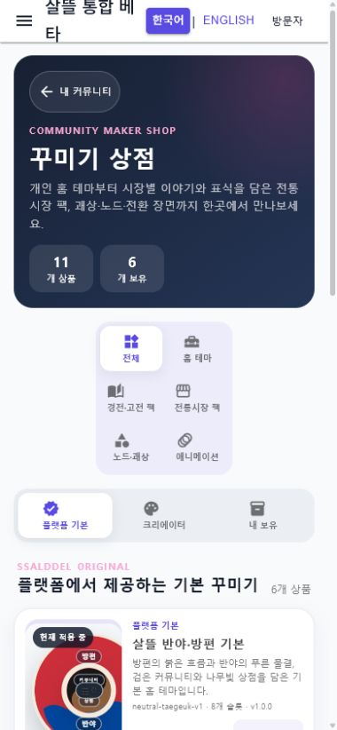
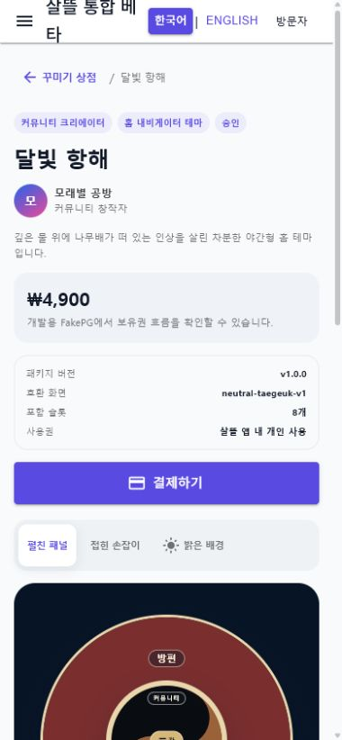
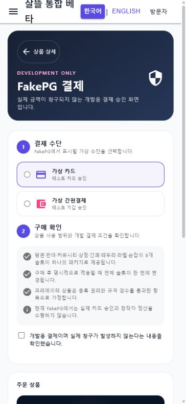
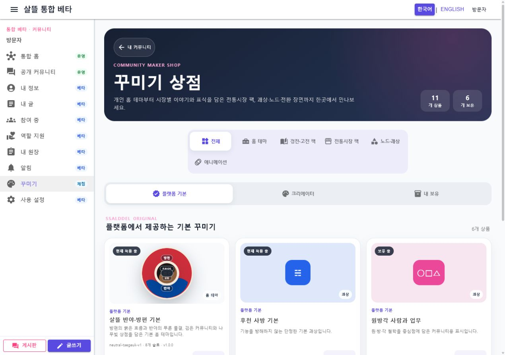

# 개인 공간·꾸미기 Route 의미·단일책임 정렬

## 결과

Web 개인 페이지가 `/community/decorations`와 상품 주소까지 mode로 해석하던 책임을 제거했다. 이제 Web과 모바일은 같은 꾸미기 상점·stable-key 상품 상세·FakePG checkout Route Page에서 같은 공용 Screen을 조립하고, 개인 페이지는 `/community/me` 아래의 개인 관리만 맡는다.

| 사용자 목표 | Canonical route | 책임·효과 |
| --- | --- | --- |
| 개인 꾸미기 관리 | `/community/me/decorations` | 내 보유·적용 상태 확인과 상점 이동 |
| 상품 탐색 | `/community/decorations` | 공개 상품 분류·필터, 읽기 전용 |
| 상품 확인·적용 | `/community/decorations/products/{ProductKey}` | stable key 상세와 이미 보유한 상품의 로컬 적용 선택, 구매 없음 |
| 개발 결제 | `/community/decorations/checkout/{ProductKey}` | 로그인 후 FakePG Simulation 보유권 기록, 실제 금전 이동 없음 |
| 기존 링크 호환 | `/community/decorations/{ProductKey}`와 `/{ProductKey}/checkout` | canonical route로 replace redirect |

## 책임 경계

- `CommunityPageRoutes`가 Web·모바일의 상점, 상품, checkout과 legacy builder를 한곳에서 정의하고 key를 검증·인코딩한다.
- `CommunityPersonalPage`는 `/community/me`와 개인 section만 해석한다. 꾸미기 section은 직접 구매하지 않고 상점 또는 stable-key 상품으로 이동한다.
- `CommunityDecorationStoreScreen`은 탐색만 담당하며 purchase adapter를 참조하지 않는다.
- `CommunityDecorationProductScreen`은 미리보기·가격·사용 범위와 이미 보유한 상품의 적용 선택을 담당한다. 보유권 생성과 FakePG는 호출하지 않는다.
- `CommunityDecorationCheckoutScreen`만 `ICommunityDecorationPurchaseClient`를 호출한다. Web adapter는 인증된 개발 세션에만 보유권을 남기며, 모바일 adapter는 서버 지원 상품의 기존 FakePG API를 재사용한다.
- Web·모바일의 Route Page는 parameter와 플랫폼별 복귀·제작 링크만 공용 Screen에 전달한다.
- 상품·checkout 기존 주소는 독립 legacy Page가 replace redirect해 북마크를 보존한다.

실제 카드 승인, 금액 청구, 창작자 정산, 운영 구매와 자동 적용은 실행하지 않는다. checkout은 동의 전 비활성이고 구매 완료 뒤에도 적용 여부는 사용자가 별도로 선택한다.

## 모바일 우선 보완

- 390px 상점은 상품을 한 열로 표시하고 모든 필터·탭·상세 이동을 최소 48px 터치 영역으로 맞췄다.
- 390px 상품 상세은 제목·가격·결제 동작을 큰 테마 미리보기보다 먼저 보여 준다.
- 390px checkout은 결제 수단, 동의, 주문 요약을 한 열로 배치하고 선택 label과 주 행동을 최소 48px로 유지한다.
- 1280px 상점은 같은 Screen을 3열 카드로 확장한다.
- 전역 Web 모바일 머리말의 제목 줄바꿈은 이 업무 Screen이 아니라 다음 공용 셸 감사 범위로 남긴다.

## 실제 화면

390px 꾸미기 상점이다.

390px stable-key 상품 상세다. 핵심 정보와 결제 행동이 미리보기보다 먼저 보인다.

390px FakePG checkout이다. 실제 구매 Command는 실행하지 않았다.

1280px 같은 상점 Screen의 adaptive 3열 배치다.

## 실제 검증

- 상점·상품·checkout을 390px에서 실제 렌더링해 단일 열, 가로 넘침 없음과 48px 이상 주요 터치 영역을 확인했다.
- 상품 상세에서 정보 영역이 `top=128px`, 미리보기 영역이 `top=593px`로 배치되고 결제 버튼 높이가 48px인 것을 확인했다.
- checkout의 결제 수단 label은 53px, 동의 영역과 비활성 결제 버튼은 48px이며 동의 또는 FakePG Command를 실행하지 않았다.
- 1280px 상점에서 상품 카드가 3열이고 가로 넘침이 없는 것을 확인했다.
- 기존 상품·checkout 주소가 각각 canonical stable-key route로 replace redirect되는 것을 확인했다.
- 최종 browser console 오류와 경고는 없었다.
- route·capability·조립·상태 회귀 테스트를 포함한 clean index 스냅샷의 전체 테스트 2,594개가 통과했다.
- 같은 스냅샷의 `Ssalddel.WebApp`과 `SsalddelApp` Windows target 빌드가 각각 경고 0개·오류 0개로 통과했다.

## 다음 작업

`P2-2`에서 Web과 모바일의 `/shipper`가 같은 화주 허브 목표를 갖도록 공용 Screen과 플랫폼 shell을 정렬한다. 이 과정에서 공통 Web 모바일 머리말의 제목 줄바꿈과 언어 전환 터치 영역도 함께 감사한다.
