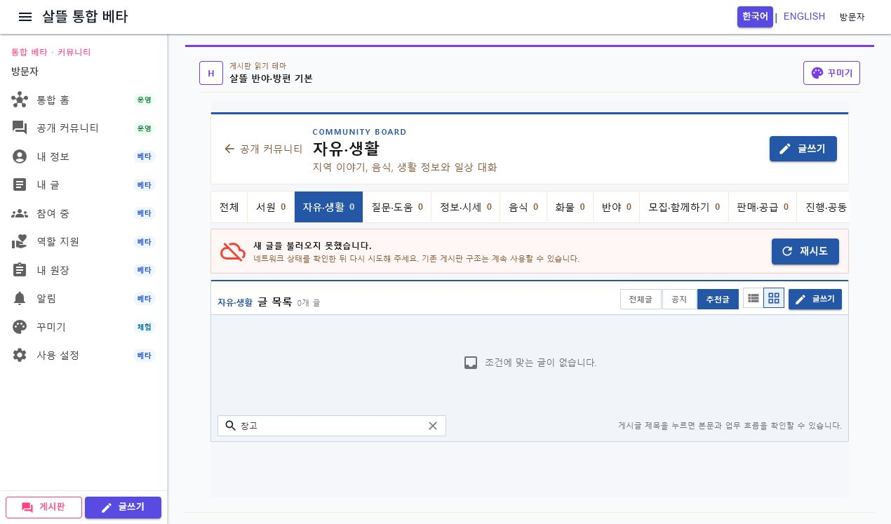
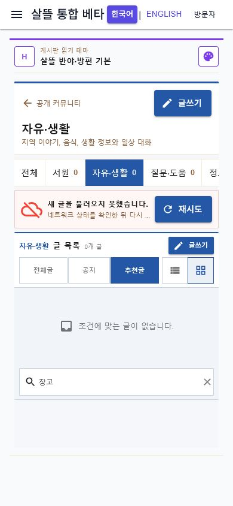
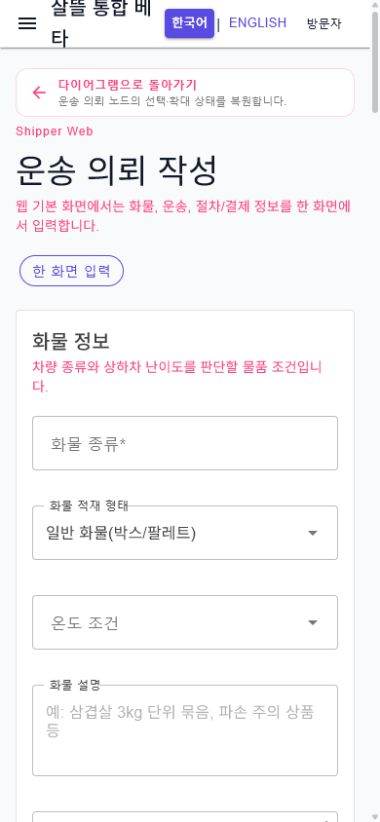

# 커뮤니티 목록·다이어그램 복귀 문맥 통합

날짜: 2026-07-22

## 변경 결과

- 게시판 목록 route를 `Ssalddel.Ui.Common`의 `CommunityBoardListScreen`으로 옮기고 WebApp과 `SsalddelApp`이 같은 Screen을 조립하도록 맞췄다.
- `CommunityBoardNavigationContext`가 게시판, 검색어, 필터, 목록·카드 보기, page와 focus를 URL query로 표현한다. 검색·필터·보기 변경은 URL에 반영되어 새로고침과 상세 화면 왕복 뒤에도 복원된다.
- `PageNavigationContext`가 앱 내부의 안전한 local `from`만 허용한다. 외부 URL과 잘못된 값은 기본 경로로 정규화하며 글쓰기, 추천 목록·상세, 영속 글 상세와 커뮤니티 작업 route가 같은 계약을 사용한다.
- WebApp에만 있던 커뮤니티 홈·게시판·글쓰기·상세·추천·작업공간·게시판 관리·원장 초안 route를 `SsalddelApp`에도 같은 의미로 추가했다.
- 다이어그램 node에서 3단계 업무 route로 이동할 때 현재 `ledgerTemplate`, 선택 node, zoom, filter와 출발 page를 `from`으로 넘긴다. 공용 `PageReturnContextBar`가 업무 화면 위에 정확한 다이어그램 복귀 링크를 표시한다.
- 게시판 route와 공용 목록 조작 영역은 390px에서 가로 overflow 없이 동작하고 버튼·링크·입력의 최소 터치 높이를 44px로 맞췄다.
- 운영 효과는 추가하지 않았다. 추천·자동 배차·계약·결제는 기존 경계를 유지하고 이번 변경은 탐색 상태와 화면 책임만 정리한다.

## 대표 화면

## 실제 왕복 확인

1. `/community/boards?boardKey=free-life&q=창고&filter=추천글&view=cards`에서 추천 목록으로 이동했다.
2. 추천 sample 글 `창고 업무 첫 화면은 공정별 인증 게이트로 통일`을 열고 추천 목록을 거쳐 게시판으로 돌아왔다.
3. 최종 URL과 화면에서 `free-life`, `창고`, `추천글`, `cards`가 모두 복원됨을 확인했다.
4. `/diagram`의 `cargo-transport` 원장에서 `운송 의뢰` node와 120% zoom을 선택해 `/shipper/request`로 이동했다.
5. 업무 화면의 `다이어그램으로 돌아가기`를 누른 뒤 같은 원장, node, zoom과 `/community/workspace` 출발 문맥이 복원됨을 확인했다.

로컬 검증에서는 커뮤니티 API server를 함께 실행하지 않아 영속 글 목록은 명시적 network error·retry 상태로 표시됐다. URL 문맥 왕복은 공용 sample 추천 글과 실제 route navigation으로 확인했으며 운영 실패를 sample 데이터로 대체하지 않았다.

## 검증

- 커뮤니티 route·복귀 문맥·공용 Screen·Web/모바일 parity·page capability 관련 대상 테스트 120개 통과
- `Ssalddel.WebApp` 빌드: 경고 0, 오류 0
- `SsalddelApp` Windows 빌드: 경고 0, 오류 0
- `SsalddelAdminApp` Windows 빌드: 경고 0, 오류 0
- 실제 Web desktop 1270px와 mobile 390×844에서 게시판·추천 상세·다이어그램·운송 의뢰 왕복을 확인
- desktop과 mobile 게시판에서 horizontal overflow가 없고, mobile 게시판의 렌더된 버튼·링크·입력 조작 영역이 모두 44px 이상임을 확인
- mobile 복귀 bar는 높이 51px이며 정확한 다이어그램 deep link를 가리킴을 확인

## 다음 단계

`P1-1` 운송 요청 작성에서 Web 한 화면과 모바일 wizard가 같은 draft·validation을 사용하도록 화물, 운송, 절차, 최종 확인 Screen을 공용 경계로 분리한다.
